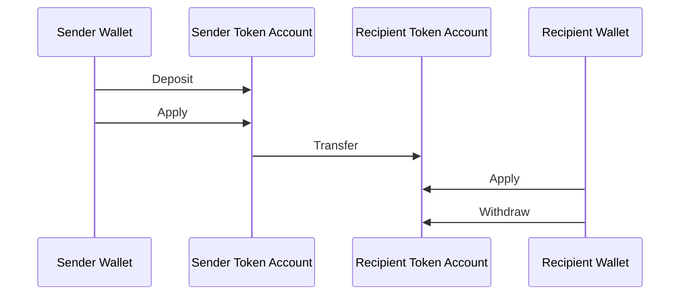
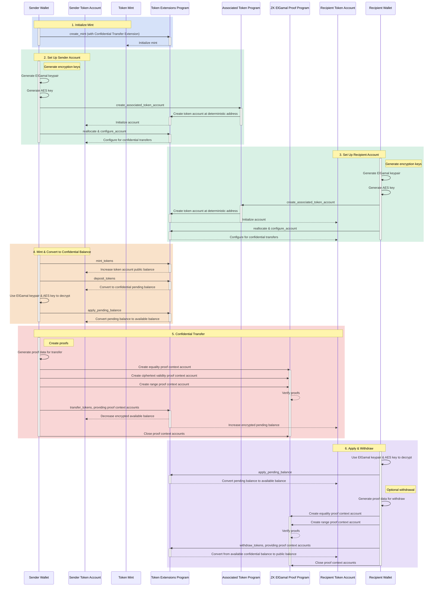

## Wat zijn Vertrouwelijke Overdrachten?

<Embed url="https://youtu.be/Bqs95tFcRIU" />

Vertrouwelijke overdrachten stellen je in staat om tokens te versturen tussen
token accounts zonder het overdrachtsbedrag te onthullen. Dit is nuttig voor
privacybeschermende transacties. Alleen de overdrachtsbedragen en tokensaldi
zijn privé. De adressen van de token accounts blijven openbaar.

- [Protocoloverzicht](https://www.solana-program.com/docs/confidential-balances/overview) -
  Details over het onderliggende cryptografische protocol
- [Snelstartgids](https://www.solana-program.com/docs/confidential-balances#setup) -
  Installatie en basis CLI-opdrachten
- [Vertrouwelijke Saldi Kookboek](https://github.com/solana-developers/Confidential-Balances-Sample) -
  Codevoorbeelden voor het gebruik van de Confidential Transfer-extensie

### Hoe werkt het?

De Confidential Transfer-extensie voegt
[instructies](https://github.com/solana-program/token-2022/blob/efd0c957fefbd79882d77df5fb2dac88c001249c/program/src/extension/confidential_transfer/instruction.rs#L29)
toe aan het Token Extensions Program waarmee je tokens kunt overdragen tussen
accounts zonder het overdrachtsbedrag te onthullen.

De basisstroom van vertrouwelijke tokenoverdrachten is als volgt:

1. Maak een mint account aan met de confidential transfer-extensie.
2. Maak token accounts aan met de confidential transfer-extensie voor de
   verzender en ontvanger.
3. Mint tokens naar het account van de verzender.
4. **Stort** het publieke saldo van de verzender naar het **vertrouwelijk
   uitstaand saldo**.
5. **Pas** het uitstaande saldo van de verzender toe op het **vertrouwelijk
   beschikbaar saldo**.
6. **Draag** tokens vertrouwelijk over van het token account van de verzender
   naar het token account van de ontvanger.
7. **Pas** het uitstaande saldo van de ontvanger toe op het **vertrouwelijk
   beschikbaar saldo**.
8. **Hef** het vertrouwelijk beschikbaar saldo van de ontvanger op naar het
   **publiek saldo**.

Voor meer details over de stappen in de vertrouwelijke overdrachtsstroom, zie de
bijbehorende pagina's:

<Cards>
  <Card
    title="Mint Account Aanmaken"
    href="/docs/tokens/extensions/confidential-transfer/create-mint"
  >
    Hoe je een mint account aanmaakt met de Confidential Transfer-extensie
  </Card>
  <Card
    title="Token Account Aanmaken"
    href="/docs/tokens/extensions/confidential-transfer/create-token-account"
  >
    Hoe je een token account configureert met de Confidential Transfer-extensie
  </Card>
  <Card
    title="Tokens Storten"
    href="/docs/tokens/extensions/confidential-transfer/deposit-tokens"
  >
    Hoe je tokens stort naar het vertrouwelijk uitstaand saldo
  </Card>
  <Card
    title="Uitstaand Saldo Toepassen"
    href="/docs/tokens/extensions/confidential-transfer/apply-pending-balance"
  >
    Hoe je het uitstaande saldo toepast op het vertrouwelijk beschikbaar saldo
  </Card>
  <Card
    title="Tokens Opnemen"
    href="/docs/tokens/extensions/confidential-transfer/withdraw-tokens"
  >
    Hoe je tokens opneemt van het vertrouwelijk beschikbaar saldo
  </Card>
  <Card
    title="Tokens Overdragen"
    href="/docs/tokens/extensions/confidential-transfer/transfer-tokens"
  >
    Hoe je tokens vertrouwelijk overdraagt tussen token accounts
  </Card>
  <Card
    title="Integratiegids"
    href="/docs/tokens/extensions/confidential-transfer/integration-guide"
  >
    Hoe wallets, verkenners en beurzen vertrouwelijke overdrachtstokens kunnen
    ondersteunen
  </Card>
  <Card
    title="Uitgeversgids"
    href="/docs/tokens/extensions/confidential-transfer/issuer-guide"
  >
    Hoe je een vertrouwelijk overdrachtstoken uitgeeft en beheert
    (goedkeuringsbeleid, auditors, kosten, minting en verbranding)
  </Card>
</Cards>

Het onderstaande diagram toont een gedetailleerde volgorde van de basisstroom
voor vertrouwelijke token-overdrachten:

## Vertrouwelijke Overdracht Instructies

De volledige lijst van instructies voor de Vertrouwelijke Overdracht-extensie
[instructions](https://github.com/solana-program/token-2022/blob/efd0c957fefbd79882d77df5fb2dac88c001249c/program/src/extension/confidential_transfer/instruction.rs#L29)
zijn als volgt:

| Instructie                          | Beschrijving                                                                                                                                                                             |
| ----------------------------------- | ---------------------------------------------------------------------------------------------------------------------------------------------------------------------------------------- |
| _rs`InitializeMint`_                | Stelt de mint account in voor vertrouwelijke overdrachten. Deze instructie moet worden opgenomen in dezelfde transactie als de _rs`TokenInstruction::InitializeMint`_ instructie.        |
| _rs`UpdateMint`_                    | Werkt de instellingen voor vertrouwelijke overdrachten bij voor een mint.                                                                                                                |
| _rs`ConfigureAccount`_              | Stelt een token account in voor vertrouwelijke overdrachten.                                                                                                                             |
| _rs`ApproveAccount`_                | Keurt een token account goed voor vertrouwelijke overdrachten als de mint goedkeuring vereist voor nieuwe token accounts.                                                                |
| _rs`EmptyAccount`_                  | Leegt de openstaande en beschikbare vertrouwelijke saldi om het sluiten van een token account mogelijk te maken.                                                                         |
| _rs`Deposit`_                       | Converteert het publieke tokensaldo naar een openstaand vertrouwelijk saldo.                                                                                                             |
| _rs`Withdraw`_                      | Converteert het beschikbare vertrouwelijke saldo terug naar een publiek saldo.                                                                                                           |
| _rs`Transfer`_                      | Draagt tokens vertrouwelijk over tussen token accounts.                                                                                                                                  |
| _rs`ApplyPendingBalance`_           | Converteert het openstaande saldo naar een beschikbaar saldo na stortingen of overdrachten.                                                                                              |
| _rs`EnableConfidentialCredits`_     | Staat een token account toe om vertrouwelijke token-overdrachten te ontvangen.                                                                                                           |
| _rs`DisableConfidentialCredits`_    | Blokkeert inkomende vertrouwelijke overdrachten maar staat publieke overdrachten nog steeds toe.                                                                                         |
| _rs`EnableNonConfidentialCredits`_  | Staat een token account toe om publieke token-overdrachten te ontvangen.                                                                                                                 |
| _rs`DisableNonConfidentialCredits`_ | Blokkeert reguliere overdrachten zodat het account alleen vertrouwelijke overdrachten ontvangt.                                                                                          |
| _rs`TransferWithFee`_               | Draagt tokens vertrouwelijk over tussen token accounts met een vergoeding.                                                                                                               |
| _rs`ConfigureAccountWithRegistry`_  | Alternatieve manier om token accounts te configureren voor vertrouwelijke overdrachten met behulp van een _rs`ElGamalRegistry`_ account in plaats van _rs`VerifyPubkeyValidity`_ bewijs. |
