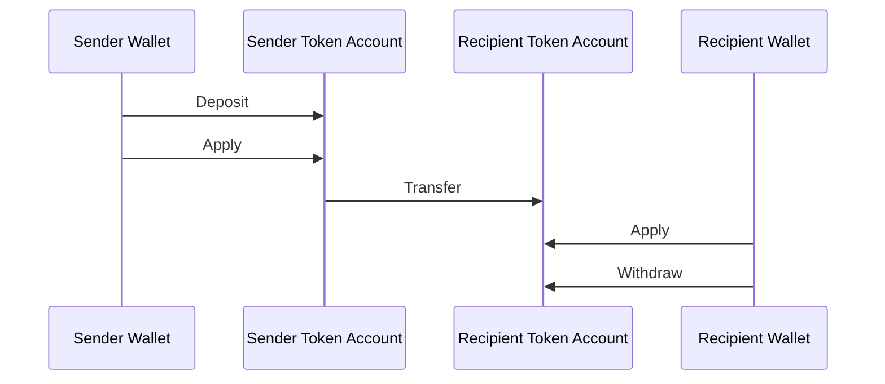
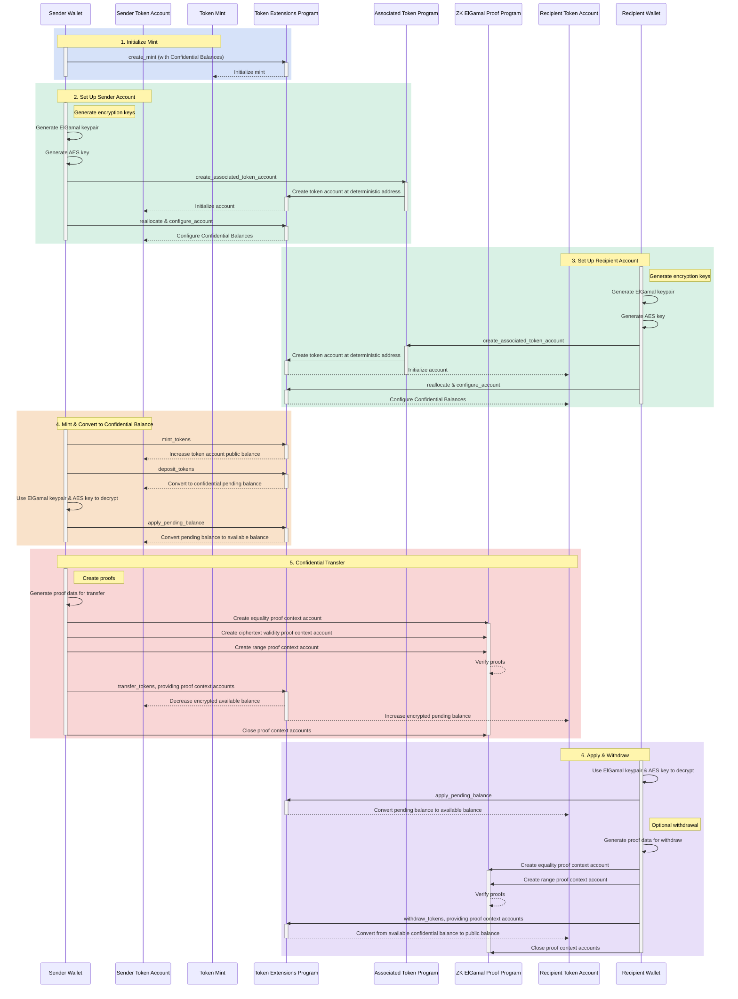

## Wat zijn Confidential Balances?

<Embed url="https://youtu.be/Bqs95tFcRIU" />

Confidential Balances is een Token-2022-extensie waarmee je tokens kunt overdragen tussen token accounts zonder het overdrachtsbedrag te onthullen. Dit is nuttig voor privacybeschermende transacties. Alleen overdrachtsbedragen en tokensaldi zijn privé. Token account-adressen blijven openbaar.

- [Protocoloverzicht](https://www.solana-program.com/docs/confidential-balances/overview) -
  Details over het onderliggende cryptografische protocol
- [Snelstartgids](https://www.solana-program.com/docs/confidential-balances#setup) -
  Installatie en basis CLI-opdrachten
- [Confidential Balances Cookbook](https://github.com/solana-developers/Confidential-Balances-Sample) -
  Codefragmenten die laten zien hoe je Confidential Balances gebruikt

### Hoe werkt het?

De Confidential Balances-extensie voegt
[instructies](https://github.com/solana-program/token-2022/blob/efd0c957fefbd79882d77df5fb2dac88c001249c/program/src/extension/confidential_transfer/instruction.rs#L29)
toe aan het Token Extensions Program waarmee je tokens tussen accounts kunt overdragen zonder het overdrachtsbedrag te onthullen.

```mermaid title="Confidential Balances Basic Overview"
    sequenceDiagram

    participant A as Sender Wallet
    participant AA as Sender Token Account
    participant BB as Recipient Token Account
    participant B as Recipient Wallet

    A->>AA: Deposit
    A->>AA: Apply

    AA->>BB: Transfer
    B->>BB: Apply

    B->>BB: Withdraw

```

De basisstroom van vertrouwelijke tokenoverdrachten is als volgt:

1. Maak een mint account aan met Confidential Balances ingeschakeld.
2. Maak token accounts aan met Confidential Balances ingeschakeld voor de verzender en
   ontvanger.
3. Mint tokens naar het account van de verzender.
4. **Stort** het publieke saldo van de verzender naar het **vertrouwelijk
   uitstaand saldo**.
5. **Pas** het uitstaande saldo van de verzender toe op het **vertrouwelijk
   beschikbaar saldo**.
6. **Draag** tokens vertrouwelijk over van het token account van de verzender
   naar het token account van de ontvanger.
7. **Pas** het uitstaande saldo van de ontvanger toe op het **vertrouwelijk
   beschikbaar saldo**.
8. **Hef** het vertrouwelijk beschikbaar saldo van de ontvanger op naar het
   **publiek saldo**.

### Auditorsleutels

Een Confidential Balances-mint kan een optionele globale auditor ElGamal-openbare sleutel opslaan. Wanneer er een is geconfigureerd, bevat elke vertrouwelijke overdracht het bedrag versleuteld voor de verzender, ontvanger en auditor. Het overdrachtsbewijs verifieert dat alle drie de cipherteksten hetzelfde bedrag bevatten. Het publiek kan het bedrag nog steeds niet lezen, maar de houder van de geheime auditorsleutel kan overdrachtsbedragen voor die mint ontsleutelen.

De Confidential Balances-autoriteit stelt de auditorsleutel in bij het initialiseren van de extensie of wijzigt deze later met _rs`UpdateMint`_. De autoriteit kan de sleutel roteren of wissen. Een rotatie geldt alleen voor toekomstige overdrachten, bewaar dus eerdere geheime sleutels wanneer historische audittoegang vereist is. Auditorsleutels bieden leestoegang; ze machtigen geen tokenoverdrachten en onthullen het volledige vertrouwelijke saldo van een account niet.

Voor voorbeelden van instelling en rotatie, zie
[Een auditor configureren](/docs/tokens/extensions/confidential-transfer/issuer-guide#configure-an-auditor).
Wallets, verkenners, exchanges en compliance-providers moeten ook de
[richtlijnen voor auditorintegratie](/docs/tokens/extensions/confidential-transfer/integration-guide#auditors-and-compliance) raadplegen.

Voor meer details over de stappen in de vertrouwelijke overdrachtsstroom, zie de
bijbehorende pagina's:

<Cards>
  <Card
    title="Mint Account Aanmaken"
    href="/docs/tokens/extensions/confidential-transfer/create-mint"
  >
    Een mint account aanmaken met Confidential Balances ingeschakeld
  </Card>
  <Card
    title="Token Account Aanmaken"
    href="/docs/tokens/extensions/confidential-transfer/create-token-account"
  >
    Een token account configureren met Confidential Balances ingeschakeld
  </Card>
  <Card
    title="Tokens Storten"
    href="/docs/tokens/extensions/confidential-transfer/deposit-tokens"
  >
    Hoe je tokens stort naar het vertrouwelijk uitstaand saldo
  </Card>
  <Card
    title="Uitstaand Saldo Toepassen"
    href="/docs/tokens/extensions/confidential-transfer/apply-pending-balance"
  >
    Hoe je het uitstaande saldo toepast op het vertrouwelijk beschikbaar saldo
  </Card>
  <Card
    title="Tokens Opnemen"
    href="/docs/tokens/extensions/confidential-transfer/withdraw-tokens"
  >
    Hoe je tokens opneemt van het vertrouwelijk beschikbaar saldo
  </Card>
  <Card
    title="Tokens Overdragen"
    href="/docs/tokens/extensions/confidential-transfer/transfer-tokens"
  >
    Hoe je tokens vertrouwelijk overdraagt tussen token accounts
  </Card>
  <Card
    title="Integratiegids"
    href="/docs/tokens/extensions/confidential-transfer/integration-guide"
  >
    Hoe wallets, verkenners en exchanges Confidential Balances-tokens kunnen ondersteunen
  </Card>
  <Card
    title="Uitgeversgids"
    href="/docs/tokens/extensions/confidential-transfer/issuer-guide"
  >
    Hoe je een Confidential Balances-token uitgeeft en beheert (goedkeuringsbeleid, auditors, kosten, mint en burn)
  </Card>
</Cards>

Het onderstaande diagram toont een gedetailleerde volgorde van de basisstroom
voor vertrouwelijke token-overdrachten:

```mermaid title="Confidential Balances Detailed Overview"
sequenceDiagram
    participant Sender as Sender Wallet
    participant SenderAccount as Sender Token Account
    participant Mint as Token Mint
    participant Token22 as Token Extensions Program
    participant ATAProgram as Associated Token Program
    participant ElGamal as ZK ElGamal Proof Program
    participant RecipientAccount as Recipient Token Account
    participant Recipient as Recipient Wallet

    rect rgba(120, 160, 235, 0.3)
    Note over Sender,Mint: 1. Initialize Mint

    activate Sender
    Sender->>Token22: create_mint (with Confidential Balances)
    activate Token22
    Token22-->>Mint: Initialize mint
    deactivate Token22
    deactivate Sender
    end

    rect rgba(130, 210, 170, 0.3)
    Note over Sender,SenderAccount: 2. Set Up Sender Account

    activate Sender
    Note right of Sender: Generate encryption keys
    Sender->>Sender: Generate ElGamal keypair
    Sender->>Sender: Generate AES key

    Sender->>ATAProgram: create_associated_token_account
    activate ATAProgram
    ATAProgram->>Token22: Create token account at deterministic address
    activate Token22
    Token22-->>SenderAccount: Initialize account
    deactivate Token22
    deactivate ATAProgram

    Sender->>Token22: reallocate & configure_account
    activate Token22
    Token22-->>SenderAccount: Configure Confidential Balances
    deactivate Token22
    deactivate Sender
    end

    rect rgba(130, 210, 170, 0.3)
    Note over Recipient,RecipientAccount: 3. Set Up Recipient Account

    activate Recipient
    Note right of Recipient: Generate encryption keys
    Recipient->>Recipient: Generate ElGamal keypair
    Recipient->>Recipient: Generate AES key

    Recipient->>ATAProgram: create_associated_token_account
    activate ATAProgram
    ATAProgram->>Token22: Create token account at deterministic address
    activate Token22
    Token22-->>RecipientAccount: Initialize account
    deactivate Token22
    deactivate ATAProgram

    Recipient->>Token22: reallocate & configure_account
    activate Token22
    Token22-->>RecipientAccount: Configure Confidential Balances
    deactivate Token22
    deactivate Recipient
    end

    rect rgba(235, 160, 80, 0.3)
    Note over Sender,SenderAccount: 4. Mint & Convert to Confidential Balance

    activate Sender
    Sender->>Token22: mint_tokens
    activate Token22
    Token22-->>SenderAccount: Increase token account public balance
    deactivate Token22

    Sender->>Token22: deposit_tokens
    activate Token22
    Token22-->>SenderAccount: Convert to confidential pending balance
    deactivate Token22

    Sender->>Sender: Use ElGamal keypair & AES key to decrypt
    Sender->>Token22: apply_pending_balance
    activate Token22
    Token22-->>SenderAccount: Convert pending balance to available balance
    deactivate Token22
    deactivate Sender
    end

    rect rgba(235, 120, 120, 0.3)
    Note over Sender,RecipientAccount: 5. Confidential Transfer

    activate Sender
    Note right of Sender: Create proofs
    Sender->>Sender: Generate proof data for transfer

    Sender->>ElGamal: Create equality proof context account
    activate ElGamal
    Sender->>ElGamal: Create ciphertext validity proof context account
    Sender->>ElGamal: Create range proof context account
    ElGamal-->>ElGamal: Verify proofs

    Sender->>Token22: transfer_tokens, providing proof context accounts
    activate Token22
    Token22-->>SenderAccount: Decrease encrypted available balance
    Token22-->>RecipientAccount: Increase encrypted pending balance
    deactivate Token22

    Sender->>ElGamal: Close proof context accounts
    deactivate ElGamal
    deactivate Sender
    end

    rect rgba(180, 150, 235, 0.3)
    Note over Recipient,RecipientAccount: 6. Apply & Withdraw

    activate Recipient
    Recipient->>Recipient: Use ElGamal keypair & AES key to decrypt
    Recipient->>Token22: apply_pending_balance
    activate Token22
    Token22-->>RecipientAccount: Convert pending balance to available balance
    deactivate Token22

    Note right of Recipient: Optional withdrawal
    Recipient->>Recipient: Generate proof data for withdraw

    Recipient->>ElGamal: Create equality proof context account
    activate ElGamal
    Recipient->>ElGamal: Create range proof context account
    ElGamal-->>ElGamal: Verify proofs

    Recipient->>Token22: withdraw_tokens, providing proof context accounts
    activate Token22
    Token22-->>RecipientAccount: Convert from available confidential balance to public balance
    deactivate Token22

    Recipient->>ElGamal: Close proof context accounts
    deactivate ElGamal
    deactivate Recipient
    end
```

## Confidential Balances-instructies

De volledige lijst van Confidential Balances-extensie
[instructies](https://github.com/solana-program/token-2022/blob/efd0c957fefbd79882d77df5fb2dac88c001249c/program/src/extension/confidential_transfer/instruction.rs#L29)
is als volgt:

| Instructie                         | Beschrijving                                                                                                                                                       |
| ----------------------------------- | ----------------------------------------------------------------------------------------------------------------------------------------------------------------- |
| _rs`InitializeMint`_                | Schakelt Confidential Balances in op een mint account. Deze instructie moet worden opgenomen in dezelfde transactie als de _rs`TokenInstruction::InitializeMint`_-instructie. |
| _rs`UpdateMint`_                    | Werkt het goedkeuringsbeleid van de mint-account en de optionele globale auditor ElGamal-openbare sleutel bij.                                                                        |
| _rs`ConfigureAccount`_              | Schakelt Confidential Balances in op een token account.                                                                                                                 |
| _rs`ApproveAccount`_                | Keurt een token account goed voor Confidential Balances als de mint goedkeuring vereist voor nieuwe token accounts.                                                          |
| _rs`EmptyAccount`_                  | Leegt de openstaande en beschikbare vertrouwelijke saldi om het sluiten van een token account mogelijk te maken.                                                                         |
| _rs`Deposit`_                       | Converteert het publieke tokensaldo naar een openstaand vertrouwelijk saldo.                                                                                                  |
| _rs`Withdraw`_                      | Converteert het beschikbare vertrouwelijke saldo terug naar een publiek saldo.                                                                                                   |
| _rs`Transfer`_                      | Draagt tokens vertrouwelijk over tussen token accounts.                                                                                                           |
| _rs`ApplyPendingBalance`_           | Converteert het openstaande saldo naar een beschikbaar saldo na stortingen of overdrachten.                                                                                      |
| _rs`EnableConfidentialCredits`_     | Staat een token account toe om vertrouwelijke token-overdrachten te ontvangen.                                                                                                   |
| _rs`DisableConfidentialCredits`_    | Blokkeert inkomende vertrouwelijke overdrachten maar staat publieke overdrachten nog steeds toe.                                                                                     |
| _rs`EnableNonConfidentialCredits`_  | Staat een token account toe om publieke token-overdrachten te ontvangen.                                                                                                         |
| _rs`DisableNonConfidentialCredits`_ | Blokkeert reguliere overdrachten zodat het account alleen vertrouwelijke overdrachten ontvangt.                                                                                     |
| _rs`TransferWithFee`_               | Draagt tokens vertrouwelijk over tussen token accounts met een vergoeding.                                                                                                |
| _rs`ConfigureAccountWithRegistry`_  | Alternatieve manier om token accounts te configureren voor Confidential Balances met behulp van een _rs`ElGamalRegistry`_-account in plaats van een _rs`VerifyPubkeyValidity`_-bewijs.         |
