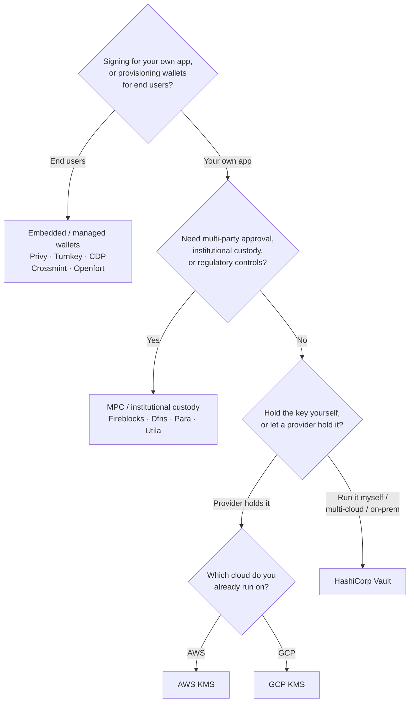

Keychain biedt één `SolanaSigner` interface voor elke backend, waardoor de keuze
operationeel is, niet architecturaal — u kunt dit later wijzigen via
configuratie. Daarom **begint u bij uw vereisten, niet bij een product.** Twee
vragen bepalen het merendeel: _waar bevindt de privésleutel zich, en wie is
gemachtigd om er een handtekening mee te autoriseren?_

Er is geen beste backend. Elke backend is beter geschikt voor een bepaalde set
beperkingen — de cloud waarop u al draait, of u sleutelinfrastructuur wilt
beheren, en welke bewaring- en goedkeuringscontroles u verplicht bent te hebben.
De onderstaande flow koppelt die beperkingen aan een backend.

<Callout type="info">
  Deze handleiding behandelt backend (server-side) ondertekening. Wanneer uw
  eindgebruikers hun eigen transacties ondertekenen in een browser, gebruik dan
  een wallet via de Wallet Standard — zie [Ondertekenen in
  Productie](/docs/core/transactions/signing-in-production).
</Callout>

## Beslissingsstroom

<Callout type="info">
  Lokale ontwikkeling en tests hebben dit allemaal niet nodig — gebruik de
  **Memory**-backend voor prototyping en schakel daarna via configuratie over op
  een van de bovenstaande productiebackends.
</Callout>

## Doorloop de vragen

<Steps>

<Step>

### Ondertekent u voor uw eigen applicatie of voor uw eindgebruikers?

Als u wallets inricht die **eindgebruikers** bezitten en beheren
(consumenten-apps, onboardingflows), gebruik dan een **embedded / managed
wallet**-backend — Privy, Turnkey, CDP, Crossmint of Openfort. Deze beheren
per-gebruiker wallets en authenticatie namens u.

Als u ondertekent als **uw eigen applicatie** — een betalende partij, een
treasury, backend-automatisering — ga dan hieronder verder.

</Step>

<Step>

### Heeft u goedkeuring door meerdere partijen, institutionele bewaring of regelgevende controles nodig?

Als handtekeningen een goedkeuringsbeleid, bestedingslimiet of
complianceworkflow moeten doorlopen voordat ze worden gegenereerd — of als u een
gereguleerde bewaarder nodig heeft die de sleutels beheert — gebruik dan een
**MPC / institutionele bewaring** backend: Fireblocks, Dfns, Para of Utila. Deze
oplossingen splitsen of bewaren de sleutel en ondertekenen mede conform uw
beleid.

Als u alleen een sleutel nodig heeft die op verzoek ondertekent, ga dan
hieronder verder.

</Step>

<Step>

### Wilt u de sleutel zelf beheren, of laat u dit door een provider doen?

Als een cloudprovider de sleutel in hardware-ondersteunde infrastructuur moet
bewaren en uw IAM-beleid bepaalt wie kan ondertekenen, gebruik dan de KMS van
die cloud:

- **Draait op AWS** → AWS KMS
- **Draait op GCP** → GCP KMS

Als u de sleutelinfrastructuur zelf wilt beheren — of u werkt multi-cloud of
on-premises — gebruik dan **HashiCorp Vault**. U beheert en controleert het
zelf; de sleutel blijft in de Transit-engine en ondertekent op verzoek.

</Step>

</Steps>

## Bewaarmodellen

De backends zijn ingedeeld in vijf bewaarmodellen. De bovenstaande beslisboom
leidt u naar één ervan.

- **Zelfbeheer (in-process)** — uw applicatie bewaart de ruwe privésleutel.
  Handig voor ontwikkeling, maar niet geschikt voor productie. Backend:
  **Memory**.
- **Zelfgehoste sleutelbeheer** — u beheert de sleutelinfrastructuur zelf; de
  sleutel blijft daarbinnen en ondertekent op verzoek. Backend: **HashiCorp
  Vault**.
- **Cloud KMS / HSM** — een cloudprovider bewaart de sleutel in
  hardware-ondersteunde infrastructuur; de sleutel verlaat de service nooit en
  uw IAM-beleid bepaalt wie kan ondertekenen. Backends: **AWS KMS**, **GCP
  KMS**.
- **MPC & institutionele bewaring** — de sleutel wordt gesplitst of bewaard bij
  een provider, die mede ondertekent conform uw beleid (goedkeuringen,
  limieten). Backends: **Fireblocks**, **Dfns**, **Para**, **Utila**.
- **Embedded & beheerde wallets** — een provider beheert wallets namens u, vaak
  voor het onboarden van eindgebruikers. Backends: **Privy**, **Turnkey**,
  **CDP**, **Crossmint**, **Openfort**.

## Backend vergelijking

| Backend         | Bewaarmodel                       | Het beste voor                                         | Notities                                                   |
| --------------- | --------------------------------- | ------------------------------------------------------ | ---------------------------------------------------------- |
| Memory          | Zelfbeheer (in-proces)            | Lokale ontwikkeling, tests, CI                         | Onbewerkte sleutel in proces — niet gebruiken in productie |
| HashiCorp Vault | Zelfgehoste sleutelbeheer         | Teams die hun eigen sleutelinfrastructuur beheren      | Transit-engine; u beheert en auditeert deze zelf           |
| AWS KMS         | Cloud KMS / HSM                   | Backends die op AWS draaien                            | Sleutel verlaat KMS nooit; IAM beheert ondertekening       |
| GCP KMS         | Cloud KMS / HSM                   | Backends die op GCP draaien                            | Sleutel verlaat KMS nooit; IAM beheert ondertekening       |
| Fireblocks      | MPC / institutioneel beheer       | Treasuries, exchanges, gereguleerde bewaring           | Policy-engine en goedkeuringsworkflows                     |
| Dfns            | MPC wallet-infrastructuur         | Programmatische wallets met beleidscontroles           | Ed25519-ondertekening                                      |
| Para            | MPC wallets                       | Apps die MPC-ondersteunde wallets wensen               | API-sleutel + wallet-ID                                    |
| Utila           | MPC bewaring + mede-ondertekenaar | Bestaande door Utila beheerde Solana-wallets           | `signMessage` niet ondersteund; u verzendt de tx zelf      |
| Privy           | Embedded wallets                  | Consumenten-apps die gebruikers onboarden naar wallets | App-beheerde embedded wallets                              |
| Turnkey         | Niet-custodiale sleutelbeheer     | Programmatisch, beleidsgericht ondertekenen            | Niet-custodiale sleutelbeheer                              |
| CDP             | Beheerde wallet (Coinbase)        | Apps op het Coinbase Developer Platform                | `signMessage` accepteert alleen UTF-8 payloads             |
| Crossmint       | Beheerde wallets                  | Marktplaatsen en apps met beheerde wallets             | `smart` en `mpc` wallets; `signMessage` niet ondersteund   |
| Openfort        | Embedded backend wallets          | Server-side wallets                                    | In TEE opgeslagen sleutels                                 |

## Zakelijke scenario's

Een enkele applicatie heeft vaak meer dan één van deze tegelijk nodig. Omdat de
interface identiek is, kun je per rol een andere backend gebruiken zonder de
aanroeppunten te wijzigen.

- **Treasurybeheer** — scheid een operationele "hot" ondertekenaar van een
  "cold" treasury-ondertekenaar. Ondersteun de treasury met MPC-bewaring of een
  cloud-HSM en vereist goedkeuringsbeleid voorafgaand aan hoogwaardige
  handtekeningen.
- **Goedkeuringsworkflows** — MPC- en bewaarbackends (bijv. Fireblocks) dwingen
  meerdere goedkeuringen af voordat een handtekening wordt gegenereerd.
- **Compliance en audit** — cloud KMS (AWS/GCP) en Vault genereren
  auditlogboeken van ondertekeningen; institutionele bewaarders voegen
  beleidshandhaving en rapportage toe.
- **Gereguleerde omgevingen** — bewaar sleutelmateriaal in een HSM, KMS of
  institutionele bewaarder zodat ruwe sleutels nooit uw applicatie raken.

Zie
[Aanbevolen werkwijzen voor productie](/docs/tools/keychain/production-best-practices)
voor het veilig beheren van deze backends.

<Cards>
  <Card
    title="Rust-handleiding"
    href="/docs/tools/keychain/getting-started/rust"
  >
    Configureer elke backend in Rust.
  </Card>
  <Card
    title="TypeScript-handleiding"
    href="/docs/tools/keychain/getting-started/typescript"
  >
    Configureer elke backend in TypeScript.
  </Card>
</Cards>
