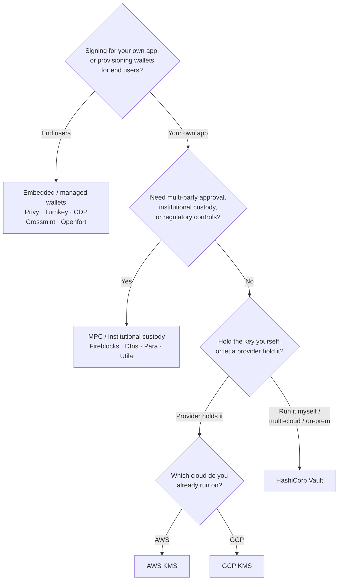

Keychain biedt één `SolanaSigner` interface voor elke backend, waardoor de keuze
operationeel is en niet architecturaal — u kunt deze later wijzigen via de
configuratie. Begin daarom **vanuit uw vereisten, niet vanuit een product.**
Twee vragen bepalen het meeste: _waar bevindt de privésleutel zich, en wie mag
een handtekening autoriseren?_

Er is geen enkele beste backend. Elke backend is beter geschikt voor een
bepaalde set beperkingen — de cloud waarop u al draait, of u
sleutelinfrastructuur wilt beheren, en welke beheer- en goedkeuringscontroles u
nodig heeft. De onderstaande flow koppelt die beperkingen aan een backend.

<Callout type="info">
  Deze handleiding behandelt backend-ondertekening (server-side). Wanneer uw
  eindgebruikers hun eigen transacties ondertekenen in een browser, gebruik dan
  een wallet via de Wallet Standard — zie [Ondertekenen in
  Productie](/docs/core/transactions/signing-in-production).
</Callout>

## Beslissingsstroom

<Callout type="info">
  Lokale ontwikkeling en tests hebben dit allemaal niet nodig — gebruik de
  **Memory**-backend voor prototyping en schakel daarna via de configuratie over
  naar een van de bovenstaande productiebackends.
</Callout>

## De vragen doorlopen

<Steps>

<Step>

### Ondertekent u voor uw eigen applicatie of voor uw eindgebruikers?

Als u wallets inricht die **eindgebruikers** bezitten en beheren
(consumenten-apps, onboardingflows), gebruik dan een **embedded / managed
wallet**-backend — Privy, Turnkey, CDP, Crossmint of Openfort. Deze beheren
wallets per gebruiker en authenticatie namens u.

Als je tekent als **je eigen applicatie** — een fee payer, een treasury,
backend-automatisering — ga dan hieronder verder.

</Step>

<Step>

### Heb je goedkeuring van meerdere partijen, institutionele bewaring of regelgevende controles nodig?

Als handtekeningen een goedkeuringsbeleid, bestedingslimiet of
complianceworkflow moeten doorlopen voordat ze worden gegenereerd — of als je
een gereguleerde bewaarder nodig hebt die de sleutels beheert — gebruik dan een
**MPC / institutionele bewaring**-backend: Fireblocks, Dfns, Para of Utila. Deze
diensten splitsen of bewaren de sleutel en co-ondertekenen volgens jouw beleid.

Als je alleen een sleutel nodig hebt die op verzoek tekent, ga dan hieronder
verder.

</Step>

<Step>

### Wil je de sleutel zelf bewaren, of wil je dat een provider dat doet?

Als een cloudprovider de sleutel in hardware-ondersteunde infrastructuur moet
bewaren en jouw IAM-beleid bepaalt wie kan tekenen, gebruik dan de KMS van die
cloud:

- **Draaien op AWS** → AWS KMS
- **Draaien op GCP** → GCP KMS

Als je de sleutelinfrastructuur zelf wilt beheren — of je werkt multi-cloud of
on-premises — gebruik dan **HashiCorp Vault**. Jij beheert en auditeert het; de
sleutel blijft in de Transit-engine en tekent op verzoek.

</Step>

</Steps>

## Bewaarmodellen

De backends zijn ingedeeld in vijf bewaarmodellen. De bovenstaande flow leidt je
naar een van hen.

- **Eigen beheer (in-process)** — je applicatie bewaart de onbewerkte
  privésleutel. Handig voor ontwikkeling, maar ongeschikt voor productie.
  Backend: **Memory**.
- **Zelfgehoste sleutelbeheer** — jij beheert de sleutelinfrastructuur; de
  sleutel blijft daarin en tekent op verzoek. Backend: **HashiCorp Vault**.
- **Cloud KMS / HSM** — een cloudprovider bewaart de sleutel in
  hardware-ondersteunde infrastructuur; de sleutel verlaat de service nooit en
  jouw IAM-beleid bepaalt wie kan tekenen. Backends: **AWS KMS**, **GCP KMS**.
- **MPC & institutionele bewaring** — de sleutel wordt gesplitst of bewaard door
  een provider, die mede-ondertekent volgens jouw beleid (goedkeuringen,
  limieten). Backends: **Fireblocks**, **Dfns**, **Para**, **Utila**.
- **Embedded & beheerde wallets** — een provider beheert wallets namens jou,
  vaak om eindgebruikers te onboarden. Backends: **Privy**, **Turnkey**,
  **CDP**, **Crossmint**, **Openfort**.

## Backend vergelijking

| Backend         | Bewaarmodel                   | Het beste voor                                    | Opmerkingen                                              |
| --------------- | ----------------------------- | ------------------------------------------------- | -------------------------------------------------------- |
| Memory          | Zelfbeheer (in-process)       | Lokale ontwikkeling, tests, CI                    | Ruwe sleutel in proces — niet gebruiken in productie     |
| HashiCorp Vault | Zelfgehoste sleutelbeheer     | Teams die hun eigen sleutelinfrastructuur beheren | Transit engine; u beheert en auditeert het zelf          |
| AWS KMS         | Cloud KMS / HSM               | Backends die op AWS draaien                       | Sleutel verlaat KMS nooit; IAM beheert ondertekening     |
| GCP KMS         | Cloud KMS / HSM               | Backends die op GCP draaien                       | Sleutel verlaat KMS nooit; IAM beheert ondertekening     |
| Fireblocks      | MPC / institutioneel beheer   | Treasuries, exchanges, gereguleerd beheer         | Beleidsmotor en goedkeuringsworkflows                    |
| Dfns            | MPC-walletinfrastructuur      | Programmatische wallets met beleidscontroles      | Ed25519-ondertekening                                    |
| Para            | MPC-wallets                   | Apps die MPC-ondersteunde wallets willen          | API-sleutel + wallet-ID                                  |
| Utila           | MPC-beheer + co-ondertekenaar | Bestaande door Utila beheerde Solana-wallets      | `signMessage` niet ondersteund; u verstuurt de tx zelf   |
| Privy           | Ingebedde wallets             | Consumenten-apps die gebruikers onboarden         | Door app beheerde ingebedde wallets                      |
| Turnkey         | Niet-custodiale sleutelbeheer | Programmatisch, door beleid beheerd ondertekenen  | Niet-custodiale sleutelbeheer                            |
| CDP             | Beheerde wallet (Coinbase)    | Apps op het Coinbase Developer Platform           | `signMessage` accepteert alleen UTF-8-payloads           |
| Crossmint       | Beheerde wallets              | Marktplaatsen en beheerde-wallet-apps             | `smart` en `mpc` wallets; `signMessage` niet ondersteund |
| Openfort        | Ingebedde backend-wallets     | Server-side wallets                               | In TEE opgeslagen sleutels                               |

## Zakelijke scenario's

Een enkele applicatie heeft vaak meer dan één van deze tegelijk nodig. Omdat de
interface identiek is, kun je per rol een andere backend gebruiken zonder de
aanroeplocaties te wijzigen.

- **Treasurybeheer** — scheid een operationele "hot" ondertekenaar van een
  "cold" treasury-ondertekenaar. Ondersteun de treasury met MPC-bewaring of een
  cloud-HSM en vereist goedkeuringsbeleid voorafgaand aan hoogwaardige
  handtekeningen.
- **Goedkeuringsworkflows** — MPC- en bewaarbackends (bijv. Fireblocks) vereisen
  meervoudige goedkeuring voordat een handtekening wordt gegenereerd.
- **Compliance en audit** — cloud-KMS (AWS/GCP) en Vault genereren
  auditlogboeken van ondertekeningen; institutionele bewaarders voegen
  beleidshandhaving en rapportage toe.
- **Gereguleerde omgevingen** — bewaar sleutelmateriaal in een HSM, KMS of
  institutionele bewaarder zodat ruwe sleutels uw applicatie nooit bereiken.

Zie
[Best practices voor productie](/docs/tools/keychain/production-best-practices)
voor het veilig beheren van deze backends.

<Cards>
  <Card
    title="Rust-handleiding"
    href="/docs/tools/keychain/getting-started/rust"
  >
    Configureer elke backend in Rust.
  </Card>
  <Card
    title="TypeScript-handleiding"
    href="/docs/tools/keychain/getting-started/typescript"
  >
    Configureer elke backend in TypeScript.
  </Card>
</Cards>
