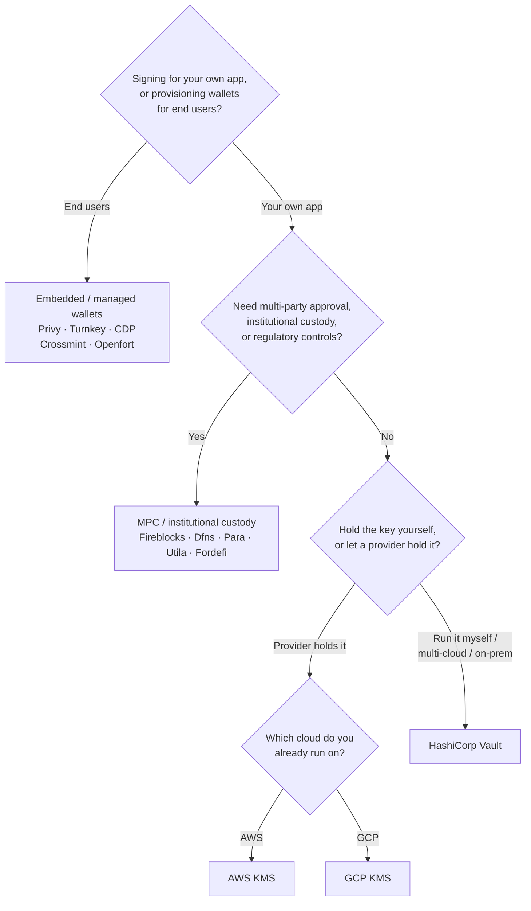

Keychain biedt één `SolanaSigner`-basisinterface voor alle backends, dus voor
de meeste backends is de keuze operationeel en niet architecturaal: je kunt de
backend later wijzigen via configuratie. De uitzondering is de vorm van de transactie. Crossmint
en Fordefi native auto-modus ondertekenen en verzenden aan de serverzijde, en Fordefi native
handmatige modus herschrijft de transactie voordat deze wordt ondertekend. Overstappen naar of van een
van deze opties verandert dus hoe je de signer aanroept. Daarom geldt: **begin bij je
eisen, niet bij een product.** Twee vragen bepalen het meeste: _waar staat
de private key, en wie mag een handtekening ermee autoriseren?_

Elke backend behalve Ledger is beschikbaar in alle vier de talen (Rust, TypeScript,
Python en Go). Ledger is alleen beschikbaar in Rust, achter de opt-in-feature `ledger`.

Er bestaat geen enkele beste backend. Elke backend past beter bij een bepaalde set
aan randvoorwaarden: de cloud waarop je al draait, of je zelf key-infrastructuur
wilt beheren, en welke bewarings- en goedkeuringscontroles je moet hebben.
Het onderstaande stroomschema koppelt die randvoorwaarden aan een backend.

<Callout type="info">
  Deze gids behandelt backend-signing (aan de serverzijde). Wanneer je eindgebruikers
  hun eigen transacties in een browser ondertekenen, gebruik dan in plaats daarvan een wallet via de Wallet Standard.
  Zie [Signing in
  Production](/docs/core/transactions/signing-in-production).
</Callout>

## Beslissingsstroom

```mermaid title="Choosing a Keychain backend"
flowchart TD
    Start{Signing for your own app,<br/>or provisioning wallets<br/>for end users?}
    Start -->|End users| Managed[Embedded / managed wallets<br/>Privy · Turnkey · CDP<br/>Crossmint · Openfort]
    Start -->|Your own app| Q2{Need multi-party approval,<br/>institutional custody,<br/>or regulatory controls?}
    Q2 -->|Yes| MPC[MPC / institutional custody<br/>Fireblocks · Dfns · Para · Utila · Fordefi]
    Q2 -->|No| Q3{Hold the key yourself,<br/>or let a provider hold it?}
    Q3 -->|Provider holds it| Q4{Which cloud do you<br/>already run on?}
    Q4 -->|AWS| AWS[AWS KMS]
    Q4 -->|GCP| GCP[GCP KMS]
    Q3 -->|Run it myself /<br/>multi-cloud / on-prem| Vault[HashiCorp Vault]
```

<Callout type="info">
  Voor lokale ontwikkeling en tests is niets hiervan nodig: gebruik de **Memory**-backend
  voor prototyping en schakel daarna via
  configuratie over op een van de productie-backends hierboven.
</Callout>

## De vragen doorlopen

<Steps>

<Step>

### Onderteken je voor je eigen applicatie of voor je eindgebruikers?

Als je wallets inricht die **eindgebruikers** zelf bezitten en beheren (consumenten-apps,
onboardingflows), gebruik dan een **embedded / managed wallet**-backend: Privy, Turnkey,
CDP, Crossmint of Openfort. Deze beheren wallets en authenticatie per gebruiker
namens jou.

Als je tekent als **je eigen applicatie** (een fee payer, een treasury, backend-automatisering),
ga dan hieronder verder.

</Step>

<Step>

### Heb je multi-party-goedkeuring, institutionele bewaring of regelgevende controles nodig?

Als handtekeningen eerst een goedkeuringsbeleid, bestedingslimiet of compliance-workflow
moeten doorlopen voordat ze worden gegenereerd, of als je een gereguleerde bewaarder nodig hebt die de
keys beheert, gebruik dan een **MPC / institutionele custody**-backend: Fireblocks, Dfns, Para,
Utila of Fordefi. Deze splitsen de key of nemen deze in bewaring en tekenen mee volgens jouw
beleid.

Als je alleen een key nodig hebt die op verzoek tekent, ga dan hieronder verder.

</Step>

<Step>

### Wil je de key zelf beheren of door een provider laten beheren?

Als een cloudprovider de key moet bewaren in hardwarematige infrastructuur en
jouw IAM-beleid bepaalt wie mag tekenen, gebruik dan de KMS van die cloud:

- **Draai je op AWS** → AWS KMS
- **Draai je op GCP** → GCP KMS

Wil je de key-infrastructuur zelf beheren, of werk je multi-cloud of
on-prem, gebruik dan **HashiCorp Vault**. Jij draait en auditet het; de key blijft binnen de
Transit-engine en tekent op verzoek.

</Step>

</Steps>

## Bewaarmodellen

De backends vallen uiteen in zes custody-modellen. Het stroomschema hierboven brengt je bij
een van die modellen.

- **Self-custody (in-process)**: je applicatie bewaart de ruwe private key.
  Handig voor ontwikkeling, maar ongeschikt voor productie. Backend:
  **Memory**.
- **Self-custody (hardware wallet)**: de key verlaat nooit een Ledger-apparaat, en
  een persoon bevestigt elke handtekening op het scherm. Geschikt voor interactieve
  operator-signing, niet voor onbeheerde services. Alleen Rust, opt-in en niet gedekt
  door de audit. Backend: **Ledger**.
- **Zelf gehost key management**: je beheert zelf de key-infrastructuur; de key
  blijft daarbinnen en tekent op verzoek. Backend: **HashiCorp Vault**.
- **Cloud KMS / HSM**: een cloudprovider slaat de key op in hardwarematige
  infrastructuur; de key verlaat de service nooit en jouw IAM-beleid bepaalt
  wie mag tekenen. Backends: **AWS KMS**, **GCP KMS**.
- **MPC & institutionele custody**: de key wordt gesplitst of in bewaring gegeven bij een
  provider, die meetekent volgens jouw beleid (goedkeuringen, limieten).
  Backends: **Fireblocks**, **Dfns**, **Para**, **Utila**, **Fordefi**.
- **Embedded & managed wallets**: een provider beheert wallets namens jou,
  vaak om eindgebruikers te onboarden. Backends: **Privy**, **Turnkey**, **CDP**,
  **Crossmint**, **Openfort**.

## Backend vergelijking

| Backend         | Bewaarmodel                  | Het beste voor                                     | Opmerkingen                                                                                                              |
| --------------- | ------------------------------ | -------------------------------------------- | ------------------------------------------------------------------------------------------------------------------ |
| Memory          | Zelfbeheer (in-process)      | Lokale ontwikkeling, tests, CI                 | Ruwe key in het proces; niet gebruiken in productie                                                                       |
| Ledger          | Self-custody (hardware wallet) | Interactieve operator-signing vanuit Rust-tools | Alleen Rust, opt-in `ledger`-feature, niet geaudit; elke handtekening wordt op het apparaat bevestigd                                 |
| HashiCorp Vault | Zelfgehoste sleutelbeheer     | Teams die hun eigen sleutelinfrastructuur beheren   | Transit engine; u beheert en auditeert het zelf                                                                           |
| AWS KMS         | Cloud KMS / HSM                | Backends die op AWS draaien                      | Sleutel verlaat KMS nooit; IAM beheert ondertekening                                                                         |
| GCP KMS         | Cloud KMS / HSM                | Backends die op GCP draaien                      | Sleutel verlaat KMS nooit; IAM beheert ondertekening                                                                         |
| Fireblocks      | MPC / institutioneel beheer    | Treasuries, exchanges, gereguleerd beheer     | Beleidsmotor en goedkeuringsworkflows                                                                               |
| Dfns            | MPC-walletinfrastructuur      | Programmatische wallets met beleidscontroles    | Ed25519-ondertekening                                                                                                    |
| Para            | MPC-wallets                    | Apps die MPC-ondersteunde wallets willen            | API-sleutel + wallet-ID                                                                                                |
| Utila           | MPC-beheer + co-ondertekenaar        | Bestaande door Utila beheerde Solana-wallets        | `signMessage` niet ondersteund; u verstuurt de tx zelf                                                                    |
| Fordefi         | MPC / institutioneel beheer    | Institutionele bewaring met beleidscontroles   | Black box: jij verzendt. Native auto: Fordefi herschrijft en verzendt. Native handmatig: Fordefi herschrijft, jij verzendt het resultaat |
| Privy           | Ingebedde wallets               | Consumenten-apps die gebruikers onboarden    | Door app beheerde ingebedde wallets                                                                                       |
| Turnkey         | Niet-custodiale sleutelbeheer   | Programmatisch, door beleid beheerd ondertekenen           | Niet-custodiale sleutelbeheer                                                                                       |
| CDP             | Beheerde wallet (Coinbase)      | Apps op het Coinbase Developer Platform      | `signMessage` accepteert alleen UTF-8-payloads                                                                          |
| Crossmint       | Beheerde wallets                | Marktplaatsen en beheerde-wallet-apps         | Alleen verzenden: verzendt aan de serverzijde, kan herschrijven voor gassponsoring; `signMessage` wordt niet ondersteund                   |
| Openfort        | Ingebedde backend-wallets       | Server-side wallets                          | In TEE opgeslagen sleutels                                                                                                    |

## Capaciteitsvorm

Naast custody heeft elke backend één transactievorm, en die bepaalt hoe je
de signer aanroept:

- **Sign**: de provider ondertekent de bytes die jij hebt opgebouwd en jij verzendt ze. De meeste
  backends, waaronder Ledger en Fordefi black box-modus.
- **Rewrite and sign**: de provider herschrijft de transactie en ondertekent deze
  vervolgens zonder te verzenden. Ga verder met de transactie die wordt teruggegeven. Fordefi native
  handmatige modus.
- **Sign and broadcast**: de provider ondertekent en verzendt aan de serverzijde, dus een
  fout betekent niet dat er niets is aangekomen. Crossmint en Fordefi native auto-modus.

De tabel met signer-capabilities in de README van elke taal geeft de vorm van elke
backend weer; het
[beveiligingsmodel](https://github.com/solana-foundation/solana-keychain/blob/main/docs/SECURITY_MODEL.md)
legt uit wat elke vorm garandeert.

## Zakelijke scenario's

Een enkele applicatie heeft vaak meer dan één van deze tegelijk nodig. Doordat de
interface gedeeld is, kun je per rol een andere backend draaien zonder aanroepen aan te passen,
zolang de backends dezelfde capability-vorm delen.

- **Treasurybeheer** — scheid een operationele "hot" ondertekenaar van een
  "cold" treasury-ondertekenaar. Ondersteun de treasury met MPC-bewaring of een
  cloud-HSM en vereist goedkeuringsbeleid voorafgaand aan hoogwaardige
  handtekeningen.
- **Goedkeuringsworkflows** — MPC- en bewaarbackends (bijv. Fireblocks) vereisen
  meervoudige goedkeuring voordat een handtekening wordt gegenereerd.
- **Compliance en audit** — cloud-KMS (AWS/GCP) en Vault genereren
  auditlogboeken van ondertekeningen; institutionele bewaarders voegen
  beleidshandhaving en rapportage toe.
- **Gereguleerde omgevingen** — bewaar sleutelmateriaal in een HSM, KMS of
  institutionele bewaarder zodat ruwe sleutels uw applicatie nooit bereiken.

Zie
[Best practices voor productie](/docs/tools/keychain/production-best-practices)
voor het veilig beheren van deze backends.

<Cards>
  <Card title="Rust-handleiding" href="/docs/tools/keychain/getting-started/rust">
    Configureer elke backend in Rust.
  </Card>
  <Card
    title="TypeScript-handleiding"
    href="/docs/tools/keychain/getting-started/typescript"
  >
    Configureer elke backend in TypeScript.
  </Card>
</Cards>
