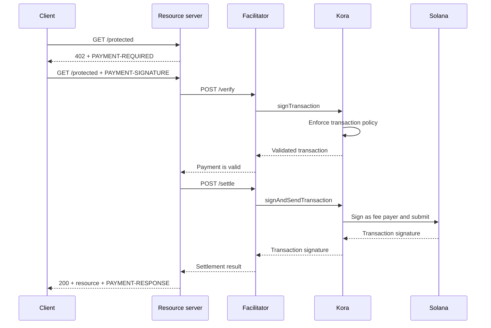

Kora kan de Solana-ondertekening, transactiebeleid en vergoedingssponsorlaag verzorgen achter een [x402 V2-facilitator](/docs/tools/x402-facilitator). De facilitator implementeert de x402 HTTP API; Kora valideert, ondertekent en verstuurt de betalingstransacties die het accepteert.

Deze handleiding start de referentie-Kora-facilitator op Solana Devnet. Dit is een ontwikkelomgeving voor het testen van de integratie, geen productie-implementatie.

## Architectuur



De vier applicatierollen blijven gescheiden:

- De **client** selecteert een betalingsvereiste en ondertekent de betalingsautorisatie.
- De **resourceserver** bepaalt de prijs van een route en verwerkt deze alleen na succesvolle verificatie en afwikkeling.
- De **facilitator** stelt de `/supported`-, `/verify`- en `/settle`-eindpunten van x402 beschikbaar.
- **Kora** ondertekent alleen transacties die door zijn beleid zijn toegestaan en kan de Solana-netwerkvergoedingen sponsoren.

Kora vervangt het x402-protocol niet. Het is de ondertekenings- en beleidsgrens die door deze facilitatorimplementatie wordt gebruikt.

## Start de referentiefacilitator

Je hebt Git en [Docker met Compose](https://docs.docker.com/compose/) nodig. Kloon de meest recente stabiele Kora-release en ga naar de x402-demo:

```bash
git clone --branch v2.0.5 --depth 1 https://github.com/solana-foundation/kora.git
cd kora/examples/x402/demo
cp .env.example .env
```

Stel `KORA_PRIVATE_KEY` in `.env` in op een wegwerpbaar Devnet-keypair. De ondertekeningsconfiguratie van de demo accepteert een base58-geheim, een byte-array-keypair of het pad naar een JSON-keypair-bestand. Financier het openbare adres met Devnet SOL zodat het transactievergoedingen kan sponsoren.

<Callout type="caution" title="Gebruik een wegwerpbare Devnet-ondertekenaar">
  De Docker-demo laadt de Kora-ondertekenaar uit een omgevingsvariabele. Zet geen productiesleutel in deze demo en sla het `.env`-bestand niet op in versiebeheer.
</Callout>

Start Kora en de facilitator:

```bash
docker compose up --build
```

De eerste build kan enkele minuten duren. Wanneer beide gezondheidscontroles slagen, bekijk je de geadverteerde mogelijkheden van de facilitator vanuit een andere terminal:

```bash
curl http://127.0.0.1:3000/supported
```

Het antwoord moet x402 versie `2`, het `exact`-schema en de Devnet CAIP-2-netwerkidentificator adverteren:

```json
{
  "kinds": [
    {
      "x402Version": 2,
      "scheme": "exact",
      "network": "solana:EtWTRABZaYq6iMfeYKouRu166VU2xqa1",
      "extra": {
        "feePayer": "<KORA_SIGNER_ADDRESS>"
      }
    }
  ]
}
```

Kora luistert standaard op `127.0.0.1:8080` en de facilitator op `127.0.0.1:3000`. Stop de demo met `Ctrl+C`.

## Verbind een resourceserver

Configureer de x402-resourceserver om de lokale facilitator en het openbare adres van de Kora-ondertekenaar als ontvanger te gebruiken:

```bash
FACILITATOR_URL=http://127.0.0.1:3000
SOLANA_PAY_TO=<KORA_SIGNER_ADDRESS>
```

Volg daarna [x402 op Solana](/docs/payments/agentic-payments/x402) om x402 V2-middleware toe te voegen aan een Express-route. Een onbetaald verzoek ontvangt `PAYMENT-REQUIRED`, de nieuwe poging bevat `PAYMENT-SIGNATURE` en een succesvol antwoord bevat `PAYMENT-RESPONSE`.

Kopieer geen voorbeelden die `X-PAYMENT`, `X-PAYMENT-RESPONSE` of de netwerknaam `solana-devnet` gebruiken. Die velden horen bij x402 V1.

De Kora-repository bevat ook een beveiligde API en een betalingsbewuste client in dezelfde map `examples/x402/demo`. Gebruik deze applicaties wanneer je de volledige lokale flow wilt testen.

## Configureer het Kora-beleid

De referentie `kora/kora.toml` is bewust beperkt. Het validatiebeleid bepaalt:

- welke Solana-programma's de ondertekenaar toestaat;
- welke SPL-tokenmints gebruikt mogen worden;
- het maximum aantal gesponsorde lamports en handtekeningen;
- welke vergoedingsbetaler-operaties verboden zijn; en
- welke Token-2022-extensies worden geweigerd.

De demo schakelt alleen de Kora RPC-methoden in die de facilitator nodig heeft: `signTransaction`, `signAndSendTransaction`, `getBlockhash`, `getPayerSigner`, `getConfig` en `getVersion`.

Behandel het beleid als de beveiligingsgrens voor de vergoedingsbetaler-sleutel. Voor een productiedienst:

1. Sta alleen de programma's, tokenmints en transactievormen toe die uw x402-schema produceert.
2. Weiger overdrachten, wijzigingen van bevoegdheden, het sluiten van accounts en andere instructies die waarde kunnen verplaatsen van de Kora-ondertekenaar.
3. Stel transactie- en gebruikslimieten in die het verlies beperken bij een gecompromitteerde facilitatorreferentie.
4. Gebruik een beheerde ondertekeningsbackend in plaats van een privésleutel die in een omgevingsvariabele is opgeslagen.

## Beveilig de verbinding tussen facilitator en Kora

De demo schakelt Kora API-sleutelauthenticatie in. De facilitator stuurt de waarde van `KORA_API_KEY`, die moet overeenkomen met `[kora.auth].api_key` in `kora.toml`.

Voor productie, ook:

- houd Kora op een privénetwerk en beëindig TLS op een vertrouwde grens;
- sla API-referenties op in een geheimenbeheerder en roteer ze;
- overweeg Kora's HMAC-verzoekauthenticatie voor bescherming tegen manipulatie en herhaling;
- scheid de vergoedingsbetaler- en betalingsontvanger-sleutels wanneer uw boekhoudmodel dit vereist; en
- stel meldingen in bij beleidsweigering, afwikkelingsfouten, vergoedingsverbruik en het saldo van de ondertekenaar.

## Versterk de betalingsafwikkeling

Kora valideert de Solana-transactie, maar de facilitator en resourceserver blijven verantwoordelijk voor de correctheid van het x402-protocol. Handhaaf het volgende voordat u een resource aanbiedt:

- de geselecteerde x402-versie, het schema, het netwerk, het activum, het bedrag en de ontvanger;
- de autorisatielooptijd en de exacte Solana-instructie-indeling;
- atomaire replaybescherming en idempotente afwikkeling;
- bevestiging op het vereiste bevestigingsniveau van het product; en
- een duurzame koppeling tussen de aankoop, het afwikkelingsresultaat en de uitvoering.

Geef geen betaalde inhoud terug louter omdat Kora een transactie voor ondertekening heeft geaccepteerd. Lever alleen nadat de facilitator een succesvol afwikkelingsresultaat retourneert.

## Gerelateerde bronnen

- [Kora-repository en x402-demo](https://github.com/solana-foundation/kora/tree/main/examples/x402/demo)
- [Kora-operatorconfiguratie](/docs/tools/kora/operators/configuration)
- [Kora-ondertekeningsbackends](/docs/tools/kora/operators/signers)
- [Kora-beveiligingsaudits](/docs/tools/kora/security-audits)
- [x402 V2-specificatie](https://github.com/x402-foundation/x402/blob/main/specs/x402-specification-v2.md)
- [Overzicht van agentische betalingen](/docs/payments/agentic-payments)
