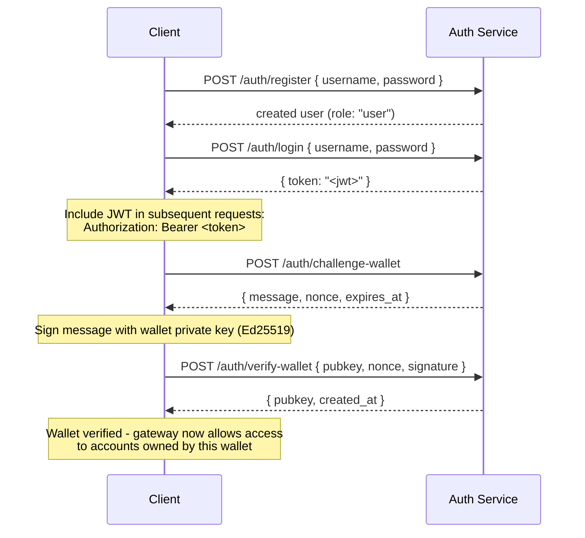

## Overzicht

Private Channels bevat een optionele Auth Service die gatewaytoegang bewaakt
met JWT-authenticatie en rolgebaseerde toegangscontrole (RBAC). Wanneer
authenticatie is uitgeschakeld, accepteert de gateway alle verbindingen. Wanneer ingeschakeld,
moeten clients bij elk verzoek een geldig JWT meesturen.

Deze pagina is bedoeld voor twee doelgroepen:

- **Ontwikkelaars** - registratie, inloggen, walletverificatie en het uitvoeren van
  geverifieerde verzoeken
- **Operators** - de auth service inschakelen, `JWT_SECRET` configureren en
  de `operator`-rol toewijzen

## Authenticatie inschakelen

Authenticatie wordt ingeschakeld door `JWT_SECRET` (niet-leeg) in te stellen op zowel de
gateway als de Auth Service. De Auth Service vereist ook
`AUTH_DATABASE_URL`.

Wanneer `JWT_SECRET` niet is ingesteld, werkt de gateway in open modus; er is geen token
vereist.

> **Docker Compose:** De auth service is een Docker Compose-profiel en wordt **niet
> standaard gestart**. Om deze op te nemen, geef je `--profile auth` mee aan je
> `docker compose`-opdracht, inclusief `--env-file .env` zodat secrets zoals
> `JWT_SECRET` en `POSTGRES_PASSWORD` daadwerkelijk worden omgezet (Compose schakelt het
> automatisch laden van `.env` uit zodra een `--env-file`-vlag wordt meegegeven):
>
> ```bash
> docker compose -f docker-compose.devnet.yml --env-file versions.env --env-file .env.devnet --env-file .env --profile auth up -d
> ```

## Auth Service API

Alle endpoints vallen onder `/auth`. De auth service luistert op `AUTH_PORT`
(standaard `8903`).

### `POST /auth/register`

Maak een nieuw account aan. Alle gebruikers worden geregistreerd met de `user`-rol.

```json
{ "username": "alice", "password": "hunter2" }
```

- Gebruikersnaam: 5-32 tekens, alfanumeriek plus `_` en `-`
- Wachtwoord: 6-128 tekens
- Geeft de aangemaakte gebruiker terug; het wachtwoord wordt nooit teruggegeven

### `POST /auth/login`

Authenticeer en ontvang een ondertekend JWT dat 24 uur geldig is.

```json
{ "username": "alice", "password": "hunter2" }
```

Geeft `{ "token": "<jwt>" }` terug. Zowel een verkeerde gebruikersnaam als een verkeerd wachtwoord geven
`401` terug om het opsporen van gebruikersnamen te voorkomen.

### `POST /auth/challenge-wallet`

Vraag een ondertekeningschallenge aan om eigendom van een Solana-wallet te bewijzen. Vereist een
geldig JWT.

Geeft een bericht, nonce en vervaltijd terug. De challenge vervalt na 10 minuten.

```json
{
  "message": "PrivateChannel wallet verification\nuser: <uuid>\nnonce: <uuid>\nexpires: <unix>",
  "nonce": "<uuid>",
  "expires_at": "<iso8601>"
}
```

### `POST /auth/verify-wallet`

Dien de ondertekende challenge in om een wallet als geverifieerd te registreren. Vereist een geldig
JWT.

```json
{
  "pubkey": "<base58 pubkey>",
  "nonce": "<uuid from challenge>",
  "signature": "<base58 Ed25519 signature>"
}
```

De service reconstrueert het challengebericht, verifieert de Ed25519-handtekening
en slaat de wallet op. Elke nonce kan maar één keer worden gebruikt; herhaalde pogingen worden
afgewezen.

Geeft `{ "pubkey": "<base58>", "created_at": "<iso8601>" }` terug.

### `GET /auth/wallets`

Geeft alle geverifieerde wallets van de geverifieerde gebruiker weer. Vereist een geldig JWT.

### `DELETE /auth/wallets/{pubkey}`

Verwijder een geverifieerde wallet uit het account van de geverifieerde gebruiker. Vereist een geldig
JWT.

### `GET /health`

Liveness-controle. Geeft `200 ok` terug. Geen authenticatie vereist.

## JWT-structuur

Tokens gebruiken het HS256-algoritme en verlopen 24 uur na uitgifte.

| Claim  | Waarde                           |
| ------ | ------------------------------- |
| `sub`  | Gebruikers-UUID                       |
| `role` | `"user"` of `"operator"`        |
| `iss`  | `"private-channel-auth"`        |
| `aud`  | `"private-channel-gateway"`     |
| `exp`  | Unix-tijdstempel (24u na uitgifte) |

> `iss` en `aud` zijn aanwezig in de JWT-payload, maar worden gevalideerd door de
> JWT-configuratie van de gateway, niet gedeserialiseerd in de applicatieclaims-
> struct. Applicatielaagcode heeft alleen toegang tot `sub`, `role` en `exp`.

Geef het token mee in de `Authorization`-header:

```
Authorization: Bearer <JWT_TOKEN>
```

## Rollen

### user

Standaardrol bij registratie.

- Toegang is beperkt tot de geverifieerde wallets van de gebruiker zelf
- Geblokkeerd voor: `getBlock`, `getTransaction`, `simulateTransaction`
- Kan: `Deposit` aanroepen op het Escrow Program, opnames initiëren via
  `WithdrawFunds`

### operator

Verhoogde rol. Moet rechtstreeks worden toegewezen; er is geen zelfbedieningspad om
te escaleren van `user` naar `operator`.

**Ken de rol toe**, via de Admin CLI (`private-channel-auth-admin`):

```bash
private-channel-auth-admin set-role --username alice --role operator
```

of met directe SQL:

<Callout type="warning">
  Dit is een geprivilegieerde databasebewerking. Beperk de toegang tot de Auth Service-
  database dienovereenkomstig en controleer alle rolwijzigingen.
</Callout>

```sql
UPDATE private_channel_auth.users SET role = 'operator' WHERE username = 'alice';
```

**Registreer een wallet zonder de zelfverificatiestroom (Admin CLI,
`private-channel-auth-admin`):**

```bash
private-channel-auth-admin attach-wallet --username alice --pubkey <base58-pubkey>
```

Dit voegt een geverifieerde wallet rechtstreeks in de tabel `verified_wallets` in,
waarmee de challenge/verify-stroom wordt omzeild. Dwingt een unieke beperking af op
`(user_id, pubkey)`. Dit **verleent** de `operator`-rol niet op zichzelf; gebruik
`set-role` of de bovenstaande SQL-update daarvoor. Dit commando is bedoeld om een
wallet aan een account te koppelen (bijvoorbeeld een serviceaccount) zonder dat de
interactieve challenge/verify-stroom vereist is.

**Mogelijkheden:**

- Omzeilt alle walletbezitcontroles
- Volledige toegang tot alle gateway RPC-methoden, inclusief `getBlock`,
  `getTransaction`, `simulateTransaction`
- Vereist voor: `ReleaseFunds`, `ResetSmtRoot`

## Volledige authenticatiestroom



## Geverifieerde verzoeken uitvoeren

```typescript
const response = await fetch("http://localhost:8899/", {
  method: "POST",
  headers: {
    "Content-Type": "application/json",
    Authorization: `Bearer ${jwtToken}`
  },
  body: JSON.stringify({
    jsonrpc: "2.0",
    id: 1,
    method: "getBalance",
    params: [walletAddress]
  })
});
const data = await response.json();
```

## Gateway-endpoints

Deze endpoints vereisen geen authenticatie:

| Endpoint  | Methode | Beschrijving                               | Succes                  | Fout                     |
| --------- | ------ | ----------------------------------------- | ------------------------ | --------------------------- |
| `/health` | GET    | Liveness-controle                            | `200 {"status":"ok"}`    | -                           |
| `/ready`  | GET    | Diepe gereedheidscontrole; test schrijf- en leesknooppunten | `200 {"status":"ready"}` | `503 {"status":"degraded"}` |

Voor de `JWT_SECRET`- en gateway-omgevingsvariabelenreferentie, zie de
[Configuratiereferentie](/docs/tools/private-channels/operators/configuration).

## RPC-methode toegangsmatrix

De volgende methoden worden herkend door de gateway. Wanneer `JWT_SECRET` is ingesteld,
hangt toegang af van de JWT-rol:

| Methode                        | Route      | Geen JWT | `user`           | `operator` |
| ----------------------------- | ---------- | ------ | ---------------- | ---------- |
| `sendTransaction`             | Schrijfknooppunt | ✓      | ✓                | ✓          |
| `getLatestBlockhash`          | Leesknooppunt  | ✓      | ✓                | ✓          |
| `getSlot`                     | Leesknooppunt  | ✓      | ✓                | ✓          |
| `getRecentBlockhash`          | Leesknooppunt  | ✓      | ✓                | ✓          |
| `getSignatureStatuses`        | Leesknooppunt  | ✓      | ✓                | ✓          |
| `getTransactionCount`         | Leesknooppunt  | ✓      | ✓                | ✓          |
| `getFirstAvailableBlock`      | Leesknooppunt  | ✓      | ✓                | ✓          |
| `getBlocks`                   | Leesknooppunt  | ✓      | ✓                | ✓          |
| `getEpochInfo`                | Leesknooppunt  | ✓      | ✓                | ✓          |
| `getEpochSchedule`            | Leesknooppunt  | ✓      | ✓                | ✓          |
| `getRecentPerformanceSamples` | Leesknooppunt  | ✓      | ✓                | ✓          |
| `getBlockTime`                | Leesknooppunt  | ✓      | ✓                | ✓          |
| `getVoteAccounts`             | Leesknooppunt  | ✓      | ✓                | ✓          |
| `getSupply`                   | Leesknooppunt  | ✓      | ✓                | ✓          |
| `getSlotLeaders`              | Leesknooppunt  | ✓      | ✓                | ✓          |
| `isBlockhashValid`            | Leesknooppunt  | ✓      | ✓                | ✓          |
| `getAccountInfo`              | Leesknooppunt  | 401    | bezitsbeveiligd¹ | ✓          |
| `getTokenAccountBalance`      | Leesknooppunt  | 401    | bezitsbeveiligd¹ | ✓          |
| `getSignaturesForAddress`     | Leesknooppunt  | 401    | bezitsbeveiligd¹ | ✓          |
| `getBlock`                    | Leesknooppunt  | 401    | 403              | ✓          |
| `getTransaction`              | Leesknooppunt  | 401    | 403              | ✓          |
| `simulateTransaction`         | Leesknooppunt  | 401    | 403              | ✓          |

¹ **Bezitsbeveiligd**: voor een SPL Token account (het eigenaarsveld is `TokenkegQ...`
of `TokenzQ...`, data van minimaal 165 bytes), controleert de gateway of het
`owner`- of `delegate`-veld overeenkomt met een van de geverifieerde wallets van de geverifieerde gebruiker. Voor elk ander accounttype (een System Program-wallet of een onbekende
PDA) controleert de gateway of de bevraagde pubkey zelf een van de geverifieerde wallets van de gebruiker is, aangezien dergelijke accounts geen eigenaar/delegate-veld hebben om te inspecteren.
Als een van beide controles mislukt, wordt 403 teruggegeven.
