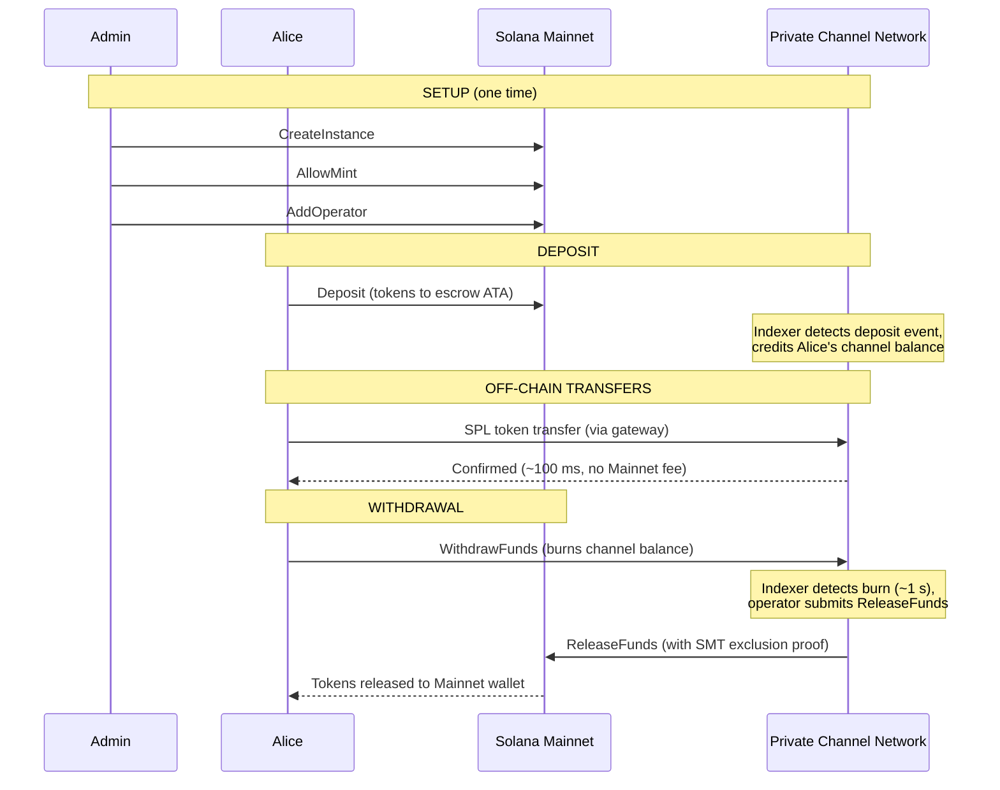
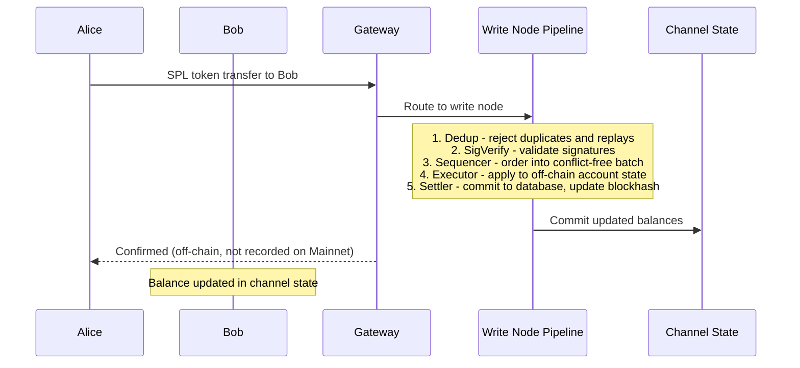
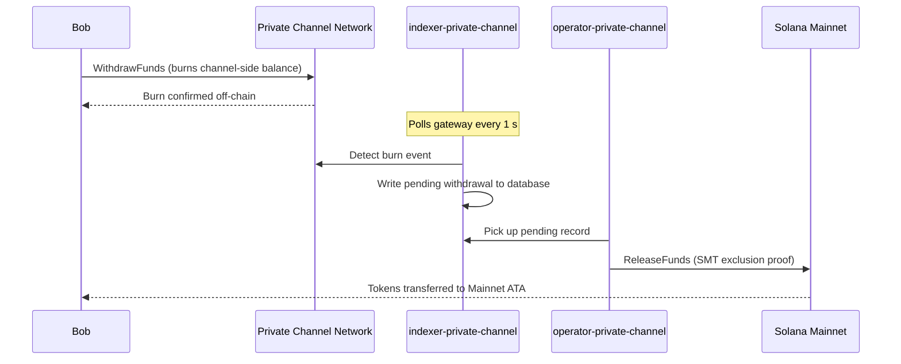

## Wat is een privékanaal?

Een privékanaal is een off-chain betalingsnetwerk dat verankerd is aan Solana. Gebruikers storten SPL-tokens in een on-chain escrow-programma en voeren vervolgens off-chain transacties uit via een gateway met hoge snelheid en zonder kosten per overdracht. Afwikkeling naar Solana Mainnet verloopt via een Sparse Merkle Tree-bewijs, wat garandeert dat fondsen altijd inwisselbaar zijn en dubbele uitgaven onmogelijk zijn.

Anders dan bij de native betalingsstroom van Solana verschijnen overdrachten binnen een kanaal pas on-chain wanneer een gebruiker opneemt. Het kanalennetwerk draait zijn eigen transactiepijplijn (dedup -> sig verify -> sequencer -> executor -> settler) die transacties onafhankelijk van de bloktijd van Solana verwerkt.

## Deelnemers

### Instance-beheerder

De beheerder implementeert de `Instance`-PDA via `CreateInstance` en bepaalt welke SPL-token-mints worden geaccepteerd (`AllowMint` / `BlockMint`). De beheerder beheert en trekt operators in via `AddOperator` / `RemoveOperator`, en kan beheerdersrechten overdragen via `SetNewAdmin`. Er is één beheerder per instantie. De overdracht van beheerdersrechten is onomkeerbaar in één stap: de huidige beheerder kan de rol niet terugkrijgen zonder medewerking van de nieuwe beheerder.

### Operators

Operators worden ingericht door de beheerder. Ze hebben een `Operator`-PDA en zijn de enige accounts die `ReleaseFunds` (voor het afwikkelen van opnames naar Mainnet) en `ResetSmtRoot` (voor het roteren van de Sparse Merkle Tree) mogen aanroepen. Operators omzeilen alle eigendomscontroles in de gateway en hebben toegang tot alle JSON-RPC-methoden, inclusief `getBlock`, `getTransaction` en `simulateTransaction`. JWT-rol: `"operator"`. Operators moeten rechtstreeks in de database worden ingericht; er is geen zelfbediende escalatie mogelijk. Zie de
[Operators-handleiding](/docs/tools/private-channels/operators) voor implementatie- en configuratiedetails.

### Gebruikers

Gebruikers registreren zichzelf via de Auth Service. JWT-rol: `"user"`. Gebruikers kunnen `Deposit` rechtstreeks aanroepen op het Escrow-programma en opnames initiëren via de kanaalzijdige `WithdrawFunds`-instructie op het Withdraw-programma. Gatewaytoegang is beperkt tot hun eigen geverifieerde wallets; ze kunnen `getBlock`, `getTransaction` of `simulateTransaction` niet aanroepen.

## Kanaallevenscyclus

1. **Instantie aanmaken** - Beheerder roept `CreateInstance` aan, waarmee de `Instance`-PDA wordt aangemaakt en de toegestane mints worden geconfigureerd.
2. **Storting** - Gebruikers storten SPL-tokens in de escrow via de `Deposit`-instructie. Tokens worden overgebracht naar de associated token account van de instantie.
3. **Off-chain overdrachten** - Gebruikers versturen overdrachten via de gateway. Overdrachten worden gesequenced en uitgevoerd op het kanalennetwerk zonder Mainnet te raken.
4. **Opname initiëren** - Een gebruiker roept `WithdrawFunds` aan op het Withdraw-programma (kanaalzijde) om zijn saldo te verbranden en een opname te signaleren.
5. **Mainnet-afwikkeling** - Een operator levert een geldig SMT-uitsluitingsbewijs en roept `ReleaseFunds` aan op het Escrow-programma (Mainnet), waardoor tokens worden vrijgegeven naar de wallet van de gebruiker.
6. **Boomrotatie** - Wanneer de SMT de capaciteit nadert (65.536 bladeren), roept de operator `ResetSmtRoot` aan om de boom te roteren en een nieuwe epoch te starten.

### Overdracht

### Opname

## Wanneer privékanalen gebruiken

Gebruik privékanalen wanneer uw applicatie het volgende nodig heeft:

- **Off-chain doorvoer** - uw overdrachtsvolume zou de Solana TPS verzadigen of u heeft bevestiging in minder dan een seconde nodig
- **Privacy** - identiteiten van tegenpartijen en overdrachtsbedragen mogen niet on-chain verschijnen
- **Geen kosten per overdracht** - bij frequente overdrachten waarbij de SOL-kosten per transactie te hoog zijn

Gebruik in plaats daarvan native SPL-overdrachten wanneer:

- **On-chain samenstelbaarheid** vereist is (DeFi, swaps, leningen; andere programma's moeten de overdracht kunnen waarnemen of erop kunnen reageren)
- **Afwikkeling met één overdracht** volstaat en privacy geen vereiste is
- **Geen gateway-infrastructuur** beschikbaar of operationeel haalbaar is
