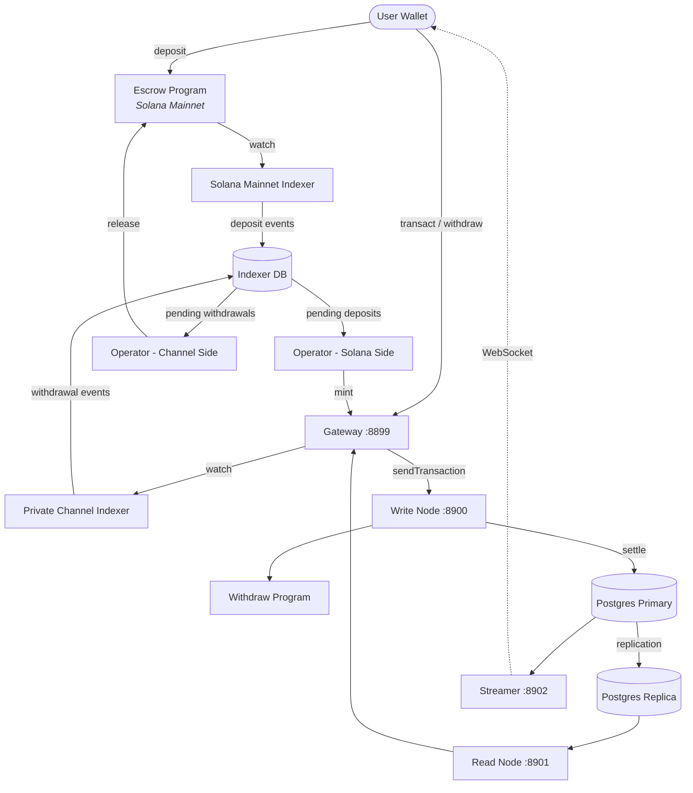

<Callout type="warning">
  Private Channels is niet beveiligingsgeauditeerd en wordt niet aanbevolen voor
  productiegebruik met echte fondsen zonder een grondige beveiligingsbeoordeling.
</Callout>

<Callout type="info">
  **Een instantie implementeren?** Ga naar de [Operatorsgids](/docs/tools/private-channels/operators). **Integreren tegen een
  bestaande instantie?** Ga naar de
  [Quickstart](/docs/tools/private-channels/quickstart/installation). Deze pagina
  is de architectuurreferentie voor beide doelgroepen.
</Callout>

## Architectuur

Private Channels bestaat uit vier componenten: twee on-chain Solana-programma's
(Escrow en Withdraw) en twee off-chain services (Gateway en Auth Service).
Samen vormen ze een state channel-protocol waarbij fondsen op Mainnet staan maar
overdrachten off-chain worden afgewikkeld.

### Escrow-programma

Het Escrow-programma is een on-chain Solana-programma dat gestorte SPL-tokens
bewaard. Het is het vertrouwensanker van het systeem: alle fondsen bevinden zich
ultimelijk in escrow totdat een operator een geldig Sparse Merkle Tree-uitsluitingsbewijs
levert om ze vrij te geven.

- Programma-ID: `9tgHa1DcnaSSUtmMsst8ovKTe1Gfxzezn27KnH9xXYeU`
- Dit ID wordt via `declare_id!()` gecompileerd in de programma-binary. Off-chain
  services lezen hetzelfde ID tijdens het compileren uit de gegenereerde client-crate,
  niet uit een omgevingsvariabele.
- Beheert `Instance`-, `AllowedMint`- en `Operator`-PDA's
- Instructies: `CreateInstance`, `AllowMint`, `BlockMint`, `AddOperator`,
  `RemoveOperator`, `SetNewAdmin`, `Deposit`, `ReleaseFunds`, `ResetSmtRoot`

### Withdraw-programma

Het Withdraw-programma draait op het private channel-netwerk, niet op Solana Mainnet.
Gebruikers roepen `WithdrawFunds` aan om hun token-saldo aan de kanaalzijde te verbranden. Deze verbranding
geeft fondsen niet automatisch vrij; het signaleert aan de operator dat een
opname in behandeling is. De operator roept vervolgens `ReleaseFunds` aan op het Escrow-programma
met een geldig SMT-bewijs om de afwikkeling te voltooien.

- Programma-ID: `J231K9UEpS4y4KAPwGc4gsMNCjKFRMYcQBcjVW7vBhVi`
- Dit ID wordt gecompileerd in de programma-binary. Off-chain services lezen hetzelfde
  ID tijdens het compileren uit de gegenereerde client-crate, niet uit een
  omgevingsvariabele.

### Gateway

De Gateway is een Solana JSON-RPC-compatibele proxy die clientverzoeken doorstuurt naar
het schrijfknooppunt van het kanalennetwerk (voor transactieverwerking) en het leesvenstknooppunt (voor
query's). Het wordt geconfigureerd via omgevingsvariabelen: `GATEWAY_PORT`,
`GATEWAY_WRITE_URL`, `GATEWAY_READ_URL`.

Health-eindpunten (geen authenticatie vereist):

- `GET /health` - livenesscontrole; retourneert `200 {"status":"ok"}`
- `GET /ready` - diepgaande gereedheidscontrole, controleert schrijf- en leesvenstknooppunten; retourneert
  `200 {"status":"ready"}` of `503 {"status":"degraded"}`

#### RPC-methoderoutering en toegang

De gateway stuurt `sendTransaction` door naar het schrijfknooppunt en alle andere methoden naar
het leesvenstknooppunt. Verzoeken groter dan 64 KB worden afgewezen met HTTP 413. Wanneer
authenticatie is ingeschakeld, wordt toegang tot methoden beheerd via JWT-rol. Zie
**[Authenticatie & Rollen](/docs/tools/private-channels/concepts/auth)** voor de
volledigde methodematrix.

### Auth Service

De Auth Service is een optioneel onderdeel dat HS256-JWT's uitgeeft (24 uur
geldigheid) voor toegangscontrole van de gateway. Het wordt ingeschakeld wanneer de omgevingsvariabele `JWT_SECRET`
is ingesteld. Zonder dit accepteert de gateway alle verbindingen.

JWT-claims: `sub` (gebruikers-UUID), `role` (`"user"` of `"operator"`), `iss`
(`"private-channel-auth"`), `aud` (`"private-channel-gateway"`), `exp` (Unix-
tijdstempel). `iss` en `aud` worden gevalideerd door de JWT-configuratie van de gateway,
niet gedeserialiseerd in de applicatieclaimstructuur: alleen `sub`, `role` en
`exp` zijn beschikbaar voor code op de applicatielaag.

Rollen:

- `user` - toegang beperkt tot eigen geverifieerde wallets; kan `getBlock`,
  `getTransaction` of `simulateTransaction` niet aanroepen
- `operator` - omzeilt alle eigendomscontroles; volledige toegang tot RPC-methoden; moet worden
  ingericht in de database (geen zelfbediening voor escalatie)

### Streamer

De Streamer is een WebSocket-server die kanaaltoestandsupdates in realtime naar
verbonden clients pusht, waardoor polling van de RPC niet meer nodig is. Het pollt
PostgreSQL op toestandswijzigingen. Het maakt deel uit van de basis Docker Compose-stack, niet
van de devnet-stack die in deze gids wordt ingezet; zie de
[Configuratiereferentie](/docs/tools/private-channels/operators/configuration#service-port-reference).

- Poort: `8902`, configureerbaar via `STREAMER_PORT`
- Verbinden: `ws://localhost:8902`
- Health-eindpunt: `GET /health` - retourneert `503` als een interne poll-lus
  langer dan 30 seconden stagneert

<Callout type="warning">
  Het WebSocket-gebeurtenisschema is nog niet openbaar gedocumenteerd. Raadpleeg
  [`core/src/bin/streamer.rs`](https://github.com/solana-foundation/solana-private-channels/blob/main/core/src/bin/streamer.rs)
  voor implementatiedetails totdat formele documentatie beschikbaar is.
</Callout>



## Transactiepijplijn

```text
Transaction -> [1:Dedup] -> [2:SigVerify] -> [3:Sequencer] -> [4:Executor] -> [5:Settler] -> Database
```

Transacties die naar de Gateway worden verzonden, doorlopen een vijffasige pijplijn voordat
hun toestand wordt vastgelegd:

1. **Dedup** - filtert dubbele transacties voordat ze de pijplijn binnenkomen
2. **SigVerify** - valideert transactiehandtekeningen tegen de publieke sleutel van de ondertekenaar
3. **Sequencer** - ordent geldige transacties deterministisch om een
   canonieke geschiedenis vast te stellen
4. **Executor** - voert transacties uit tegen de accountslaag van het kanaal
   (BOB Cache + AccountsDB), waarbij saldi off-chain worden bijgewerkt
5. **Settler** - legt geaccumuleerde transactieresultaten vast in PostgreSQL en
   werkt de Redis-cache bij; genereert nieuwe blokhashen voor de volgende blokcyclus.
   Mainnet-afwikkeling (aanroepen van `ReleaseFunds`) wordt afzonderlijk afgehandeld door de
   `operator-private-channel`-service

## Belangrijkste kenmerken

### Privacy

Overdrachten tussen kanaaldeelnemers worden niet vastgelegd op Solana Mainnet. Alleen
stortingen (het kanaal betreden) en definitieve opnames (het kanaal verlaten)
verschijnen on-chain. Tegenpartijidentiteiten en overdrachtsbedragen zijn niet zichtbaar voor
buitenstaanders tijdens kanaaloperaties.

### Prestaties

De off-chain pijplijn verwijdert de bloktijd van Solana uit het kritieke pad.
Overdrachten worden bevestigd wanneer de sequencer ze verwerkt, niet wanneer een Solana-blok
wordt bevestigd. Dit maakt sub-secondefinalisatie en doorvoer mogelijk die de native
TPS van Solana overtreft voor overdrachten op de applicatielaag.

### Afwikkeling

Elke opname is beschermd door een on-chain Sparse Merkle Tree-bewijs. De SMT-wortel
wordt opgeslagen in `Instance.withdrawal_transactions_root` op het Escrow-programma.
Wanneer `ReleaseFunds` wordt aangeroepen, verifieert het programma eerst een uitsluitingsbewijs voor
een ongeziene nonce tegen de huidige on-chain wortel, en vervolgens een afzonderlijk
opnamebewijs voor die nonce tegen de door de aanroeper opgegeven nieuwe wortel. Pas nadat
beide controles zijn geslaagd, slaat het de nieuwe wortel op, waardoor dubbel besteden onmogelijk is, zelfs
als een operatorsleutel gecompromitteerd is.

## Beveiligingsmodel

**Adminsleutel** - beheert het aanmaken van instanties (`CreateInstance`) en het inrichten van operators
(`AddOperator` / `RemoveOperator`). Compromittering van de adminsleutel
maakt willekeurig inrichten van operators mogelijk. `SetNewAdmin` draagt adminbevoegdheid
onherstelbaar over in één stap; bescherm de adminsleutel dienovereenkomstig.

**Operatorsleutels** - kunnen `ReleaseFunds` en `ResetSmtRoot` aanroepen. Ze kunnen
geen fondsen vrijgeven zonder een geldig SMT-uitsluitingsbewijs tegen de huidige on-chain
wortel. De on-chain `verify_smt_exclusion_proof`-controle is de laatste verdedigingslinie
tegen ongeautoriseerde opnames: een gecompromitteerde operatorsleutel alleen is
niet voldoende om de escrow leeg te maken.

**SMT-wortel** - on-chain opgeslagen in `Instance.withdrawal_transactions_root`.
Atomisch bijgewerkt bij elke `ReleaseFunds`-aanroep. Omdat elk bewijs moet
verwijzen naar een ongeziene nonce, is dubbel besteden van hetzelfde kanaalsaldo
onmogelijk, zelfs als een operatorsleutel gecompromitteerd is.

**Boomrotatie** - `Instance.current_tree_index` houdt boom-epochs bij. Wanneer
`ResetSmtRoot` wordt aangeroepen, verhoogt het de boomindex en maakt alle
nonces uit de vorige boom-epoch ongeldig, waardoor een schone lei ontstaat voor nieuwe afwikkelingscycli.

## Operationele sleutelbeveiliging

<Callout type="warning">
  De off-chain services gebruiken hun eigen ondertekenaarsvocabulaire, wat losstaat van
  de on-chain admin/operator-bevoegdheden beschreven in het Beveiligingsmodel hierboven.
  `ADMIN_PRIVATE_KEY` is vereist voor elke operatorservice en betaalt
  transactiekosten; een afzonderlijke, optionele `OPERATOR_PRIVATE_KEY` levert de
  on-chain Operator-handtekening voor `ReleaseFunds` en `ResetSmtRoot`, en valt
  terug op de waarde van `ADMIN_PRIVATE_KEY` wanneer niet ingesteld. Zet nooit de adminsleutel van de
  instantie op protocolniveau (gebruikt voor `CreateInstance` / `AddOperator` / `SetNewAdmin`)
  in een van beide variabelen of stel deze bloot tijdens runtime; bewaar die sleutel koud en offline.
</Callout>

`ReleaseFunds` en `ResetSmtRoot` vereisen twee on-chain handtekeningen: de vergoedingsbetaler
(uit `ADMIN_PRIVATE_KEY`) en de bevoegdheid van de Operator PDA (uit
`OPERATOR_PRIVATE_KEY`, of `ADMIN_PRIVATE_KEY` als dat niet is ingesteld). De devnet-walkthrough in deze implementatiegids
plaatst het gegenereerde operator keypair in
`ADMIN_PRIVATE_KEY` en laat `OPERATOR_PRIVATE_KEY` niet ingesteld, zodat hetzelfde keypair
beide ondertekenaarsrollen vervult. Behandel welke sleutel ook in `ADMIN_PRIVATE_KEY` terechtkomt met
dezelfde controles als een privésleutel van een hot wallet:

- Sla het alleen op in het gitgenegeerde `.env`-bestand, nooit in `.env.devnet` of enige
  vastgelegde configuratie
- Overweeg voor productie-implementaties een secrets manager (AWS Secrets Manager,
  HashiCorp Vault) in plaats van een plaintext-omgevingsvariabele
- Het keypair van de instantieadmin op protocolniveau (gebruikt om `AddOperator` /
  `SetNewAdmin` aan te roepen) moet koud worden bewaard; het is alleen nodig tijdens de instelling van de instantie
  en het inrichten van operators, niet tijdens runtime

`SetNewAdmin` draagt adminrechten **onherstelbaar over in één enkele transactie**:
de huidige admin heeft geen herstelmogelijkheid zonder de medewerking van de nieuwe admin. Roep
het niet aan zonder het doelwit te verifiëren.

## Volgende stappen

<Cards>
  <Card
    title="Quickstart"
    href="/docs/tools/private-channels/quickstart/installation"
  >
    Stel uw omgeving in en genereer TypeScript-clients.
  </Card>
  <Card title="Kanalen" href="/docs/tools/private-channels/concepts/channels">
    Begrijp deelnemers en de levenscyclus van kanalen.
  </Card>
  <Card
    title="Sparse Merkle Tree"
    href="/docs/tools/private-channels/concepts/smt"
  >
    Begrijp hoe opnamebewijzen on-chain worden geverifieerd.
  </Card>
  <Card
    title="Instructies"
    href="/docs/tools/private-channels/instructions/deposit"
  >
    Volledige instructiereferentie voor alle programma's.
  </Card>
</Cards>
