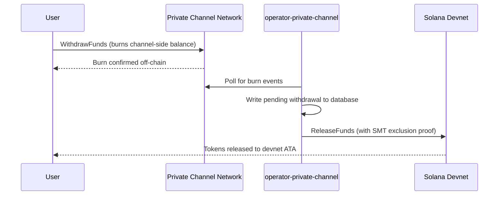

## Overzicht

Opnemen vanuit Private Channels is een tweestapsproces. Eerst verbrandt de gebruiker
hun kanaalzijdig tokensaldo door `WithdrawFunds` aan te roepen op het Withdraw
Program. Vervolgens roept een operator `ReleaseFunds` aan op het Escrow Program (devnet,
in deze walkthrough) met een geldig Sparse Merkle Tree-uitsluitingsbewijs om de
fondsen vrij te geven. Het SMT-bewijs zorgt ervoor dat elke opnamenonce slechts één keer
kan worden gebruikt, waardoor dubbele uitgaven worden voorkomen.



## Stap 1: Opname initiëren op het kanaal

Roep `WithdrawFunds` aan op het Withdraw Program om uw kanaalzijdig saldo te verbranden.
Gebruik de `Async`-variant, die automatisch de `tokenAccount` PDA afleidt en de
aanbevolen vorm is voor productiegebruik:

```typescript
import { getWithdrawFundsInstructionAsync } from "../private-channel-withdraw-program/clients/typescript/src/generated";
import {
  createSolanaRpc,
  address,
  pipe,
  createTransactionMessage,
  setTransactionMessageFeePayerSigner,
  setTransactionMessageLifetimeUsingBlockhash,
  appendTransactionMessageInstruction,
  signAndSendTransactionMessageWithSigners,
  assertIsTransactionMessageWithSingleSendingSigner,
  getBase58Decoder
} from "@solana/kit";

// Point to the gateway, not a public Solana RPC
const privateChannelRpc = createSolanaRpc("http://localhost:8899");

const withdrawIx = await getWithdrawFundsInstructionAsync({
  user: userSigner,
  mint: address(mintAddress),
  amount: 1_000_000n, // 1 USDC (6 decimals)
  destination: null // null = release to signer's devnet wallet
});

const { value: latestBlockhash } = await privateChannelRpc
  .getLatestBlockhash({ commitment: "confirmed" })
  .send();

// Sent to the Private Channels gateway (not Solana RPC directly), which
// expects the legacy transaction format - do not switch this to version 0.
const transactionMessage = pipe(
  createTransactionMessage({ version: "legacy" }),
  (m) => setTransactionMessageFeePayerSigner(userSigner, m),
  (m) => setTransactionMessageLifetimeUsingBlockhash(latestBlockhash, m),
  (m) => appendTransactionMessageInstruction(withdrawIx, m)
);

assertIsTransactionMessageWithSingleSendingSigner(transactionMessage);

const signatureBytes =
  await signAndSendTransactionMessageWithSigners(transactionMessage);
const signature = getBase58Decoder().decode(signatureBytes);
console.log("Withdrawal initiated:", signature);
```

- Withdraw Program ID: `J231K9UEpS4y4KAPwGc4gsMNCjKFRMYcQBcjVW7vBhVi`
- Dien deze transactie in bij de gateway (`http://localhost:8899`), niet bij een
  openbaar Solana RPC
- Als `destination` is opgegeven, gaan de vrijgegeven fondsen naar die wallet in plaats van
  die van de ondertekenaar

## Wat u kunt verwachten

Er is geen verdere actie vereist na het aanroepen van `WithdrawFunds`. De operator-
services verwerken de afwikkeling automatisch:

1. `indexer-private-channel` pollt het kanaal elke 1 seconde op verbrandingsgebeurtenissen
   en schrijft een openstaande opnamerecord wanneer de uwe wordt gedetecteerd
2. `operator-private-channel` pollt de database elke 1 seconde op openstaande
   records en dient `ReleaseFunds` in bij het Escrow Program op Solana devnet
   met het vereiste SMT-uitsluitingsbewijs; het pollt voor devnet-bevestiging tot
   5 keer met intervallen van 400 ms voordat het opnieuw probeert

Fondsen verschijnen doorgaans binnen enkele seconden in uw devnet-wallet onder normale
omstandigheden.

## Hoe de operator afwikkelt (referentie)

Na de kanaalzijdige verbranding moet een ingerichte operator `ReleaseFunds` aanroepen op
het Escrow Program met een geldig SMT-uitsluitingsbewijs; de operator kan geen fondsen
vrijgeven zonder te bewijzen dat de opnamenonce nog niet eerder is gebruikt. Deze stap
wordt automatisch afgehandeld door `operator-private-channel`; u hoeft dit zelf
niet aan te roepen.

De operator verstrekt:

- `amount`: moet overeenkomen met het verbrande bedrag
- `user`: ontvangende wallet op devnet
- `new_withdrawal_root`: bijgewerkte SMT-root na deze opname
- `transaction_nonce`: unieke nonce voor dit blad
- `sibling_proofs`: 512 bytes (16 x 32-byte sibling-hashes voor het boombewijs)

## Verifiëren

Nadat de operatorcall is bevestigd, controleert u uw devnet-tokensaldo:

```bash
spl-token balance <MINT_ADDRESS> --owner <YOUR_WALLET>
```

Of via RPC:

```typescript
import { createSolanaRpc, address } from "@solana/kit";
import { findAssociatedTokenPda } from "@solana-program/token";

const TOKEN_PROGRAM_ADDRESS = address(
  "TokenkegQfeZyiNwAJbNbGKPFXCWuBvf9Ss623VQ5DA"
);

// Query devnet directly; ReleaseFunds settles here, not through the gateway
const rpc = createSolanaRpc("https://api.devnet.solana.com");

const [yourDevnetAta] = await findAssociatedTokenPda({
  mint: address(mintAddress),
  owner: address(userSigner.address),
  tokenProgram: TOKEN_PROGRAM_ADDRESS
});

const balance = await rpc.getTokenAccountBalance(yourDevnetAta).send();
console.log(balance.value.uiAmountString);
```

## U heeft de Quickstart voltooid

U heeft de volledige Private Channels-cyclus op devnet uitgevoerd: SPL-tokens gestort in
het escrow, een off-chain overdracht verzonden via de gateway, en fondsen teruggetrokken
naar uw devnet-wallet.

<Cards>
  <Card
    title="Levenscyclus van het kanaal"
    href="/docs/tools/private-channels/concepts/channels"
  >
    Begrijp de deelnemers en de volledige stroom van storting tot opname in detail.
  </Card>
  <Card
    title="Authenticatie & rollen"
    href="/docs/tools/private-channels/concepts/auth"
  >
    Voeg JWT-authenticatie toe aan uw integratie.
  </Card>
  <Card
    title="Referentie voor fondsen vrijgeven"
    href="/docs/tools/private-channels/instructions/release-funds"
  >
    Volledige ReleaseFunds-instructiereferentie voor operatortooling.
  </Card>
  <Card
    title="Sparse Merkle Tree"
    href="/docs/tools/private-channels/concepts/smt"
  >
    Begrijp hoe opnamebewijzen dubbele uitgaven voorkomen.
  </Card>
</Cards>
