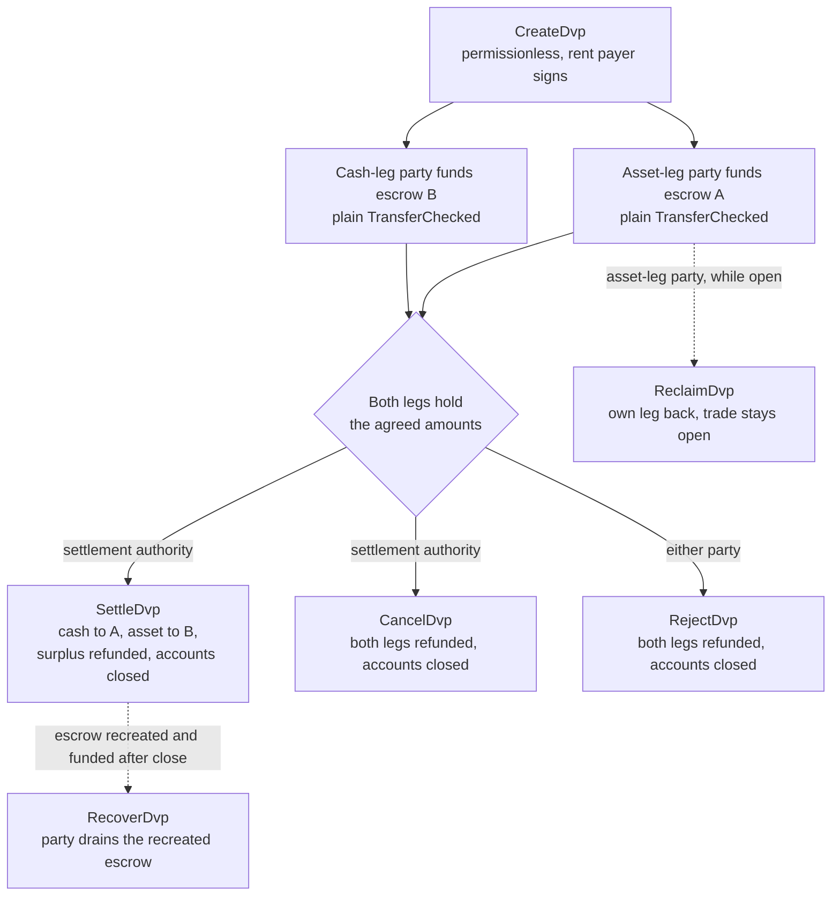
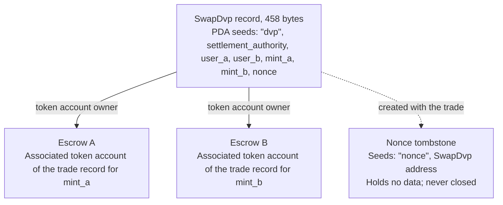

Program DvP to standardowy program do rozrachunku „dostawa za płatność” w Solanie, utrzymywany przez Solana Foundation i poddany audytowi przez Cantina. Dwie strony uzgadniają wymianę, każda wysyła swoją nogę na konto escrow zwykłym transferem tokenów, a podmiot rozliczający rozlicza obie nogi w jednej transakcji, więc albo przesuwają się obie, albo żadna. Podmiot rozliczający to trzeci adres wskazany w wymianie, na przykład platforma lub agent, który ją zorganizował. Żadna ze stron nie pisze ani nie wdraża programu, a portfel lub powiernik, który potrafi wysłać standardowy transfer tokenów (`TransferChecked`), może zasilić nogę bez integracji specyficznej dla DvP. Do czasu rozliczenia każda ze stron może odebrać własną nogę lub wycofać wymianę.

<Callout type="warn" title="Przeczytaj rekord, zanim na nim polegasz">

Tworzenie rekordu wymiany nie wymaga uprawnień, więc rekord nie jest dowodem zgody. Każda ze stron odczytuje zapisane warunki przed zasileniem nogi, a podmiot rozliczający – przed rozliczeniem (zob. [weryfikacja](#verification-before-funding-and-settlement)).

</Callout>

## Jak to działa

Każda wymiana otrzymuje rekord należący do programu i dwa konta escrow, po jednym na nogę. Strona nogi aktywa (`user_a`) i strona nogi gotówkowej (`user_b`) zasilają swoje nogi, przelewając tokeny na konto escrow danej nogi. Podmiot rozliczający jest jedynym sygnatariuszem, który może dokonać rozliczenia. Rozliczenie przekazuje uzgodnioną kwotę każdej nogi drugiej stronie, zwraca ewentualną nadwyżkę stronie będącej właścicielem nogi oraz zamyka rekord i oba konta escrow. Atomowość wynika z [transakcji](/docs/core/transactions) Solany: oba przelewy są w jednej transakcji, więc albo oba wchodzą w życie, albo żaden.

Każdy zwrot, odzyskanie środków i zwrot nadwyżki trafia na associated token account należące do strony: konto `user_a` dla `mint_a`, konto `user_b` dla `mint_b`. Powiernik lub system skarbowy może zasilić nogę z własnego konta, ale wszystko, co zostanie zwrócone, trafia na konto strony, a nie z powrotem do powiernika. Każda wymiana pozostawia też trwałe konto-znacznik (zob. [Stan](#state)).

## Przewodniki

Strony kroków prowadzą jedną wymianę od utworzenia do rozliczenia, z kodem w TypeScript i Rust dla każdej instrukcji.

<Cards>
  <Card title="Utwórz wymianę" href="/docs/defi/dvp-program/create-a-trade">
    Zainstaluj klienty i zapisz warunki wymiany za pomocą CreateDvp
  </Card>
  <Card title="Zasil nogi" href="/docs/defi/dvp-program/fund-the-legs">
    Zweryfikuj zapisane warunki, a następnie zasil każdą nogę zwykłym transferem
  </Card>
  <Card title="Rozlicz wymianę" href="/docs/defi/dvp-program/settle-the-trade">
    Rozlicz obie nogi w jednej transakcji jako podmiot rozliczający
  </Card>
  <Card title="Wycofaj wymianę" href="/docs/defi/dvp-program/unwind-a-trade">
    Odbierz nogę, anuluj lub odrzuć wymianę i odzyskaj spóźnione depozyty
  </Card>
</Cards>

[Demo na devnet](https://solana.com/delivery-vs-payment/demo) przeprowadza wymianę od początku do końca: tworzy wymianę, zasila oba konta escrow standardowymi transferami tokenów i rozlicza obie nogi w jednej transakcji.

## Wybór między programem a delegowaniem

[Delivery vs Payment (DvP) z użyciem delegowania](/docs/tokenization/dvp) rozlicza tę samą wymianę bez programu: każda strona deleguje swoją pozycję agentowi rozliczeniowemu, który przesuwa obie nogi w jednej transakcji.

- **Program** nie wymaga delegowania, więc limit jednego delegata na token account nie obowiązuje, a podmiot rozliczający nie może przekierować wpływów. Każda wymiana zależy od aktualizowalnego programu i jego uprawnienia do aktualizacji.
- **Wzorzec delegowania** nie ma zależności od programu i działa z mintami z Scaled UI Amount. Program odrzuca takie minty, co wyklucza każdy mint utworzony z szablonu `tokenized-security` Mosaic (zob. [ograniczenia konfiguracji mintów](#mint-configuration-constraints)).

## Role

Program jest symetryczny. W jego interfejsie obie strony to `user_a`, który dostarcza `mint_a`, oraz `user_b`, który dostarcza `mint_b`. README i wygenerowane klienty nazywają `mint_a` nogą aktywa, a `mint_b` nogą gotówkową, i te strony trzymają się tej konwencji, ale nic w programie nie wymaga, by noga gotówkowa była instrumentem gotówkowym. Dwa aktywa lub dwa stablecoiny rozlicza się w ten sam sposób.

| Rola                 | Kto                               | Podpisuje                                              | Uwagi                                                                                                                                                                                                     |
| -------------------- | --------------------------------- | -------------------------------------------------- | --------------------------------------------------------------------------------------------------------------------------------------------------------------------------------------------------------- |
| Strona nogi aktywa      | `user_a`, dostarcza `mint_a`       | Własny transfer zasilający; Reclaim, Reject, Recover | Portfel keypair lub inteligentny portfel oparty na PDA, taki jak skarbiec multisig. Konto multisig SPL Token ani program account nie mogą być stroną: Create kończy się błędem `PartyNotSignerCapable`                   |
| Strona nogi gotówkowej       | `user_b`, dostarcza `mint_b`       | Własny transfer zasilający; Reclaim, Reject, Recover | To samo wymaganie                                                                                                                                                                                          |
| Podmiot rozliczający | Trzeci adres wskazany przy tworzeniu | Settle, Cancel                                     | Jedyny sygnatariusz, który może rozliczyć. Nie może przekierować wpływów, które są ustalone przy tworzeniu. Otrzymuje rent z zamykanych kont, gdy rozlicza lub anuluje                                         |
| Płatnik rent           | Ten, kto podpisuje `CreateDvp`         | Create                                             | Wpłaca rent (depozyt SOL utrzymujący konto otwarte) za rekord, znacznik nonce (tombstone) i oba konta escrow. Nie jest zapisywany jako odbiorca rent: rent z zamkniętych kont trafia do tego, kto zamyka wymianę |

## Identyfikator programu

```text
dvp34bdbcEm4f4FCUjGV4mDAkDshaQR4LkK8fdcsyZq
```

| Klaster      | Program                                       | Uprawnienie do aktualizacji                              | Ostatnio wdrożony slot |
| ------------ | --------------------------------------------- | ---------------------------------------------- | ------------------ |
| mainnet-beta | `dvp34bdbcEm4f4FCUjGV4mDAkDshaQR4LkK8fdcsyZq` | `DXtFpbPjcn2hxPnw79x1Pfoj35vXh5AsWBkS37YnXMVv` | 452,058,374        |
| devnet       | `dvp34bdbcEm4f4FCUjGV4mDAkDshaQR4LkK8fdcsyZq` | `5EX1zFeJWj4rGYZv432WnYw8CbaSUeTdxPx4r573UgYU` | 479,376,863        |

Program jest aktualizowalny w obu klastrach. Powyższe wartości to to, co `solana program show` zwróciło 2 października 2026 r.; uruchom to samo polecenie, aby poznać aktualne wartości. Kompilacja na devnet jest starsza niż commit, na którym oparto strony kroków (zob. [Instalacja](/docs/defi/dvp-program/create-a-trade#install)), ale ma ten sam zestaw instrukcji i błędów.

## Cykl życia



Wymiana jest otwarta od `CreateDvp` do momentu, aż jedna z operacji Settle, Cancel lub Reject ją zamknie. Zasilenie nie ma własnej instrukcji: noga jest zasilona, gdy jej konto escrow zawiera co najmniej uzgodnioną kwotę. Reclaim działa dla pojedynczej nogi i pozostawia wymianę otwartą, więc problem z jedną nogą nie zmusza drugiej strony do anulowania całej wymiany.

## Stan

Każda wymiana ma jedno konto `SwapDvp` o rozmiarze 458 bajtów, należące do programu. Jego adres jest wyprowadzany z podmiotu rozliczającego, obu stron, obu mintów i nonce (seedy `["dvp", settlement_authority, user_a, user_b, mint_a, mint_b, nonce]`). Kwoty i czasy są zapisane wewnątrz konta i nie wpływają na adres, dlatego trzeba je odczytać, a nie wnioskować. Małe konto-znacznik, czyli nonce tombstone pod `["nonce", swap_dvp]`, jest tworzone razem z wymianą i nigdy nie jest zamykane, więc każda kombinacja stron, mintów, podmiotu rozliczającego i nonce może zostać użyta tylko dla jednej wymiany.



| Pole                                  | Typ          | Znaczenie                                                                                                 |
| -------------------------------------- | ------------- | ------------------------------------------------------------------------------------------------------- |
| `bump`                                 | `u8`          | Bump PDA                                                                                                |
| `user_a`, `user_b`                     | `Pubkey`      | Obie strony                                                                                         |
| `mint_a`, `mint_b`                     | `Pubkey`      | Minty nogi aktywa i nogi gotówkowej                                                                        |
| `settlement_authority`                 | `Pubkey`      | Jedyny sygnatariusz, który może rozliczyć lub anulować                                                               |
| `token_program_a`, `token_program_b`   | `Pubkey`      | Token program będący właścicielem każdego mintu; wymiana może łączyć nogi SPL Token i Token-2022                    |
| `amount_a`, `amount_b`                 | `u64`         | Uzgodniona kwota każdej nogi, w najmniejszej jednostce mintu (jednostki bazowe)                                 |
| `expiry_timestamp`                     | `i64`         | Po tym czasie sieci (zegar on-chain) Settle jest odrzucane. Reclaim, Cancel i Reject nadal działają |
| `nonce`                                | `u64`         | Rozróżnia wymiany, które mają te same pozostałe seedy. Jednorazowy                                             |
| `ref_string`                           | `[u8; 64]`    | Nieprzezroczysty identyfikator klienta, dopełniony zerami; program nigdy go nie odczytuje                                     |
| `user_a_settlement_destination`        | `Pubkey`      | Otrzymuje nogę gotówkową przy Settle; domyślnie `user_a`                                                   |
| `user_b_settlement_destination`        | `Pubkey`      | Otrzymuje nogę aktywa przy Settle; domyślnie `user_b`                                                  |
| `mint_a_authority`, `mint_b_authority` | `Pubkey`      | Uprawnienia mintów zapisane przy tworzeniu; Settle kończy się błędem, jeśli któreś z nich się zmieniło                           |
| `earliest_settlement_timestamp`        | `Option<i64>` | Jeśli ustawiony, Settle jest odrzucane przed tym czasem sieci                                                     |

Lista pól pochodzi z IDL programu w commicie wskazanym w sekcji [Utwórz wymianę](/docs/defi/dvp-program/create-a-trade#install).

## Instrukcje

| Instrukcja  | Sygnatariusz               | Efekt                                                                                                                                                              |
| ------------ | -------------------- | ------------------------------------------------------------------------------------------------------------------------------------------------------------------- |
| `CreateDvp`  | Dowolny płatnik            | Tworzy rekord `SwapDvp`, jego znacznik nonce (tombstone) i oba konta escrow. Nie przenosi żadnych tokenów                                                                        |
| `ReclaimDvp` | `user_a` lub `user_b` | Zwraca z escrow własną nogę sygnatariusza. Wymiana pozostaje otwarta, a noga może zostać zasilona ponownie                                                                      |
| `SettleDvp`  | Podmiot rozliczający | Przekazuje `amount_a` na adres docelowy `user_b` i `amount_b` na adres docelowy `user_a`, zwraca ewentualną nadwyżkę stronie danej nogi, zamyka rekord i oba konta escrow |
| `CancelDvp`  | Podmiot rozliczający | Zwraca wszystko, co zawiera escrow A, do `user_a`, a escrow B do `user_b`, zamyka rekord i oba konta escrow                                                            |
| `RejectDvp`  | `user_a` lub `user_b` | Taki sam efekt jak Cancel, podpisany przez stronę                                                                                                                            |
| `RecoverDvp` | `user_a` lub `user_b` | Po zamknięciu wymiany: opróżnia odtworzone konto escrow na własne token account sygnatariusza i je zamyka. Obejmuje depozyt, który wpłynął po Settle, Cancel lub Reject  |

Każdy zwrot trafia na associated token account strony dla mintu danej nogi, niezależnie od tego, kto zasilił escrow.

Konta i argumenty każdej instrukcji opisano na stronie danego kroku.

## Błędy

| Kod | Błąd                            | Kiedy                                                                                                   |
| ---- | -------------------------------- | ------------------------------------------------------------------------------------------------------ |
| 0    | `SignerNotParty`                 | Reclaim, Reject lub Recover podpisane przez adres, który nie jest `user_a` ani `user_b`                      |
| 1    | `DvpExpired`                     | Settle po `expiry_timestamp`                                                                        |
| 2    | `SettlementAuthorityMismatch`    | Settle lub Cancel podpisane przez adres inny niż podmiot rozliczający                              |
| 3    | `SettlementTooEarly`             | Settle przed `earliest_settlement_timestamp`                                                          |
| 4    | `LegNotFunded`                   | Settle, gdy escrow zawiera mniej niż uzgodniona kwota                                               |
| 5    | `ExpiryNotInFuture`              | Create z terminem wygaśnięcia równym bieżącemu czasowi sieci lub wcześniejszym                                            |
| 6    | `EarliestAfterExpiry`            | Create z najwcześniejszym czasem rozliczenia późniejszym niż termin wygaśnięcia                                               |
| 7    | `SelfDvp`                        | Create z `user_a` równym `user_b`                                                                 |
| 8    | `SameMint`                       | Create z `mint_a` równym `mint_b`                                                                 |
| 9    | `ZeroAmount`                     | Create z zerową kwotą dla którejkolwiek nogi                                                                |
| 10   | `BlockedMintExtension`           | Create lub Settle z mintem z rozszerzeniem TransferFee, InterestBearing, ScaledUiAmount lub NonTransferable |
| 11   | `SettlementAuthorityIsParty`     | Create z podmiotem rozliczającym równym jednej ze stron                                                  |
| 12   | `SettlementAuthorityExecutable`  | Create z wykonywalnym podmiotem rozliczającym                                                         |
| 13   | `NonceAlreadyUsed`               | Create ponownie używające `(seeds, nonce)`, które ma już tombstone                                         |
| 14   | `ExpiryTooFarInFuture`           | Create z terminem wygaśnięcia dalszym niż rok w przyszłość                                                         |
| 15   | `RefStringTooLong`               | Create z referencją dłuższą niż 64 bajty                                                           |
| 16   | `DvpStillOpen`                   | Recover, gdy wymiana jest nadal otwarta; użyj Reclaim                                                     |
| 17   | `DvpNeverCreated`                | Odzyskiwanie przy użyciu seedów, które nie mają tombstone                                                              |
| 18   | `EscrowPreloadedWithLamports`    | Create, gdy escrow inny niż natywny przechowuje lamports powyżej minimum zwalniającego z rent                           |
| 19   | `SettlementDestinationIsSwapDvp` | Create z miejscem docelowym rozliczenia równym rekordowi wymiany                                         |
| 20   | `SwapDvpPreloadedWithLamports`   | Create, gdy adres rekordu przechowuje lamports powyżej rezerwy na rent                                   |
| 21   | `RecipientAtaMismatch`           | Odbiorca lub token account zwrotu nie należy już do oczekiwanego portfela i mintu                  |
| 22   | `PartyNotSignerCapable`          | Create ze stroną, która nie jest niewykonywalnym kontem należącym do systemu                                 |
| 23   | `MintAuthorityChanged`           | Settle, gdy mint authority nogi różni się od wartości zapisanej przy tworzeniu                         |

## Zdarzenia i indeksowanie

Program nie emituje żadnych zdarzeń onchain. Indeksator lub system uzgadniania
odczytuje stan konta `SwapDvp` oraz salda tokenów obu kont escrow i używa
`ref_string`, aby powiązać wymianę z jej zleceniem off-chain. Ponieważ rekord
jest zamykany przy rozliczeniu, system, który potrzebuje warunków po fakcie,
zapisuje je w chwili odczytu albo odtwarza je z transakcji, która utworzyła
wymianę.

## Obsługiwane tokeny

Wymiana może łączyć nogę SPL Token z nogą Token-2022; każda noga ma własny
token program. Noga z wrapped SOL jest obsługiwana.

| Rozszerzenie Token-2022 w mincie nogi                                                     | Zachowanie programu                                                  |
| ---------------------------------------------------------------------------------------- | ----------------------------------------------------------------- |
| TransferFee, InterestBearing, ScaledUiAmount, NonTransferable                            | Odrzucane w Create i Settle z błędem `BlockedMintExtension`         |
| PermanentDelegate, Pausable, DefaultAccountState, freeze authority, MintCloseAuthority | Akceptowane; każde z tych uprawnień może działać na tokenach w escrow           |
| ConfidentialTransfer                                                                     | Akceptowane; kwoty na tej nodze są publiczne                          |
| TransferHook                                                                             | Obsługiwane, do 32 dodatkowych kont na nogę                        |
| MemoTransfer na koncie docelowym lub koncie zwrotu                                          | Akceptowane; program emituje wymagane memo przed transferem |

Opłata transferowa sprawiłaby, że strona otrzymująca dostałaby mniej niż
uzgodniona kwota. Interest Bearing i Scaled UI Amount nie zmieniają surowych
kwot, ale ich stopa lub mnożnik mogą się zmienić między utworzeniem a
rozliczeniem wymiany, co zmienia sposób wyświetlania uzgodnionych kwot.
NonTransferable zablokowałoby obie nogi.

Akceptowane uprawnienia mogą przenosić, zamrażać lub wstrzymywać tokeny w
escrow przez cały czas trwania wymiany (zob. poniżej). Konta escrow nie można
skonfigurować do odbioru poufnych transferów, więc kwoty w escrow i kwoty
rozliczone na nodze poufnej są publiczne.

W przypadku mintu z hookiem klient ustala dodatkowe konta hooka i dołącza je
do Settle, Cancel, Reject, Reclaim i Recover. Limit 32 na nogę obejmuje program
hooka i jego konto walidacji. Jeśli hook authority powiększy listę kont hooka
ponad ten limit, każdy transfer na tej nodze kończy się niepowodzeniem, w tym
Reclaim, Cancel, Reject i Recover, dopóki authority tego nie cofnie. Limit kont
w transakcji może zadziałać wcześniej niż limit na nogę, gdy obie nogi mają
hooki.

Gdy konto docelowe lub konto zwrotu wymaga memo, program wywołuje program Memo
przed transferem. Dlatego każda instrukcja, która przenosi tokeny z escrow,
przyjmuje konto `memo_program`.

### Ograniczenia konfiguracji mintu

**Scaled UI Amount.** Szablon `tokenized-security` w
[Mosaic](https://github.com/solana-foundation/mosaic), zestawie narzędzi do emisji od Solana Foundation, zawsze
dodaje Scaled UI Amount, więc program nie akceptuje jako nogi mintu utworzonego
z tego szablonu. Mint przeznaczony dla tego programu można utworzyć bez tego
rozszerzenia (zob. [Token Extensions](/docs/tokens/extensions));
[DvP z użyciem delegowania](/docs/tokenization/dvp) rozlicza się przez delegowane uprawnienia
i nie stosuje tej kontroli.

**MINTY zamrożone domyślnie.** Escrow każdej wymiany to associated token account
należące do program-derived address, które jest nowe dla danej wymiany. W mincie
z Default Account State ustawionym na frozen escrow jest tworzone jako
zamrożone, a transfer finansujący na nie kończy się niepowodzeniem, dopóki nie
zostanie odmrożone. W ramach [Token ACL](/docs/tokenization/token-acl) oznacza to, że emitent lub jego
agent transferowy dopuszcza escrow wymiany przed sfinansowaniem: albo dodając
adres rekordu wymiany (właściciela escrow) do allowlisty, tak aby każdy mógł
odmrozić escrow, gdy konfiguracja Token ACL mintu włącza odmrażanie bez
uprawnień, albo przez bezpośrednie odmrożenie przez freeze authority.
Zamrożone escrow blokuje też Settle, Reclaim, Cancel, Reject i Recover na tej
nodze, więc freeze authority, a w mincie z hookiem także hook authority, jest
stroną zaufaną przez cały czas trwania wymiany. Ścieżka zamrożonego escrow jest
opisana tutaj i nie jest wykorzystana we fragmentach kodu dla devnetu.

## Ograniczenia

- Brak dopasowywania zleceń, ustalania cen i księgi zleceń. Strony uzgadniają
  warunki poza księgą, a jedna z nich je zapisuje.
- Brak nettingu i tylko relacje dwustronne: jeden rekord to jedna wymiana między
dwiema stronami.
- Brak częściowej realizacji. Settle przenosi dokładnie uzgodnioną kwotę każdej
  nogi i zwraca nadwyżkę stronie danej nogi.
- Brak nogi poza księgą. Obie nogi to token accounts w Solanie; noga gotówkowa
  w istniejących systemach rozliczana jest osobno i uzgadniana.
- Brak weryfikacji uprawnień, allowlisty ani KYC. Kwalifikowalność posiadaczy
  egzekwują własne mechanizmy kontroli mintu.
- Brak automatycznego rozliczenia. Podmiot uprawniony do rozliczenia musi je
  podpisać.
- Brak zdarzeń i brak opłaty protokołowej poza opłatami transakcyjnymi i rent.

Program eliminuje ryzyko kapitału między dwiema stronami: żadna noga nie
zostanie przeniesiona, jeśli nie zostaną przeniesione obie. Nie eliminuje
ryzyka kredytowego emitenta ani ryzyka wykupu któregokolwiek tokena, możliwości
działania freeze authority, pause authority lub permanent delegate mintu na
tokenach w escrow (zob. [obsługiwane tokeny](#supported-tokens)), ani zależności od
dostępności podmiotu uprawnionego do rozliczenia, który musi je podpisać.

## Weryfikacja przed sfinansowaniem i rozliczeniem

`CreateDvp` nie wymaga uprawnień: podpisuje tylko płatnik, a strony i podmiot
uprawniony do rozliczenia nie. Każdy może więc utworzyć rekord wskazujący
dowolne strony i dowolne warunki. Przed sfinansowaniem, a także ponownie przed
rozliczeniem, odczytaj konto `SwapDvp` i potwierdź, że:

1. Konto należy do programu DvP i ma dokładnie 458 bajtów. Konto, które nie należy
   do programu, można wypełnić bajtami dekodującymi się jak prawdziwy rekord.
2. `user_a`, `user_b`, `mint_a`, `mint_b` i `settlement_authority` odpowiadają
   uzgodnionej wymianie.
3. `amount_a`, `amount_b`, `expiry_timestamp` i
   `earliest_settlement_timestamp` odpowiadają uzgodnionym warunkom.
4. Oba miejsca docelowe rozliczenia to uzgodnione adresy. Sfałszowany rekord może
   przekierować środki.

[Finansowanie nóg](/docs/defi/dvp-program/fund-the-legs#verify-the-terms) wymienia
wygenerowane klienty z funkcjami odczytu ze sprawdzaniem i pokazuje to
sprawdzenie w kodzie.

Uznaj wymianę za rozliczoną, gdy transakcja Settle osiągnie poziom
[`finalized`](/docs/rpc#configuring-state-commitment). Jest to sieciowy poziom
potwierdzenia (commitment level); to, czy oznacza on także ostateczność
rozliczenia w sensie prawnym, zależy od umów stron i obowiązujących reżimów
prawnych.

## Wersjonowanie

Konto `SwapDvp` nie zawiera pola wersji. Jego układ ma stały rozmiar 458 bajtów
(`SwapDvp::LEN`), a funkcje odczytu ze sprawdzaniem odrzucają konto o innej
długości. IDL ma własną wersję: `0.1.0` według stanu na 2 października 2026 r.

Program można aktualizować w obu klastrach (zob. [Program ID](#program-id)). Rekord
wymiany istnieje tylko do chwili rozliczenia, anulowania lub odrzucenia, więc
sprawdź w repozytorium, jak aktualizacja traktuje otwarte wymiany, i
wygeneruj klienty ponownie z IDL wdrożonej wersji.

## Repozytorium i audyt

Kod źródłowy, IDL, wygenerowane klienty i testy znajdują się w
[`solana-foundation/dvp`](https://github.com/solana-foundation/dvp) na licencji MIT. Program jest programem
`no_std` napisanym w Pinocchio; klienty są generowane z IDL za pomocą Codama.
Zgłoszenia podatności należy przesyłać przez link do security advisory w
repozytorium, zgodnie z jego plikiem `SECURITY.md`.

Program został poddany audytowi przez
[Cantina](https://cantina.xyz/portfolio/fe870bb4-d96d-4902-8aec-9dfcfa2d6a79).

## Powiązane

- [Delivery vs Payment (DvP) z użyciem delegowania](/docs/tokenization/dvp): wzorzec
  delegowania bez programu
- [Token ACL](/docs/tokenization/token-acl): jak mint z bramką dostępu współdziała z kontami
  escrow
