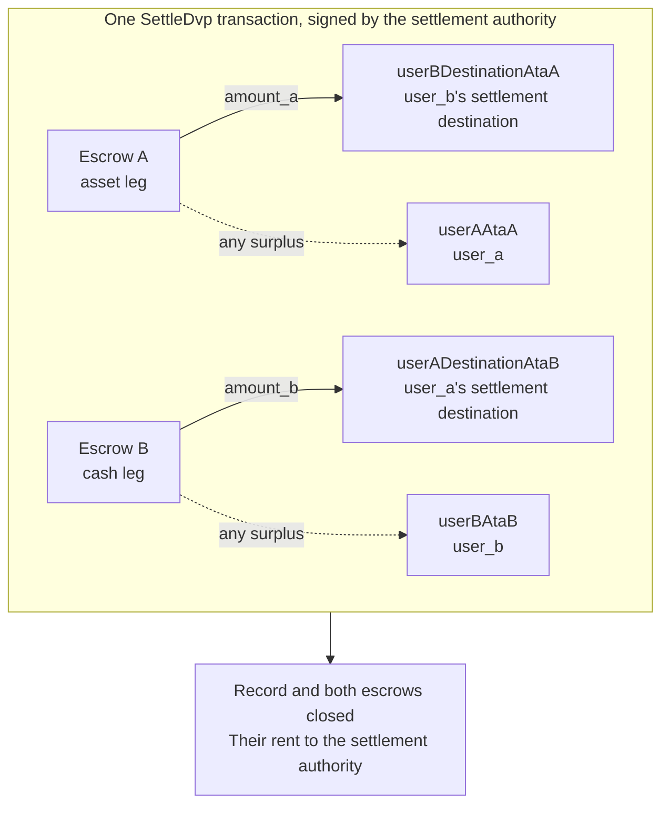

`SettleDvp` jest podpisywana przez podmiot rozliczający wskazany w zapisie transakcji. W
jednej transakcji przenosi `amount_a` z nogi aktywa na adres docelowy strony nogi gotówkowej
oraz `amount_b` z nogi gotówkowej na adres docelowy strony nogi aktywa,
zwraca ewentualną nadwyżkę z któregokolwiek escrow stronie danej nogi oraz zamyka zapis
i oba escrow. Jeśli którykolwiek z tych transferów nie może zostać zrealizowany, instrukcja
kończy się niepowodzeniem i nic nie zostaje przeniesione.

Ta strona jest kontynuacją tematów [tworzenie transakcji](/docs/defi/dvp-program/create-a-trade)
oraz [finansowanie nóg](/docs/defi/dvp-program/fund-the-legs); klient, podpisujący,
`trade` i token accounts stron są przenoszone z poprzednich kroków.

## Ponowna weryfikacja przed podpisaniem

Podmiot rozliczający podpisuje transakcję, która przenosi obie nogi, więc przed podpisaniem
wykonuje ten sam odczyt co każda ze stron: właściciel, rozmiar, strony,
mints, kwoty, termin ważności i oba adresy docelowe (zob.
[finansowanie nóg](/docs/defi/dvp-program/fund-the-legs#verify-the-terms)). Sam
program przy rozliczeniu ponownie sprawdza, czy każdy mint nadal należy do token
program zapisanego podczas tworzenia, nie ma zablokowanego rozszerzenia i ma tę samą
mint authority co w chwili tworzenia transakcji, więc mint odtworzony z zablokowanym
rozszerzeniem, innym token program lub inną mint authority nie może
zostać rozliczony.

## Utwórz konta odbiorców

Settle zapisuje dane w czterech token accounts, których program nie tworzy:

| Konto                | Otrzymuje                     | Właściciel                           |
| ---------------------- | ---------------------------- | ------------------------------- |
| `userADestinationAtaB` | Noga gotówkowa (`amount_b`)    | `user_a_settlement_destination` |
| `userBDestinationAtaA` | Noga aktywa (`amount_a`)   | `user_b_settlement_destination` |
| `userAAtaA`            | Ewentualna nadwyżka na nodze aktywa | `user_a`                        |
| `userBAtaB`            | Ewentualna nadwyżka na nodze gotówkowej  | `user_b`                        |

Konta nadwyżek są używane tylko wtedy, gdy escrow zawiera więcej niż uzgodniona
kwota, ale każdy, kto posiada dany mint, może wygenerować nadwyżkę, wysyłając kilka jednostek
bazowych do escrow. Jeśli konto zwrotu nie istnieje, całe Settle
kończy się niepowodzeniem, dlatego utwórz wszystkie cztery idempotentnie w tej samej transakcji.

<Tabs items={["TypeScript", "Rust"]}>
  <Tab value="TypeScript">
    ```ts
    import {
      findAssociatedTokenPda,
      getCreateAssociatedTokenIdempotentInstruction,
    } from "@solana-program/token-2022";

    const destinationA = t.userASettlementDestination; // defaults to userA
    const destinationB = t.userBSettlementDestination; // defaults to userB

    const [userADestinationAtaB] = await findAssociatedTokenPda({
      mint: mintB,
      owner: destinationA,
      tokenProgram: tokenProgramB,
    });
    const [userBDestinationAtaA] = await findAssociatedTokenPda({
      mint: mintA,
      owner: destinationB,
      tokenProgram: tokenProgramA,
    });
    // userAAtaA and userBAtaB are from fund the legs.

    const createRecipientAccounts = [
      { ata: userADestinationAtaB, owner: destinationA, mint: mintB, tokenProgram: tokenProgramB },
      { ata: userBDestinationAtaA, owner: destinationB, mint: mintA, tokenProgram: tokenProgramA },
      { ata: userAAtaA, owner: userA, mint: mintA, tokenProgram: tokenProgramA },
      { ata: userBAtaB, owner: userB, mint: mintB, tokenProgram: tokenProgramB },
    ].map(({ ata, owner, mint, tokenProgram }) =>
      getCreateAssociatedTokenIdempotentInstruction({
        payer: authoritySigner,
        ata,
        owner,
        mint,
        tokenProgram,
      }),
    );
    ```

  </Tab>

  <Tab value="Rust">
    ```rust
    use spl_associated_token_account_client::address::get_associated_token_address_with_program_id;
    use spl_associated_token_account_client::instruction::create_associated_token_account_idempotent;

    let authority: Pubkey = pubkey!("SETTLEMENT_AUTHORITY_ADDRESS_HERE");
    let destination_a = trade.user_a_settlement_destination; // defaults to user_a
    let destination_b = trade.user_b_settlement_destination; // defaults to user_b

    let user_a_destination_ata_b =
        get_associated_token_address_with_program_id(&destination_a, &mint_b, &token_program_b);
    let user_b_destination_ata_a =
        get_associated_token_address_with_program_id(&destination_b, &mint_a, &token_program_a);
    let user_a_ata_a = get_associated_token_address_with_program_id(&user_a, &mint_a, &token_program_a);
    let user_b_ata_b = get_associated_token_address_with_program_id(&user_b, &mint_b, &token_program_b);

    let create_recipient_accounts = [
        create_associated_token_account_idempotent(&authority, &destination_a, &mint_b, &token_program_b),
        create_associated_token_account_idempotent(&authority, &destination_b, &mint_a, &token_program_a),
        create_associated_token_account_idempotent(&authority, &user_a, &mint_a, &token_program_a),
        create_associated_token_account_idempotent(&authority, &user_b, &mint_b, &token_program_b),
    ];
    ```

  </Tab>
</Tabs>

## Rozliczenie (Settle)

`legAExtrasCount` informuje program, ile z kont dołączonych po stałej
liście należy do transfer hooka nogi aktywa; pozostałe należą do nogi
gotówkowej. W przypadku mints bez transfer hooków przekaż zero i niczego nie dołączaj. Memo
program account jest wymagany przez instrukcję i jest używany tylko dla adresów docelowych,
które wymagają memo.

<Tabs items={["TypeScript", "Rust"]}>
  <Tab value="TypeScript">
    ```ts
    import { MEMO_PROGRAM_ADDRESS } from "@solana-program/memo";
    import { getSettleDvpInstruction } from "./dvp";

    const settleInstruction = getSettleDvpInstruction({
      settlementAuthority: authoritySigner,
      swapDvp,
      mintA,
      mintB,
      dvpAtaA: escrowA,
      dvpAtaB: escrowB,
      userADestinationAtaB,
      userBDestinationAtaA,
      userAAtaA,
      userBAtaB,
      tokenProgramA,
      tokenProgramB,
      memoProgram: MEMO_PROGRAM_ADDRESS,
      legAExtrasCount: 0,
    });

    const { context: settleContext } = await client.sendTransaction([
      ...createRecipientAccounts,
      settleInstruction,
    ]);
    const settleSignature = settleContext.signature;
    console.log("Submitted:", settleSignature);

    // sendTransaction returns at the client's commitment (confirmed by default).
    // Wait for finalized before recording the trade as settled.
    let finalized = false;
    for (let attempt = 0; attempt < 30 && !finalized; attempt++) {
      const {
        value: [status],
      } = await client.rpc.getSignatureStatuses([settleSignature]).send();
      if (status?.err) {
        throw new Error("Settle transaction failed");
      }
      finalized = status?.confirmationStatus === "finalized";
      if (!finalized) {
        await new Promise((resolve) => setTimeout(resolve, 2_000));
      }
    }
    if (!finalized) {
      // A closed record means it settled; an open one is safe to settle again.
      throw new Error("Settle not finalized after 60s; read the trade record");
    }
    console.log("Settled:", settleSignature);
    ```

  </Tab>

  <Tab value="Rust">
    ```rust
    use dvp_swap_program_client::instructions::SettleDvpBuilder;

    const MEMO_PROGRAM_ID: Pubkey = pubkey!("MemoSq4gqABAXKb96qnH8TysNcWxMyWCqXgDLGmfcHr");

    let settle_ix = SettleDvpBuilder::new()
        .settlement_authority(authority)
        .swap_dvp(swap_dvp)
        .mint_a(mint_a)
        .mint_b(mint_b)
        .dvp_ata_a(escrow_a)
        .dvp_ata_b(escrow_b)
        .user_a_destination_ata_b(user_a_destination_ata_b)
        .user_b_destination_ata_a(user_b_destination_ata_a)
        .user_a_ata_a(user_a_ata_a)
        .user_b_ata_b(user_b_ata_b)
        .token_program_a(token_program_a)
        .token_program_b(token_program_b)
        .memo_program(MEMO_PROGRAM_ID)
        .leg_a_extras_count(0)
        .instruction();
    ```

  </Tab>
</Tabs>



### Transfer hooks

Wygenerowany IDL zawiera tylko stałe konta, więc wygenerowane buildery
nie znają kont hooków. Rozwiąż extra account metas każdego mintu z hookiem
tak samo, jak przy bezpośrednim transferze tego tokena, a następnie dołącz je do
instrukcji: najpierw konta nogi aktywa, potem nogi gotówkowej, przy czym
`legAExtrasCount` ustaw na liczbę w pierwszej grupie. W TypeScript rozszerz
tablicę `accounts` instrukcji o rozwiązane metas; w Rust użyj
`add_remaining_accounts` w builderze. Limit wynosi 32 konta na nogę,
włącznie z programem hooka i kontem walidacji; limit kont w transakcji
może zadziałać wcześniej, gdy obie nogi mają hooki. Program usuwa flagę podpisującego
z każdego przekazywanego konta, więc hook nie może uzyskać podpisu
podmiotu rozliczającego tą drogą.

## Zapisz wynik

Uznaj transakcję za rozliczoną, gdy transakcja Settle osiągnie status `finalized`. Zapis
i oba escrow po rozliczeniu już nie istnieją, więc system, który później potrzebuje
warunków, zapisuje je z odczytu sprzed rozliczenia lub z transakcji tworzącej. Rent z zamkniętych kont trafił do podmiotu
rozliczającego.

## Błędy rozliczenia (Settle)

`LegNotFunded` oznacza, że escrow zawiera mniej niż uzgodniona kwota; `DvpExpired`
i `SettlementTooEarly` oznaczają, że okno czasowe zostało przekroczone; `MintAuthorityChanged`
i `BlockedMintExtension` oznaczają, że mint zmienił się po utworzeniu;
`RecipientAtaMismatch` oznacza, że token account adresu docelowego lub zwrotu nie istnieje albo
nie należy już do oczekiwanego właściciela i mintu, zwykle dlatego, że pominięto powyższy krok
tworzenia konta. W każdym z tych przypadków nic nie zostało przeniesione, a
strony mogą cofnąć transakcję, z zastrzeżeniem uprawnień mintu (zob.
[cofanie transakcji](/docs/defi/dvp-program/unwind-a-trade)).

## Dalsze kroki

- [Cofanie transakcji](/docs/defi/dvp-program/unwind-a-trade): odzyskiwanie sfinansowanych
  nóg, gdy transakcja nie zostaje rozliczona
