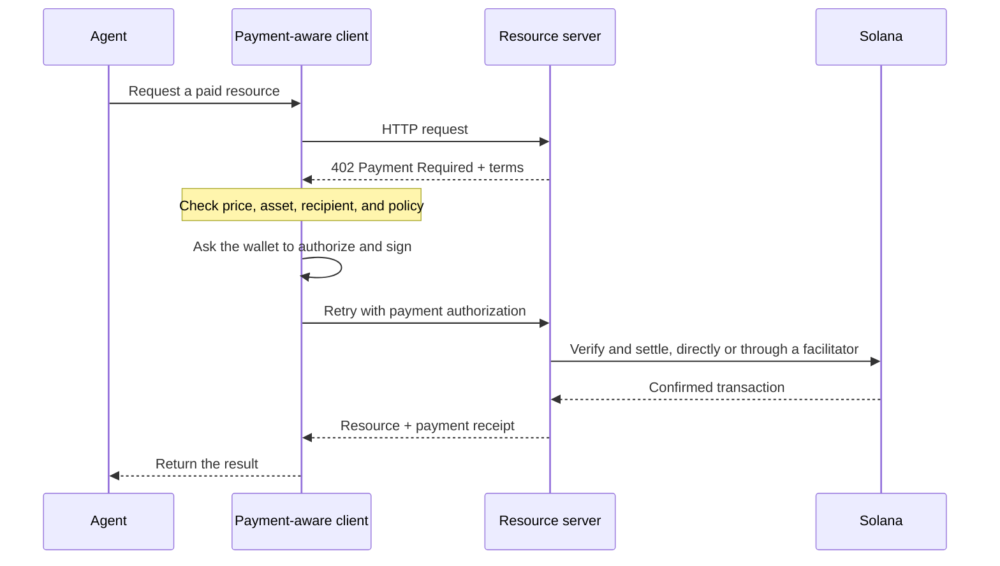

Płatności agentowe pozwalają oprogramowaniu poznać cenę, autoryzować płatność i otrzymać
zasób w ramach tego samego przepływu HTTP. Agent może zapłacić za zapytanie o dane, inferencję
modelu lub wywołanie narzędzia bez wcześniejszego zakładania konta rozliczeniowego czy kopiowania
klucza API.

<Cards>
  <Card title="MPP" href="/docs/payments/agentic-payments/mpp">
    Użyj uwierzytelniania HTTP do jednorazowych opłat i płatnych sesji z pomiarem zużycia.
  </Card>
  <Card title="x402" href="/docs/payments/agentic-payments/x402">
    Dodaj do zasobu HTTP wymagania płatnicze x402 V2, podpisy i rozliczenie.
  </Card>
</Cards>

## Wspólny przepływ płatności

MPP i x402 używają różnych nagłówków i modeli danych, ale ich podstawowy przepływ HTTP jest
podobny:

## MPP i x402

Oba protokoły mogą rozliczać płatności w stablecoinach na Solanie. Wybierz ten, który lepiej pasuje do
modelu płatności i interoperacyjności potrzebnych Twojej usłudze, a nie kieruj się wyłącznie wspólnym kodem statusu `402`.

|                         | MPP                                                               | x402                                                                     |
| ----------------------- | ----------------------------------------------------------------- | ------------------------------------------------------------------------ |
| Wezwanie do zapłaty (challenge)               | `WWW-Authenticate: Payment`                                       | `PAYMENT-REQUIRED`                                                       |
| Autoryzacja klienta    | `Authorization: Payment`                                          | `PAYMENT-SIGNATURE`                                                      |
| Potwierdzenie                 | `Payment-Receipt`                                                 | `PAYMENT-RESPONSE`                                                       |
| Modele płatności na Solanie   | Jednorazowe intencje `charge` oraz ograniczone limitem, rozliczane według zużycia intencje `session`           | Schematy takie jak `exact` i `upto`; obsługa zależy od sieci i klienta |
| Architektura rozliczeń | Walidacja po stronie serwera lub opcjonalny przekaźnik albo brama                | Serwer zasobów z lokalną weryfikacją lub facilitator                 |
| Dobry punkt wyjścia     | API wymagające semantyki uwierzytelniania HTTP lub wielokrotnego pomiaru zużycia | Zasoby płatne za żądanie i istniejący klienci x402                      |

MPP to **Machine Payments Protocol**. Nie należy go mylić z **Model
Context Protocol (MCP)**. MCP udostępnia agentom narzędzia i zasoby; MPP lub x402
mogą wymagać płatności, gdy agent wywołuje jedno z tych narzędzi.

<Callout type="info">
  Usługa może udostępniać więcej niż jeden protokół. Klient wybiera obsługiwaną przez siebie
  opcję płatności, a następnie używa pasujących nagłówków wezwania, autoryzacji i
  potwierdzenia w całej wymianie.
</Callout>
