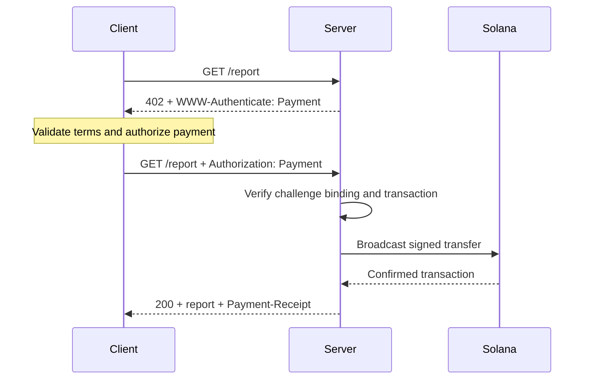
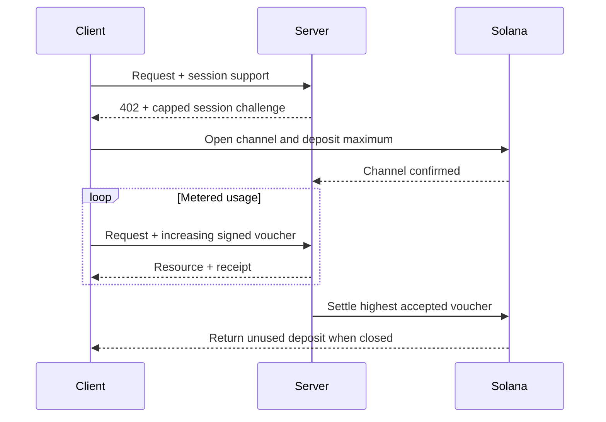

[Machine Payments Protocol (MPP)](https://mpp.dev/) stosuje semantykę uwierzytelniania HTTP do płatności. Serwer wysyła wyzwanie w odpowiedzi na nieopłacone żądanie, klient zwraca poświadczenie płatności, a serwer po zaakceptowaniu płatności zwraca potwierdzenie.

MPP rozdziela trzy kwestie:

- **Intencja** (intent) opisuje interakcję handlową, na przykład jednorazową opłatę `charge` lub rozliczaną według zużycia sesję `session`.
- **Metoda płatności** opisuje sposób przepływu wartości. Metoda dla Solany obsługuje w przypadku opłat natywny token SOL oraz tokeny SPL.
- **Transport** HTTP przenosi wyzwania, poświadczenia, potwierdzenia i błędy.

MPP jest publikowany jako zestaw dokumentów Internet-Draft. Traktuj [aktualne specyfikacje](https://paymentauth.org/) jako źródło prawdy i miej na uwadze, że szczegóły mogą się zmieniać, dopóki prace nad wersjami roboczymi trwają.

## Wymiana HTTP

MPP używa standardowych pól uwierzytelniania HTTP zamiast nagłówków płatności specyficznych dla protokołu:

| Komunikat                 | Reprezentacja HTTP                                         |
| ----------------------- | ----------------------------------------------------------- |
| Wyzwanie płatnicze       | `402 Payment Required` z `WWW-Authenticate: Payment ...` |
| Poświadczenie płatności      | Ponowione żądanie z `Authorization: Payment ...`           |
| Potwierdzenie udanej płatności      | Odpowiedź z zasobem z `Payment-Receipt: ...`               |
| Nieprawidłowe dane płatności | Treść Problem Details w formacie `application/problem+json`       |



Wyzwanie zawiera wygenerowany przez serwer identyfikator, realm, metodę, intencję, zakodowane żądanie płatności oraz termin ważności. Poświadczenie powtarza wyzwanie i dodaje dowód płatności specyficzny dla danej metody. Serwer musi zweryfikować oba elementy; prawidłowy transfer powiązany z innym wyzwaniem nie może odblokować zasobu.

## Jednorazowe opłaty na Solanie

Intencja `charge` dla Solany obsługuje dwa typy poświadczeń:

- **Tryb pull** wykorzystuje podpisaną transakcję. Klient podpisuje transfer i wysyła transakcję do serwera. Serwer weryfikuje ją, opcjonalnie dodaje podpis płatnika opłat (fee payer), rozgłasza transakcję, czeka na jej potwierdzenie i zwraca sygnaturę transakcji w potwierdzeniu.
- **Tryb push** wykorzystuje sygnaturę transakcji. Klient najpierw rozgłasza transakcję, a następnie wysyła potwierdzoną sygnaturę do serwera. Serwer pobiera transakcję i weryfikuje ją przed zwróceniem zasobu.

Tryb pull umożliwia sponsorowanie opłat transakcyjnych przez serwer oraz logikę ponawiania po stronie serwera. Tryb push jest przydatny, gdy portfel wymaga, aby klient samodzielnie przesłał swoją transakcję, ale nie można w nim skorzystać ze sponsorowania opłat przez serwer.

Normatywne pola i reguły weryfikacji znajdziesz w [specyfikacji opłat Solana charge](https://paymentauth.org/draft-solana-charge-00.html).

## Dodawanie opłaty MPP do API Express

Solana Pay Kit zapewnia aktualną integrację TypeScript dla MPP i x402. Zainstaluj go razem z Express:

```bash
pnpm add @solana/pay-kit @solana/kit@^6.9.0 express
pnpm add --save-dev @types/express tsx
```

Ten najprostszy przykład korzysta z hostowanego środowiska testowego Surfpool oraz publicznego odbiorcy demonstracyjnego z pakietu. Służy wyłącznie do lokalnego programowania:

```ts filename=server.ts
import express from "express";
import { createPayKit, usd } from "@solana/pay-kit";

const pay = await createPayKit({
  accept: ["mpp"],
  rpcUrl: "https://402.surfnet.dev:8899"
});

const app = express();

app.get("/report", pay.express(usd("0.01")), (_req, res) => {
  res.json({ report: "Paid report" });
});

app.listen(4567, () => {
  console.log("Paid API listening on http://127.0.0.1:4567");
});
```

Uruchom go i porównaj nieopłacone żądanie z żądaniem obsługującym płatności:

```bash
pnpm tsx server.ts
curl -i http://127.0.0.1:4567/report
pay --sandbox curl http://127.0.0.1:4567/report
```

Handler trasy jest uruchamiany dopiero po tym, jak middleware zaakceptuje płatność.

<Callout type="warn" title="Zastąp wszystkie domyślne ustawienia sandboxa w środowisku produkcyjnym">
  Skonfiguruj jawnie sieć, odbiorcę (merchant), dedykowany RPC, stabilny sekret powiązania wyzwań, produkcyjnego sygnatariusza oraz trwały magazyn zapobiegający powtórzeniom (replay store). Nigdy nie kieruj prawdziwych płatności do demonstracyjnego sygnatariusza z pakietu.
</Callout>

## Sesje rozliczane według zużycia

Użyj sesji Solana MPP `session`, gdy klient będzie wykonywać wiele drobnych, powiązanych ze sobą płatności. Sesja otwiera kanał płatności onchain z maksymalnym depozytem, a następnie w miarę wzrostu zużycia korzysta ze skumulowanych podpisanych voucherów. Serwer może weryfikować vouchery offchain i rozliczyć najwyższą zaakceptowaną kwotę później.

Sprawdza się to w przypadku inferencji rozliczanej według tokenów, pobierań rozliczanych według bajtów, danych na żywo i powtarzanych wywołań narzędzi. Nie jest to to samo, co wysyłanie osobnej płatności onchain dla każdego zdarzenia.



Nazywaj sesję **płatnością sesyjną**, **kanałem płatności** lub **ograniczoną, powtarzalną autoryzacją**. Określenia „płatność strumieniowa” używaj tylko wtedy, gdy usługa i umowa płatnicza faktycznie mierzą strumień zużycia.

## Weryfikacja w środowisku produkcyjnym

W przypadku każdej opłaty na Solanie serwer musi zweryfikować co najmniej:

- Wyzwanie jest autentyczne, nie wygasło, jest powiązane z tym żądaniem i przeznaczone dla tego realm.
- Transakcja używa oczekiwanej sieci, aktywa lub mint, odbiorcy, kwoty oraz token program.
- Wszelkie instrukcje płatnika opłat lub associated token account są jawnie dozwolone i nie mogą opróżnić środków sygnatariusza serwera.
- Transakcja zakończyła się powodzeniem na wymaganym poziomie commitment.
- Sygnatura transakcji nie została jeszcze wykorzystana.
- Sprawdzenie powtórzenia i operacja oznaczenia jako wykorzystanej są atomowe na wszystkich instancjach serwera.

W przypadku sesji przechowuj też stan kanału, zaakceptowaną kwotę skumulowaną oraz znacznik rozliczenia (settlement watermark) we wspólnym magazynie. Opisz w dokumentacji, jak klienci odzyskują niewykorzystane środki, jeśli serwer stanie się niedostępny.

## Powiązane zasoby

- [Specyfikacje MPP](https://paymentauth.org/)
- [Dokumentacja protokołu MPP](https://mpp.dev/protocol)
- [Solana Pay Kit](https://github.com/solana-foundation/pay-kit)
- [Przegląd płatności agentowych](/docs/payments/agentic-payments)
- [Gotowość produkcyjna](/docs/tools/production-readiness)
