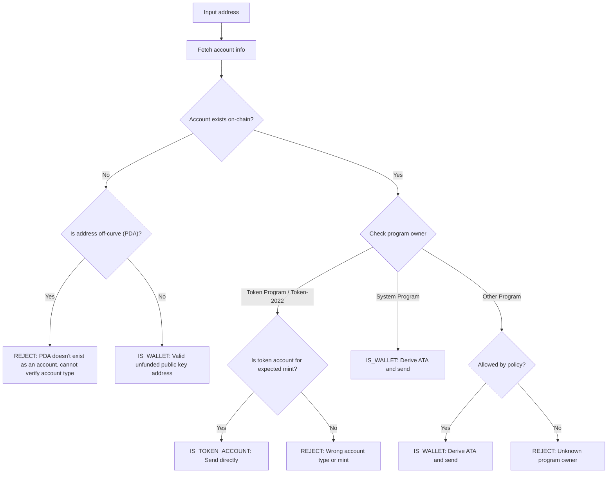

Wysłanie tokenów na nieprawidłowy adres może skutkować trwałą utratą środków.
Weryfikacja adresu zapewnia, że wysyłasz tokeny tylko na adresy, które mogą je
poprawnie odebrać i uzyskać do nich dostęp.

<Callout>
  Zobacz [Jak działają płatności w Solana](/docs/payments/how-payments-work),
  aby poznać podstawowe pojęcia dotyczące płatności.
</Callout>

## Zrozumienie adresów Solana

Konta Solana mają dwa typy adresów: on-curve i off-curve.

### Adresy on-curve

Standardowe adresy to klucze publiczne z par kluczy Ed25519. Te adresy:

- Mają odpowiadający im klucz prywatny, który może podpisywać transakcje
- Służą jako adresy portfeli

### Adresy off-curve (PDA)

[Program Derived Addresses](/docs/core/pda) (adresy pochodne programu) są
deterministycznie wyprowadzane z ID programu i seedów. Te adresy:

- **Nie** mają odpowiadającego im klucza prywatnego
- Mogą być podpisywane tylko przez program, z którego zostały wyprowadzone

## Typy kont w płatnościach

Użyj adresu, aby pobrać [konto](/docs/core/accounts) z sieci, sprawdź
właściciela programu i typ konta, aby określić, jak obsłużyć dany adres.

<Callout>
  Wiedza o tym, czy adres jest on-curve czy off-curve, nie mówi, jaki to typ
  konta, jaki program jest jego właścicielem ani czy konto istnieje pod tym
  adresem. Musisz pobrać konto z sieci, aby poznać te szczegóły.
</Callout>

### Konta System Program (portfele)

Konta należące do System Program to standardowe portfele. Aby wysłać tokeny SPL
do portfela, należy wyznaczyć i użyć jego
[associated token account (ATA)](/docs/tokens/basics/create-token-account#whats-an-associated-token-account).

Po wyznaczeniu adresu ATA sprawdź, czy token account istnieje on-chain. Jeśli
ATA nie istnieje, możesz dodać instrukcję utworzenia token account odbiorcy w
tej samej transakcji co transfer. Wymaga to jednak opłacenia rent za nowe token
account. Ponieważ odbiorca jest właścicielem ATA, SOL zapłacone za rent nie może
zostać odzyskane przez nadawcę.

<Callout type="warn">
  Bez odpowiednich zabezpieczeń subsydiowanie tworzenia ATA może zostać
  wykorzystane w nieuczciwy sposób. Złośliwy użytkownik może zlecić transfer,
  utworzyć swoje ATA na Twój koszt, zamknąć ATA, aby odzyskać rent SOL, i
  powtarzać ten proces.
</Callout>

### Konta tokenów

[Konta tokenów](/docs/tokens/basics/create-token-account) są własnością Token
Program lub Token-2022 Program i przechowują salda tokenów. Jeśli otrzymany
adres należy do programu tokenów, należy zweryfikować, czy konto jest kontem
tokena (a nie mint account) i czy odpowiada oczekiwanemu mint account tokena
przed wysłaniem.

<Callout type="info">
  Token Programs automatycznie sprawdzają, czy oba konta tokenów w transferze
  przechowują tokeny tego samego mint. Jeśli weryfikacja się nie powiedzie,
  transakcja zostaje odrzucona i żadne środki nie zostają utracone.
</Callout>

### Konta mint

[Konta mint](/docs/tokens/basics/create-mint) śledzą podaż tokena i metadane
konkretnego tokena. Konta mint są również własnością Token Programs, ale **nie**
są prawidłowymi odbiorcami transferów tokenów. Próba wysłania tokenów na adres
mint kończy się nieudaną transakcją, ale środki nie zostają utracone.

### Inne konta

Konta należące do innych programów wymagają decyzji politycznej. Niektóre konta
(np. portfele multisig) mogą być prawidłowymi właścicielami kont tokenów,
podczas gdy inne powinny zostać odrzucone.

## Przebieg weryfikacji

Poniższy diagram przedstawia przykładowe drzewo decyzyjne do weryfikacji adresu:



<Steps>
<Step>

### Pobierz konto

Użyj adresu, aby pobrać szczegóły konta z sieci.

</Step>
<Step>

### Konto nie istnieje

Jeśli pod tym adresem nie istnieje konto, sprawdź, czy adres jest on-curve czy
off-curve:

- **Poza krzywą (PDA)**: Ostrożnie odrzuć ten adres, aby uniknąć wysyłania do
  ATA, który może być niedostępny. Bez istniejącego konta nie da się określić na
  podstawie samego adresu, który program wygenerował ten PDA ani czy adres jest
  ATA. Utworzenie ATA dla tego adresu i wysłanie tokenów może spowodować
  zablokowanie środków na niedostępnym token account.

- **Na krzywej**: To poprawny adres portfela (klucz publiczny), który nie został
  jeszcze zasilony. Wygeneruj ATA, sprawdź, czy istnieje, i wyślij na niego
  tokeny. Musisz podjąć decyzję, czy finansować utworzenie ATA, jeśli jeszcze
  nie istnieje.

</Step>
<Step>

### Konto istnieje

Jeśli konto istnieje, sprawdź, który program jest jego właścicielem:

- **System Program**: To standardowy portfel. Wygeneruj ATA, sprawdź, czy
  istnieje, i wyślij na niego tokeny. Musisz podjąć decyzję, czy finansować
  utworzenie ATA, jeśli jeszcze nie istnieje.

- **Token Program / Token-2022**: Zweryfikuj, czy konto jest token account (a
  nie mint account) i czy posiada token (mint), który chcesz wysłać. Jeśli tak,
  wyślij tokeny bezpośrednio na ten adres. Jeśli to mint account lub token
  account dla innego mint, odrzuć adres.

- **Inny program**: Wymaga decyzji politycznej. Niektóre programy, jak portfele
  multisig, mogą być akceptowalnymi właścicielami token account. Jeśli polityka
  na to pozwala, wygeneruj ATA i wyślij. W przeciwnym razie odrzuć adres.

</Step>
</Steps>

## Demo

Poniższy przykład pokazuje wyłącznie logikę walidacji adresu. To kod
referencyjny służący do celów ilustracyjnych.

<Callout>
  Demo nie pokazuje, jak wyprowadzić ATA ani jak zbudować transakcję do
  wysyłania tokenów. Zobacz dokumentację dotyczącą [token
  account](/docs/tokens/basics/create-token-account#how-to-create-an-associated-token-account)
  oraz [przesyłania tokenów](/docs/tokens/basics/transfer-tokens), aby znaleźć
  przykładowy kod.
</Callout>

Poniższa demonstracja wykorzystuje trzy możliwe wyniki:

| Wynik              | Znaczenie                 | Działanie                                      |
| ------------------ | ------------------------- | ---------------------------------------------- |
| `IS_WALLET`        | Prawidłowy adres portfela | Wyprowadź i wyślij na associated token account |
| `IS_TOKEN_ACCOUNT` | Prawidłowy token account  | Wyślij tokeny bezpośrednio na ten adres        |
| `REJECT`           | Nieprawidłowy adres       | Nie wysyłaj                                    |

<CodeTabs flags="r">

```ts !! title="Demo"
// !collapse(1:35) collapsed

import {
  type Address,
  type Rpc,
  type GetAccountInfoApi,
  createSolanaRpc,
  fetchJsonParsedAccount,
  isOffCurveAddress,
  generateKeyPairSigner,
  getProgramDerivedAddress
} from "@solana/kit";

// =============================================================================
// Constants
// =============================================================================

const defaultRpc = createSolanaRpc("https://api.mainnet-beta.solana.com");

const SYSTEM_PROGRAM = "11111111111111111111111111111111" as Address;
const TOKEN_PROGRAM = "TokenkegQfeZyiNwAJbNbGKPFXCWuBvf9Ss623VQ5DA" as Address;
const TOKEN_2022_PROGRAM =
  "TokenzQdBNbLqP5VEhdkAS6EPFLC1PHnBqCXEpPxuEb" as Address;

// =============================================================================
// Validation Function
// =============================================================================

/**
 * Possible validation results for an input address.
 */
export type ValidationResult =
  | { type: "IS_TOKEN_ACCOUNT" }
  | { type: "IS_WALLET" }
  | { type: "REJECT"; reason: string };

/**
 * Validates an input address and classifies it as a wallet, token account, or invalid.
 *
 * @param inputAddress - The address to validate
 * @param rpc - Optional RPC client (defaults to mainnet)
 * @returns Classification result:
 *   - IS_WALLET: Valid wallet address
 *   - IS_TOKEN_ACCOUNT: Valid token account
 *   - REJECT: Invalid address for transfers
 */
export async function validateAddress(
  inputAddress: Address,
  rpc: Rpc<GetAccountInfoApi> = defaultRpc
): Promise<ValidationResult> {
  const account = await fetchJsonParsedAccount(rpc, inputAddress);
  // Log the account data for demo
  console.log("\nAccount:", account);

  // Account doesn't exist on-chain
  if (!account.exists) {
    // Off-curve = PDA that doesn't exist as an account
    // Reject conservatively to avoid sending to an address that may be inaccessible.
    if (isOffCurveAddress(inputAddress)) {
      return { type: "REJECT", reason: "PDA doesn't exist as an account" };
    }
    // On-curve = valid keypair address, treat as unfunded wallet
    return { type: "IS_WALLET" };
  }

  // Account exists, check program owner
  const owner = account.programAddress;

  // System Program = wallet
  if (owner === SYSTEM_PROGRAM) {
    return { type: "IS_WALLET" };
  }

  // Token Program or Token-2022, check if token account
  if (owner === TOKEN_PROGRAM || owner === TOKEN_2022_PROGRAM) {
    const accountType = (
      account.data as { parsedAccountMeta?: { type?: string } }
    ).parsedAccountMeta?.type;

    if (accountType === "account") {
      return { type: "IS_TOKEN_ACCOUNT" };
    }
    // Reject if not a token account (mint account)
    return {
      type: "REJECT",
      reason: "Not a token account"
    };
  }

  // Unknown program owner
  return { type: "REJECT", reason: "Unknown program owner" };
}

// =============================================================================
// Examples
// =============================================================================
// !collapse(1:1000) collapsed

// Wallets
const EXISTING_WALLET =
  "H8sMJSCQxfKiFTCfDR3DUMLPwcRbM61LGFJ8N4dK3WjS" as Address;
const NEW_WALLET = (await generateKeyPairSigner()).address;

// Token accounts
const USDC_TOKEN_ACCOUNT =
  "3emsAVdmGKERbHjmGfQ6oZ1e35dkf5iYcS6U4CPKFVaa" as Address;
const PYUSD_TOKEN_ACCOUNT =
  "47od2TPRvqJipfPVWZdyenLEngPw8hC36nDxiLyvGsEP" as Address;

// Token mints (should be rejected)
const USDC_MINT = "EPjFWdd5AufqSSqeM2qN1xzybapC8G4wEGGkZwyTDt1v" as Address;
const PYUSD_MINT = "2b1kV6DkPAnxd5ixfnxCpjxmKwqjjaYmCZfHsFu24GXo" as Address;

// PDA that doesn't exist (should be rejected)
const [NON_EXISTENT_PDA] = await getProgramDerivedAddress({
  programAddress: (await generateKeyPairSigner()).address,
  seeds: ["seed"]
});

// Program account (should be rejected)
const PROGRAM_ACCOUNT =
  "p1exdMJcjVao65QdewkaZRUnU6VPSXhus9n2GzWfh98" as Address;

async function runExample(label: string, address: Address) {
  console.log(`\n${"─".repeat(60)}`);
  console.log(`Example: ${label}`);
  console.log(`Input: ${address}`);
  console.log(`${"─".repeat(60)}`);

  const result = await validateAddress(address);
  console.log("\nResult:", result);
}

console.log("\n" + "═".repeat(60));
console.log("  IS_WALLET Examples");
console.log("═".repeat(60));

await runExample("Existing funded wallet", EXISTING_WALLET);
await runExample("New wallet (unfunded)", NEW_WALLET);

console.log("\n" + "═".repeat(60));
console.log("  IS_TOKEN_ACCOUNT Examples");
console.log("═".repeat(60));

await runExample("USDC token account (Token Program)", USDC_TOKEN_ACCOUNT);
await runExample("PYUSD token account (Token-2022)", PYUSD_TOKEN_ACCOUNT);

console.log("\n" + "═".repeat(60));
console.log("  REJECT Examples");
console.log("═".repeat(60));

await runExample("USDC mint address", USDC_MINT);
await runExample("PYUSD mint address", PYUSD_MINT);
await runExample("Non-existent PDA", NON_EXISTENT_PDA);
await runExample("Program account", PROGRAM_ACCOUNT);

console.log("\n" + "═".repeat(60));
console.log("  Done!");
console.log("═".repeat(60) + "\n");
```

</CodeTabs>
