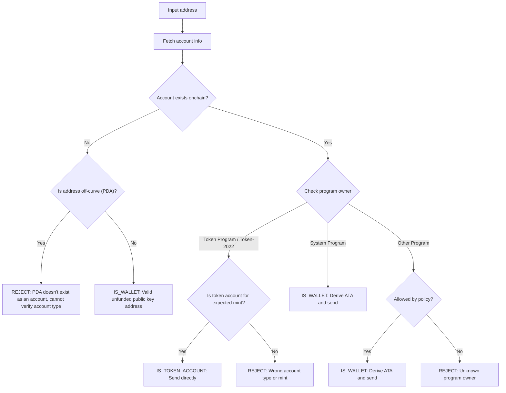

Wysłanie środków na nieprawidłowy adres może skutkować ich trwałą utratą.
Weryfikacja adresu gwarantuje, że wysyłasz środki wyłącznie na adresy, które
mogą je prawidłowo odbierać i do nich uzyskiwać dostęp.

Walidacja zależy od tego, co wysyłasz:

- **Tokeny SPL** są częściowo samochroniące. Token Program odrzuca transfer,
  którego konta nie pasują do oczekiwanego mintu, więc błędnie skierowany
  transfer tokenów kończy się niepowodzeniem bez utraty środków. Większość tej
  strony dotyczy wysyłania tokenów SPL.
- **Natywne SOL** nie ma takiego zabezpieczenia. Transfer przez System Program
  powiedzie się na każdym koncie, więc nieprawidłowy odbiorca trwale blokuje
  SOL. Zobacz [Wysyłanie natywnego SOL](#sending-native-sol).

<Callout>
  Zobacz [Jak działają płatności na Solanie](/docs/payments/how-payments-work),
  aby poznać podstawowe koncepcje dotyczące płatności.
</Callout>

## Zrozumienie adresów Solany

Konta Solany mają dwa typy adresów: na krzywej (on-curve) i poza krzywą
(off-curve).

### Adresy na krzywej (On-Curve)

Standardowe adresy to klucze publiczne z keypairs Ed25519. Te adresy:

- Posiadają odpowiadający klucz prywatny, który może podpisywać transakcje
- Są używane jako adresy portfeli

### Adresy poza krzywą (PDAs)

[Program Derived Addresses](/docs/core/pda) są deterministycznie wyprowadzane z
identyfikatora programu i ziaren (seeds). Te adresy:

- **Nie** posiadają odpowiadającego klucza prywatnego
- Mogą być podpisywane wyłącznie przez program, z którego adres został
  wyprowadzony

## Typy kont w płatnościach

Użyj adresu, aby pobrać [konto](/docs/core/accounts) z sieci, sprawdź
właściciela programu i typ konta, aby określić sposób obsługi adresu.

<Callout>
  Wiedza o tym, czy adres jest na krzywej, czy poza krzywą, nie mówi ci, jaki to
  typ konta, który program jest jego właścicielem ani czy konto istnieje pod tym
  adresem. Aby ustalić te szczegóły, musisz pobrać konto z sieci.
</Callout>

### Konta System Program (Portfele)

Konta należące do System Program to standardowe portfele. Aby wysłać tokeny SPL
do portfela, należy wyprowadzić i użyć jego
[Associated Token Account (ATA)](/docs/tokens/basics/create-token-account#whats-an-associated-token-account).

Po wyprowadzeniu adresu ATA sprawdź, czy token account istnieje w łańcuchu.
Jeśli ATA nie istnieje, możesz dołączyć instrukcję jego utworzenia dla odbiorcy
w tej samej transakcji co przelew. Wymaga to jednak opłacenia rent za nowy token
account. Ponieważ odbiorca jest właścicielem ATA, SOL zapłacony za rent nie może
zostać odzyskany przez nadawcę.

<Callout type="warn">
  Bez odpowiednich zabezpieczeń, finansowanie tworzenia ATA może zostać
  wykorzystane do nadużyć. Złośliwy użytkownik mógłby zażądać przelewu,
  doprowadzić do utworzenia swojego ATA na Twój koszt, zamknąć ATA w celu
  odzyskania rent SOL, a następnie powtarzać ten proceder.
</Callout>

### Token Accounts

[Token accounts](/docs/tokens/basics/create-token-account) są własnością Token
Program lub Token-2022 Program i przechowują salda tokenów. Jeśli adres, który
otrzymujesz, należy do programu tokenów, powinieneś zweryfikować, czy konto jest
token account (nie mint account) i czy odpowiada oczekiwanemu token mint account
przed wysłaniem.

<Callout type="info">
  Token Programs automatycznie weryfikują, czy oba token accounts w transakcji
  przechowują tokeny tego samego mintu. Jeśli weryfikacja się nie powiedzie,
  transakcja zostaje odrzucona i żadne środki nie są tracone.
</Callout>

### Konta Mint

[Mint accounts](/docs/tokens/basics/create-mint) śledzą podaż tokenów oraz
metadane konkretnego tokena. Mint accounts są również własnością Token Programs,
ale **nie** są prawidłowymi odbiorcami transferów tokenów. Próba wysłania
tokenów na adres mint skutkuje nieudaną transakcją, jednak żadne środki nie są
tracone.

### Inne konta

Konta należące do innych programów wymagają podjęcia decyzji dotyczącej
polityki. Niektóre konta (np. portfele multisig) mogą być prawidłowymi
właścicielami token account, podczas gdy inne powinny być odrzucone.

## Wysyłanie natywnego SOL

Powyższa klasyfikacja określa, dokąd mogą trafiać tokeny SPL. Natywny SOL jest
bardziej restrykcyjny: jedynym bezpiecznym odbiorcą jest **portfel System
Program** (lub niefinansowany adres na krzywej, który staje się nim).

Transfer w ramach System Program dodaje lamport do dowolnego konta, w tym mint,
token accounts, programów i PDA. Lamports mogą być wyprowadzone tylko przez
program będący właścicielem konta, więc wysłanie SOL do nieprawidłowego odbiorcy
może skutkować trwałą utratą środków.

W przeciwieństwie do transferu tokenów SPL, transakcja **nie** kończy się
niepowodzeniem, gdy odbiorca jest nieoczekiwanym adresem.

Podczas wysyłania natywnego SOL akceptowalnym wynikiem jest wyłącznie
`IS_WALLET`. `IS_TOKEN_ACCOUNT` **nie jest**: token account przechowuje tokeny
SPL, a SOL wysłany tam jest poza kontrolą nadawcy.

<Callout type="warn">
  To częsty sposób na utratę SOL: użytkownik wkleja adres mint tokena (lub adres
  programu) do pola wypłaty SOL. Transfer kończy się powodzeniem, a SOL jest
  nieodwracalnie utracony. Zawsze klasyfikuj odbiorcę przed podpisaniem
  transferu SOL.
</Callout>

## Przepływ weryfikacji

Poniższy diagram przedstawia referencyjne drzewo decyzyjne do walidacji adresu:


```mermaid title="Address Verification Flow"
flowchart TD
    A["Input address"]
    B["Fetch account info"]

    A --> B
    B --> C{"Account exists onchain?"}

    %% --- Non-existent account path ---
    C -- "No" --> D{"Is address off-curve (PDA)?"}
    D -- "Yes" --> R1["REJECT: PDA doesn't exist as an account, cannot verify account type"]
    D -- "No" --> W1["IS_WALLET: Valid unfunded public key address"]

    %% --- Existing account path ---
    C -- "Yes" --> F{"Check program owner"}

    F -- "Token Program / Token-2022" --> G{"Is token account for expected mint?"}
    G -- "Yes" --> T1["IS_TOKEN_ACCOUNT: Send directly"]
    G -- "No" --> R2["REJECT: Wrong account type or mint"]

    F -- "System Program" --> W2["IS_WALLET: Derive ATA and send"]

    F -- "Other Program" --> K{"Allowed by policy?"}
    K -- "Yes" --> W3["IS_WALLET: Derive ATA and send"]
    K -- "No" --> R3["REJECT: Unknown program owner"]
```

<Steps>
<Step>

### Pobierz konto

Użyj adresu, aby pobrać szczegóły konta z sieci.

</Step>
<Step>

### Konto nie istnieje

Jeśli pod tym adresem nie istnieje żadne konto, sprawdź, czy adres jest na
krzywej, czy poza krzywą:

- **Poza krzywą (PDA)**: Zachowawczo odrzuć adres, aby uniknąć wysyłania do ATA,
  które może być niedostępne. Bez istniejącego konta nie można określić
  wyłącznie na podstawie adresu, który program wyprowadził to PDA ani czy adres
  należy do ATA. Wyprowadzenie ATA dla tego adresu w celu wysłania tokenów może
  skutkować zablokowaniem środków w niedostępnym token account.

- **On-curve**: To prawidłowy adres portfela (klucz publiczny), który nie został
  jeszcze zasilony. Wyprowadź ATA, sprawdź czy istnieje i wyślij na niego
  tokeny. Musisz podjąć decyzję dotyczącą polityki, czy sfinansować utworzenie
  ATA, jeśli nie istnieje.

</Step>
<Step>

### Konto istnieje

Jeśli konto istnieje, sprawdź, który program jest jego właścicielem:

- **System Program**: To standardowy portfel. Wyprowadź ATA, sprawdź czy
  istnieje i wyślij na niego tokeny. Musisz podjąć decyzję dotyczącą polityki,
  czy sfinansować utworzenie ATA, jeśli nie istnieje.

- **Token Program / Token-2022**: Sprawdź, czy konto jest token account (nie
  mint account) i czy przechowuje token (mint), który zamierzasz wysłać. Jeśli
  jest prawidłowe, wyślij tokeny bezpośrednio na ten adres. Jeśli jest to mint
  account lub token account dla innego mintu, odrzuć adres.

- **Inny program**: Wymaga to decyzji dotyczącej polityki. Niektóre programy,
  takie jak portfele multisig, mogą być dopuszczalnymi właścicielami token
  accounts. Jeśli Twoja polityka na to pozwala, wyprowadź ATA i wyślij. W
  przeciwnym razie odrzuć adres.

</Step>
</Steps>

## Demo

Poniższy przykład pokazuje wyłącznie logikę walidacji adresu. Jest to kod
referencyjny dla celów ilustracyjnych.

<Callout>
  Demo nie pokazuje, jak wyprowadzić ATA ani jak zbudować transakcję wysyłania
  tokenów. Zapoznaj się z dokumentacją [token
  account](/docs/tokens/basics/create-token-account#how-to-create-an-associated-token-account)
  oraz [token transfer](/docs/tokens/basics/transfer-tokens), aby zobaczyć
  przykładowy kod.
</Callout>

Demo poniżej wykorzystuje trzy możliwe wyniki:

| Wynik              | Znaczenie                 | Akcja                                          |
| ------------------ | ------------------------- | ---------------------------------------------- |
| `IS_WALLET`        | Prawidłowy adres portfela | Wyprowadź i wyślij na associated token account |
| `IS_TOKEN_ACCOUNT` | Prawidłowy token account  | Wyślij tokeny bezpośrednio na ten adres        |
| `REJECT`           | Nieprawidłowy adres       | Nie wysyłaj                                    |

Następnie mapuje każdy wynik na akceptowalność dla poszczególnych zasobów za
pomocą `canReceiveNativeSol` (tylko portfele) oraz `canReceiveSplToken`
(portfele lub token accounts). token account zwraca `IS_TOKEN_ACCOUNT`, więc
może odbierać tokeny SPL, ale **nie** native SOL — to rozróżnienie zapobiega
blokowaniu SOL.

<CodeTabs flags="r">

```ts !! title="Demo"
// !collapse(1:35) collapsed

import {
  type Address,
  type Rpc,
  type GetAccountInfoApi,
  createSolanaRpc,
  fetchJsonParsedAccount,
  isOffCurveAddress,
  generateKeyPairSigner,
  getProgramDerivedAddress
} from "@solana/kit";

// =============================================================================
// Constants
// =============================================================================

const defaultRpc = createSolanaRpc("https://api.mainnet-beta.solana.com");

const SYSTEM_PROGRAM = "11111111111111111111111111111111" as Address;
const TOKEN_PROGRAM = "TokenkegQfeZyiNwAJbNbGKPFXCWuBvf9Ss623VQ5DA" as Address;
const TOKEN_2022_PROGRAM =
  "TokenzQdBNbLqP5VEhdkAS6EPFLC1PHnBqCXEpPxuEb" as Address;

// =============================================================================
// Validation Function
// =============================================================================

/**
 * Possible validation results for an input address.
 */
export type ValidationResult =
  | { type: "IS_TOKEN_ACCOUNT" }
  | { type: "IS_WALLET" }
  | { type: "REJECT"; reason: string };

/**
 * Validates an input address and classifies it as a wallet, token account, or invalid.
 *
 * @param inputAddress - The address to validate
 * @param rpc - Optional RPC client (defaults to mainnet)
 * @returns Classification result:
 *   - IS_WALLET: Valid wallet address
 *   - IS_TOKEN_ACCOUNT: Valid token account
 *   - REJECT: Invalid address for transfers
 */
export async function validateAddress(
  inputAddress: Address,
  rpc: Rpc<GetAccountInfoApi> = defaultRpc
): Promise<ValidationResult> {
  const account = await fetchJsonParsedAccount(rpc, inputAddress);
  // Log the account data for demo
  console.log("\nAccount:", account);

  // Account doesn't exist onchain
  if (!account.exists) {
    // Off-curve = PDA that doesn't exist as an account
    // Reject conservatively to avoid sending to an address that may be inaccessible.
    if (isOffCurveAddress(inputAddress)) {
      return { type: "REJECT", reason: "PDA doesn't exist as an account" };
    }
    // On-curve = valid keypair address, treat as unfunded wallet
    return { type: "IS_WALLET" };
  }

  // Account exists, check program owner
  const owner = account.programAddress;

  // System Program = wallet
  if (owner === SYSTEM_PROGRAM) {
    return { type: "IS_WALLET" };
  }

  // Token Program or Token-2022, check if token account
  if (owner === TOKEN_PROGRAM || owner === TOKEN_2022_PROGRAM) {
    const accountType = (
      account.data as { parsedAccountMeta?: { type?: string } }
    ).parsedAccountMeta?.type;

    if (accountType === "account") {
      return { type: "IS_TOKEN_ACCOUNT" };
    }
    // Reject if not a token account (mint account)
    return {
      type: "REJECT",
      reason: "Not a token account"
    };
  }

  // Unknown program owner
  return { type: "REJECT", reason: "Unknown program owner" };
}

/**
 * Native SOL is only safe to send to a wallet. Any other account locks it.
 */
function canReceiveNativeSol(result: ValidationResult): boolean {
  return result.type === "IS_WALLET";
}

/**
 * SPL tokens can go to a wallet (via its ATA) or directly to a token account.
 */
function canReceiveSplToken(result: ValidationResult): boolean {
  return result.type === "IS_WALLET" || result.type === "IS_TOKEN_ACCOUNT";
}

// =============================================================================
// Examples
// =============================================================================
// !collapse(1:1000) collapsed

// Wallets
const EXISTING_WALLET =
  "H8sMJSCQxfKiFTCfDR3DUMLPwcRbM61LGFJ8N4dK3WjS" as Address;
const NEW_WALLET = (await generateKeyPairSigner()).address;

// Token accounts
const USDC_TOKEN_ACCOUNT =
  "3emsAVdmGKERbHjmGfQ6oZ1e35dkf5iYcS6U4CPKFVaa" as Address;
const PYUSD_TOKEN_ACCOUNT =
  "47od2TPRvqJipfPVWZdyenLEngPw8hC36nDxiLyvGsEP" as Address;

// Token mints (should be rejected)
const USDC_MINT = "EPjFWdd5AufqSSqeM2qN1xzybapC8G4wEGGkZwyTDt1v" as Address;
const PYUSD_MINT = "2b1kV6DkPAnxd5ixfnxCpjxmKwqjjaYmCZfHsFu24GXo" as Address;

// PDA that doesn't exist (should be rejected)
const [NON_EXISTENT_PDA] = await getProgramDerivedAddress({
  programAddress: (await generateKeyPairSigner()).address,
  seeds: ["seed"]
});

// Program account (should be rejected)
const PROGRAM_ACCOUNT =
  "p1exdMJcjVao65QdewkaZRUnU6VPSXhus9n2GzWfh98" as Address;

async function runExample(label: string, address: Address) {
  console.log(`\n${"─".repeat(60)}`);
  console.log(`Example: ${label}`);
  console.log(`Input: ${address}`);
  console.log(`${"─".repeat(60)}`);

  const result = await validateAddress(address);
  console.log("\nResult:", result);
  console.log(
    `Can receive SOL?   ${canReceiveNativeSol(result) ? "YES" : "NO"}`
  );
  console.log(
    `Can receive token? ${canReceiveSplToken(result) ? "YES" : "NO"}`
  );
}

console.log("\n" + "═".repeat(60));
console.log("  IS_WALLET Examples");
console.log("═".repeat(60));

await runExample("Existing funded wallet", EXISTING_WALLET);
await runExample("New wallet (unfunded)", NEW_WALLET);

console.log("\n" + "═".repeat(60));
console.log("  IS_TOKEN_ACCOUNT Examples");
console.log("═".repeat(60));

await runExample("USDC token account (Token Program)", USDC_TOKEN_ACCOUNT);
await runExample("PYUSD token account (Token-2022)", PYUSD_TOKEN_ACCOUNT);

console.log("\n" + "═".repeat(60));
console.log("  REJECT Examples");
console.log("═".repeat(60));

await runExample("USDC mint address", USDC_MINT);
await runExample("PYUSD mint address", PYUSD_MINT);
await runExample("Non-existent PDA", NON_EXISTENT_PDA);
await runExample("Program account", PROGRAM_ACCOUNT);

console.log("\n" + "═".repeat(60));
console.log("  Done!");
console.log("═".repeat(60) + "\n");
```

</CodeTabs>
