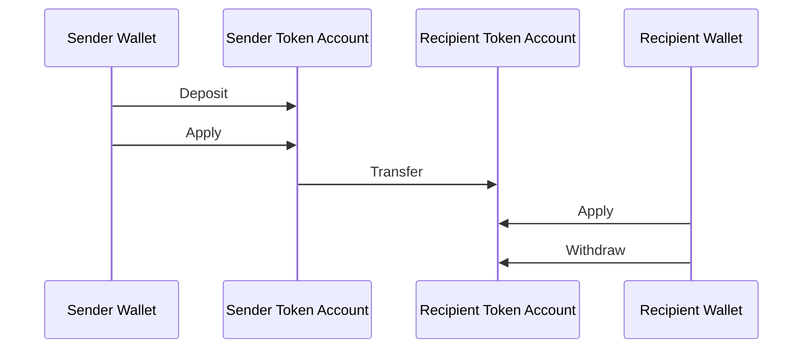
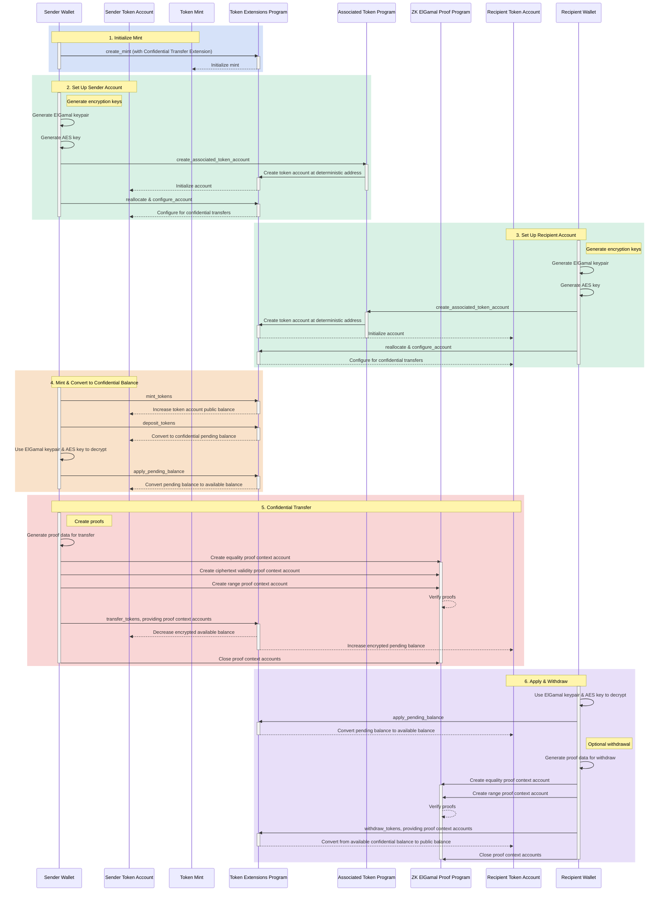

## Czym są Poufne Transfery?

Poufne transfery umożliwiają przesyłanie tokenów między token accounts bez
ujawniania kwoty transferu. Jest to przydatne w transakcjach zachowujących
prywatność. Prywatne są wyłącznie kwoty transferów i salda tokenów. Adresy token
accounts pozostają publiczne.

- [Przegląd protokołu](https://www.solana-program.com/docs/confidential-balances/overview) -
  Szczegóły dotyczące leżącego u podstaw protokołu kryptograficznego
- [Przewodnik szybkiego startu](https://www.solana-program.com/docs/confidential-balances#setup) -
  Konfiguracja i podstawowe polecenia CLI
- [Poradnik Poufnych Sald](https://github.com/solana-developers/Confidential-Balances-Sample) -
  Fragmenty kodu pokazujące, jak korzystać z rozszerzenia Poufnego Transferu

### Jak to działa?

Rozszerzenie Poufnego Transferu dodaje
[instrukcje](https://github.com/solana-program/token-2022/blob/efd0c957fefbd79882d77df5fb2dac88c001249c/program/src/extension/confidential_transfer/instruction.rs#L29)
do Token Extensions Program, które pozwalają na przesyłanie tokenów między
kontami bez ujawniania kwoty transferu.

Podstawowy przebieg poufnych transferów tokenów jest następujący:

1. Utwórz mint account z rozszerzeniem poufnego transferu.
2. Utwórz token accounts z rozszerzeniem poufnego transferu dla nadawcy i
   odbiorcy.
3. Wyemituj tokeny na konto nadawcy.
4. **Wpłać** publiczne saldo nadawcy na **poufne saldo oczekujące**.
5. **Zastosuj** saldo oczekujące nadawcy jako **poufne saldo dostępne**.
6. Poufnie **prześlij** tokeny z token account nadawcy do token account
   odbiorcy.
7. **Zastosuj** saldo oczekujące odbiorcy jako **poufne saldo dostępne**.
8. **Wypłać** poufne saldo dostępne odbiorcy na **saldo publiczne**.

Więcej szczegółów na temat kroków w przepływie poufnych transferów znajdziesz na
odpowiednich stronach:

<Cards>
  <Card
    title="Utwórz Mint Account"
    href="/docs/tokens/extensions/confidential-transfer/create-mint"
  >
    Jak utworzyć mint account z rozszerzeniem Poufnego Transferu
  </Card>
  <Card
    title="Utwórz Token Account"
    href="/docs/tokens/extensions/confidential-transfer/create-token-account"
  >
    Jak skonfigurować token account z rozszerzeniem Poufnego Transferu
  </Card>
  <Card
    title="Wpłać Tokeny"
    href="/docs/tokens/extensions/confidential-transfer/deposit-tokens"
  >
    Jak wpłacić tokeny na poufne saldo oczekujące
  </Card>
  <Card
    title="Zastosuj Saldo Oczekujące"
    href="/docs/tokens/extensions/confidential-transfer/apply-pending-balance"
  >
    Jak zastosować saldo oczekujące jako dostępne saldo poufne
  </Card>
  <Card
    title="Wypłać Tokeny"
    href="/docs/tokens/extensions/confidential-transfer/withdraw-tokens"
  >
    Jak wypłacić tokeny z poufnego salda dostępnego
  </Card>
  <Card
    title="Prześlij Tokeny"
    href="/docs/tokens/extensions/confidential-transfer/transfer-tokens"
  >
    Jak poufnie przesyłać tokeny między token accounts
  </Card>
  <Card
    title="Przewodnik Integracji"
    href="/docs/tokens/extensions/confidential-transfer/integration-guide"
  >
    Jak portfele, eksploratory i giełdy mogą obsługiwać tokeny z poufnym
    transferem
  </Card>
  <Card
    title="Przewodnik dla Emitentów"
    href="/docs/tokens/extensions/confidential-transfer/issuer-guide"
  >
    Jak emitować i obsługiwać token z poufnym transferem (polityka
    zatwierdzania, audytorzy, opłaty, emisja i spalanie)
  </Card>
</Cards>

Poniższy diagram przedstawia szczegółową sekwencję podstawowego przepływu dla
poufnych przelewów tokenów:

## Instrukcje poufnych transferów

Pełna lista instrukcji rozszerzenia Confidential Transfer
[instructions](https://github.com/solana-program/token-2022/blob/efd0c957fefbd79882d77df5fb2dac88c001249c/program/src/extension/confidential_transfer/instruction.rs#L29)
jest następująca:

| Instrukcja                          | Opis                                                                                                                                                          |
| ----------------------------------- | ------------------------------------------------------------------------------------------------------------------------------------------------------------- |
| _rs`InitializeMint`_                | Konfiguruje mint account dla poufnych transferów. Ta instrukcja musi być zawarta w tej samej transakcji co instrukcja _rs`TokenInstruction::InitializeMint`_. |
| _rs`UpdateMint`_                    | Aktualizuje ustawienia poufnych transferów dla mint.                                                                                                          |
| _rs`ConfigureAccount`_              | Konfiguruje token account dla poufnych transferów.                                                                                                            |
| _rs`ApproveAccount`_                | Zatwierdza token account dla poufnych transferów, jeśli mint wymaga zatwierdzenia dla nowych token accounts.                                                  |
| _rs`EmptyAccount`_                  | Opróżnia oczekujące i dostępne poufne salda, aby umożliwić zamknięcie token account.                                                                          |
| _rs`Deposit`_                       | Konwertuje publiczne saldo tokenów na oczekujące poufne saldo.                                                                                                |
| _rs`Withdraw`_                      | Konwertuje dostępne poufne saldo z powrotem na publiczne saldo.                                                                                               |
| _rs`Transfer`_                      | Poufnie transferuje tokeny pomiędzy token accounts.                                                                                                           |
| _rs`ApplyPendingBalance`_           | Konwertuje oczekujące saldo na dostępne saldo po depozytach lub transferach.                                                                                  |
| _rs`EnableConfidentialCredits`_     | Umożliwia token account odbieranie poufnych transferów tokenów.                                                                                               |
| _rs`DisableConfidentialCredits`_    | Blokuje przychodzące poufne transfery, zezwalając nadal na publiczne transfery.                                                                               |
| _rs`EnableNonConfidentialCredits`_  | Umożliwia token account odbieranie publicznych transferów tokenów.                                                                                            |
| _rs`DisableNonConfidentialCredits`_ | Blokuje zwykłe transfery, aby konto mogło odbierać wyłącznie poufne transfery.                                                                                |
| _rs`TransferWithFee`_               | Poufnie transferuje tokeny pomiędzy token accounts z opłatą.                                                                                                  |
| _rs`ConfigureAccountWithRegistry`_  | Alternatywny sposób konfiguracji token accounts dla poufnych transferów przy użyciu konta _rs`ElGamalRegistry`_ zamiast dowodu _rs`VerifyPubkeyValidity`_.    |
