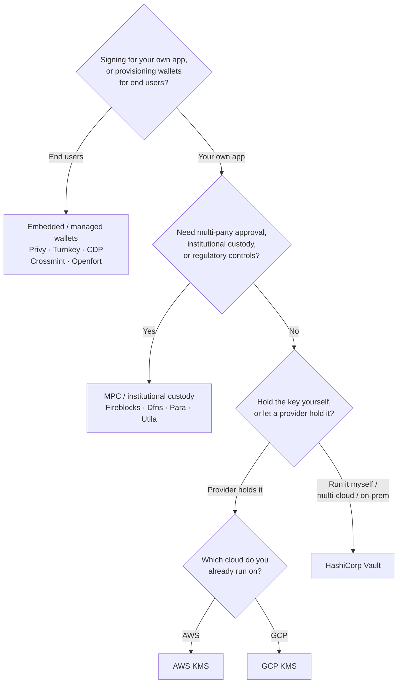

Keychain udostępnia jeden interfejs `SolanaSigner` dla każdego backendu, więc
wybór ma charakter operacyjny, a nie architektoniczny — możesz go zmienić
później poprzez konfigurację. Dlatego **zacznij od swoich wymagań, a nie od
produktu.** Dwa pytania rozstrzygają większość kwestii: _gdzie przechowywany
jest klucz prywatny i kto jest uprawniony do autoryzowania podpisu za jego
pomocą?_

Nie ma jednego najlepszego backendu. Każdy z nich lepiej sprawdza się w
określonym zestawie ograniczeń — chmura, z której już korzystasz, to, czy chcesz
samodzielnie zarządzać infrastrukturą kluczy, oraz wymagane kontrole
przechowywania i zatwierdzania. Poniższy schemat mapuje te ograniczenia na
konkretny backend.

<Callout type="info">
  Ten przewodnik opisuje podpisywanie po stronie backendu (serwera). Gdy Twoi
  użytkownicy końcowi podpisują własne transakcje w przeglądarce, użyj portfela
  zgodnego ze standardem Wallet Standard — zobacz [Podpisywanie w środowisku
  produkcyjnym](/docs/core/transactions/signing-in-production).
</Callout>

## Schemat decyzyjny

<Callout type="info">
  Lokalne środowisko programistyczne i testy nie wymagają żadnego z powyższych —
  użyj backendu **Memory** do prototypowania, a następnie przełącz się na jeden
  z powyższych backendów produkcyjnych poprzez konfigurację.
</Callout>

## Przejdź przez pytania

<Steps>

<Step>

### Czy podpisujesz w imieniu własnej aplikacji, czy swoich użytkowników końcowych?

Jeśli udostępniasz portfele, które **użytkownicy końcowi** posiadają i obsługują
(aplikacje konsumenckie, procesy wdrożeniowe), użyj backendu **osadzonych /
zarządzanych portfeli** — Privy, Turnkey, CDP, Crossmint lub Openfort.
Zarządzają one portfelami per użytkownik oraz uwierzytelnianiem w Twoim imieniu.

Jeśli podpisujesz jako **własna aplikacja** — płatnik opłat, skarbiec,
automatyzacja backendu — kontynuuj poniżej.

</Step>

<Step>

### Czy potrzebujesz wielostronnego zatwierdzania, instytucjonalnego przechowywania kluczy lub kontroli regulacyjnych?

Jeśli podpisy muszą przejść przez politykę zatwierdzeń, limit wydatków lub
procedurę zgodności zanim zostaną wygenerowane — lub potrzebujesz regulowanego
depozytariusza przechowującego klucze — użyj backendu **MPC / instytucjonalnego
przechowywania kluczy**: Fireblocks, Dfns, Para lub Utila. Systemy te dzielą lub
przechowują klucz i współpodpisują zgodnie z Twoją polityką.

Jeśli potrzebujesz jedynie klucza, który podpisuje na żądanie, kontynuuj
poniżej.

</Step>

<Step>

### Czy chcesz przechowywać klucz samodzielnie, czy powierzyć go dostawcy?

Jeśli dostawca chmury powinien przechowywać klucz w infrastrukturze opartej na
sprzęcie, a Twoja polityka IAM kontroluje, kto może podpisywać, użyj KMS tej
chmury:

- **Działasz na AWS** → AWS KMS
- **Działasz na GCP** → GCP KMS

Jeśli chcesz samodzielnie zarządzać infrastrukturą kluczy — lub działasz w
środowisku wielochmurowym bądź lokalnym — użyj **HashiCorp Vault**. Sam
uruchamiasz i audytujesz ten system; klucz pozostaje w silniku Transit i
podpisuje na żądanie.

</Step>

</Steps>

## Modele przechowywania kluczy

Backendy grupują się w pięć modeli przechowywania kluczy. Powyższy schemat
prowadzi do jednego z nich.

- **Własne przechowywanie (w procesie)** — aplikacja przechowuje surowy klucz
  prywatny. Wygodne podczas programowania, ale nieodpowiednie dla środowiska
  produkcyjnego. Backend: **Memory**.
- **Samodzielnie zarządzane klucze** — samodzielnie obsługujesz infrastrukturę
  kluczy; klucz pozostaje wewnątrz niej i podpisuje na żądanie. Backend:
  **HashiCorp Vault**.
- **Cloud KMS / HSM** — dostawca chmury przechowuje klucz w infrastrukturze
  opartej na sprzęcie; klucz nigdy nie opuszcza usługi, a Twoja polityka IAM
  kontroluje, kto może podpisywać. Backendy: **AWS KMS**, **GCP KMS**.
- **MPC i instytucjonalne przechowywanie kluczy** — klucz jest podzielony lub
  powierzony dostawcy, który współpodpisuje zgodnie z Twoją polityką
  (zatwierdzenia, limity). Backendy: **Fireblocks**, **Dfns**, **Para**,
  **Utila**.
- **Wbudowane i zarządzane portfele** — dostawca zarządza portfelami w Twoim
  imieniu, często w celu wdrożenia użytkowników końcowych. Backendy: **Privy**,
  **Turnkey**, **CDP**, **Crossmint**, **Openfort**.

## Porównanie backendów

| Backend         | Model przechowywania kluczy        | Najlepszy do                                        | Uwagi                                                     |
| --------------- | ---------------------------------- | --------------------------------------------------- | --------------------------------------------------------- |
| Memory          | Własna kontrola (w procesie)       | Lokalny development, testy, CI                      | Klucz jawny w procesie — nie używać na produkcji          |
| HashiCorp Vault | Własny serwer zarządzania kluczami | Zespoły prowadzące własną infrastrukturę kluczy     | Silnik Transit; samodzielna obsługa i audyt               |
| AWS KMS         | Cloud KMS / HSM                    | Backendy działające na AWS                          | Klucz nigdy nie opuszcza KMS; IAM kontroluje podpis       |
| GCP KMS         | Cloud KMS / HSM                    | Backendy działające na GCP                          | Klucz nigdy nie opuszcza KMS; IAM kontroluje podpis       |
| Fireblocks      | MPC / instytucjonalna custody      | Skarbce, giełdy, regulowana custody                 | Silnik polityk i przepływy zatwierdzeń                    |
| Dfns            | Infrastruktura portfeli MPC        | Portfele programatyczne z kontrolą polityk          | Podpisywanie Ed25519                                      |
| Para            | Portfele MPC                       | Aplikacje wymagające portfeli opartych na MPC       | Klucz API + ID portfela                                   |
| Utila           | MPC custody + współpodpisujący     | Istniejące portfele Solana zarządzane przez Utila   | `signMessage` nieobsługiwane; tx rozgłaszasz samodzielnie |
| Privy           | Wbudowane portfele                 | Aplikacje konsumenckie onboardujące użytkowników    | Wbudowane portfele zarządzane przez aplikację             |
| Turnkey         | Zarządzanie kluczami bez custody   | Podpisywanie programatyczne z kontrolą polityk      | Zarządzanie kluczami bez custody                          |
| CDP             | Zarządzany portfel (Coinbase)      | Aplikacje na platformie Coinbase Developer Platform | `signMessage` akceptuje wyłącznie dane UTF-8              |
| Crossmint       | Zarządzane portfele                | Marketplace i aplikacje z zarządzanymi portfelami   | Portfele `smart` i `mpc`; `signMessage` nieobsługiwane    |
| Openfort        | Wbudowane portfele backendowe      | Portfele po stronie serwera                         | Klucze przechowywane w TEE                                |

## Scenariusze enterprise

Jedna aplikacja często potrzebuje więcej niż jednego z tych rozwiązań
jednocześnie. Ponieważ interfejs jest identyczny, można uruchomić różny backend
dla każdej roli bez zmiany miejsc wywołań.

- **Operacje skarbcowe** — oddziel operacyjny sygnatariusz „gorący“ od
  sygnatariusza „zimnego“ skarbca. Zabezpiecz skarbiec za pomocą powiernictwa
  MPC lub sprzętowego modułu bezpieczeństwa (HSM) w chmurze i wymagaj polityk
  zatwierdzania przed podpisami o wysokiej wartości.
- **Przepływy zatwierdzania** — backendy MPC i powiernicze (np. Fireblocks)
  wymuszają wielostronne zatwierdzenie przed wygenerowaniem podpisu.
- **Zgodność i audyt** — KMS w chmurze (AWS/GCP) oraz Vault generują dzienniki
  audytu podpisywania; instytucjonalni powiernicy dodają egzekwowanie polityk i
  raportowanie.
- **Środowiska regulowane** — przechowuj materiał kluczowy w HSM, KMS lub
  instytucjonalnym powierniku, aby surowe klucze nigdy nie trafiały do Twojej
  aplikacji.

Zobacz
[Najlepsze praktyki produkcyjne](/docs/tools/keychain/production-best-practices)
dotyczące bezpiecznego operowania tymi backendami.

<Cards>
  <Card
    title="Przewodnik Rust"
    href="/docs/tools/keychain/getting-started/rust"
  >
    Skonfiguruj każdy backend w Rust.
  </Card>
  <Card
    title="Przewodnik TypeScript"
    href="/docs/tools/keychain/getting-started/typescript"
  >
    Skonfiguruj każdy backend w TypeScript.
  </Card>
</Cards>
