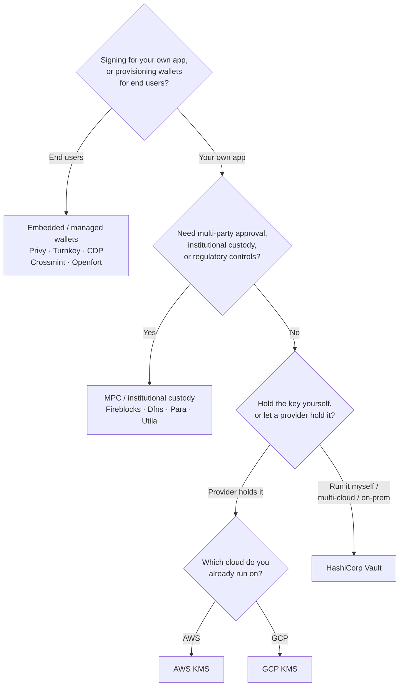

Keychain udostępnia jeden interfejs `SolanaSigner` dla każdego backendu, więc
wybór ma charakter operacyjny, a nie architektoniczny — możesz go zmienić
później poprzez konfigurację. Dlatego **zacznij od swoich wymagań, a nie od
produktu.** Dwa pytania decydują o większości: _gdzie przechowywany jest klucz
prywatny i kto jest uprawniony do autoryzacji podpisu za jego pomocą?_

Nie istnieje jeden najlepszy backend. Każdy z nich lepiej sprawdza się w
określonym zestawie ograniczeń — chmura, z której już korzystasz, to, czy chcesz
zarządzać infrastrukturą kluczy, oraz jakie wymagania dotyczące custody i
kontroli zatwierdzeń musisz spełnić. Poniższy schemat mapuje te ograniczenia na
odpowiedni backend.

<Callout type="info">
  Ten przewodnik dotyczy podpisywania po stronie backendu (serwera). Gdy Twoi
  użytkownicy końcowi podpisują własne transakcje w przeglądarce, użyj portfela
  zgodnego ze standardem Wallet Standard — zobacz [Podpisywanie w środowisku
  produkcyjnym](/docs/core/transactions/signing-in-production).
</Callout>

## Schemat decyzyjny

<Callout type="info">
  Lokalne środowisko deweloperskie i testy nie wymagają żadnego z powyższych —
  użyj backendu **Memory** do prototypowania, a następnie przełącz się na jeden
  z powyższych backendów produkcyjnych poprzez konfigurację.
</Callout>

## Analiza pytań

<Steps>

<Step>

### Czy podpisujesz dla własnej aplikacji, czy dla swoich użytkowników końcowych?

Jeśli udostępniasz portfele, które **użytkownicy końcowi** posiadają i obsługują
(aplikacje konsumenckie, procesy onboardingu), użyj backendu **portfela
wbudowanego / zarządzanego** — Privy, Turnkey, CDP, Crossmint lub Openfort.
Zarządzają one portfelami poszczególnych użytkowników i uwierzytelnianiem w
Twoim imieniu.

Jeśli podpisujesz jako **własna aplikacja** — płatnik opłat, skarbiec,
automatyzacja backendu — kontynuuj poniżej.

</Step>

<Step>

### Czy potrzebujesz wielostronnego zatwierdzania, instytucjonalnej opieki nad kluczami lub kontroli regulacyjnych?

Jeśli podpisy muszą przejść przez politykę zatwierdzeń, limit wydatków lub
przepływ zgodności zanim zostaną wygenerowane — lub potrzebujesz regulowanego
powiernika przechowującego klucze — użyj backendu **MPC / instytucjonalnej
opieki nad kluczami**: Fireblocks, Dfns, Para lub Utila. Rozdzielają one klucz
lub sprawują nad nim pieczę i współpodpisują zgodnie z Twoją polityką.

Jeśli potrzebujesz jedynie klucza podpisującego na żądanie, kontynuuj poniżej.

</Step>

<Step>

### Czy chcesz przechowywać klucz samodzielnie, czy powierzyć go dostawcy?

Jeśli klucz ma być przechowywany przez dostawcę chmurowego w infrastrukturze
opartej na sprzęcie, a Twoja polityka IAM kontroluje, kto może podpisywać, użyj
KMS tej chmury:

- **Działasz na AWS** → AWS KMS
- **Działasz na GCP** → GCP KMS

Jeśli chcesz samodzielnie zarządzać infrastrukturą kluczy — lub korzystasz z
wielu chmur albo środowiska on-prem — użyj **HashiCorp Vault**. Ty uruchamiasz
go i audytujesz; klucz pozostaje wewnątrz silnika Transit i podpisuje na
żądanie.

</Step>

</Steps>

## Modele przechowywania kluczy

Backendy dzielą się na pięć modeli przechowywania kluczy. Powyższy przepływ
decyzyjny prowadzi Cię do jednego z nich.

- **Własna pieczą (in-process)** — aplikacja przechowuje surowy klucz prywatny.
  Wygodne podczas programowania, ale nieodpowiednie na produkcję. Backend:
  **Memory**.
- **Samodzielnie zarządzane klucze** — sam zarządzasz infrastrukturą kluczy;
  klucz pozostaje wewnątrz niej i podpisuje na żądanie. Backend: **HashiCorp
  Vault**.
- **Cloud KMS / HSM** — dostawca chmurowy przechowuje klucz w infrastrukturze
  opartej na sprzęcie; klucz nigdy nie opuszcza usługi, a Twoja polityka IAM
  kontroluje, kto może podpisywać. Backendy: **AWS KMS**, **GCP KMS**.
- **MPC i instytucjonalna opieka nad kluczami** — klucz jest rozdzielony lub
  powierzony dostawcy, który współpodpisuje zgodnie z Twoją polityką
  (zatwierdzenia, limity). Backendy: **Fireblocks**, **Dfns**, **Para**,
  **Utila**.
- **Wbudowane i zarządzane portfele** — dostawca zarządza portfelami w Twoim
  imieniu, często w celu wdrożenia użytkowników końcowych. Backendy: **Privy**,
  **Turnkey**, **CDP**, **Crossmint**, **Openfort**.

## Porównanie backendów

| Backend         | Model przechowywania kluczy                 | Najlepszy dla                                                 | Uwagi                                                             |
| --------------- | ------------------------------------------- | ------------------------------------------------------------- | ----------------------------------------------------------------- |
| Memory          | Samodzielna opieka (w procesie)             | Lokalne środowisko deweloperskie, testy, CI                   | Klucz w pamięci procesu — nie używać na produkcji                 |
| HashiCorp Vault | Samodzielnie hostowane zarządzanie kluczami | Zespoły posiadające własną infrastrukturę kluczy              | Silnik Transit; samodzielna obsługa i audyt                       |
| AWS KMS         | Chmurowy KMS / HSM                          | Backendy działające na AWS                                    | Klucz nigdy nie opuszcza KMS; IAM kontroluje podpisywanie         |
| GCP KMS         | Chmurowy KMS / HSM                          | Backendy działające na GCP                                    | Klucz nigdy nie opuszcza KMS; IAM kontroluje podpisywanie         |
| Fireblocks      | MPC / instytucjonalna opieka                | Skarbce, giełdy, regulowana opieka nad aktywami               | Silnik reguł i przepływy zatwierdzania                            |
| Dfns            | Infrastruktura portfeli MPC                 | Programowe portfele z kontrolą reguł                          | Podpisywanie Ed25519                                              |
| Para            | Portfele MPC                                | Aplikacje wymagające portfeli opartych na MPC                 | Klucz API + ID portfela                                           |
| Utila           | Opieka MPC + współpodpisujący               | Istniejące portfele Solana zarządzane przez Utila             | `signMessage` nieobsługiwane; transakcja rozgłaszana samodzielnie |
| Privy           | Wbudowane portfele                          | Aplikacje konsumenckie wprowadzające użytkowników do portfeli | Wbudowane portfele zarządzane przez aplikację                     |
| Turnkey         | Niedepozytatywne zarządzanie kluczami       | Programowe, zabezpieczone regułami podpisywanie               | Niedepozytatywne zarządzanie kluczami                             |
| CDP             | Zarządzany portfel (Coinbase)               | Aplikacje na platformie Coinbase Developer Platform           | `signMessage` akceptuje wyłącznie payloady UTF-8                  |
| Crossmint       | Zarządzane portfele                         | Platformy handlowe i aplikacje z zarządzanymi portfelami      | Portfele `smart` i `mpc`; `signMessage` nieobsługiwane            |
| Openfort        | Wbudowane portfele backendowe               | Portfele po stronie serwera                                   | Klucze przechowywane w TEE                                        |

## Scenariusze dla przedsiębiorstw

Jedna aplikacja często potrzebuje więcej niż jednego z tych rozwiązań naraz.
Ponieważ interfejs jest identyczny, możesz uruchomić inny backend dla każdej
roli bez zmiany miejsc wywołań.

- **Operacje skarbcowe** — oddziel operacyjny podpisujący "hot" od "cold"
  podpisującego skarbcowego. Zabezpiecz skarbiec za pomocą przechowywania MPC
  lub sprzętowego modułu HSM w chmurze i wymagaj polityk zatwierdzania przed
  podpisami wysokiej wartości.
- **Przepływy zatwierdzania** — backendy MPC i custody (np. Fireblocks)
  wymuszają wielostronne zatwierdzenie przed wygenerowaniem podpisu.
- **Zgodność i audyt** — chmurowe KMS (AWS/GCP) i Vault emitują dzienniki audytu
  podpisywania; instytucjonalni depozytariusze dodają egzekwowanie polityk i
  raportowanie.
- **Środowiska regulowane** — przechowuj materiał kluczowy w HSM, KMS lub
  instytucjonalnym depozycie, aby surowe klucze nigdy nie dotykały twojej
  aplikacji.

Zobacz
[Najlepsze praktyki produkcyjne](/docs/tools/keychain/production-best-practices)
dotyczące bezpiecznego obsługiwania tych backendów.

<Cards>
  <Card
    title="Przewodnik Rust"
    href="/docs/tools/keychain/getting-started/rust"
  >
    Skonfiguruj każdy backend w Rust.
  </Card>
  <Card
    title="Przewodnik TypeScript"
    href="/docs/tools/keychain/getting-started/typescript"
  >
    Skonfiguruj każdy backend w TypeScript.
  </Card>
</Cards>
