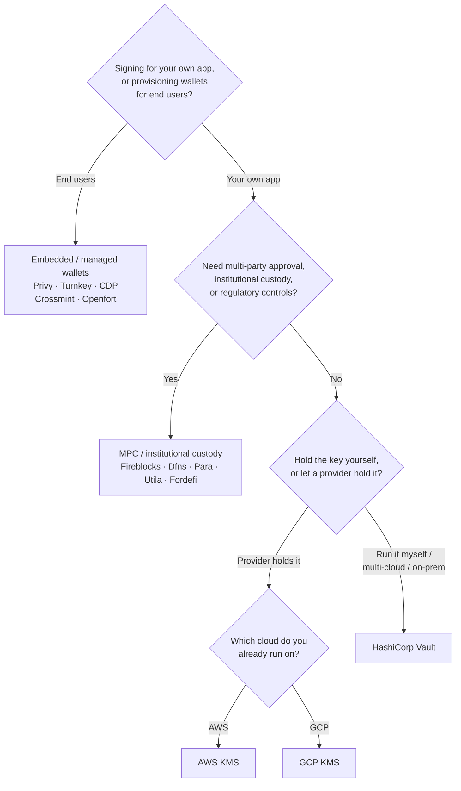

Keychain udostępnia jeden bazowy interfejs `SolanaSigner` we wszystkich backendach, więc w przypadku
większości backendów wybór ma charakter operacyjny, a nie architektoniczny: możesz go zmienić
później w konfiguracji. Wyjątkiem jest kształt transakcji. Tryb natywny auto w Crossmint
i Fordefi podpisuje i rozgłasza transakcje po stronie serwera, a tryb natywny manual we Fordefi
przepisuje transakcję przed jej podpisaniem, więc przejście na któryś z nich lub rezygnacja z niego
zmienia sposób wywoływania signera. Dlatego **zacznij od swoich wymagań, a nie od produktu.** Większość decyduje się w dwóch pytaniach: _gdzie znajduje się
klucz prywatny i kto może autoryzować podpis za jego pomocą?_

Każdy backend poza Ledger jest dostępny we wszystkich czterech językach (Rust, TypeScript,
Python i Go). Ledger jest dostępny tylko w Rust, za opcjonalną funkcją `ledger`.

Nie ma jednego najlepszego backendu. Każdy z nich lepiej pasuje do określonego zestawu
ograniczeń: chmury, z której już korzystasz, tego, czy chcesz samodzielnie obsługiwać infrastrukturę kluczy,
oraz tego, jakie mechanizmy custody i kontroli zatwierdzeń musisz zapewnić.
Poniższy schemat przypisuje te ograniczenia do backendu.

<Callout type="info">
  Ten przewodnik dotyczy podpisywania po stronie backendu (serwera). Jeśli Twoi użytkownicy końcowi podpisują
  własne transakcje w przeglądarce, użyj portfela za pośrednictwem Wallet Standard.
  Zobacz [Podpisywanie w
  środowisku produkcyjnym](/docs/core/transactions/signing-in-production).
</Callout>

## Schemat decyzyjny

```mermaid title="Choosing a Keychain backend"
flowchart TD
    Start{Signing for your own app,<br/>or provisioning wallets<br/>for end users?}
    Start -->|End users| Managed[Embedded / managed wallets<br/>Privy · Turnkey · CDP<br/>Crossmint · Openfort]
    Start -->|Your own app| Q2{Need multi-party approval,<br/>institutional custody,<br/>or regulatory controls?}
    Q2 -->|Yes| MPC[MPC / institutional custody<br/>Fireblocks · Dfns · Para · Utila · Fordefi]
    Q2 -->|No| Q3{Hold the key yourself,<br/>or let a provider hold it?}
    Q3 -->|Provider holds it| Q4{Which cloud do you<br/>already run on?}
    Q4 -->|AWS| AWS[AWS KMS]
    Q4 -->|GCP| GCP[GCP KMS]
    Q3 -->|Run it myself /<br/>multi-cloud / on-prem| Vault[HashiCorp Vault]
```

<Callout type="info">
  Lokalne środowisko programistyczne i testy tego nie wymagają: użyj backendu **Memory**
  do prototypowania, a następnie przełącz się na jeden z powyższych backendów produkcyjnych w
  konfiguracji.
</Callout>

## Analiza pytań

<Steps>

<Step>

### Czy podpisujesz dla własnej aplikacji, czy dla swoich użytkowników końcowych?

Jeśli udostępniasz portfele, których właścicielami i operatorami są **użytkownicy końcowi** (aplikacje konsumenckie,
przepływy onboardingu), użyj backendu **portfeli wbudowanych / zarządzanych**: Privy, Turnkey,
CDP, Crossmint lub Openfort. Zarządzają one portfelami poszczególnych użytkowników i uwierzytelnianiem
w Twoim imieniu.

Jeśli podpisujesz jako **własna aplikacja** (płatnik opłat, skarbiec,
automatyzacja backendu), czytaj dalej.

</Step>

<Step>

### Czy potrzebujesz zatwierdzeń wielostronnych, instytucjonalnego custody lub kontroli regulacyjnych?

Jeśli podpisy muszą przejść politykę zatwierdzania, limit wydatków lub proces zgodności,
zanim zostaną wygenerowane, albo potrzebujesz regulowanego powiernika przechowującego
klucze, użyj backendu **MPC / custody instytucjonalnego**: Fireblocks, Dfns, Para,
Utila lub Fordefi. Dzielą one klucz lub przechowują go i współpodpisują zgodnie z Twoją
polityką.

Jeśli potrzebujesz tylko klucza, który podpisuje na żądanie, czytaj dalej.

</Step>

<Step>

### Czy chcesz samodzielnie przechowywać klucz, czy powierzyć to dostawcy?

Jeśli dostawca chmury ma przechowywać klucz w infrastrukturze opartej na sprzęcie, a
Twoja polityka IAM kontroluje, kto może podpisywać, użyj KMS tej chmury:

- **Działasz na AWS** → AWS KMS
- **Działasz na GCP** → GCP KMS

Jeśli chcesz samodzielnie obsługiwać infrastrukturę kluczy albo korzystasz z wielu chmur lub
infrastruktury on-prem, użyj **HashiCorp Vault**. Samodzielnie go uruchamiasz i audytujesz; klucz pozostaje wewnątrz
silnika Transit i podpisuje na żądanie.

</Step>

</Steps>

## Modele przechowywania kluczy

Backendy dzielą się na sześć modeli custody. Powyższy schemat prowadzi do jednego
z nich.

- **Self-custody (w procesie)**: Twoja aplikacja przechowuje surowy klucz prywatny.
  Wygodne w trakcie developmentu, ale nieodpowiednie dla produkcji. Backend:
  **Memory**.
- **Self-custody (portfel sprzętowy)**: klucz nigdy nie opuszcza urządzenia Ledger, a
  człowiek potwierdza każdy podpis na jego ekranie. Odpowiednie do interaktywnego
  podpisywania przez operatora, a nie dla usług działających bez nadzoru. Tylko Rust, opcjonalne i nieobjęte
  audytem. Backend: **Ledger**.
- **Samodzielnie hostowane zarządzanie kluczami**: samodzielnie obsługujesz infrastrukturę kluczy; klucz
  pozostaje wewnątrz niej i podpisuje na żądanie. Backend: **HashiCorp Vault**.
- **Cloud KMS / HSM**: dostawca chmury przechowuje klucz w infrastrukturze opartej na sprzęcie;
  klucz nigdy nie opuszcza usługi, a Twoja polityka IAM kontroluje,
  kto może podpisywać. Backendy: **AWS KMS**, **GCP KMS**.
- **MPC i custody instytucjonalne**: klucz jest dzielony lub przechowywany przez
  dostawcę, który współpodpisuje zgodnie z Twoją polityką (zatwierdzenia, limity).
  Backendy: **Fireblocks**, **Dfns**, **Para**, **Utila**, **Fordefi**.
- **Portfele wbudowane i zarządzane**: dostawca zarządza portfelami w Twoim imieniu,
  często w celu onboardingu użytkowników końcowych. Backendy: **Privy**, **Turnkey**, **CDP**,
  **Crossmint**, **Openfort**.

## Porównanie backendów

| Backend         | Model przechowywania kluczy                  | Najlepszy dla                                     | Uwagi                                                                                                              |
| --------------- | ------------------------------ | -------------------------------------------- | ------------------------------------------------------------------------------------------------------------------ |
| Memory          | Samodzielna opieka (w procesie)      | Lokalne środowisko deweloperskie, testy, CI                 | Surowy klucz w procesie; nie używaj w produkcji                                                                       |
| Ledger          | Self-custody (portfel sprzętowy) | Interaktywne podpisywanie przez operatora z narzędzi Rust | Tylko Rust, opcjonalna funkcja `ledger`, bez audytu; każdy podpis potwierdzany na urządzeniu                                 |
| HashiCorp Vault | Samodzielnie hostowane zarządzanie kluczami     | Zespoły posiadające własną infrastrukturę kluczy   | Silnik Transit; samodzielna obsługa i audyt                                                                           |
| AWS KMS         | Chmurowy KMS / HSM                | Backendy działające na AWS                      | Klucz nigdy nie opuszcza KMS; IAM kontroluje podpisywanie                                                                         |
| GCP KMS         | Chmurowy KMS / HSM                | Backendy działające na GCP                      | Klucz nigdy nie opuszcza KMS; IAM kontroluje podpisywanie                                                                         |
| Fireblocks      | MPC / instytucjonalna opieka    | Skarbce, giełdy, regulowana opieka nad aktywami     | Silnik reguł i przepływy zatwierdzania                                                                               |
| Dfns            | Infrastruktura portfeli MPC      | Programowe portfele z kontrolą reguł    | Podpisywanie Ed25519                                                                                                    |
| Para            | Portfele MPC                    | Aplikacje wymagające portfeli opartych na MPC            | Klucz API + ID portfela                                                                                                |
| Utila           | Opieka MPC + współpodpisujący        | Istniejące portfele Solana zarządzane przez Utila        | `signMessage` nieobsługiwane; transakcja rozgłaszana samodzielnie                                                                    |
| Fordefi         | MPC / instytucjonalna opieka    | Instytucjonalna opieka nad kluczami z kontrolą polityk   | Czarna skrzynka: Ty wysyłasz. Native auto: Fordefi przepisuje i wysyła. Native manual: Fordefi przepisuje, a Ty wysyłasz wynik |
| Privy           | Wbudowane portfele               | Aplikacje konsumenckie wprowadzające użytkowników do portfeli    | Wbudowane portfele zarządzane przez aplikację                                                                                       |
| Turnkey         | Niedepozytatywne zarządzanie kluczami   | Programowe, zabezpieczone regułami podpisywanie           | Niedepozytatywne zarządzanie kluczami                                                                                       |
| CDP             | Zarządzany portfel (Coinbase)      | Aplikacje na platformie Coinbase Developer Platform      | `signMessage` akceptuje wyłącznie payloady UTF-8                                                                          |
| Crossmint       | Zarządzane portfele                | Platformy handlowe i aplikacje z zarządzanymi portfelami         | Tylko wysyłanie: rozgłasza po stronie serwera, może przepisywać na potrzeby sponsorowania gazu; `signMessage` nieobsługiwane                   |
| Openfort        | Wbudowane portfele backendowe       | Portfele po stronie serwera                          | Klucze przechowywane w TEE                                                                                                    |

## Kształt możliwości

Poza custody każdy backend ma jeden kształt transakcji, który decyduje o tym, jak
wywołujesz signera:

- **Podpisanie**: dostawca podpisuje bajty, które zbudowałeś, a Ty je rozgłaszasz. Większość
  backendów, w tym Ledger i tryb czarnej skrzynki Fordefi.
- **Przepisanie i podpisanie**: dostawca przepisuje transakcję, a następnie ją podpisuje
  bez rozgłaszania. Kontynuuj od zwróconej transakcji. Tryb natywny manual
  we Fordefi.
- **Podpisanie i rozgłoszenie**: dostawca podpisuje i rozgłasza po stronie serwera, więc
  błąd nie oznacza, że nic nie trafiło do sieci. Crossmint i tryb natywny auto we Fordefi.

Tabela możliwości signerów w README każdego języka podaje kształt każdego
backendu;
[model bezpieczeństwa](https://github.com/solana-foundation/solana-keychain/blob/main/docs/SECURITY_MODEL.md)
wyjaśnia, co gwarantuje każdy kształt.

## Scenariusze dla przedsiębiorstw

Jedna aplikacja często potrzebuje kilku z nich jednocześnie. Ponieważ
interfejs jest wspólny, możesz uruchomić inny backend dla każdej roli bez zmiany
miejsc wywołań, o ile backendy mają ten sam kształt możliwości.

- **Operacje skarbcowe** — oddziel operacyjny podpisujący "hot" od "cold"
  podpisującego skarbcowego. Zabezpiecz skarbiec za pomocą przechowywania MPC
  lub sprzętowego modułu HSM w chmurze i wymagaj polityk zatwierdzania przed
  podpisami wysokiej wartości.
- **Przepływy zatwierdzania** — backendy MPC i custody (np. Fireblocks)
  wymuszają wielostronne zatwierdzenie przed wygenerowaniem podpisu.
- **Zgodność i audyt** — chmurowe KMS (AWS/GCP) i Vault emitują dzienniki audytu
  podpisywania; instytucjonalni depozytariusze dodają egzekwowanie polityk i
  raportowanie.
- **Środowiska regulowane** — przechowuj materiał kluczowy w HSM, KMS lub
  instytucjonalnym depozycie, aby surowe klucze nigdy nie dotykały twojej
  aplikacji.

Zobacz
[Najlepsze praktyki produkcyjne](/docs/tools/keychain/production-best-practices)
dotyczące bezpiecznego obsługiwania tych backendów.

<Cards>
  <Card title="Przewodnik Rust" href="/docs/tools/keychain/getting-started/rust">
    Skonfiguruj każdy backend w Rust.
  </Card>
  <Card
    title="Przewodnik TypeScript"
    href="/docs/tools/keychain/getting-started/typescript"
  >
    Skonfiguruj każdy backend w TypeScript.
  </Card>
</Cards>
