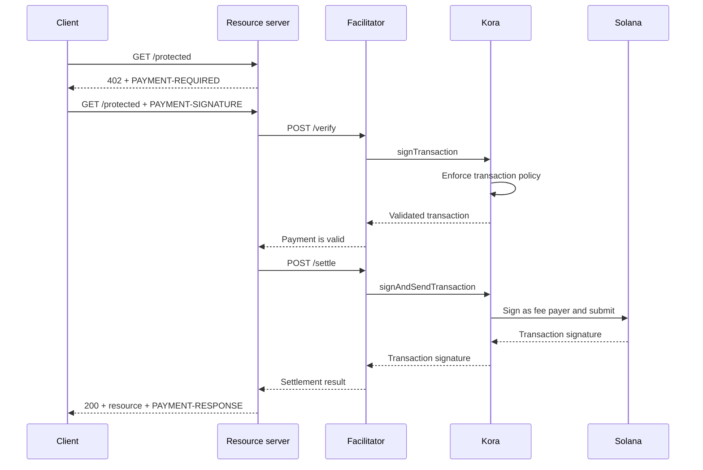

Kora może zapewnić warstwę podpisywania transakcji Solana, polityki transakcyjnej i sponsorowania opłat dla [fasilitatora x402 V2](/docs/tools/x402-facilitator). Fasiliatator implementuje interfejs HTTP x402; Kora weryfikuje, podpisuje i wysyła akceptowane przez siebie transakcje płatnicze.

Ten przewodnik uruchamia referencyjny fasiliatator Kora w sieci Solana Devnet. Jest to środowisko deweloperskie służące do testowania integracji, a nie wdrożenie produkcyjne.

## Architektura



Cztery role aplikacji pozostają oddzielne:

- **Klient** wybiera wymaganie płatnicze i podpisuje autoryzację płatności.
- **Serwer zasobów** wycenia trasę i realizuje ją dopiero po pomyślnej weryfikacji i rozliczeniu.
- **Fasiliatator** udostępnia punkty końcowe x402: `/supported`, `/verify` i `/settle`.
- **Kora** podpisuje wyłącznie transakcje dozwolone przez jej politykę i może sponsorować opłaty sieciowe Solana.

Kora nie zastępuje protokołu x402. Jest granicą podpisywania i polityki stosowaną przez tę implementację fasilitatora.

## Uruchomienie referencyjnego fasilitatora

Potrzebujesz Git i [Docker z Compose](https://docs.docker.com/compose/). Sklonuj najnowsze stabilne wydanie Kora i przejdź do demo x402:

```bash
git clone --branch v2.0.5 --depth 1 https://github.com/solana-foundation/kora.git
cd kora/examples/x402/demo
cp .env.example .env
```

Ustaw `KORA_PRIVATE_KEY` w pliku `.env` na jednorazowy keypair Devnet. Konfiguracja sygnatariusza demo akceptuje sekret w formacie base58, keypair w postaci tablicy bajtów lub ścieżkę do pliku keypair JSON. Zasilij jego publiczny adres SOL z Devnet, aby mógł sponsorować opłaty transakcyjne.

<Callout type="caution" title="Używaj jednorazowego sygnatariusza Devnet">
  Demo Docker ładuje sygnatariusza Kora ze zmiennej środowiskowej. Nie umieszczaj produkcyjnego klucza podpisującego w tym demo ani nie commituj pliku `.env`.
</Callout>

Uruchom Kora i fasiliatator:

```bash
docker compose up --build
```

Pierwsze budowanie może potrwać kilka minut. Gdy oba sprawdzenia stanu przejdą pomyślnie, sprawdź możliwości reklamowane przez fasiliatator z innego terminala:

```bash
curl http://127.0.0.1:3000/supported
```

Odpowiedź powinna reklamować wersję x402 `2`, schemat `exact` oraz identyfikator sieci Devnet CAIP-2:

```json
{
  "kinds": [
    {
      "x402Version": 2,
      "scheme": "exact",
      "network": "solana:EtWTRABZaYq6iMfeYKouRu166VU2xqa1",
      "extra": {
        "feePayer": "<KORA_SIGNER_ADDRESS>"
      }
    }
  ]
}
```

Kora nasłuchuje domyślnie na `127.0.0.1:8080`, a fasiliatator na `127.0.0.1:3000`. Zatrzymaj demo za pomocą `Ctrl+C`.

## Podłączenie serwera zasobów

Skonfiguruj serwer zasobów x402 tak, aby używał lokalnego fasilitatora i publicznego adresu sygnatariusza Kora jako odbiorcy:

```bash
FACILITATOR_URL=http://127.0.0.1:3000
SOLANA_PAY_TO=<KORA_SIGNER_ADDRESS>
```

Następnie postępuj zgodnie z [x402 na Solana](/docs/payments/agentic-payments/x402), aby dodać middleware x402 V2 do trasy Express. Nieopłacone żądanie otrzymuje odpowiedź `PAYMENT-REQUIRED`, ponowna próba zawiera nagłówek `PAYMENT-SIGNATURE`, a pomyślna odpowiedź zawiera `PAYMENT-RESPONSE`.

Nie kopiuj przykładów używających `X-PAYMENT`, `X-PAYMENT-RESPONSE` ani nazwy sieci `solana-devnet`. Te pola należą do x402 V1.

Repozytorium Kora zawiera również chronione API oraz klienta obsługującego płatności w tym samym katalogu `examples/x402/demo`. Używaj tych aplikacji, gdy chcesz przetestować kompletny lokalny przepływ.

## Konfiguracja polityki Kora

Referencyjny plik `kora/kora.toml` jest celowo wąsko skonfigurowany. Jego polityka walidacji kontroluje:

- które programy Solana sygnatariusz dopuszcza;
- które minty tokenów SPL mogą być używane;
- maksymalną liczbę sponsorowanych lamport i podpisów;
- które operacje płatnika opłat są zabronione; oraz
- które rozszerzenia Token-2022 są odrzucane.

Demo włącza tylko te metody RPC Kora, których potrzebuje fasiliatator:
`signTransaction`, `signAndSendTransaction`, `getBlockhash`, `getPayerSigner`,
`getConfig` i `getVersion`.

Traktuj politykę jako granicę bezpieczeństwa dla klucza płatnika opłat. W przypadku usługi produkcyjnej:

1. Dodaj do listy dozwolonych wyłącznie programy, minty tokenów i formy transakcji generowane przez Twój schemat x402.
2. Zabroń transferów, zmian uprawnień, zamykania kont i innych instrukcji, które mogą przenosić wartość od sygnatariusza Kora.
3. Ustaw limity transakcji i użycia ograniczające straty wynikające z przejęcia danych uwierzytelniających fasilitatora.
4. Używaj zarządzanego backendu sygnatariusza zamiast klucza prywatnego przechowywanego w zmiennej środowiskowej.

## Zabezpieczenie połączenia fasiliatator–Kora

Demo włącza uwierzytelnianie kluczem API Kora. Fasiliatator wysyła wartość `KORA_API_KEY`, która musi odpowiadać `[kora.auth].api_key` w pliku `kora.toml`.

W środowisku produkcyjnym dodatkowo:

- utrzymuj Kora w sieci prywatnej i zakończaj TLS na zaufanej granicy;
- przechowuj dane uwierzytelniające API w menedżerze sekretów i regularnie je rotuj;
- rozważ uwierzytelnianie żądań HMAC Kora w celu ochrony przed manipulacją i atakami powtórzeniowymi;
- rozdziel klucze płatnika opłat i odbiorcy płatności, jeśli wymaga tego Twój model rozliczeń; oraz
- ustawiaj alerty na odrzucenia polityki, błędy rozliczenia, zużycie opłat i saldo sygnatariusza.

## Wzmocnienie rozliczenia płatności

Kora weryfikuje transakcję Solana, jednak za poprawność protokołu x402 nadal odpowiadają fasiliatator i serwer zasobów. Przed udostępnieniem zasobu wymuś:

- wybraną wersję x402, schemat, sieć, zasób, kwotę i odbiorcę;
- czas życia autoryzacji i dokładny układ instrukcji Solana;
- atomową ochronę przed powtórzeniami i idempotentne rozliczenie;
- potwierdzenie na poziomie zatwierdzenia wymaganym przez produkt; oraz
- trwałe odwzorowanie pomiędzy zakupem, wynikiem rozliczenia a realizacją.

Nie zwracaj opłaconej treści tylko dlatego, że Kora zaakceptowała transakcję do podpisania. Realizuj żądanie dopiero po tym, jak fasiliatator zwróci pomyślny wynik rozliczenia.

## Powiązane zasoby

- [Repozytorium Kora i demo x402](https://github.com/solana-foundation/kora/tree/main/examples/x402/demo)
- [Konfiguracja operatora Kora](/docs/tools/kora/operators/configuration)
- [Backendy sygnatariuszy Kora](/docs/tools/kora/operators/signers)
- [Audyty bezpieczeństwa Kora](/docs/tools/kora/security-audits)
- [Specyfikacja x402 V2](https://github.com/x402-foundation/x402/blob/main/specs/x402-specification-v2.md)
- [Przegląd płatności agentycznych](/docs/payments/agentic-payments)
