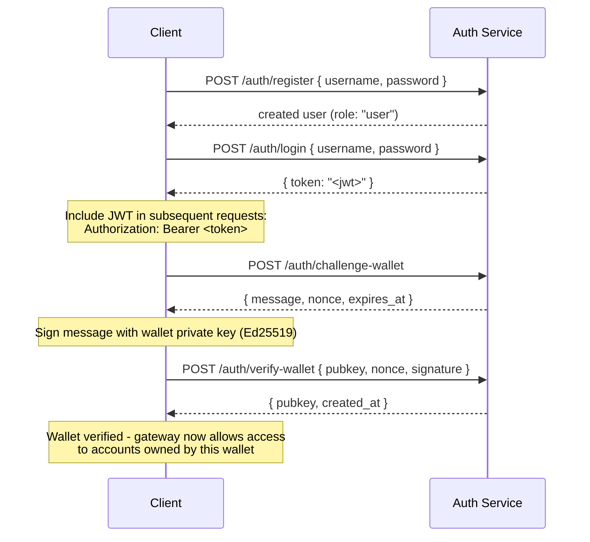

## Przegląd

Private Channels zawiera opcjonalną usługę Auth Service, która kontroluje dostęp do bramki
za pomocą uwierzytelniania JWT i kontroli dostępu opartej na rolach (RBAC). Gdy
uwierzytelnianie jest wyłączone, bramka akceptuje wszystkie połączenia. Gdy jest włączone,
klienci muszą przesyłać prawidłowy JWT w każdym żądaniu.

Ta strona dotyczy obu grup odbiorców:

- **Deweloperzy** – rejestracja, logowanie, weryfikacja portfela i wykonywanie
  uwierzytelnionych żądań
- **Operatorzy** – włączanie usługi auth, konfigurowanie `JWT_SECRET` oraz
  nadawanie roli `operator`

## Włączanie uwierzytelniania

Uwierzytelnianie jest włączane przez ustawienie `JWT_SECRET` (niepuste) zarówno na
bramce, jak i w usłudze Auth Service. Auth Service wymaga również
`AUTH_DATABASE_URL`.

Gdy `JWT_SECRET` nie jest ustawiony, bramka działa w trybie otwartym; żaden token nie jest
wymagany.

> **Docker Compose:** Usługa auth jest profilem Docker Compose i **nie jest
> uruchamiana domyślnie**. Aby ją uwzględnić, przekaż `--profile auth` do polecenia
> `docker compose`, w tym `--env-file .env`, aby sekrety takie jak
> `JWT_SECRET` i `POSTGRES_PASSWORD` były poprawnie rozwiązywane (Compose wyłącza automatyczne
> ładowanie `.env`, gdy zostanie przekazana jakakolwiek flaga `--env-file`):
>
> ```bash
> docker compose -f docker-compose.devnet.yml --env-file versions.env --env-file .env.devnet --env-file .env --profile auth up -d
> ```

## API usługi Auth Service

Wszystkie endpointy znajdują się pod `/auth`. Usługa auth nasłuchuje na `AUTH_PORT`
(domyślnie `8903`).

### `POST /auth/register`

Utwórz nowe konto. Wszyscy użytkownicy są rejestrowani z rolą `user`.

```json
{ "username": "alice", "password": "hunter2" }
```

- Nazwa użytkownika: 5–32 znaki, alfanumeryczne oraz `_` i `-`
- Hasło: 6–128 znaków
- Zwraca utworzonego użytkownika; hasło nigdy nie jest zwracane

### `POST /auth/login`

Uwierzytelnij się i otrzymaj podpisany JWT ważny przez 24 godziny.

```json
{ "username": "alice", "password": "hunter2" }
```

Zwraca `{ "token": "<jwt>" }`. Zarówno błędna nazwa użytkownika, jak i błędne hasło zwracają
`401`, aby zapobiec enumeracji nazw użytkowników.

### `POST /auth/challenge-wallet`

Zażądaj wyzwania podpisowego w celu potwierdzenia własności portfela Solana. Wymaga
prawidłowego JWT.

Zwraca komunikat, nonce i czas wygaśnięcia. Wyzwanie wygasa po 10 minutach.

```json
{
  "message": "PrivateChannel wallet verification\nuser: <uuid>\nnonce: <uuid>\nexpires: <unix>",
  "nonce": "<uuid>",
  "expires_at": "<iso8601>"
}
```

### `POST /auth/verify-wallet`

Prześlij podpisane wyzwanie, aby zarejestrować portfel jako zweryfikowany. Wymaga prawidłowego
JWT.

```json
{
  "pubkey": "<base58 pubkey>",
  "nonce": "<uuid from challenge>",
  "signature": "<base58 Ed25519 signature>"
}
```

Usługa rekonstruuje komunikat wyzwania, weryfikuje podpis Ed25519
i zapisuje portfel. Każdy nonce może zostać wykorzystany tylko raz; powtórne użycie
jest odrzucane.

Zwraca `{ "pubkey": "<base58>", "created_at": "<iso8601>" }`.

### `GET /auth/wallets`

Wyświetl wszystkie zweryfikowane portfele uwierzytelnionego użytkownika. Wymaga prawidłowego JWT.

### `DELETE /auth/wallets/{pubkey}`

Usuń zweryfikowany portfel z konta uwierzytelnionego użytkownika. Wymaga prawidłowego
JWT.

### `GET /health`

Sprawdzenie aktywności. Zwraca `200 ok`. Uwierzytelnianie nie jest wymagane.

## Struktura JWT

Tokeny używają algorytmu HS256 i wygasają 24 godziny po wystawieniu.

| Claim  | Wartość                           |
| ------ | ------------------------------- |
| `sub`  | UUID użytkownika                       |
| `role` | `"user"` lub `"operator"`        |
| `iss`  | `"private-channel-auth"`        |
| `aud`  | `"private-channel-gateway"`     |
| `exp`  | Znacznik czasu Unix (24h od wystawienia) |

> `iss` i `aud` są obecne w payloadzie JWT, ale są walidowane przez
> konfigurację JWT bramki, a nie deserializowane do struktury claimów aplikacji.
> Kod warstwy aplikacji ma dostęp wyłącznie do `sub`, `role` i `exp`.

Przekaż token w nagłówku `Authorization`:

```
Authorization: Bearer <JWT_TOKEN>
```

## Role

### user

Domyślna rola przy rejestracji.

- Dostęp jest ograniczony do zweryfikowanych portfeli użytkownika
- Zablokowany dostęp do: `getBlock`, `getTransaction`, `simulateTransaction`
- Może: wywołać `Deposit` w Escrow Program, inicjować wypłaty przez
  `WithdrawFunds`

### operator

Rola z podwyższonymi uprawnieniami. Musi być nadana bezpośrednio; nie istnieje ścieżka samoobsługowa
do eskalacji z `user` do `operator`.

**Nadaj rolę**, za pomocą Admin CLI (`private-channel-auth-admin`):

```bash
private-channel-auth-admin set-role --username alice --role operator
```

lub bezpośrednim SQL:

<Callout type="warning">
  Jest to uprzywilejowana operacja na bazie danych. Odpowiednio ogranicz dostęp do bazy danych usługi Auth Service
  i przeprowadzaj audyt wszelkich zmian ról.
</Callout>

```sql
UPDATE private_channel_auth.users SET role = 'operator' WHERE username = 'alice';
```

**Zarejestruj portfel bez procesu samoweryfikacji (Admin CLI,
`private-channel-auth-admin`):**

```bash
private-channel-auth-admin attach-wallet --username alice --pubkey <base58-pubkey>
```

Powoduje to bezpośrednie wstawienie zweryfikowanego portfela do tabeli `verified_wallets`,
omijając proces challenge/verify. Wymusza unikalność dla
`(user_id, pubkey)`. Samo w sobie **nie** nadaje roli `operator`; użyj
`set-role` lub powyższej aktualizacji SQL w tym celu. To polecenie służy do przypisania portfela
do konta (na przykład konta serwisowego) bez konieczności przechodzenia przez
interaktywny proces challenge/verify.

**Możliwości:**

- Pomija wszystkie sprawdzenia własności portfela
- Pełny dostęp do wszystkich metod RPC bramki, w tym `getBlock`,
  `getTransaction`, `simulateTransaction`
- Wymagane dla: `ReleaseFunds`, `ResetSmtRoot`

## Pełny przepływ uwierzytelniania



## Wykonywanie uwierzytelnionych żądań

```typescript
const response = await fetch("http://localhost:8899/", {
  method: "POST",
  headers: {
    "Content-Type": "application/json",
    Authorization: `Bearer ${jwtToken}`
  },
  body: JSON.stringify({
    jsonrpc: "2.0",
    id: 1,
    method: "getBalance",
    params: [walletAddress]
  })
});
const data = await response.json();
```

## Endpointy bramki

Te endpointy nie wymagają uwierzytelniania:

| Endpoint  | Metoda | Opis                               | Sukces                  | Błąd                     |
| --------- | ------ | ----------------------------------------- | ------------------------ | --------------------------- |
| `/health` | GET    | Sprawdzenie aktywności                            | `200 {"status":"ok"}`    | -                           |
| `/ready`  | GET    | Pełne sprawdzenie gotowości; sonduje węzły zapisu i odczytu | `200 {"status":"ready"}` | `503 {"status":"degraded"}` |

Informacje dotyczące `JWT_SECRET` i zmiennych środowiskowych bramki znajdziesz w
[dokumentacji konfiguracji](/docs/tools/private-channels/operators/configuration).

## Macierz dostępu do metod RPC

Poniższe metody są rozpoznawane przez bramkę. Gdy `JWT_SECRET` jest ustawiony,
dostęp zależy od roli JWT:

| Metoda                        | Trasa      | Bez JWT | `user`           | `operator` |
| ----------------------------- | ---------- | ------ | ---------------- | ---------- |
| `sendTransaction`             | Węzeł zapisu | ✓      | ✓                | ✓          |
| `getLatestBlockhash`          | Węzeł odczytu  | ✓      | ✓                | ✓          |
| `getSlot`                     | Węzeł odczytu  | ✓      | ✓                | ✓          |
| `getRecentBlockhash`          | Węzeł odczytu  | ✓      | ✓                | ✓          |
| `getSignatureStatuses`        | Węzeł odczytu  | ✓      | ✓                | ✓          |
| `getTransactionCount`         | Węzeł odczytu  | ✓      | ✓                | ✓          |
| `getFirstAvailableBlock`      | Węzeł odczytu  | ✓      | ✓                | ✓          |
| `getBlocks`                   | Węzeł odczytu  | ✓      | ✓                | ✓          |
| `getEpochInfo`                | Węzeł odczytu  | ✓      | ✓                | ✓          |
| `getEpochSchedule`            | Węzeł odczytu  | ✓      | ✓                | ✓          |
| `getRecentPerformanceSamples` | Węzeł odczytu  | ✓      | ✓                | ✓          |
| `getBlockTime`                | Węzeł odczytu  | ✓      | ✓                | ✓          |
| `getVoteAccounts`             | Węzeł odczytu  | ✓      | ✓                | ✓          |
| `getSupply`                   | Węzeł odczytu  | ✓      | ✓                | ✓          |
| `getSlotLeaders`              | Węzeł odczytu  | ✓      | ✓                | ✓          |
| `isBlockhashValid`            | Węzeł odczytu  | ✓      | ✓                | ✓          |
| `getAccountInfo`              | Węzeł odczytu  | 401    | weryfikacja własności¹ | ✓          |
| `getTokenAccountBalance`      | Węzeł odczytu  | 401    | weryfikacja własności¹ | ✓          |
| `getSignaturesForAddress`     | Węzeł odczytu  | 401    | weryfikacja własności¹ | ✓          |
| `getBlock`                    | Węzeł odczytu  | 401    | 403              | ✓          |
| `getTransaction`              | Węzeł odczytu  | 401    | 403              | ✓          |
| `simulateTransaction`         | Węzeł odczytu  | 401    | 403              | ✓          |

¹ **Weryfikacja własności**: dla token account SPL (pole owner to `TokenkegQ...`
lub `TokenzQ...`, dane o długości co najmniej 165 bajtów), bramka sprawdza, czy
pole `owner` lub `delegate` odpowiada jednemu ze zweryfikowanych portfeli uwierzytelnionego użytkownika. Dla każdego innego typu konta (portfel System Program lub nieznany
PDA) sprawdza natomiast, czy zapytany pubkey sam w sobie należy do zweryfikowanych portfeli użytkownika,
ponieważ takie konta nie mają pola owner/delegate do sprawdzenia.
Niepomyślny wynik któregokolwiek ze sprawdzeń zwraca 403.
