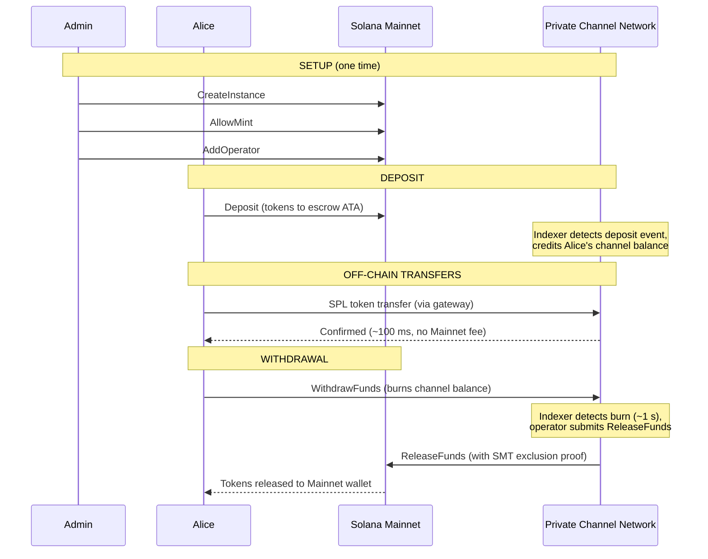
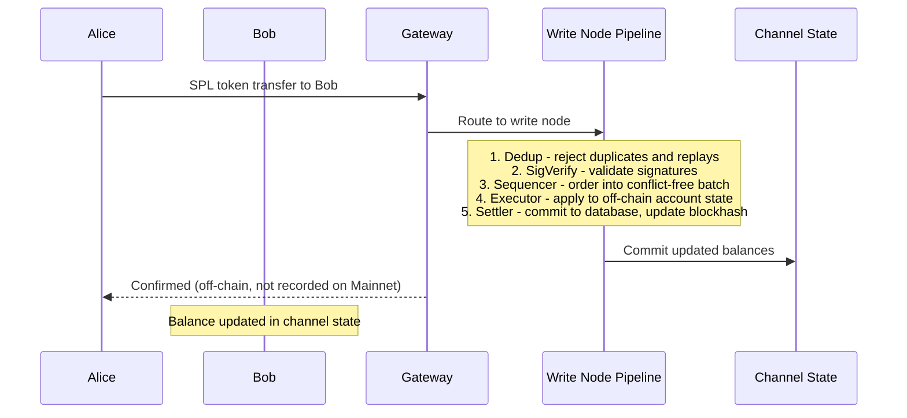
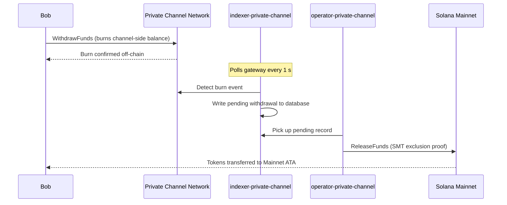

## Czym jest kanał prywatny?

Kanał prywatny to sieć płatności off-chain zakotwiczona w Solanie. Użytkownicy
wpłacają tokeny SPL do programu escrow on-chain, a następnie dokonują transakcji off-chain
poprzez bramę z dużą prędkością i zerowym kosztem pojedynczego przelewu. Rozliczenie z powrotem do
Solana Mainnet odbywa się za pomocą dowodu Sparse Merkle Tree, co gwarantuje, że środki są zawsze
możliwe do realizacji, a podwójne wydanie jest niemożliwe.

W przeciwieństwie do natywnego przepływu płatności Solany, przelewy wewnątrz kanału nie pojawiają się
on-chain do momentu wypłaty przez użytkownika. Sieć kanałów posiada własny potok transakcji
(dedup -> sig verify -> sequencer -> executor -> settler), który
przetwarza transakcje niezależnie od czasu bloku Solany.

## Uczestnicy

### Administrator instancji

Administrator wdraża PDA `Instance` za pomocą `CreateInstance` i kontroluje, które minty SPL
są akceptowane (`AllowMint` / `BlockMint`). Administrator przydziela i
odwołuje operatorów za pomocą `AddOperator` / `RemoveOperator`, a także może przekazać prawa administratora
poprzez `SetNewAdmin`. Istnieje jeden administrator na instancję. Przekazanie praw administratora
jest nieodwracalne w jednym kroku: obecny administrator nie może odzyskać roli
bez współpracy nowego administratora.

### Operatorzy

Operatorzy są przydzielani przez administratora. Posiadają PDA `Operator` i są jedynymi
kontami uprawnionymi do wywoływania `ReleaseFunds` (w celu rozliczenia wypłat do
Mainnetu) oraz `ResetSmtRoot` (w celu rotacji Sparse Merkle Tree). Operatorzy pomijają
wszystkie kontrole własności w bramie i mają dostęp do wszystkich metod JSON-RPC,
w tym `getBlock`, `getTransaction` i `simulateTransaction`. Rola JWT:
`"operator"`. Operatorzy muszą być przypisani bezpośrednio w bazie danych; nie istnieje
samoobsługowa eskalacja uprawnień. Szczegóły dotyczące wdrożenia i konfiguracji
znajdują się w [przewodniku dla operatorów](/docs/tools/private-channels/operators).

### Użytkownicy

Użytkownicy rejestrują się samodzielnie za pośrednictwem usługi Auth. Rola JWT: `"user"`. Użytkownicy mogą wywoływać
`Deposit` bezpośrednio w programie Escrow i inicjować wypłaty za pomocą
instrukcji `WithdrawFunds` po stronie kanału w programie Withdraw. Dostęp do bramy
jest ograniczony do ich własnych zweryfikowanych portfeli; nie mogą wywoływać `getBlock`,
`getTransaction` ani `simulateTransaction`.

## Cykl życia kanału

1. **Tworzenie instancji** - Administrator wywołuje `CreateInstance`, tworząc PDA `Instance`
   i konfigurując dozwolone minty.
2. **Wpłata** - Użytkownicy wpłacają tokeny SPL do escrow za pomocą instrukcji `Deposit`.
   Tokeny trafiają do associated token account instancji.
3. **Przelewy off-chain** - Użytkownicy wysyłają przelewy przez bramę. Przelewy
   są sekwencjonowane i wykonywane w sieci kanałów bez angażowania Mainnet.
4. **Inicjowanie wypłaty** - Użytkownik wywołuje `WithdrawFunds` w programie Withdraw
   (po stronie kanału), aby spalić swoje saldo i zasygnalizować wypłatę.
5. **Rozliczenie na Mainnet** - Operator dostarcza ważny dowód wykluczenia SMT i
   wywołuje `ReleaseFunds` w programie Escrow (Mainnet), zwalniając tokeny do
   portfela użytkownika.
6. **Rotacja drzewa** - Gdy SMT zbliża się do pojemności (65 536 liści), operator
   wywołuje `ResetSmtRoot`, aby dokonać rotacji drzewa i rozpocząć nowy epoch.

### Przelew

### Wypłata

## Kiedy używać kanałów prywatnych

Używaj kanałów prywatnych, gdy Twoja aplikacja potrzebuje:

- **Przepustowości off-chain** — wolumen Twoich przelewów wysyciłby TPS Solany lub
  potrzebujesz potwierdzenia poniżej sekundy
- **Prywatności** — tożsamości stron i kwoty przelewów nie mogą pojawiać się
  on-chain
- **Zerowych opłat za przelew** — częste przelewy, gdzie koszt SOL za transakcję
  jest zbyt wysoki

Używaj natywnych przelewów SPL w zamian, gdy:

- **Wymagana jest kompozycyjność on-chain** (DeFi, swapy, pożyczki; inne programy
  muszą mieć możliwość obserwowania lub działania na podstawie przelewu)
- **Jednorazowe rozliczenie** jest akceptowalne i prywatność nie stanowi problemu
- **Brak infrastruktury bramowej** lub jej wdrożenie jest operacyjnie niewykonalne
