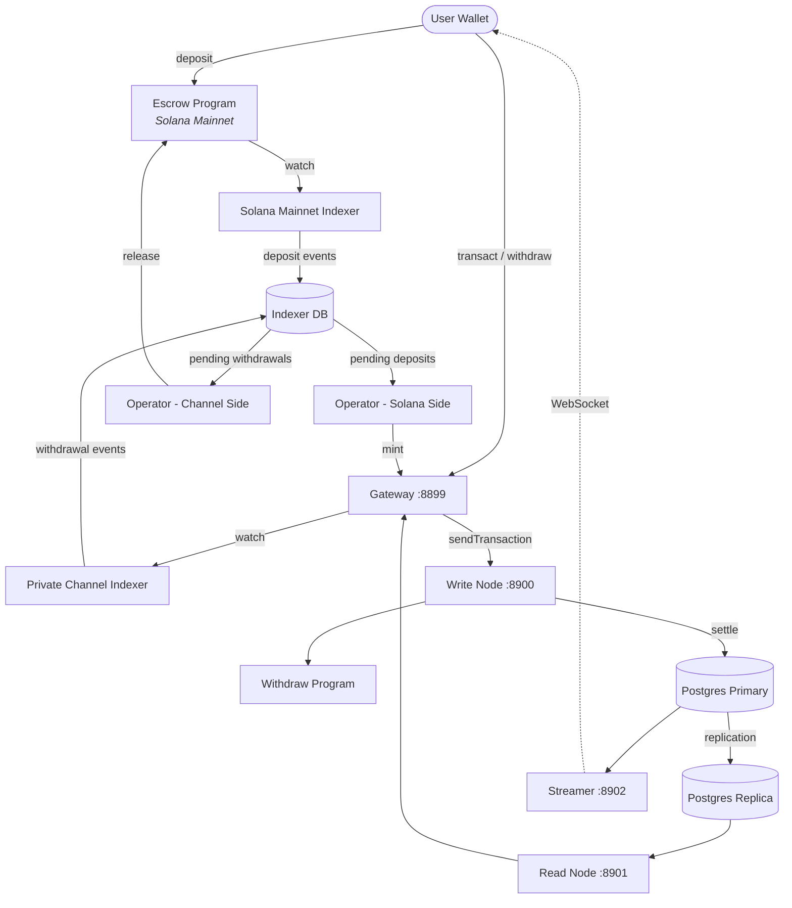

<Callout type="warning">
  Private Channels nie przeszło audytu bezpieczeństwa i nie jest zalecane do
  użytku produkcyjnego z prawdziwymi środkami bez gruntownego przeglądu bezpieczeństwa.
</Callout>

<Callout type="info">
  **Wdrażasz instancję?** Przejdź do [przewodnika
  operatora](/docs/tools/private-channels/operators). **Integrujesz się z
  istniejącą instancją?** Przejdź do
  [Quickstart](/docs/tools/private-channels/quickstart/installation). Ta strona
  jest dokumentacją architektury przeznaczoną dla obu grup odbiorców.
</Callout>

## Architektura

Private Channels składa się z czterech komponentów: dwóch programów on-chain Solana
(Escrow i Withdraw) oraz dwóch usług off-chain (Gateway i Auth Service).
Razem tworzą protokół kanałów stanowych, w którym środki przechowywane są w sieci Mainnet,
ale transfery rozliczane są off-chain.

### Program Escrow

Program Escrow to program on-chain Solana przechowujący zdeponowane tokeny SPL.
Jest on kotwicą zaufania systemu: wszystkie środki ostatecznie przechowywane są
w depozycie, dopóki operator nie dostarczy ważnego dowodu wykluczenia Sparse Merkle Tree
w celu ich zwolnienia.

- ID programu: `9tgHa1DcnaSSUtmMsst8ovKTe1Gfxzezn27KnH9xXYeU`
- To ID jest kompilowane do pliku binarnego programu za pomocą `declare_id!()`. Usługi off-chain
  odczytują to samo ID w czasie kompilacji z wygenerowanej skrzynki klienckiej, nie
  ze zmiennej środowiskowej.
- Zarządza PDA: `Instance`, `AllowedMint` i `Operator`
- Instrukcje: `CreateInstance`, `AllowMint`, `BlockMint`, `AddOperator`,
  `RemoveOperator`, `SetNewAdmin`, `Deposit`, `ReleaseFunds`, `ResetSmtRoot`

### Program Withdraw

Program Withdraw działa w prywatnej sieci kanałów, nie w sieci Solana Mainnet.
Użytkownicy wywołują `WithdrawFunds`, aby spalić swoje saldo tokenów po stronie kanału. To spalenie
nie zwalnia automatycznie środków; sygnalizuje operatorowi, że
oczekuje wypłata. Operator wywołuje następnie `ReleaseFunds` na Programie Escrow
z ważnym dowodem SMT, aby zakończyć rozliczenie.

- ID programu: `J231K9UEpS4y4KAPwGc4gsMNCjKFRMYcQBcjVW7vBhVi`
- To ID jest kompilowane do pliku binarnego programu. Usługi off-chain odczytują to samo
  ID w czasie kompilacji z wygenerowanej skrzynki klienckiej, nie ze zmiennej
  środowiskowej.

### Gateway

Gateway to proxy zgodne z Solana JSON-RPC, które kieruje żądania klientów do
węzła zapisu sieci kanałów (do przesyłania transakcji) i węzła odczytu (do
zapytań). Jest konfigurowane za pomocą zmiennych środowiskowych: `GATEWAY_PORT`,
`GATEWAY_WRITE_URL`, `GATEWAY_READ_URL`.

Punkty końcowe health check (bez wymaganego uwierzytelniania):

- `GET /health` - sprawdzenie dostępności; zwraca `200 {"status":"ok"}`
- `GET /ready` - głęboka weryfikacja gotowości, sprawdza węzły zapisu i odczytu; zwraca
  `200 {"status":"ready"}` lub `503 {"status":"degraded"}`

#### Routing metod RPC i kontrola dostępu

Gateway kieruje `sendTransaction` do węzła zapisu, a wszystkie pozostałe metody do
węzła odczytu. Żądania większe niż 64 KB są odrzucane z kodem HTTP 413. Gdy
uwierzytelnianie jest włączone, dostęp do metod jest kontrolowany przez rolę JWT. Zobacz
**[Uwierzytelnianie i role](/docs/tools/private-channels/concepts/auth)**, aby zapoznać się z
pełną macierzą metod.

### Auth Service

Auth Service to opcjonalny komponent wydający tokeny JWT HS256 (ważność 24 godziny)
do kontroli dostępu do gateway. Jest włączany, gdy ustawiona jest zmienna środowiskowa `JWT_SECRET`.
Bez niej gateway akceptuje wszystkie połączenia.

Pola JWT: `sub` (UUID użytkownika), `role` (`"user"` lub `"operator"`), `iss`
(`"private-channel-auth"`), `aud` (`"private-channel-gateway"`), `exp` (znacznik czasu Unix).
`iss` i `aud` są walidowane przez konfigurację JWT gateway,
a nie deserializowane do struktury pól aplikacji: tylko `sub`, `role` i
`exp` są dostępne dla kodu warstwy aplikacji.

Role:

- `user` - dostęp ograniczony do własnych zweryfikowanych portfeli; nie może wywoływać `getBlock`,
  `getTransaction` ani `simulateTransaction`
- `operator` - pomija wszystkie sprawdzenia własności; pełny dostęp do metod RPC; musi być
  przypisany w bazie danych (brak samodzielnej eskalacji uprawnień)

### Streamer

Streamer to serwer WebSocket przesyłający aktualizacje stanu kanału do
podłączonych klientów w czasie rzeczywistym, eliminując potrzebę odpytywania RPC. Odpytuje
PostgreSQL w poszukiwaniu zmian stanu. Jest częścią bazowego stosu Docker Compose, nie
stosu devnet wdrażanego w tym przewodniku; zobacz
[dokumentację konfiguracji](/docs/tools/private-channels/operators/configuration#service-port-reference).

- Port: `8902`, konfigurowalny za pomocą `STREAMER_PORT`
- Połączenie: `ws://localhost:8902`
- Punkt końcowy health check: `GET /health` - zwraca `503`, jeśli którakolwiek wewnętrzna pętla odpytywania
  zatrzyma się na dłużej niż 30 sekund

<Callout type="warning">
  Schemat zdarzeń WebSocket nie jest jeszcze publicznie udokumentowany. Do czasu udostępnienia
  formalnej dokumentacji należy zapoznać się z
  [`core/src/bin/streamer.rs`](https://github.com/solana-foundation/solana-private-channels/blob/main/core/src/bin/streamer.rs)
  w celu uzyskania szczegółów implementacji.
</Callout>



## Potok transakcji

```text
Transaction -> [1:Dedup] -> [2:SigVerify] -> [3:Sequencer] -> [4:Executor] -> [5:Settler] -> Database
```

Transakcje przesłane do Gateway przechodzą przez pięcioetapowy potok, zanim
iczh stan zostanie zatwierdzony:

1. **Dedup** - filtruje zduplikowane transakcje przed ich wejściem do potoku
2. **SigVerify** - weryfikuje podpisy transakcji względem klucza publicznego podpisującego
3. **Sequencer** - porządkuje ważne transakcje w sposób deterministyczny, tworząc
   kanoniczną historię
4. **Executor** - wykonuje transakcje na warstwie kont kanału
   (BOB Cache + AccountsDB), aktualizując salda off-chain
5. **Settler** - zatwierdza skumulowane wyniki transakcji w PostgreSQL i
   aktualizuje pamięć podręczną Redis; generuje nowe skróty bloków dla następnego cyklu blokowego.
   Rozliczenie w sieci Mainnet (wywołanie `ReleaseFunds`) jest obsługiwane oddzielnie przez usługę
   `operator-private-channel`

## Kluczowe funkcje

### Prywatność

Transfery między uczestnikami kanału nie są rejestrowane w sieci Solana Mainnet. Tylko
depozyty (wejście do kanału) i ostateczne wypłaty (wyjście z kanału)
pojawiają się on-chain. Tożsamości stron i kwoty transferów nie są widoczne dla
zewnętrznych obserwatorów podczas działania kanału.

### Wydajność

Potok off-chain usuwa czas bloku Solana z krytycznej ścieżki.
Transfery są potwierdzane, gdy sekwencer je przetworzy, nie gdy zostanie potwierdzony blok Solana.
Umożliwia to finalizację poniżej jednej sekundy i przepustowość przekraczającą natywny
TPS Solana dla transferów na poziomie aplikacji.

### Rozliczenie

Każda wypłata jest chroniona przez on-chain dowód Sparse Merkle Tree. Korzeń SMT
jest przechowywany w `Instance.withdrawal_transactions_root` w Programie Escrow.
Gdy wywoływane jest `ReleaseFunds`, program najpierw weryfikuje dowód wykluczenia dla
niewidzianego wcześniej nonce względem bieżącego korzenia on-chain, a następnie weryfikuje odrębny
dowód włączenia dla tego nonce względem nowego korzenia dostarczonego przez wywołującego. Dopiero po
pomyślnym przejściu obu kontroli nowy korzeń jest zapisywany, co uniemożliwia podwójne wydatkowanie nawet
w przypadku naruszenia klucza operatora.

## Model bezpieczeństwa

**Klucz administratora** - kontroluje tworzenie instancji (`CreateInstance`) i przypisywanie operatorów
(`AddOperator` / `RemoveOperator`). Naruszenie klucza administratora umożliwia
przypisywanie dowolnych operatorów. `SetNewAdmin` przenosi uprawnienia administratora
nieodwracalnie w jednym kroku; klucz administratora należy odpowiednio chronić.

**Klucze operatora** - mogą wywoływać `ReleaseFunds` i `ResetSmtRoot`. Nie mogą
zwolnić środków bez ważnego dowodu wykluczenia SMT względem bieżącego korzenia on-chain.
Sprawdzenie `verify_smt_exclusion_proof` on-chain jest ostatnią linią
obrony przed nieautoryzowanymi wypłatami: sam naruszony klucz operatora
nie wystarczy do opróżnienia depozytu.

**Korzeń SMT** - przechowywany on-chain w `Instance.withdrawal_transactions_root`.
Aktualizowany atomowo przy każdym wywołaniu `ReleaseFunds`. Ponieważ każdy dowód musi
odwoływać się do niewidzianego wcześniej nonce, podwójne wydatkowanie tego samego salda kanału jest
niemożliwe nawet w przypadku naruszenia klucza operatora.

**Rotacja drzewa** - `Instance.current_tree_index` śledzi epoch drzewa. Gdy
wywoływane jest `ResetSmtRoot`, inkrementuje indeks drzewa i unieważnia wszystkie
nonce z poprzedniego epoch drzewa, zapewniając czysty stan dla nowych cykli
rozliczeniowych.

## Bezpieczeństwo operacyjnych kluczy

<Callout type="warning">
  Usługi off-chain używają własnego słownika podpisujących, który nie jest powiązany
  z uprawnieniami administratora/operatora on-chain opisanymi powyżej w modelu bezpieczeństwa.
  `ADMIN_PRIVATE_KEY` jest wymagany przez każdą usługę operatora i pokrywa
  opłaty transakcyjne; oddzielny, opcjonalny `OPERATOR_PRIVATE_KEY` dostarcza
  podpis on-chain Operatora dla `ReleaseFunds` i `ResetSmtRoot` i przyjmuje
  wartość `ADMIN_PRIVATE_KEY`, gdy nie jest ustawiony. Nigdy nie umieszczaj klucza administratora instancji
  na poziomie protokołu (używanego dla `CreateInstance` / `AddOperator` / `SetNewAdmin`)
  w żadnej z tych zmiennych ani nie ujawniaj go w środowisku uruchomieniowym; przechowuj ten klucz
  w trybie cold i offline.
</Callout>

`ReleaseFunds` i `ResetSmtRoot` wymagają dwóch podpisów on-chain: płatnika opłat
(z `ADMIN_PRIVATE_KEY`) i authority PDA Operatora (z
`OPERATOR_PRIVATE_KEY` lub `ADMIN_PRIVATE_KEY`, jeśli tamten nie jest ustawiony). Instruktaż devnet
w tym przewodniku wdrożeniowym umieszcza wygenerowany keypair operatora w
`ADMIN_PRIVATE_KEY` i pozostawia `OPERATOR_PRIVATE_KEY` nieustawiony, dzięki czemu ten sam keypair
pełni obie role podpisującego. Traktuj klucz, który trafia do `ADMIN_PRIVATE_KEY`, z
takimi samymi środkami ostrożności jak klucz prywatny gorącego portfela:

- Przechowuj go wyłącznie w pliku `.env` dodanym do gitignore, nigdy w `.env.devnet` ani w żadnej
  zatwierdzonej konfiguracji
- W przypadku wdrożeń produkcyjnych rozważ użycie menedżera sekretów (AWS Secrets Manager,
  HashiCorp Vault) zamiast zmiennej środowiskowej w postaci zwykłego tekstu
- Keypair administratora instancji na poziomie protokołu (używany do wywołania `AddOperator` /
  `SetNewAdmin`) powinien być przechowywany w trybie cold; jest potrzebny wyłącznie podczas konfiguracji
  instancji i przypisywania operatorów, nie podczas działania systemu

`SetNewAdmin` przenosi uprawnienia administratora **nieodwracalnie w jednej transakcji**:
bieżący administrator nie ma ścieżki odzyskania bez współpracy nowego administratora. Nie
wywołuj tej instrukcji bez zweryfikowania adresu docelowego.

## Następne kroki

<Cards>
  <Card
    title="Quickstart"
    href="/docs/tools/private-channels/quickstart/installation"
  >
    Skonfiguruj środowisko i wygeneruj klientów TypeScript.
  </Card>
  <Card title="Kanały" href="/docs/tools/private-channels/concepts/channels">
    Poznaj uczestników i cykl życia kanału.
  </Card>
  <Card
    title="Sparse Merkle Tree"
    href="/docs/tools/private-channels/concepts/smt"
  >
    Dowiedz się, jak dowody wypłat są weryfikowane on-chain.
  </Card>
  <Card
    title="Instrukcje"
    href="/docs/tools/private-channels/instructions/deposit"
  >
    Pełny opis instrukcji dla wszystkich programów.
  </Card>
</Cards>
