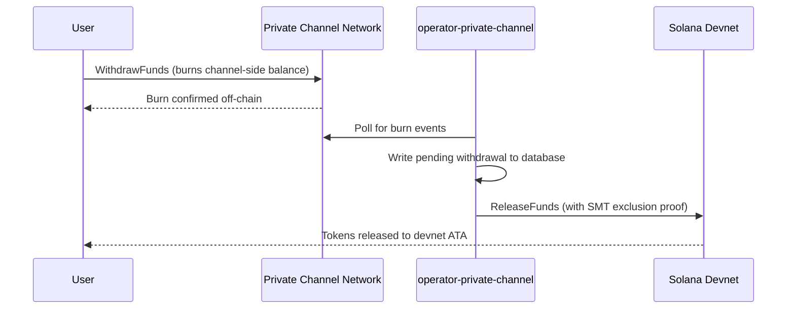

## Przegląd

Wypłata z Private Channels to proces dwuetapowy. Najpierw użytkownik spala
swoje saldo tokenów po stronie kanału, wywołując `WithdrawFunds` w programie
Withdraw Program. Następnie operator wywołuje `ReleaseFunds` w programie
Escrow Program (devnet, w tym przewodniku) z ważnym dowodem wykluczenia
Sparse Merkle Tree, aby zwolnić środki. Dowód SMT zapewnia, że każdy nonce
wypłaty może być użyty tylko raz, zapobiegając podwójnemu wydaniu.



## Krok 1: Zainicjuj wypłatę na kanale

Wywołaj `WithdrawFunds` w programie Withdraw Program, aby spalić swoje saldo
po stronie kanału. Użyj wariantu `Async`, który automatycznie wyznacza PDA
`tokenAccount` i jest zalecaną formą do użytku produkcyjnego:

```typescript
import { getWithdrawFundsInstructionAsync } from "../private-channel-withdraw-program/clients/typescript/src/generated";
import {
  createSolanaRpc,
  address,
  pipe,
  createTransactionMessage,
  setTransactionMessageFeePayerSigner,
  setTransactionMessageLifetimeUsingBlockhash,
  appendTransactionMessageInstruction,
  signAndSendTransactionMessageWithSigners,
  assertIsTransactionMessageWithSingleSendingSigner,
  getBase58Decoder
} from "@solana/kit";

// Point to the gateway, not a public Solana RPC
const privateChannelRpc = createSolanaRpc("http://localhost:8899");

const withdrawIx = await getWithdrawFundsInstructionAsync({
  user: userSigner,
  mint: address(mintAddress),
  amount: 1_000_000n, // 1 USDC (6 decimals)
  destination: null // null = release to signer's devnet wallet
});

const { value: latestBlockhash } = await privateChannelRpc
  .getLatestBlockhash({ commitment: "confirmed" })
  .send();

// Sent to the Private Channels gateway (not Solana RPC directly), which
// expects the legacy transaction format - do not switch this to version 0.
const transactionMessage = pipe(
  createTransactionMessage({ version: "legacy" }),
  (m) => setTransactionMessageFeePayerSigner(userSigner, m),
  (m) => setTransactionMessageLifetimeUsingBlockhash(latestBlockhash, m),
  (m) => appendTransactionMessageInstruction(withdrawIx, m)
);

assertIsTransactionMessageWithSingleSendingSigner(transactionMessage);

const signatureBytes =
  await signAndSendTransactionMessageWithSigners(transactionMessage);
const signature = getBase58Decoder().decode(signatureBytes);
console.log("Withdrawal initiated:", signature);
```

- ID programu Withdraw Program: `J231K9UEpS4y4KAPwGc4gsMNCjKFRMYcQBcjVW7vBhVi`
- Prześlij tę transakcję do bramki (`http://localhost:8899`), a nie do
  publicznego RPC Solana
- Jeśli podano `destination`, zwolnione środki trafią do tego portfela zamiast
  do portfela osoby podpisującej

## Czego się spodziewać

Po wywołaniu `WithdrawFunds` nie są wymagane żadne dalsze działania. Usługi
operatora obsługują rozliczenie automatycznie:

1. `indexer-private-channel` odpytuje kanał co 1 sekundę w poszukiwaniu zdarzeń
   spalenia i zapisuje oczekujący rekord wypłaty po wykryciu Twojego zdarzenia
2. `operator-private-channel` odpytuje bazę danych co 1 sekundę w poszukiwaniu
   oczekujących rekordów i przesyła `ReleaseFunds` do programu Escrow Program
   na Solana devnet z wymaganym dowodem wykluczenia SMT; odpytuje o potwierdzenie
   devnet do 5 razy w odstępach 400 ms przed ponowną próbą

Środki zazwyczaj pojawiają się w Twoim portfelu devnet w ciągu kilku sekund
w normalnych warunkach.

## Jak operator dokonuje rozliczenia (informacje referencyjne)

Po spaleniu po stronie kanału, skonfigurowany operator musi wywołać `ReleaseFunds`
w programie Escrow Program z ważnym dowodem wykluczenia SMT; operator nie może
zwolnić środków bez udowodnienia, że nonce wypłaty nie był wcześniej używany.
Ten krok jest obsługiwany automatycznie przez `operator-private-channel`;
nie musisz wywoływać go samodzielnie.

Operator dostarcza:

- `amount`: musi odpowiadać spalonej kwocie
- `user`: portfel odbiorcy na devnet
- `new_withdrawal_root`: zaktualizowany korzeń SMT po tej wypłacie
- `transaction_nonce`: unikalny nonce dla tego liścia
- `sibling_proofs`: 512 bajtów (16 x 32-bajtowe skróty rodzeństwa dla dowodu drzewa)

## Weryfikacja

Po potwierdzeniu wywołania operatora sprawdź saldo tokenów na devnet:

```bash
spl-token balance <MINT_ADDRESS> --owner <YOUR_WALLET>
```

Lub przez RPC:

```typescript
import { createSolanaRpc, address } from "@solana/kit";
import { findAssociatedTokenPda } from "@solana-program/token";

const TOKEN_PROGRAM_ADDRESS = address(
  "TokenkegQfeZyiNwAJbNbGKPFXCWuBvf9Ss623VQ5DA"
);

// Query devnet directly; ReleaseFunds settles here, not through the gateway
const rpc = createSolanaRpc("https://api.devnet.solana.com");

const [yourDevnetAta] = await findAssociatedTokenPda({
  mint: address(mintAddress),
  owner: address(userSigner.address),
  tokenProgram: TOKEN_PROGRAM_ADDRESS
});

const balance = await rpc.getTokenAccountBalance(yourDevnetAta).send();
console.log(balance.value.uiAmountString);
```

## Ukończyłeś przewodnik Quickstart

Przeszedłeś pełny cykl Private Channels na devnet: wpłaciłeś tokeny SPL do
depozytariusza, wysłałeś transfer off-chain przez bramkę i wypłaciłeś środki
z powrotem do swojego portfela devnet.

<Cards>
  <Card
    title="Cykl życia kanału"
    href="/docs/tools/private-channels/concepts/channels"
  >
    Poznaj szczegółowo uczestników oraz pełny przepływ od depozytu do wypłaty.
  </Card>
  <Card
    title="Uwierzytelnianie i role"
    href="/docs/tools/private-channels/concepts/auth"
  >
    Dodaj uwierzytelnianie JWT do swojej integracji.
  </Card>
  <Card
    title="Informacje referencyjne: Release Funds"
    href="/docs/tools/private-channels/instructions/release-funds"
  >
    Pełna dokumentacja instrukcji ReleaseFunds dla narzędzi operatora.
  </Card>
  <Card
    title="Sparse Merkle Tree"
    href="/docs/tools/private-channels/concepts/smt"
  >
    Dowiedz się, jak dowody wypłaty zapobiegają podwójnemu wydaniu.
  </Card>
</Cards>
