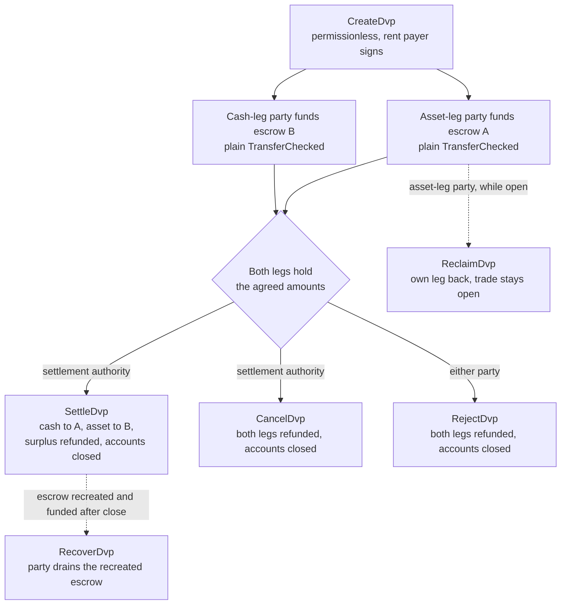
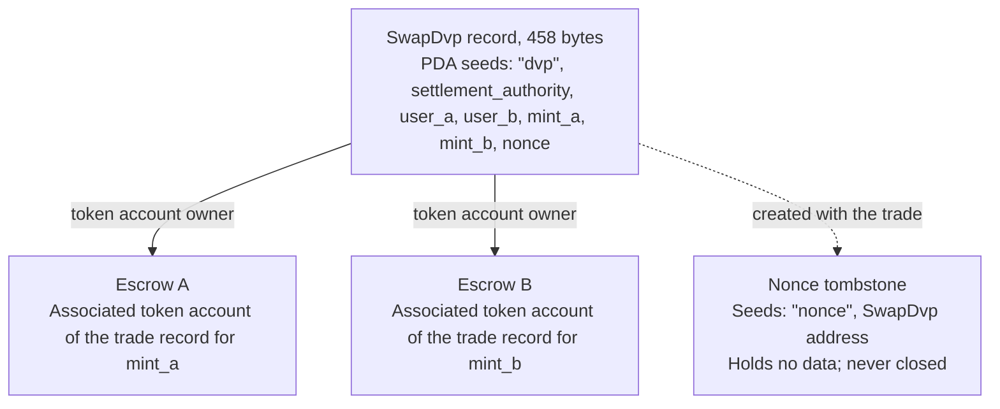

O programa DvP é o programa padrão de entrega contra pagamento na Solana,
mantido pela Solana Foundation e auditado pela Cantina. Duas partes acordam
uma operação, cada uma envia a sua perna para uma conta de escrow por meio de uma
transferência de tokens comum, e uma autoridade de liquidação liquida ambas as pernas
uma única transação, de modo que ou ambas se movem ou nenhuma se move. A autoridade de liquidação
é um terceiro endereço indicado na operação, como a plataforma ou o agente que a
organizou. Nenhuma das partes escreve ou implanta um programa, e uma carteira ou custodiante
que consiga enviar uma transferência de token padrão (`TransferChecked`) pode financiar uma perna
sem nenhuma integração específica com o DvP. Até a liquidação, qualquer uma das partes pode
retirar a sua própria perna ou desfazer a operação.

<Callout type="warn" title="Leia o registro antes de agir com base nele">

Criar um registro de operação não exige permissão, então um registro não é prova de
acordo. Cada parte lê os termos armazenados antes de financiar, e a autoridade de
liquidação antes de liquidar (veja
[verificação](#verification-before-funding-and-settlement)).

</Callout>

## Como funciona

Cada operação recebe um registro pertencente ao programa e duas contas de escrow, uma por perna. A
parte da perna de ativo (`user_a`) e a parte da perna de caixa (`user_b`) financiam cada uma uma perna
transferindo tokens para a conta de escrow dessa perna. A autoridade de liquidação
é o único signatário que pode liquidar. A liquidação transfere o valor acordado
de cada perna para o outro lado, devolve qualquer excedente à parte que é dona da
perna e encerra o registro e ambos os escrows. A atomicidade vem das
[transações](/docs/core/transactions) da Solana: as duas transferências estão em uma única transação,
portanto ou ambas têm efeito ou nenhuma tem.

Todo reembolso, recuperação e devolução de excedente vai para a associated
token account da própria parte: a conta de `user_a` para `mint_a`, a de `user_b` para `mint_b`. Um
sistema de custódia ou tesouraria pode financiar uma perna a partir da sua própria conta, mas tudo o que
for devolvido cai na conta da parte, e não volta para o custodiante. Cada operação
também deixa uma conta marcadora permanente (veja [Estado](#state)).

## Guias

As páginas de passo a passo levam uma operação da criação até a liquidação, com TypeScript e
Rust para cada instrução.

<Cards>
  <Card title="Criar uma operação" href="/docs/defi/dvp-program/create-a-trade">
    Instale os clientes e registre os termos da operação com CreateDvp
  </Card>
  <Card title="Financiar as pernas" href="/docs/defi/dvp-program/fund-the-legs">
    Verifique os termos armazenados e depois financie cada perna com uma transferência simples
  </Card>
  <Card title="Liquidar a operação" href="/docs/defi/dvp-program/settle-the-trade">
    Liquide ambas as pernas numa única transação como autoridade de liquidação
  </Card>
  <Card title="Desfazer uma operação" href="/docs/defi/dvp-program/unwind-a-trade">
    Retire uma perna, cancele ou rejeite a operação e recupere depósitos tardios
  </Card>
</Cards>

Uma [demonstração na devnet](https://solana.com/delivery-vs-payment/demo) executa uma operação de ponta a
ponta: cria a operação, financia ambos os escrows com transferências de token padrão e
liquida as duas pernas numa única transação.

## Escolhendo entre o programa e a delegação

[Entrega contra Pagamento (DvP) com delegação](/docs/tokenization/dvp) liquida a
mesma troca sem um programa: cada lado delega a sua posição a um
agente de liquidação, que move ambas as pernas numa única transação.

- **O programa** não precisa de delegação, portanto o limite de um delegado por token
  account não se aplica, e a autoridade de liquidação não pode redirecionar os recursos.
  Cada operação depende de um programa atualizável e da sua autoridade de atualização.
- **O padrão de delegação** não tem dependência de programa e funciona com mints que
  possuem Scaled UI Amount. O programa rejeita esses mints, o que exclui qualquer
  mint criado a partir do modelo `tokenized-security` do Mosaic (veja
  [restrições de configuração do mint](#mint-configuration-constraints)).

## Funções

O programa é simétrico. Na sua interface, as duas partes são `user_a`, que
entrega `mint_a`, e `user_b`, que entrega `mint_b`. O README e os clientes
gerados chamam `mint_a` de perna de ativo e `mint_b` de perna de caixa, e
estas páginas seguem essa convenção, mas nada no programa exige que a perna de caixa
seja um instrumento de caixa. Dois ativos, ou duas stablecoins, são liquidados da mesma
forma.

| Função                 | Quem                               | Assina                                              | Observações                                                                                                                                                                                                     |
| -------------------- | --------------------------------- | -------------------------------------------------- | --------------------------------------------------------------------------------------------------------------------------------------------------------------------------------------------------------- |
| Parte da perna de ativo      | `user_a`, entrega `mint_a`       | A própria transferência de financiamento; Reclaim, Reject, Recover | Uma carteira com keypair, ou uma carteira inteligente baseada em PDA, como um cofre multisig. Uma conta multisig do SPL Token ou uma program account não pode ser parte: Create falha com `PartyNotSignerCapable`                   |
| Parte da perna de caixa       | `user_b`, entrega `mint_b`       | A própria transferência de financiamento; Reclaim, Reject, Recover | Mesmo requisito                                                                                                                                                                                          |
| Autoridade de liquidação | Um terceiro endereço indicado na criação | Settle, Cancel                                     | O único signatário que pode liquidar. Não pode redirecionar os recursos, que são fixados na criação. Recebe a rent das contas encerradas quando liquida ou cancela                                         |
| Pagador da rent           | Quem assinar `CreateDvp`         | Create                                             | Financia a rent (o depósito em SOL que mantém uma conta aberta) do registro, do tombstone do nonce e de ambos os escrows. Não é registrado como destinatário de rent: a rent das contas encerradas vai para quem encerrar a operação |

## ID do programa

```text
dvp34bdbcEm4f4FCUjGV4mDAkDshaQR4LkK8fdcsyZq
```

| Cluster      | Programa                                       | Autoridade de atualização                              | Último slot implantado |
| ------------ | --------------------------------------------- | ---------------------------------------------- | ------------------ |
| mainnet-beta | `dvp34bdbcEm4f4FCUjGV4mDAkDshaQR4LkK8fdcsyZq` | `DXtFpbPjcn2hxPnw79x1Pfoj35vXh5AsWBkS37YnXMVv` | 452.058.374        |
| devnet       | `dvp34bdbcEm4f4FCUjGV4mDAkDshaQR4LkK8fdcsyZq` | `5EX1zFeJWj4rGYZv432WnYw8CbaSUeTdxPx4r573UgYU` | 479.376.863        |

O programa é atualizável em ambos os clusters. Os valores acima são o que
`solana program show` informou em 2 de outubro de 2026; execute o mesmo comando para ver
os valores atuais. A build da devnet é mais antiga do que o commit em que as páginas de passo a passo
foram escritas (veja [Instalar](/docs/defi/dvp-program/create-a-trade#install)),
com o mesmo conjunto de instruções e erros.

## Ciclo de vida



Uma operação fica aberta de `CreateDvp` até que Settle, Cancel ou Reject a
encerre. O financiamento não tem instrução própria: uma perna está financiada quando a sua conta de escrow
contém pelo menos o valor acordado. Reclaim é feito por perna e mantém a
operação aberta, de modo que um problema em uma perna não obriga a outra parte a cancelar
a operação inteira.

## Estado

Cada operação tem uma conta `SwapDvp` de 458 bytes, pertencente ao programa. O seu
endereço é derivado da autoridade de liquidação, das duas partes, dos dois
mints e de um nonce (as seeds
`["dvp", settlement_authority, user_a, user_b, mint_a, mint_b, nonce]`). Os
valores e horários são armazenados dentro da conta e não afetam o endereço,
e por isso precisam ser lidos em vez de inferidos. Uma pequena conta marcadora,
o tombstone do nonce em `["nonce", swap_dvp]`, é criada junto com a operação e
nunca é encerrada, de modo que cada combinação de partes, mints, autoridade e nonce só pode
ser usada para uma única operação.



| Campo                                  | Tipo          | Significado                                                                                                 |
| -------------------------------------- | ------------- | ------------------------------------------------------------------------------------------------------- |
| `bump`                                 | `u8`          | Bump da PDA                                                                                                |
| `user_a`, `user_b`                     | `Pubkey`      | As duas partes                                                                                         |
| `mint_a`, `mint_b`                     | `Pubkey`      | Os mints da perna de ativo e da perna de caixa                                                                        |
| `settlement_authority`                 | `Pubkey`      | O único signatário que pode liquidar ou cancelar                                                               |
| `token_program_a`, `token_program_b`   | `Pubkey`      | O token program que é dono de cada mint; uma operação pode misturar pernas SPL Token e Token-2022                    |
| `amount_a`, `amount_b`                 | `u64`         | O valor acordado de cada perna, na menor unidade do mint (unidades base)                                 |
| `expiry_timestamp`                     | `i64`         | Depois deste horário da rede (o relógio on-chain), Settle é rejeitado. Reclaim, Cancel e Reject continuam funcionando |
| `nonce`                                | `u64`         | Desambigua operações que compartilham as demais seeds. Uso único                                             |
| `ref_string`                           | `[u8; 64]`    | Uma referência opaca do cliente, preenchida com zeros; o programa nunca a lê                                     |
| `user_a_settlement_destination`        | `Pubkey`      | Recebe a perna de caixa em Settle; o padrão é `user_a`                                                   |
| `user_b_settlement_destination`        | `Pubkey`      | Recebe a perna de ativo em Settle; o padrão é `user_b`                                                  |
| `mint_a_authority`, `mint_b_authority` | `Pubkey`      | As autoridades dos mints capturadas na criação; Settle falha se qualquer uma delas tiver mudado                           |
| `earliest_settlement_timestamp`        | `Option<i64>` | Se definido, Settle é rejeitado antes deste horário da rede                                                     |

A lista de campos foi extraída do IDL do programa no commit indicado em
[Criar uma operação](/docs/defi/dvp-program/create-a-trade#install).

## Instruções

| Instrução  | Signatário               | Efeito                                                                                                                                                              |
| ------------ | -------------------- | ------------------------------------------------------------------------------------------------------------------------------------------------------------------- |
| `CreateDvp`  | Qualquer pagador            | Cria o registro `SwapDvp`, o seu tombstone do nonce e ambas as contas de escrow. Não move tokens                                                                        |
| `ReclaimDvp` | `user_a` ou `user_b` | Devolve do escrow a perna do próprio signatário. A operação continua aberta e a perna pode ser financiada novamente                                                                      |
| `SettleDvp`  | Autoridade de liquidação | Transfere `amount_a` para o destino de `user_b` e `amount_b` para o destino de `user_a`, devolve qualquer excedente à parte da perna, encerra o registro e ambos os escrows |
| `CancelDvp`  | Autoridade de liquidação | Reembolsa a `user_a` o que o escrow A contiver e a `user_b` o que o escrow B contiver, encerra o registro e ambos os escrows                                                            |
| `RejectDvp`  | `user_a` ou `user_b` | Mesmo efeito que Cancel, assinado por uma das partes                                                                                                                            |
| `RecoverDvp` | `user_a` ou `user_b` | Depois que a operação é encerrada: esvazia um escrow recriado para a token account do próprio signatário e o encerra. Cobre um depósito que chegou depois de Settle, Cancel ou Reject  |

Todo reembolso vai para a associated token account da própria parte para o
mint dessa perna, não importa quem financiou o escrow.

As contas e os argumentos de cada instrução estão na página do respectivo passo.

## Erros

| Código | Erro                            | Quando                                                                                                   |
| ---- | -------------------------------- | ------------------------------------------------------------------------------------------------------ |
| 0    | `SignerNotParty`                 | Reclaim, Reject ou Recover assinado por um endereço que não é `user_a` nem `user_b`                      |
| 1    | `DvpExpired`                     | Settle após `expiry_timestamp`                                                                        |
| 2    | `SettlementAuthorityMismatch`    | Settle ou Cancel assinado por um endereço diferente da autoridade de liquidação                              |
| 3    | `SettlementTooEarly`             | Settle antes de `earliest_settlement_timestamp`                                                          |
| 4    | `LegNotFunded`                   | Settle enquanto um escrow contém menos que o valor acordado                                               |
| 5    | `ExpiryNotInFuture`              | Create com uma expiração igual ou anterior ao horário atual da rede                                            |
| 6    | `EarliestAfterExpiry`            | Create com um horário mínimo de liquidação posterior à expiração                                               |
| 7    | `SelfDvp`                        | Create com `user_a` igual a `user_b`                                                                 |
| 8    | `SameMint`                       | Create com `mint_a` igual a `mint_b`                                                                 |
| 9    | `ZeroAmount`                     | Create com valor zero em qualquer uma das pernas                                                                |
| 10   | `BlockedMintExtension`           | Create ou Settle com um mint que tenha TransferFee, InterestBearing, ScaledUiAmount ou NonTransferable |
| 11   | `SettlementAuthorityIsParty`     | Create com a autoridade de liquidação igual a uma das partes                                                  |
| 12   | `SettlementAuthorityExecutable`  | Create com uma autoridade de liquidação executável                                                         |
| 13   | `NonceAlreadyUsed`               | Create reutilizando um `(seeds, nonce)` que já tem um tombstone                                         |
| 14   | `ExpiryTooFarInFuture`           | Create com uma expiração a mais de um ano no futuro                                                         |
| 15   | `RefStringTooLong`               | Create com uma referência maior que 64 bytes                                                           |
| 16   | `DvpStillOpen`                   | Recover enquanto a operação ainda está aberta; use Reclaim                                                     |
| 17   | `DvpNeverCreated`                | Recuperar com seeds que não têm tombstone                                                              |
| 18   | `EscrowPreloadedWithLamports`    | Create quando um escrow não nativo mantém lamports acima do seu mínimo isento de rent                           |
| 19   | `SettlementDestinationIsSwapDvp` | Create com um destino de liquidação igual ao registro da operação                                         |
| 20   | `SwapDvpPreloadedWithLamports`   | Create quando o endereço do registro mantém lamports acima da sua reserva de rent                                   |
| 21   | `RecipientAtaMismatch`           | Uma token account de destinatário ou de reembolso deixou de pertencer à carteira e ao mint esperados                  |
| 22   | `PartyNotSignerCapable`          | Create com uma parte que não é uma conta pertencente ao sistema e não executável                                 |
| 23   | `MintAuthorityChanged`           | Settle quando a mint authority de uma perna difere do valor capturado na criação                         |

## Eventos e indexação

O programa não emite eventos on-chain. Um indexador ou sistema de conciliação lê
o estado da conta `SwapDvp` e os saldos de tokens dos dois escrows, e usa
`ref_string` para correlacionar uma operação com a sua ordem off-chain. Como o registro
é encerrado na liquidação, um sistema que precise dos termos posteriormente os armazena
quando os lê, ou os reconstrói a partir da transação que criou
a operação.

## Tokens compatíveis

Uma operação pode combinar uma perna SPL Token com uma perna Token-2022; cada perna carrega o
seu próprio token program. Pernas de Wrapped SOL são compatíveis.

| Extensão Token-2022 no mint de uma perna                                                     | Comportamento do programa                                                  |
| ---------------------------------------------------------------------------------------- | ----------------------------------------------------------------- |
| TransferFee, InterestBearing, ScaledUiAmount, NonTransferable                            | Rejeitada em Create e Settle com `BlockedMintExtension`         |
| PermanentDelegate, Pausable, DefaultAccountState, uma freeze authority, MintCloseAuthority | Aceita; cada authority pode agir sobre os tokens em escrow           |
| ConfidentialTransfer                                                                     | Aceita; os valores nessa perna são públicos                          |
| TransferHook                                                                             | Compatível, até 32 contas extras por perna                        |
| MemoTransfer em uma conta de destino ou de reembolso                                          | Aceita; o programa emite o memo exigido antes da transferência |

Uma taxa de transferência deixaria o lado receptor com menos do que o valor acordado.
Interest Bearing e Scaled UI Amount não alteram os valores brutos, mas a sua taxa
ou multiplicador pode mudar entre a criação e a liquidação de uma operação, o que altera
a forma como os valores acordados são exibidos. NonTransferable deixaria ambas as pernas bloqueadas.

As authorities aceitas podem mover, congelar ou interromper os tokens em escrow durante
toda a vida da operação (veja abaixo). O escrow não pode ser configurado para receber
transferências confidenciais, portanto os valores em escrow e liquidados em uma perna
confidencial são públicos.

Para um mint com hook, o cliente resolve as contas extras do hook e as anexa
a Settle, Cancel, Reject, Reclaim e Recover. O limite de 32 por perna
inclui o programa do hook e a sua conta de validação. Se a hook authority
aumentar a lista de contas do hook além desse limite, toda transferência nessa perna
falha, incluindo Reclaim, Cancel, Reject e Recover, até que a authority
reverta a alteração. O limite de contas por transação pode ser atingido antes do limite por perna quando
ambas as pernas têm hooks.

Quando uma conta de destino ou de reembolso exige memos, o programa chama o programa Memo
antes da transferência, e é por isso que toda instrução que move tokens
para fora do escrow recebe uma conta `memo_program`.

### Restrições de configuração do mint

**Scaled UI Amount.** O template `tokenized-security` no
[Mosaic](https://github.com/solana-foundation/mosaic), o kit de ferramentas de emissão da Solana Foundation,
sempre adiciona Scaled UI Amount, portanto o programa não aceita como perna um
mint criado a partir desse template. Um mint destinado a este programa pode
ser criado sem a extensão (veja
[Token Extensions](/docs/tokens/extensions));
[DvP usando delegação](/docs/tokenization/dvp) liquida por meio de
autoridade delegada e não aplica esta verificação.

**Mints congelados por padrão.** O escrow de cada operação é uma associated token account
pertencente a um program-derived address novo para essa operação. Em um mint com
Default Account State definido como congelado, o escrow é criado congelado, e uma transferência
de financiamento para ele falha até que seja descongelado. Sob o
[Token ACL](/docs/tokenization/token-acl), isso significa que o emissor ou o seu agente de
transferência admite o escrow da operação antes do financiamento: seja adicionando o endereço
do registro da operação (o proprietário do escrow) à allowlist, para que qualquer pessoa possa descongelar
o escrow quando a configuração Token ACL do mint habilitar o descongelamento sem permissão, seja
fazendo com que a freeze authority o descongele diretamente. Um escrow congelado também bloqueia
Settle, Reclaim, Cancel, Reject e Recover nessa perna, de modo que a freeze
authority, e em um mint com hook a hook authority, é uma parte de confiança durante
toda a vida da operação. O caminho do escrow congelado é descrito aqui e não é exercitado
nos snippets da devnet.

## Limites

- Sem matching, descoberta de preços ou order book. As partes acordam os termos fora
  do ledger e uma delas os registra.
- Sem netting, e apenas bilateral: um registro é uma operação entre duas partes.
- Sem preenchimentos parciais. Settle move exatamente o valor acordado de cada perna e
  devolve qualquer excedente à parte da perna.
- Sem perna fora do ledger. Ambas as pernas são token accounts na Solana; uma perna em dinheiro nos
  trilhos existentes é liquidada separadamente e conciliada.
- Sem verificação de elegibilidade, allowlist ou KYC. Os controles do próprio mint impõem
  a elegibilidade dos detentores.
- Sem liquidação automática. A autoridade de liquidação precisa assinar.
- Sem eventos e sem taxa de protocolo além das taxas de transação e do rent.

O programa elimina o risco de principal entre as duas partes: nenhuma perna se move
a menos que ambas se movam. Ele não elimina o risco de crédito do emissor ou de resgate em nenhum dos
tokens, a capacidade da freeze authority, da pause authority ou da permanent delegate authority de um mint
de agir sobre os tokens em escrow (veja [tokens compatíveis](#supported-tokens)), nem a
dependência de a autoridade de liquidação estar disponível para assinar.

## Verificação antes do financiamento e da liquidação

`CreateDvp` não exige permissão: apenas o pagador assina, e as partes e a
autoridade de liquidação não. Portanto, qualquer pessoa pode criar um registro nomeando quaisquer
partes e quaisquer termos. Antes de financiar, e novamente antes de liquidar, leia a
conta `SwapDvp` e confirme:

1. A conta pertence ao programa DvP e tem exatamente 458 bytes. Uma conta
   que não pertence ao programa pode ser preenchida com bytes que se decodificam como um
   registro real.
2. `user_a`, `user_b`, `mint_a`, `mint_b` e `settlement_authority` correspondem à
   operação acordada.
3. `amount_a`, `amount_b`, `expiry_timestamp` e
   `earliest_settlement_timestamp` correspondem aos termos acordados.
4. Ambos os destinos de liquidação são os endereços acordados. Um registro forjado pode
   redirecionar os recursos.

[Financiar as pernas](/docs/defi/dvp-program/fund-the-legs#verify-the-terms) lista os
leitores verificados dos clientes gerados e mostra a verificação em código.

Considere uma operação liquidada quando a transação Settle atingir
[`finalized`](/docs/rpc#configuring-state-commitment). Esse é um nível de
commitment da rede; se ele também marca a finalidade da liquidação para fins jurídicos
depende dos acordos entre as partes e dos regimes aplicáveis.

## Versionamento

A conta `SwapDvp` não possui campo de versão. Seu layout é fixo em 458 bytes
(`SwapDvp::LEN`), e os leitores verificados rejeitam uma conta de qualquer outro tamanho.
O IDL tem a sua própria versão, `0.1.0` em 2 de outubro de 2026.

O programa é atualizável em ambos os clusters (veja [Program ID](#program-id)). Um
registro de operação existe apenas até ser liquidado, cancelado ou rejeitado, portanto verifique
o repositório para saber como uma atualização trata operações em aberto, e gere novamente os clientes
a partir do IDL da build implantada.

## Repositório e auditoria

O código-fonte, o IDL, os clientes gerados e os testes estão em
[`solana-foundation/dvp`](https://github.com/solana-foundation/dvp) sob a
licença MIT. O programa é um programa Pinocchio `no_std`; os clientes são
gerados a partir do IDL com o Codama. Os relatórios de vulnerabilidade são enviados pelo link de
security advisory do repositório, conforme o seu `SECURITY.md`.

O programa foi auditado pela
[Cantina](https://cantina.xyz/portfolio/fe870bb4-d96d-4902-8aec-9dfcfa2d6a79).

## Relacionados

- [Delivery vs Payment (DvP) usando delegação](/docs/tokenization/dvp): o
  padrão de delegação sem um programa
- [Token ACL](/docs/tokenization/token-acl): como um mint com acesso restrito interage com as
  contas de escrow
