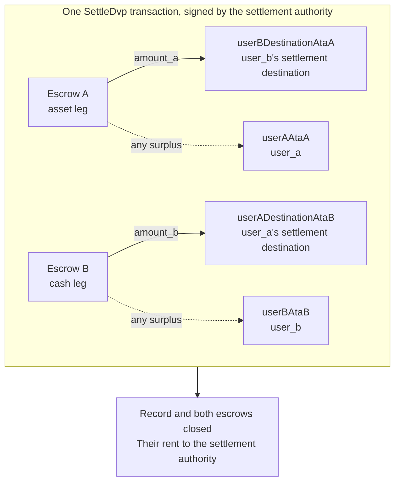

`SettleDvp` é assinada pela autoridade de liquidação indicada no registro da
negociação. Em uma única transação, move `amount_a` da perna de ativo para o
destino da parte da perna de dinheiro e `amount_b` da perna de dinheiro para o
destino da parte da perna de ativo, devolve qualquer excedente de qualquer um
dos escrows à parte da respectiva perna e fecha o registro e ambos os escrows.
Se alguma dessas transferências não puder ser concluída, a instrução falha e
nada é movimentado.

Esta página dá continuidade a [criar uma negociação](/docs/defi/dvp-program/create-a-trade)
e [financiar as pernas](/docs/defi/dvp-program/fund-the-legs); o cliente, os signatários,
`trade` e as token accounts das partes são reaproveitados.

## Revalidar antes de assinar

A autoridade de liquidação assina a transação que movimenta ambas as pernas,
portanto realiza a mesma leitura que cada parte faz antes de assinar:
proprietário, tamanho, partes, mints, valores, expiração e ambos os destinos
(consulte [financiar as pernas](/docs/defi/dvp-program/fund-the-legs#verify-the-terms)). O
prórprio programa reverifica, na liquidação, que cada mint ainda pertence ao
token program registrado na criação, não possui nenhuma extensão bloqueada e
tem a mesma autoridade de mint de quando a negociação foi criada; assim, um
mint recriado com uma extensão bloqueada, um token program diferente ou uma
autoridade de mint diferente não pode ser liquidado.

## Criar as contas de destino

A liquidação grava em quatro token accounts que o programa não cria:

| Conta                | Recebe                     | Proprietário                           |
| ---------------------- | ---------------------------- | ------------------------------- |
| `userADestinationAtaB` | A perna de dinheiro (`amount_b`)    | `user_a_settlement_destination` |
| `userBDestinationAtaA` | A perna de ativo (`amount_a`)   | `user_b_settlement_destination` |
| `userAAtaA`            | Qualquer excedente na perna de ativo | `user_a`                        |
| `userBAtaB`            | Qualquer excedente na perna de dinheiro  | `user_b`                        |

As token accounts de excedente só são usadas quando um escrow contém mais do que
o valor acordado, mas qualquer pessoa que possua o mint pode criar um excedente
enviando algumas unidades base para o escrow. Se a conta de reembolso não
existir, toda a liquidação falha; por isso, crie as quatro de forma idempotente
na mesma transação.

<Tabs items={["TypeScript", "Rust"]}>
  <Tab value="TypeScript">
    ```ts
    import {
      findAssociatedTokenPda,
      getCreateAssociatedTokenIdempotentInstruction,
    } from "@solana-program/token-2022";

    const destinationA = t.userASettlementDestination; // defaults to userA
    const destinationB = t.userBSettlementDestination; // defaults to userB

    const [userADestinationAtaB] = await findAssociatedTokenPda({
      mint: mintB,
      owner: destinationA,
      tokenProgram: tokenProgramB,
    });
    const [userBDestinationAtaA] = await findAssociatedTokenPda({
      mint: mintA,
      owner: destinationB,
      tokenProgram: tokenProgramA,
    });
    // userAAtaA and userBAtaB are from fund the legs.

    const createRecipientAccounts = [
      { ata: userADestinationAtaB, owner: destinationA, mint: mintB, tokenProgram: tokenProgramB },
      { ata: userBDestinationAtaA, owner: destinationB, mint: mintA, tokenProgram: tokenProgramA },
      { ata: userAAtaA, owner: userA, mint: mintA, tokenProgram: tokenProgramA },
      { ata: userBAtaB, owner: userB, mint: mintB, tokenProgram: tokenProgramB },
    ].map(({ ata, owner, mint, tokenProgram }) =>
      getCreateAssociatedTokenIdempotentInstruction({
        payer: authoritySigner,
        ata,
        owner,
        mint,
        tokenProgram,
      }),
    );
    ```

  </Tab>

  <Tab value="Rust">
    ```rust
    use spl_associated_token_account_client::address::get_associated_token_address_with_program_id;
    use spl_associated_token_account_client::instruction::create_associated_token_account_idempotent;

    let authority: Pubkey = pubkey!("SETTLEMENT_AUTHORITY_ADDRESS_HERE");
    let destination_a = trade.user_a_settlement_destination; // defaults to user_a
    let destination_b = trade.user_b_settlement_destination; // defaults to user_b

    let user_a_destination_ata_b =
        get_associated_token_address_with_program_id(&destination_a, &mint_b, &token_program_b);
    let user_b_destination_ata_a =
        get_associated_token_address_with_program_id(&destination_b, &mint_a, &token_program_a);
    let user_a_ata_a = get_associated_token_address_with_program_id(&user_a, &mint_a, &token_program_a);
    let user_b_ata_b = get_associated_token_address_with_program_id(&user_b, &mint_b, &token_program_b);

    let create_recipient_accounts = [
        create_associated_token_account_idempotent(&authority, &destination_a, &mint_b, &token_program_b),
        create_associated_token_account_idempotent(&authority, &destination_b, &mint_a, &token_program_a),
        create_associated_token_account_idempotent(&authority, &user_a, &mint_a, &token_program_a),
        create_associated_token_account_idempotent(&authority, &user_b, &mint_b, &token_program_b),
    ];
    ```

  </Tab>
</Tabs>

## Liquidar

`legAExtrasCount` informa ao programa quantas das contas anexadas após a lista
fixa pertencem ao transfer hook da transferência da perna de ativo; as demais
pertencem ao da perna de dinheiro. Para mints sem transfer hooks, passe zero e
não anexe nada. A program account do memo é exigida pela instrução e é usada
apenas para destinos que exigem um memo.

<Tabs items={["TypeScript", "Rust"]}>
  <Tab value="TypeScript">
    ```ts
    import { MEMO_PROGRAM_ADDRESS } from "@solana-program/memo";
    import { getSettleDvpInstruction } from "./dvp";

    const settleInstruction = getSettleDvpInstruction({
      settlementAuthority: authoritySigner,
      swapDvp,
      mintA,
      mintB,
      dvpAtaA: escrowA,
      dvpAtaB: escrowB,
      userADestinationAtaB,
      userBDestinationAtaA,
      userAAtaA,
      userBAtaB,
      tokenProgramA,
      tokenProgramB,
      memoProgram: MEMO_PROGRAM_ADDRESS,
      legAExtrasCount: 0,
    });

    const { context: settleContext } = await client.sendTransaction([
      ...createRecipientAccounts,
      settleInstruction,
    ]);
    const settleSignature = settleContext.signature;
    console.log("Submitted:", settleSignature);

    // sendTransaction returns at the client's commitment (confirmed by default).
    // Wait for finalized before recording the trade as settled.
    let finalized = false;
    for (let attempt = 0; attempt < 30 && !finalized; attempt++) {
      const {
        value: [status],
      } = await client.rpc.getSignatureStatuses([settleSignature]).send();
      if (status?.err) {
        throw new Error("Settle transaction failed");
      }
      finalized = status?.confirmationStatus === "finalized";
      if (!finalized) {
        await new Promise((resolve) => setTimeout(resolve, 2_000));
      }
    }
    if (!finalized) {
      // A closed record means it settled; an open one is safe to settle again.
      throw new Error("Settle not finalized after 60s; read the trade record");
    }
    console.log("Settled:", settleSignature);
    ```

  </Tab>

  <Tab value="Rust">
    ```rust
    use dvp_swap_program_client::instructions::SettleDvpBuilder;

    const MEMO_PROGRAM_ID: Pubkey = pubkey!("MemoSq4gqABAXKb96qnH8TysNcWxMyWCqXgDLGmfcHr");

    let settle_ix = SettleDvpBuilder::new()
        .settlement_authority(authority)
        .swap_dvp(swap_dvp)
        .mint_a(mint_a)
        .mint_b(mint_b)
        .dvp_ata_a(escrow_a)
        .dvp_ata_b(escrow_b)
        .user_a_destination_ata_b(user_a_destination_ata_b)
        .user_b_destination_ata_a(user_b_destination_ata_a)
        .user_a_ata_a(user_a_ata_a)
        .user_b_ata_b(user_b_ata_b)
        .token_program_a(token_program_a)
        .token_program_b(token_program_b)
        .memo_program(MEMO_PROGRAM_ID)
        .leg_a_extras_count(0)
        .instruction();
    ```

  </Tab>
</Tabs>



### Transfer hooks

O IDL gerado lista apenas as contas fixas, portanto os builders gerados não
conhecem as contas dos hooks. Resolva as extra account metas de cada mint com
hook da mesma forma que faria para uma transferência direta desse token e, em
seguida, anexe-as à instrução: primeiro as contas da perna de ativo, depois as
da perna de dinheiro, com `legAExtrasCount` definido com o número do primeiro
grupo. Em TypeScript, distribua (spread) as metas resolvidas no array `accounts`
da instrução; em Rust, use `add_remaining_accounts` no builder. O limite é de 32
contas por perna, incluindo o programa do hook e a conta de validação; o limite
de contas da transação pode ser atingido primeiro quando ambas as pernas têm
hooks. O programa remove o sinalizador de signatário de toda conta encaminhada,
de modo que um hook não consegue obter a assinatura da autoridade de liquidação
por esse caminho.

## Registrar o resultado

Considere a negociação liquidada quando a transação de liquidação atingir
`finalized`. O registro e ambos os escrows deixam de existir após a liquidação;
portanto, um sistema que precise dos termos posteriormente deve armazená-los a
partir da leitura anterior à liquidação ou da transação de criação. O rent das
contas encerradas foi para a autoridade de liquidação.

## Erros de liquidação

`LegNotFunded` significa que um escrow contém menos do que o valor acordado;
`DvpExpired` e `SettlementTooEarly` significam que a janela de tempo foi
perdida; `MintAuthorityChanged` e `BlockedMintExtension` significam que um mint
mudou após a criação; `RecipientAtaMismatch` significa que uma token account de
destino ou de reembolso está ausente ou não pertence mais ao proprietário e ao
mint esperados, geralmente porque a etapa de criação de contas acima foi
ignorada. Em todos os casos, nada foi movimentado e as partes podem desfazer a
operação, sujeitas às autoridades do mint (consulte
[desfazer uma negociação](/docs/defi/dvp-program/unwind-a-trade)).

## Próximos passos

- [Desfazer uma negociação](/docs/defi/dvp-program/unwind-a-trade): recuperar as
  pernas financiadas quando uma negociação não é liquidada
