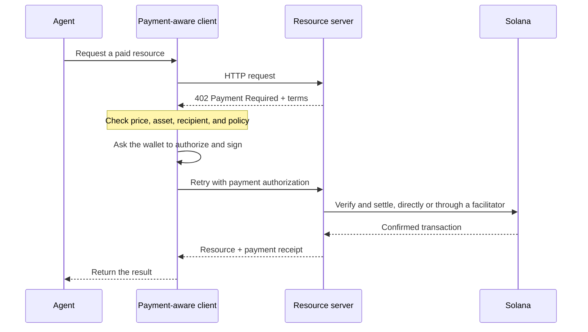

Os pagamentos agênticos permitem que um software descubra um preço, autorize um pagamento e receba
um recurso no mesmo fluxo HTTP. Um agente pode pagar por uma consulta de dados, uma inferência de
modelo ou uma chamada de ferramenta sem precisar criar primeiro uma conta de faturação nem copiar uma
chave de API.

<Cards>
  <Card title="MPP" href="/docs/payments/agentic-payments/mpp">
    Use a autenticação HTTP para cobranças únicas e sessões de pagamento medidas.
  </Card>
  <Card title="x402" href="/docs/payments/agentic-payments/x402">
    Adicione requisitos de pagamento, assinaturas e liquidação do x402 V2 a um
    recurso HTTP.
  </Card>
</Cards>

## O fluxo de pagamento comum

O MPP e o x402 usam cabeçalhos e modelos de dados diferentes, mas o fluxo HTTP básico é
semelhante:

## MPP e x402

Ambos os protocolos podem liquidar pagamentos em stablecoins na Solana. Escolha com base no
modelo de pagamento e na interoperabilidade de que o seu serviço precisa, e não apenas no código de
estado `402` em comum.

|                         | MPP                                                               | x402                                                                     |
| ----------------------- | ----------------------------------------------------------------- | ------------------------------------------------------------------------ |
| Desafio               | `WWW-Authenticate: Payment`                                       | `PAYMENT-REQUIRED`                                                       |
| Autorização do cliente    | `Authorization: Payment`                                          | `PAYMENT-SIGNATURE`                                                      |
| Recibo                 | `Payment-Receipt`                                                 | `PAYMENT-RESPONSE`                                                       |
| Modelos de pagamento na Solana   | Intenções `charge` (cobrança única) e `session` (sessão medida com limite)           | Esquemas como `exact` e `upto`; o suporte varia consoante a rede e o cliente |
| Arquitetura de liquidação | Validação no servidor, ou um relay ou gateway opcional                | Servidor de recursos com verificação local ou um facilitator                 |
| Bom ponto de partida     | APIs que precisam da semântica de autenticação HTTP ou de medição repetida | Recursos com pagamento por pedido e clientes x402 existentes                      |

O MPP é o **Machine Payments Protocol**. Não o confunda com o **Model
Context Protocol (MCP)**. O MCP expõe ferramentas e recursos aos agentes; o MPP ou o x402
podem exigir pagamento quando um agente invoca uma dessas ferramentas.

<Callout type="info">
  Um serviço pode anunciar mais do que um protocolo. O cliente seleciona uma opção de pagamento
  que suporte e, em seguida, usa os cabeçalhos de desafio, autorização e
  recibo correspondentes durante toda a troca.
</Callout>
