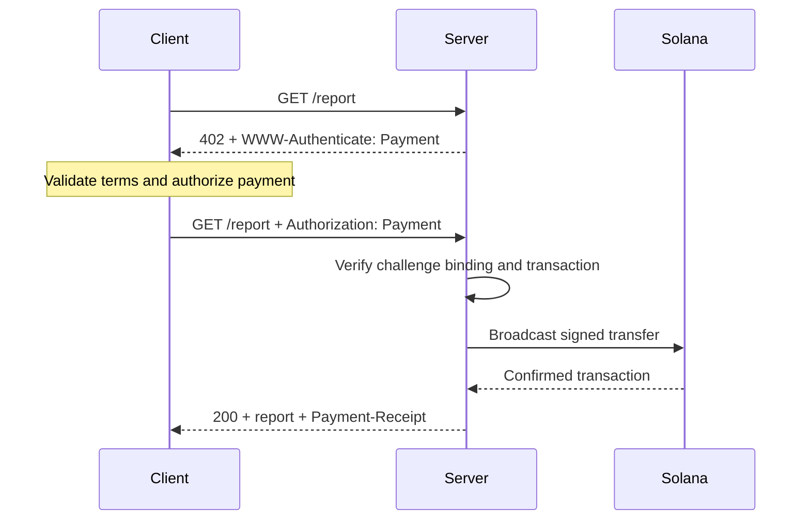
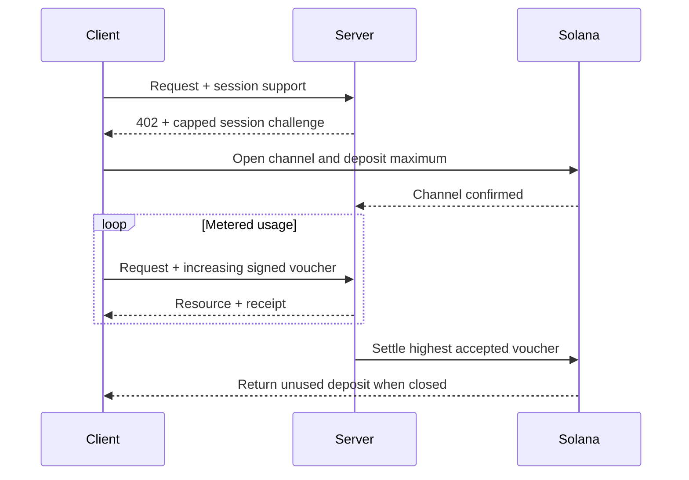

O [Machine Payments Protocol (MPP)](https://mpp.dev/) aplica a semântica de autenticação HTTP aos pagamentos. Um servidor lança um desafio a uma requisição não paga, um
cliente devolve uma credencial de pagamento e o servidor retorna um recibo depois de
aceitar o pagamento.

O MPP separa três responsabilidades:

- Uma **intenção** descreve a interação comercial, como uma
  cobrança única (`charge`) ou uma sessão medida (`session`).
- Um **método de pagamento** descreve como o valor é movimentado. O método da Solana suporta
  SOL nativo e tokens SPL para cobranças.
- Um **transporte** HTTP transporta desafios, credenciais, recibos e erros.

O MPP é publicado como um conjunto de Internet-Drafts. Trate as
[especificações atuais](https://paymentauth.org/) como a fonte da verdade e
esteja preparado para que os detalhes evoluam enquanto os rascunhos estiverem em andamento.

## Troca HTTP

O MPP usa campos padrão de autenticação HTTP em vez de cabeçalhos de
pagamento específicos do protocolo:

| Mensagem                 | Representação HTTP                                         |
| ----------------------- | ----------------------------------------------------------- |
| Desafio de pagamento       | `402 Payment Required` com `WWW-Authenticate: Payment ...` |
| Credencial de pagamento      | Requisição repetida com `Authorization: Payment ...`           |
| Recibo de sucesso      | Resposta do recurso com `Payment-Receipt: ...`               |
| Dados de pagamento inválidos | Corpo Problem Details usando `application/problem+json`       |



Um desafio inclui um ID gerado pelo servidor, realm, método, intenção, requisição de
pagamento codificada e validade. A credencial repete o desafio e adiciona a
prova de pagamento específica do método. O servidor deve verificar ambas as partes; uma
transferência válida que pertença a um desafio diferente não deve liberar o recurso.

## Cobranças únicas na Solana

A intenção `charge` da Solana suporta dois tipos de credencial:

- O **modo pull** usa uma transação assinada. O cliente assina a transferência e
  envia a transação ao servidor. O servidor a verifica, opcionalmente adiciona uma
  assinatura de pagador de taxas, transmite, confirma e retorna a assinatura da
  transação em seu recibo.
- O **modo push** usa uma assinatura de transação. O cliente transmite primeiro e depois
  envia a assinatura confirmada ao servidor. O servidor busca e verifica
  a transação antes de retornar o recurso.

O modo pull permite o patrocínio das taxas de transação pelo servidor e lógica de nova tentativa no lado do servidor.
O modo push é útil quando uma carteira exige que o cliente envie a própria
transação, mas não pode usar o patrocínio de taxas do servidor.

Para os campos normativos e as regras de verificação, consulte a
[especificação de cobrança da Solana](https://paymentauth.org/draft-solana-charge-00.html).

## Adicione uma cobrança MPP a uma API Express

O Solana Pay Kit oferece uma integração TypeScript atual para MPP e x402.
Instale-o com o Express:

```bash
pnpm add @solana/pay-kit @solana/kit@^6.9.0 express
pnpm add --save-dev @types/express tsx
```

Este exemplo mínimo usa o sandbox Surfpool hospedado e o destinatário de
demonstração público do pacote. Ele serve apenas para desenvolvimento local:

```ts filename=server.ts
import express from "express";
import { createPayKit, usd } from "@solana/pay-kit";

const pay = await createPayKit({
  accept: ["mpp"],
  rpcUrl: "https://402.surfnet.dev:8899"
});

const app = express();

app.get("/report", pay.express(usd("0.01")), (_req, res) => {
  res.json({ report: "Paid report" });
});

app.listen(4567, () => {
  console.log("Paid API listening on http://127.0.0.1:4567");
});
```

Execute-o e compare uma requisição não paga com uma requisição com pagamento:

```bash
pnpm tsx server.ts
curl -i http://127.0.0.1:4567/report
pay --sandbox curl http://127.0.0.1:4567/report
```

O manipulador de rota só é executado depois que o middleware aceita o pagamento.

<Callout type="warn" title="Substitua todos os padrões do sandbox em produção">
  Configure uma rede explícita, o destinatário do comerciante, um RPC dedicado, um segredo
  estável de vinculação de desafios, um assinante de produção e um armazenamento durável de prevenção de repetição. Nunca
  direcione pagamentos reais para um assinante de demonstração do pacote.
</Callout>

## Sessões medidas

Use uma `session` MPP da Solana quando um cliente fizer muitos pagamentos pequenos e relacionados.
Uma sessão abre um canal de pagamento onchain com um depósito máximo e depois usa
vouchers assinados cumulativos conforme o uso cresce. O servidor pode verificar os vouchers
offchain e liquidar mais tarde o maior valor aceito.

Isso é útil para inferência medida por tokens, downloads medidos por bytes, dados em tempo real
e chamadas repetidas de ferramentas. Não é o mesmo que enviar um pagamento
onchain separado para cada evento.



Chame uma sessão de **pagamento de sessão**, **canal de pagamento** ou **autorização repetida
com limite**. Só a chame de pagamento em fluxo contínuo (streaming) quando o serviço e o contrato
de pagamento realmente medirem um fluxo de uso.

## Verificação em produção

Para cada cobrança na Solana, o servidor deve verificar no mínimo:

- O desafio é autêntico, não expirou, está vinculado a esta requisição e destinado a
  este realm.
- A transação usa a rede, o ativo ou mint, o destinatário, o valor
  e o programa de tokens esperados.
- Quaisquer instruções de pagador de taxas ou de associated token account são explicitamente
  permitidas e não podem esgotar os fundos do assinante do servidor.
- A transação foi bem-sucedida no nível de commitment exigido.
- A assinatura da transação ainda não foi consumida.
- A verificação de repetição e a operação de consumo são atômicas em todas as instâncias do servidor.

Para sessões, persista também o estado do canal, o valor cumulativo aceito e a
marca d'água de liquidação em um armazenamento compartilhado. Documente como os clientes recuperam os fundos
não utilizados se o servidor ficar indisponível.

## Recursos relacionados

- [Especificações do MPP](https://paymentauth.org/)
- [Documentação do protocolo MPP](https://mpp.dev/protocol)
- [Solana Pay Kit](https://github.com/solana-foundation/pay-kit)
- [Visão geral dos pagamentos agênticos](/docs/payments/agentic-payments)
- [Prontidão para produção](/docs/tools/production-readiness)
