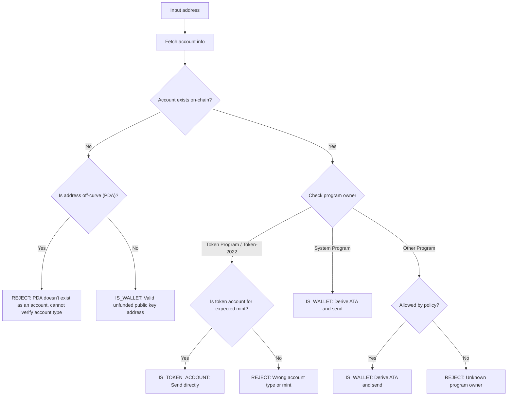

Enviar tokens para o endereço errado pode resultar em perda permanente de
fundos. A verificação de endereço garante que você envie tokens apenas para
endereços que possam recebê-los e acessá-los adequadamente.

<Callout>
  Consulte [Como funcionam os pagamentos na
  Solana](/docs/payments/how-payments-work) para conceitos fundamentais de
  pagamento.
</Callout>

## Compreendendo endereços Solana

As contas Solana têm dois tipos de endereços: on-curve e off-curve.

### Endereços on-curve

Endereços padrão são as chaves públicas de pares de chaves Ed25519. Estes
endereços:

- Têm uma chave privada correspondente que pode assinar transações
- São usados como endereços de carteira

### Endereços off-curve (PDAs)

[Program Derived Addresses](/docs/core/pda) são derivados deterministicamente de
um ID de programa e seeds. Estes endereços:

- **Não** têm uma chave privada correspondente
- Só podem ser assinados pelo programa do qual o endereço foi derivado

## Tipos de conta em pagamentos

Use o endereço para buscar uma [conta](/docs/core/accounts) da rede, verifique o
proprietário do programa e o tipo de conta para determinar como lidar com o
endereço.

<Callout>
  Saber se um endereço é on-curve ou off-curve não indica qual tipo de conta é,
  qual programa a possui ou se existe uma conta nesse endereço. Você deve buscar
  a conta da rede para determinar esses detalhes.
</Callout>

### Contas do System Program (carteiras)

Contas pertencentes ao System Program são carteiras padrão. Para enviar tokens
SPL para uma carteira, você deriva e usa sua
[associated token account (ATA)](/docs/tokens/basics/create-token-account#whats-an-associated-token-account).

Após derivar o endereço ATA, verifique se a token account existe on-chain. Se a
ATA não existir, você pode incluir uma instrução para criar a token account do
destinatário na mesma transação da transferência. No entanto, isso requer pagar
rent pela nova token account. Como o destinatário possui a ATA, o SOL pago pelo
rent não pode ser recuperado pelo remetente.

<Callout type="warn">
  Sem salvaguardas, subsidiar a criação de ATA pode ser explorado. Um utilizador
  malicioso poderia solicitar uma transferência, ter o seu ATA criado às suas
  custas, fechar o ATA para recuperar o SOL de rent e repetir.
</Callout>

### Token accounts

[Token accounts](/docs/tokens/basics/create-token-account) são propriedade do
Token Program ou Token-2022 Program e armazenam saldos de tokens. Se o endereço
que recebe é propriedade de um token program, deve verificar se a conta é uma
token account (não uma mint account) e corresponde à mint account de token
esperada antes de enviar.

<Callout type="info">
  Os Token Programs validam automaticamente que ambas as token accounts numa
  transferência contêm tokens da mesma mint. Se a validação falhar, a transação
  é rejeitada e nenhum fundo é perdido.
</Callout>

### Mint accounts

[Mint accounts](/docs/tokens/basics/create-mint) rastreiam a oferta de tokens e
metadados de um token específico. Mint accounts também são propriedade dos Token
Programs mas **não** são destinatários válidos para transferências de tokens.
Tentar enviar tokens para um endereço de mint resulta numa transação falhada,
mas nenhum fundo é perdido.

### Outras contas

Contas propriedade de outros programas requerem uma decisão de política. Algumas
contas (por exemplo, carteiras multisig) podem ser proprietários válidos de
token accounts, enquanto outras devem ser rejeitadas.

## Fluxo de verificação

O diagrama seguinte mostra uma árvore de decisão de referência para validar um
endereço:



<Steps>
<Step>

### Obter conta

Use o endereço para obter os detalhes da conta da rede.

</Step>
<Step>

### A conta não existe

Se não existir nenhuma conta neste endereço, verifique se o endereço está
on-curve ou off-curve:

- **Fora da curva (PDA)**: Rejeite conservadoramente o endereço para evitar
  enviar para uma ATA que pode estar inacessível. Sem uma conta existente, você
  não pode determinar apenas pelo endereço qual programa derivou este PDA ou se
  o endereço é para uma ATA. Derivar uma ATA para este endereço para enviar
  tokens pode resultar em fundos bloqueados numa conta de token inacessível.

- **Na curva**: Este é um endereço de carteira válido (chave pública) que ainda
  não foi financiado. Derive a ATA, verifique se ela existe e envie tokens para
  ela. Você deve tomar uma decisão de política sobre se deve financiar a criação
  da ATA se ela não existir.

</Step>
<Step>

### A conta existe

Se uma conta existe, verifique qual programa a possui:

- **System Program**: Esta é uma carteira padrão. Derive a ATA, verifique se ela
  existe e envie tokens para ela. Você deve tomar uma decisão de política sobre
  se deve financiar a criação da ATA se ela não existir.

- **Token Program / Token-2022**: Verifique se a conta é uma conta de token (não
  uma mint account) e que ela detém o token (mint) que você pretende enviar. Se
  válida, envie tokens diretamente para este endereço. Se for uma mint account
  ou uma conta de token para um mint diferente, rejeite o endereço.

- **Outro programa**: Isto requer uma decisão de política. Alguns programas como
  carteiras multisig podem ser proprietários aceitáveis de contas de token. Se a
  sua política permitir, derive a ATA e envie. Caso contrário, rejeite o
  endereço.

</Step>
</Steps>

## Demonstração

O exemplo seguinte mostra apenas a lógica de validação de endereço. Este é
código de referência para fins ilustrativos.

<Callout>
  A demonstração não mostra como derivar uma ATA ou construir uma transação para
  enviar tokens. Consulte a documentação de [conta de
  token](/docs/tokens/basics/create-token-account#how-to-create-an-associated-token-account)
  e [transferência de token](/docs/tokens/basics/transfer-tokens) para exemplos
  de código.
</Callout>

A demonstração abaixo usa três resultados possíveis:

| Resultado          | Significado                 | Ação                                           |
| ------------------ | --------------------------- | ---------------------------------------------- |
| `IS_WALLET`        | Endereço de carteira válido | Derivar e enviar para associated token account |
| `IS_TOKEN_ACCOUNT` | Token account válida        | Enviar tokens diretamente para este endereço   |
| `REJECT`           | Endereço inválido           | Não enviar                                     |

<CodeTabs flags="r">

```ts !! title="Demo"
// !collapse(1:35) collapsed

import {
  type Address,
  type Rpc,
  type GetAccountInfoApi,
  createSolanaRpc,
  fetchJsonParsedAccount,
  isOffCurveAddress,
  generateKeyPairSigner,
  getProgramDerivedAddress
} from "@solana/kit";

// =============================================================================
// Constants
// =============================================================================

const defaultRpc = createSolanaRpc("https://api.mainnet-beta.solana.com");

const SYSTEM_PROGRAM = "11111111111111111111111111111111" as Address;
const TOKEN_PROGRAM = "TokenkegQfeZyiNwAJbNbGKPFXCWuBvf9Ss623VQ5DA" as Address;
const TOKEN_2022_PROGRAM =
  "TokenzQdBNbLqP5VEhdkAS6EPFLC1PHnBqCXEpPxuEb" as Address;

// =============================================================================
// Validation Function
// =============================================================================

/**
 * Possible validation results for an input address.
 */
export type ValidationResult =
  | { type: "IS_TOKEN_ACCOUNT" }
  | { type: "IS_WALLET" }
  | { type: "REJECT"; reason: string };

/**
 * Validates an input address and classifies it as a wallet, token account, or invalid.
 *
 * @param inputAddress - The address to validate
 * @param rpc - Optional RPC client (defaults to mainnet)
 * @returns Classification result:
 *   - IS_WALLET: Valid wallet address
 *   - IS_TOKEN_ACCOUNT: Valid token account
 *   - REJECT: Invalid address for transfers
 */
export async function validateAddress(
  inputAddress: Address,
  rpc: Rpc<GetAccountInfoApi> = defaultRpc
): Promise<ValidationResult> {
  const account = await fetchJsonParsedAccount(rpc, inputAddress);
  // Log the account data for demo
  console.log("\nAccount:", account);

  // Account doesn't exist on-chain
  if (!account.exists) {
    // Off-curve = PDA that doesn't exist as an account
    // Reject conservatively to avoid sending to an address that may be inaccessible.
    if (isOffCurveAddress(inputAddress)) {
      return { type: "REJECT", reason: "PDA doesn't exist as an account" };
    }
    // On-curve = valid keypair address, treat as unfunded wallet
    return { type: "IS_WALLET" };
  }

  // Account exists, check program owner
  const owner = account.programAddress;

  // System Program = wallet
  if (owner === SYSTEM_PROGRAM) {
    return { type: "IS_WALLET" };
  }

  // Token Program or Token-2022, check if token account
  if (owner === TOKEN_PROGRAM || owner === TOKEN_2022_PROGRAM) {
    const accountType = (
      account.data as { parsedAccountMeta?: { type?: string } }
    ).parsedAccountMeta?.type;

    if (accountType === "account") {
      return { type: "IS_TOKEN_ACCOUNT" };
    }
    // Reject if not a token account (mint account)
    return {
      type: "REJECT",
      reason: "Not a token account"
    };
  }

  // Unknown program owner
  return { type: "REJECT", reason: "Unknown program owner" };
}

// =============================================================================
// Examples
// =============================================================================
// !collapse(1:1000) collapsed

// Wallets
const EXISTING_WALLET =
  "H8sMJSCQxfKiFTCfDR3DUMLPwcRbM61LGFJ8N4dK3WjS" as Address;
const NEW_WALLET = (await generateKeyPairSigner()).address;

// Token accounts
const USDC_TOKEN_ACCOUNT =
  "3emsAVdmGKERbHjmGfQ6oZ1e35dkf5iYcS6U4CPKFVaa" as Address;
const PYUSD_TOKEN_ACCOUNT =
  "47od2TPRvqJipfPVWZdyenLEngPw8hC36nDxiLyvGsEP" as Address;

// Token mints (should be rejected)
const USDC_MINT = "EPjFWdd5AufqSSqeM2qN1xzybapC8G4wEGGkZwyTDt1v" as Address;
const PYUSD_MINT = "2b1kV6DkPAnxd5ixfnxCpjxmKwqjjaYmCZfHsFu24GXo" as Address;

// PDA that doesn't exist (should be rejected)
const [NON_EXISTENT_PDA] = await getProgramDerivedAddress({
  programAddress: (await generateKeyPairSigner()).address,
  seeds: ["seed"]
});

// Program account (should be rejected)
const PROGRAM_ACCOUNT =
  "p1exdMJcjVao65QdewkaZRUnU6VPSXhus9n2GzWfh98" as Address;

async function runExample(label: string, address: Address) {
  console.log(`\n${"─".repeat(60)}`);
  console.log(`Example: ${label}`);
  console.log(`Input: ${address}`);
  console.log(`${"─".repeat(60)}`);

  const result = await validateAddress(address);
  console.log("\nResult:", result);
}

console.log("\n" + "═".repeat(60));
console.log("  IS_WALLET Examples");
console.log("═".repeat(60));

await runExample("Existing funded wallet", EXISTING_WALLET);
await runExample("New wallet (unfunded)", NEW_WALLET);

console.log("\n" + "═".repeat(60));
console.log("  IS_TOKEN_ACCOUNT Examples");
console.log("═".repeat(60));

await runExample("USDC token account (Token Program)", USDC_TOKEN_ACCOUNT);
await runExample("PYUSD token account (Token-2022)", PYUSD_TOKEN_ACCOUNT);

console.log("\n" + "═".repeat(60));
console.log("  REJECT Examples");
console.log("═".repeat(60));

await runExample("USDC mint address", USDC_MINT);
await runExample("PYUSD mint address", PYUSD_MINT);
await runExample("Non-existent PDA", NON_EXISTENT_PDA);
await runExample("Program account", PROGRAM_ACCOUNT);

console.log("\n" + "═".repeat(60));
console.log("  Done!");
console.log("═".repeat(60) + "\n");
```

</CodeTabs>
