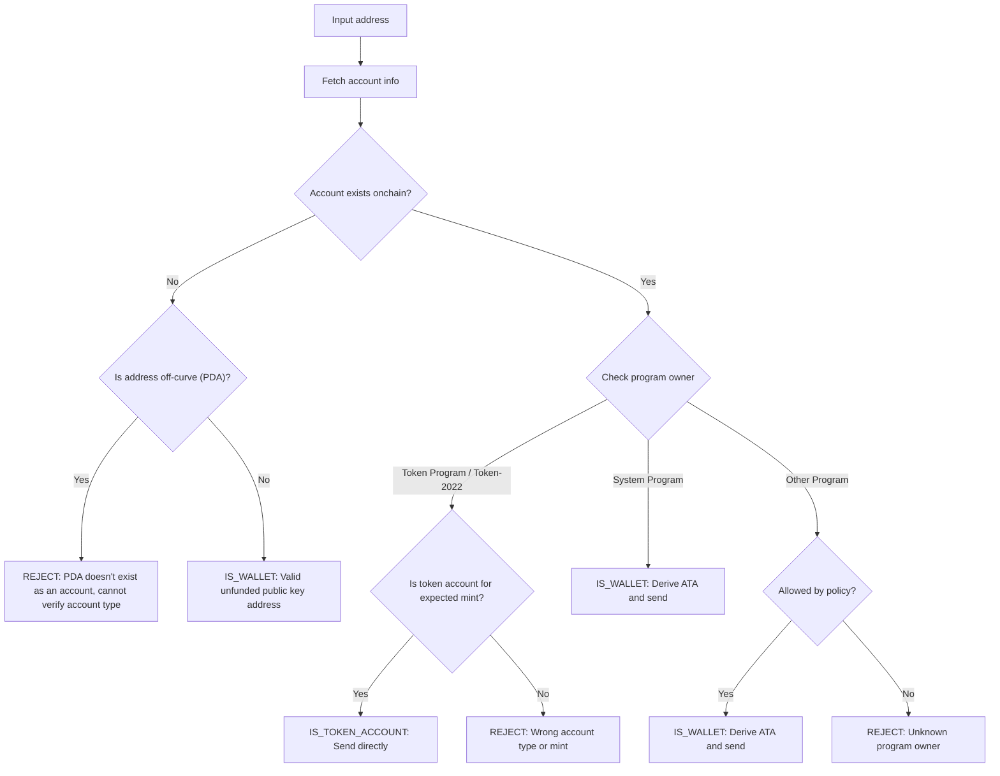

Enviar fundos para o endereço errado pode resultar em perda permanente. A
verificação de endereços garante que você envie apenas para endereços que possam
receber e acessar os fundos corretamente.

A validação depende do que você envia:

- **Tokens SPL** são parcialmente autoprotegidos. O Token Program rejeita uma
  transferência cujas contas não correspondem ao mint esperado, portanto, uma
  transferência de token mal direcionada falha sem perda de fundos. A maior
  parte desta página aborda o envio de tokens SPL.
- **SOL nativo** não possui essa proteção. Uma transferência do System Program é
  bem-sucedida em qualquer conta, portanto, um destinatário incorreto bloqueia o
  SOL permanentemente. Consulte [Enviando SOL nativo](#sending-native-sol).

<Callout>
  Consulte [Como os Pagamentos Funcionam na
  Solana](/docs/payments/how-payments-work) para os conceitos básicos de
  pagamento.
</Callout>

## Entendendo os Endereços da Solana

As contas da Solana têm dois tipos de endereços: na curva e fora da curva.

### Endereços na Curva

Os endereços padrão são as chaves públicas de keypairs Ed25519. Esses endereços:

- Possuem uma chave privada correspondente que pode assinar transações
- São usados como endereços de carteira

### Endereços Fora da Curva (PDAs)

[Program Derived Addresses](/docs/core/pda) são derivados deterministicamente de
um ID de programa e seeds. Esses endereços:

- **Não** possuem uma chave privada correspondente
- Só podem ser assinados pelo programa do qual o endereço foi derivado

## Tipos de Conta em Pagamentos

Use o endereço para buscar uma [conta](/docs/core/accounts) na rede, verifique o
proprietário do programa e o tipo de conta para determinar como tratar o
endereço.

<Callout>
  Saber se um endereço está na curva ou fora da curva não indica o tipo de conta
  que é, qual programa a detém, nem se existe uma conta nesse endereço. Você
  deve buscar a conta na rede para determinar esses detalhes.
</Callout>

### Contas do System Program (Carteiras)

Contas pertencentes ao System Program são carteiras padrão. Para enviar tokens
SPL para uma carteira, você deriva e usa sua
[Conta de Token Associada (ATA)](/docs/tokens/basics/create-token-account#whats-an-associated-token-account).

Após derivar o endereço da ATA, verifique se o token account existe onchain. Se
a ATA não existir, você pode incluir uma instrução para criar o token account do
destinatário na mesma transação que a transferência. No entanto, isso exige o
pagamento de rent para o novo token account. Como o destinatário é o dono da
ATA, o SOL pago pelo rent não pode ser recuperado pelo remetente.

<Callout type="warn">
  Sem medidas de proteção, subsidiar a criação de ATAs pode ser explorado. Um
  usuário mal-intencionado poderia solicitar uma transferência, ter sua ATA
  criada às suas custas, encerrar a ATA para recuperar o rent em SOL e repetir o
  processo.
</Callout>

### Token Accounts

Os [token accounts](/docs/tokens/basics/create-token-account) pertencem ao Token
Program ou ao Token-2022 Program e armazenam saldos de tokens. Se o endereço que
você receber pertencer a um token program, você deve verificar se a conta é um
token account (e não um mint account) e se corresponde ao mint account do token
esperado antes de enviar.

<Callout type="info">
  Os Token Programs validam automaticamente que ambos os token accounts em uma
  transferência contêm tokens do mesmo mint. Se a validação falhar, a transação
  é rejeitada e nenhum fundo é perdido.
</Callout>

### Mint Accounts

Os [mint accounts](/docs/tokens/basics/create-mint) rastreiam o fornecimento de
tokens e os metadados de um token específico. Os mint accounts também pertencem
aos Token Programs, mas **não** são destinatários válidos para transferências de
tokens. Tentar enviar tokens para um endereço de mint resulta em uma transação
com falha, mas nenhum fundo é perdido.

### Outras Contas

Contas pertencentes a outros programas exigem uma decisão de política. Algumas
contas (por exemplo, carteiras multisig) podem ser proprietárias válidas de
token account, enquanto outras devem ser rejeitadas.

## Enviando SOL nativo

A classificação acima determina para onde os tokens SPL podem ir. O SOL nativo é
mais restritivo: o único destinatário seguro é uma **carteira do System
Program** (ou um endereço não financiado na curva que se torna um).

Uma transferência do System Program adiciona lamports a qualquer conta,
incluindo mints, token accounts, programas e PDAs. Os lamports só podem ser
retirados pelo programa proprietário da conta, portanto, enviar SOL para um
destinatário incorreto pode resultar em fundos perdidos permanentemente.

Ao contrário de uma transferência de token SPL, a transação **não** falha quando
o destinatário é um endereço inesperado.

Ao enviar SOL nativo, apenas um resultado `IS_WALLET` é aceitável.
`IS_TOKEN_ACCOUNT` **não é**: uma token account armazena tokens SPL, e o SOL
enviado para lá fica fora do controle do remetente.

<Callout type="warn">
  Esta é uma forma comum de perder SOL: um usuário cola o endereço mint de um
  token (ou um endereço de programa) em um saque de SOL. A transferência é
  concluída e o SOL não pode ser recuperado. Sempre classifique o destinatário
  antes de assinar uma transferência de SOL.
</Callout>

## Fluxo de Verificação

O diagrama a seguir mostra uma árvore de decisão de referência para validar um
endereço:


```mermaid title="Address Verification Flow"
flowchart TD
    A["Input address"]
    B["Fetch account info"]

    A --> B
    B --> C{"Account exists onchain?"}

    %% --- Non-existent account path ---
    C -- "No" --> D{"Is address off-curve (PDA)?"}
    D -- "Yes" --> R1["REJECT: PDA doesn't exist as an account, cannot verify account type"]
    D -- "No" --> W1["IS_WALLET: Valid unfunded public key address"]

    %% --- Existing account path ---
    C -- "Yes" --> F{"Check program owner"}

    F -- "Token Program / Token-2022" --> G{"Is token account for expected mint?"}
    G -- "Yes" --> T1["IS_TOKEN_ACCOUNT: Send directly"]
    G -- "No" --> R2["REJECT: Wrong account type or mint"]

    F -- "System Program" --> W2["IS_WALLET: Derive ATA and send"]

    F -- "Other Program" --> K{"Allowed by policy?"}
    K -- "Yes" --> W3["IS_WALLET: Derive ATA and send"]
    K -- "No" --> R3["REJECT: Unknown program owner"]
```

<Steps>
<Step>

### Buscar conta

Use o endereço para buscar os detalhes da conta na rede.

</Step>
<Step>

### A conta não existe

Se nenhuma conta existir neste endereço, verifique se o endereço está na curva
ou fora da curva:

- **Fora da curva (PDA)**: Rejeite o endereço de forma conservadora para evitar
  o envio para uma ATA que pode estar inacessível. Sem uma conta existente, não
  é possível determinar apenas pelo endereço qual programa derivou este PDA ou
  se o endereço é de uma ATA. Derivar uma ATA para este endereço para enviar
  tokens pode resultar em fundos bloqueados em uma token account inacessível.

- **Na curva**: Este é um endereço de carteira válido (chave pública) que ainda
  não foi financiado. Derive o ATA, verifique se ele existe e envie tokens para
  ele. Você deve tomar uma decisão de política sobre se deve financiar a criação
  do ATA caso ele não exista.

</Step>
<Step>

### Conta existe

Se uma conta existir, verifique qual programa a possui:

- **System Program**: Esta é uma carteira padrão. Derive o ATA, verifique se ele
  existe e envie tokens para ele. Você deve tomar uma decisão de política sobre
  se deve financiar a criação do ATA caso ele não exista.

- **Token Program / Token-2022**: Verifique se a conta é um token account (não
  um mint account) e se ela contém o token (mint) que você pretende enviar. Se
  válido, envie tokens diretamente para este endereço. Se for um mint account ou
  um token account de um mint diferente, rejeite o endereço.

- **Outro Programa**: Isso requer uma decisão de política. Alguns programas,
  como carteiras multisig, podem ser proprietários aceitáveis de token accounts.
  Se sua política permitir, derive o ATA e envie. Caso contrário, rejeite o
  endereço.

</Step>
</Steps>

## Demo

O exemplo a seguir mostra apenas a lógica de validação de endereço. Este é um
código de referência para fins ilustrativos.

<Callout>
  A demo não mostra como derivar um ATA ou construir uma transação para enviar
  tokens. Consulte a documentação de [token
  account](/docs/tokens/basics/create-token-account#how-to-create-an-associated-token-account)
  e [transferência de tokens](/docs/tokens/basics/transfer-tokens) para exemplos
  de código.
</Callout>

A demo abaixo usa três resultados possíveis:

| Resultado          | Significado                 | Ação                                           |
| ------------------ | --------------------------- | ---------------------------------------------- |
| `IS_WALLET`        | Endereço de carteira válido | Derive e envie para o associated token account |
| `IS_TOKEN_ACCOUNT` | Token account válido        | Envie tokens diretamente para este endereço    |
| `REJECT`           | Endereço inválido           | Não enviar                                     |

Em seguida, mapeia cada resultado para a aceitabilidade por ativo com
`canReceiveNativeSol` (apenas carteiras) e `canReceiveSplToken` (carteiras ou
token accounts). Um token account retorna `IS_TOKEN_ACCOUNT`, portanto pode
receber tokens SPL, mas **não** SOL nativo — a distinção que impede o SOL de
ficar bloqueado.

<CodeTabs flags="r">

```ts !! title="Demo"
// !collapse(1:35) collapsed

import {
  type Address,
  type Rpc,
  type GetAccountInfoApi,
  createSolanaRpc,
  fetchJsonParsedAccount,
  isOffCurveAddress,
  generateKeyPairSigner,
  getProgramDerivedAddress
} from "@solana/kit";

// =============================================================================
// Constants
// =============================================================================

const defaultRpc = createSolanaRpc("https://api.mainnet-beta.solana.com");

const SYSTEM_PROGRAM = "11111111111111111111111111111111" as Address;
const TOKEN_PROGRAM = "TokenkegQfeZyiNwAJbNbGKPFXCWuBvf9Ss623VQ5DA" as Address;
const TOKEN_2022_PROGRAM =
  "TokenzQdBNbLqP5VEhdkAS6EPFLC1PHnBqCXEpPxuEb" as Address;

// =============================================================================
// Validation Function
// =============================================================================

/**
 * Possible validation results for an input address.
 */
export type ValidationResult =
  | { type: "IS_TOKEN_ACCOUNT" }
  | { type: "IS_WALLET" }
  | { type: "REJECT"; reason: string };

/**
 * Validates an input address and classifies it as a wallet, token account, or invalid.
 *
 * @param inputAddress - The address to validate
 * @param rpc - Optional RPC client (defaults to mainnet)
 * @returns Classification result:
 *   - IS_WALLET: Valid wallet address
 *   - IS_TOKEN_ACCOUNT: Valid token account
 *   - REJECT: Invalid address for transfers
 */
export async function validateAddress(
  inputAddress: Address,
  rpc: Rpc<GetAccountInfoApi> = defaultRpc
): Promise<ValidationResult> {
  const account = await fetchJsonParsedAccount(rpc, inputAddress);
  // Log the account data for demo
  console.log("\nAccount:", account);

  // Account doesn't exist onchain
  if (!account.exists) {
    // Off-curve = PDA that doesn't exist as an account
    // Reject conservatively to avoid sending to an address that may be inaccessible.
    if (isOffCurveAddress(inputAddress)) {
      return { type: "REJECT", reason: "PDA doesn't exist as an account" };
    }
    // On-curve = valid keypair address, treat as unfunded wallet
    return { type: "IS_WALLET" };
  }

  // Account exists, check program owner
  const owner = account.programAddress;

  // System Program = wallet
  if (owner === SYSTEM_PROGRAM) {
    return { type: "IS_WALLET" };
  }

  // Token Program or Token-2022, check if token account
  if (owner === TOKEN_PROGRAM || owner === TOKEN_2022_PROGRAM) {
    const accountType = (
      account.data as { parsedAccountMeta?: { type?: string } }
    ).parsedAccountMeta?.type;

    if (accountType === "account") {
      return { type: "IS_TOKEN_ACCOUNT" };
    }
    // Reject if not a token account (mint account)
    return {
      type: "REJECT",
      reason: "Not a token account"
    };
  }

  // Unknown program owner
  return { type: "REJECT", reason: "Unknown program owner" };
}

/**
 * Native SOL is only safe to send to a wallet. Any other account locks it.
 */
function canReceiveNativeSol(result: ValidationResult): boolean {
  return result.type === "IS_WALLET";
}

/**
 * SPL tokens can go to a wallet (via its ATA) or directly to a token account.
 */
function canReceiveSplToken(result: ValidationResult): boolean {
  return result.type === "IS_WALLET" || result.type === "IS_TOKEN_ACCOUNT";
}

// =============================================================================
// Examples
// =============================================================================
// !collapse(1:1000) collapsed

// Wallets
const EXISTING_WALLET =
  "H8sMJSCQxfKiFTCfDR3DUMLPwcRbM61LGFJ8N4dK3WjS" as Address;
const NEW_WALLET = (await generateKeyPairSigner()).address;

// Token accounts
const USDC_TOKEN_ACCOUNT =
  "3emsAVdmGKERbHjmGfQ6oZ1e35dkf5iYcS6U4CPKFVaa" as Address;
const PYUSD_TOKEN_ACCOUNT =
  "47od2TPRvqJipfPVWZdyenLEngPw8hC36nDxiLyvGsEP" as Address;

// Token mints (should be rejected)
const USDC_MINT = "EPjFWdd5AufqSSqeM2qN1xzybapC8G4wEGGkZwyTDt1v" as Address;
const PYUSD_MINT = "2b1kV6DkPAnxd5ixfnxCpjxmKwqjjaYmCZfHsFu24GXo" as Address;

// PDA that doesn't exist (should be rejected)
const [NON_EXISTENT_PDA] = await getProgramDerivedAddress({
  programAddress: (await generateKeyPairSigner()).address,
  seeds: ["seed"]
});

// Program account (should be rejected)
const PROGRAM_ACCOUNT =
  "p1exdMJcjVao65QdewkaZRUnU6VPSXhus9n2GzWfh98" as Address;

async function runExample(label: string, address: Address) {
  console.log(`\n${"─".repeat(60)}`);
  console.log(`Example: ${label}`);
  console.log(`Input: ${address}`);
  console.log(`${"─".repeat(60)}`);

  const result = await validateAddress(address);
  console.log("\nResult:", result);
  console.log(
    `Can receive SOL?   ${canReceiveNativeSol(result) ? "YES" : "NO"}`
  );
  console.log(
    `Can receive token? ${canReceiveSplToken(result) ? "YES" : "NO"}`
  );
}

console.log("\n" + "═".repeat(60));
console.log("  IS_WALLET Examples");
console.log("═".repeat(60));

await runExample("Existing funded wallet", EXISTING_WALLET);
await runExample("New wallet (unfunded)", NEW_WALLET);

console.log("\n" + "═".repeat(60));
console.log("  IS_TOKEN_ACCOUNT Examples");
console.log("═".repeat(60));

await runExample("USDC token account (Token Program)", USDC_TOKEN_ACCOUNT);
await runExample("PYUSD token account (Token-2022)", PYUSD_TOKEN_ACCOUNT);

console.log("\n" + "═".repeat(60));
console.log("  REJECT Examples");
console.log("═".repeat(60));

await runExample("USDC mint address", USDC_MINT);
await runExample("PYUSD mint address", PYUSD_MINT);
await runExample("Non-existent PDA", NON_EXISTENT_PDA);
await runExample("Program account", PROGRAM_ACCOUNT);

console.log("\n" + "═".repeat(60));
console.log("  Done!");
console.log("═".repeat(60) + "\n");
```

</CodeTabs>
