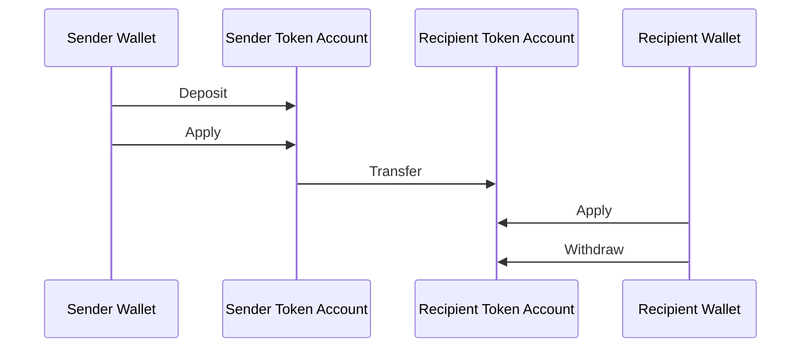
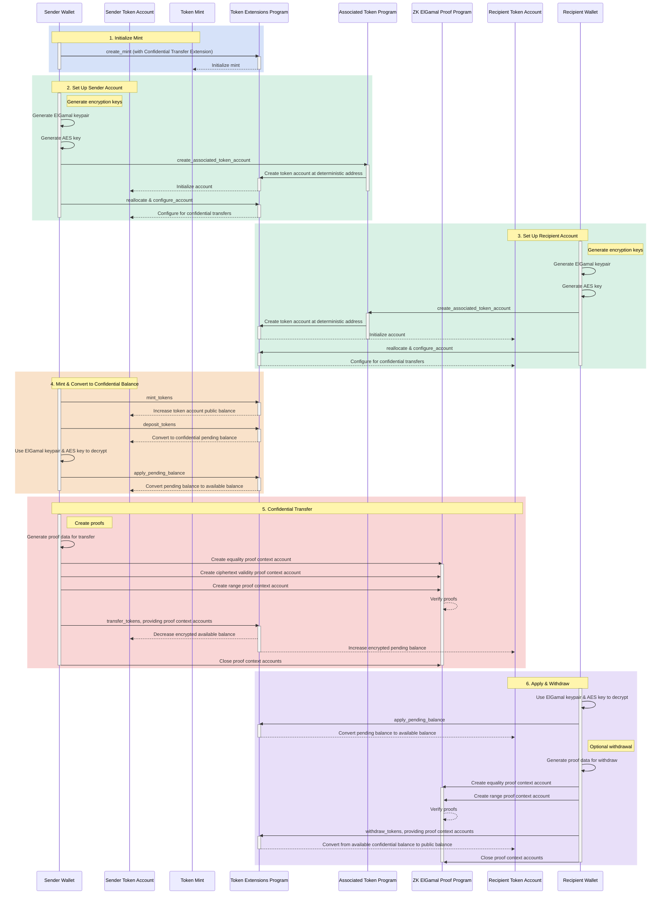

## O que são Transferências Confidenciais?

<Embed url="https://youtu.be/Bqs95tFcRIU" />

As transferências confidenciais permitem transferir tokens entre token accounts
sem revelar o valor da transferência. Isso é útil para transações que preservam
a privacidade. Apenas os valores das transferências e os saldos de tokens são
privados. Os endereços das token accounts permanecem públicos.

- [Visão Geral do Protocolo](https://www.solana-program.com/docs/confidential-balances/overview) -
  Detalhes sobre o protocolo criptográfico subjacente
- [Guia de Início Rápido](https://www.solana-program.com/docs/confidential-balances#setup) -
  Configuração e comandos básicos de CLI
- [Cookbook de Saldos Confidenciais](https://github.com/solana-developers/Confidential-Balances-Sample) -
  Trechos de código sobre como usar a extensão de Transferência Confidencial

### Como funciona?

A extensão de Transferência Confidencial adiciona
[instruções](https://github.com/solana-program/token-2022/blob/efd0c957fefbd79882d77df5fb2dac88c001249c/program/src/extension/confidential_transfer/instruction.rs#L29)
ao Token Extensions Program que permite transferir tokens entre contas sem
revelar o valor da transferência.

O fluxo básico das transferências confidenciais de tokens é o seguinte:

1. Criar um mint account com a extensão de transferência confidencial.
2. Criar token accounts com a extensão de transferência confidencial para o
   remetente e o destinatário.
3. Cunhar tokens na conta do remetente.
4. **Depositar** o saldo público do remetente no **saldo pendente
   confidencial**.
5. **Aplicar** o saldo pendente do remetente ao **saldo disponível
   confidencial**.
6. **Transferir** confidencialmente os tokens da token account do remetente para
   a token account do destinatário.
7. **Aplicar** o saldo pendente do destinatário ao **saldo disponível
   confidencial**.
8. **Sacar** o saldo disponível confidencial do destinatário para o **saldo
   público**.

Para mais detalhes sobre as etapas do fluxo de transferência confidencial,
consulte as páginas correspondentes:

<Cards>
  <Card
    title="Criar Mint Account"
    href="/docs/tokens/extensions/confidential-transfer/create-mint"
  >
    Como criar um mint account com a extensão de Transferência Confidencial
  </Card>
  <Card
    title="Criar Token Account"
    href="/docs/tokens/extensions/confidential-transfer/create-token-account"
  >
    Como configurar uma token account com a extensão de Transferência
    Confidencial
  </Card>
  <Card
    title="Depositar Tokens"
    href="/docs/tokens/extensions/confidential-transfer/deposit-tokens"
  >
    Como depositar tokens no saldo pendente confidencial
  </Card>
  <Card
    title="Aplicar Saldo Pendente"
    href="/docs/tokens/extensions/confidential-transfer/apply-pending-balance"
  >
    Como aplicar o saldo pendente ao saldo confidencial disponível
  </Card>
  <Card
    title="Sacar Tokens"
    href="/docs/tokens/extensions/confidential-transfer/withdraw-tokens"
  >
    Como sacar tokens do saldo confidencial disponível
  </Card>
  <Card
    title="Transferir Tokens"
    href="/docs/tokens/extensions/confidential-transfer/transfer-tokens"
  >
    Como transferir tokens confidencialmente entre token accounts
  </Card>
  <Card
    title="Guia de Integração"
    href="/docs/tokens/extensions/confidential-transfer/integration-guide"
  >
    Como carteiras, exploradores e exchanges podem suportar tokens de
    transferência confidencial
  </Card>
  <Card
    title="Guia para Emissores"
    href="/docs/tokens/extensions/confidential-transfer/issuer-guide"
  >
    Como emitir e operar um token de transferência confidencial (política de
    aprovação, auditores, taxas, cunhagem e queima)
  </Card>
</Cards>

O diagrama abaixo mostra uma sequência detalhada do fluxo básico para
transferências confidenciais de tokens:

## Instruções de Transferência Confidencial

A lista completa das
[instruções](https://github.com/solana-program/token-2022/blob/efd0c957fefbd79882d77df5fb2dac88c001249c/program/src/extension/confidential_transfer/instruction.rs#L29)
da extensão de Transferência Confidencial é a seguinte:

| Instrução                           | Descrição                                                                                                                                                               |
| ----------------------------------- | ----------------------------------------------------------------------------------------------------------------------------------------------------------------------- |
| _rs`InitializeMint`_                | Configura o mint account para transferências confidenciais. Esta instrução deve ser incluída na mesma transação que a instrução _rs`TokenInstruction::InitializeMint`_. |
| _rs`UpdateMint`_                    | Atualiza as configurações de transferência confidencial para um mint.                                                                                                   |
| _rs`ConfigureAccount`_              | Configura um token account para transferências confidenciais.                                                                                                           |
| _rs`ApproveAccount`_                | Aprova um token account para transferências confidenciais, caso o mint exija aprovação para novos token accounts.                                                       |
| _rs`EmptyAccount`_                  | Esvazia os saldos confidenciais pendentes e disponíveis para permitir o encerramento de um token account.                                                               |
| _rs`Deposit`_                       | Converte o saldo público de tokens em saldo confidencial pendente.                                                                                                      |
| _rs`Withdraw`_                      | Converte o saldo confidencial disponível de volta para saldo público.                                                                                                   |
| _rs`Transfer`_                      | Transfere tokens entre token accounts de forma confidencial.                                                                                                            |
| _rs`ApplyPendingBalance`_           | Converte o saldo pendente em saldo disponível após depósitos ou transferências.                                                                                         |
| _rs`EnableConfidentialCredits`_     | Permite que um token account receba transferências confidenciais de tokens.                                                                                             |
| _rs`DisableConfidentialCredits`_    | Bloqueia transferências confidenciais recebidas, permitindo ainda transferências públicas.                                                                              |
| _rs`EnableNonConfidentialCredits`_  | Permite que um token account receba transferências públicas de tokens.                                                                                                  |
| _rs`DisableNonConfidentialCredits`_ | Bloqueia transferências regulares para que a conta receba apenas transferências confidenciais.                                                                          |
| _rs`TransferWithFee`_               | Transfere tokens entre token accounts de forma confidencial com uma taxa.                                                                                               |
| _rs`ConfigureAccountWithRegistry`_  | Forma alternativa de configurar token accounts para transferências confidenciais usando uma conta _rs`ElGamalRegistry`_ em vez de uma prova _rs`VerifyPubkeyValidity`_. |
