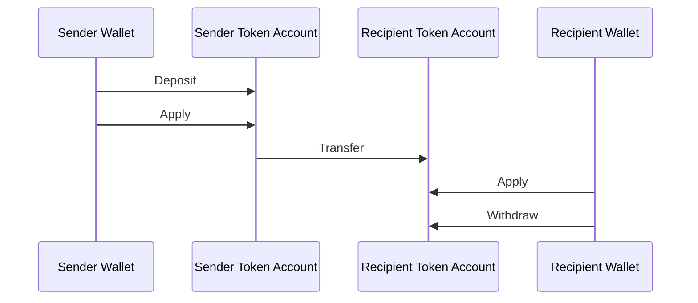
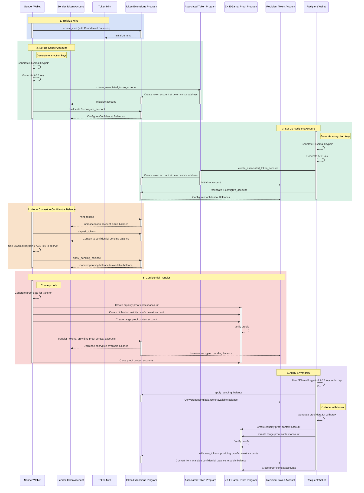

## O que são Saldos Confidenciais?

<Embed url="https://youtu.be/Bqs95tFcRIU" />

Saldos Confidenciais é uma extensão do Token-2022 que permite transferir tokens
entre token accounts sem revelar o valor da transferência. Isso é útil para
transações que preservam a privacidade. Apenas os valores das transferências e os saldos dos tokens são
privados. Os endereços das token accounts permanecem públicos.

- [Visão Geral do Protocolo](https://www.solana-program.com/docs/confidential-balances/overview) -
  Detalhes sobre o protocolo criptográfico subjacente
- [Guia de Início Rápido](https://www.solana-program.com/docs/confidential-balances#setup) -
  Configuração e comandos básicos de CLI
- [Cookbook de Saldos Confidenciais](https://github.com/solana-developers/Confidential-Balances-Sample) -
  Trechos de código mostrando como usar Saldos Confidenciais

### Como funciona?

A extensão de Saldos Confidenciais adiciona
[instruções](https://github.com/solana-program/token-2022/blob/efd0c957fefbd79882d77df5fb2dac88c001249c/program/src/extension/confidential_transfer/instruction.rs#L29)
ao Token Extensions Program que permitem transferir tokens entre
contas sem revelar o valor da transferência.

```mermaid title="Confidential Balances Basic Overview"
    sequenceDiagram

    participant A as Sender Wallet
    participant AA as Sender Token Account
    participant BB as Recipient Token Account
    participant B as Recipient Wallet

    A->>AA: Deposit
    A->>AA: Apply

    AA->>BB: Transfer
    B->>BB: Apply

    B->>BB: Withdraw

```

O fluxo básico das transferências confidenciais de tokens é o seguinte:

1. Criar uma mint account com Saldos Confidenciais habilitados.
2. Criar token accounts com Saldos Confidenciais habilitados para o remetente e
   o destinatário.
3. Cunhar tokens na conta do remetente.
4. **Depositar** o saldo público do remetente no **saldo pendente
   confidencial**.
5. **Aplicar** o saldo pendente do remetente ao **saldo disponível
   confidencial**.
6. **Transferir** confidencialmente os tokens da token account do remetente para
   a token account do destinatário.
7. **Aplicar** o saldo pendente do destinatário ao **saldo disponível
   confidencial**.
8. **Sacar** o saldo disponível confidencial do destinatário para o **saldo
   público**.

### Chaves de auditor

Uma mint account de Saldos Confidenciais pode armazenar uma chave pública ElGamal de auditor global opcional. Quando configurada, cada transferência confidencial inclui o valor criptografado para o remetente, o destinatário e o auditor. A prova de transferência verifica que os três textos cifrados contêm o mesmo valor. O público ainda não consegue ler o valor, mas o detentor da chave secreta do auditor pode descriptografar os valores das transferências para aquela mint account.

A autoridade de Saldos Confidenciais define a chave do auditor ao inicializar a extensão ou a altera posteriormente com _rs`UpdateMint`_. A autoridade pode rotacionar ou remover a chave. Uma rotação se aplica apenas a transferências futuras, portanto, mantenha as chaves secretas anteriores quando o acesso histórico de auditoria for necessário. As chaves de auditor fornecem acesso de leitura; elas não autorizam transferências de tokens nem revelam o saldo confidencial completo de uma conta.

Para exemplos de configuração e rotação, consulte
[Configurar um auditor](/docs/tokens/extensions/confidential-transfer/issuer-guide#configure-an-auditor).
Carteiras, exploradores, exchanges e provedores de conformidade também devem revisar as
[orientações de integração do auditor](/docs/tokens/extensions/confidential-transfer/integration-guide#auditors-and-compliance).

Para mais detalhes sobre as etapas do fluxo de transferência confidencial,
consulte as páginas correspondentes:

<Cards>
  <Card
    title="Criar Mint Account"
    href="/docs/tokens/extensions/confidential-transfer/create-mint"
  >
    Como criar uma mint account com Saldos Confidenciais habilitados
  </Card>
  <Card
    title="Criar Token Account"
    href="/docs/tokens/extensions/confidential-transfer/create-token-account"
  >
    Como configurar uma token account com Saldos Confidenciais habilitados
  </Card>
  <Card
    title="Depositar Tokens"
    href="/docs/tokens/extensions/confidential-transfer/deposit-tokens"
  >
    Como depositar tokens no saldo pendente confidencial
  </Card>
  <Card
    title="Aplicar Saldo Pendente"
    href="/docs/tokens/extensions/confidential-transfer/apply-pending-balance"
  >
    Como aplicar o saldo pendente ao saldo confidencial disponível
  </Card>
  <Card
    title="Sacar Tokens"
    href="/docs/tokens/extensions/confidential-transfer/withdraw-tokens"
  >
    Como sacar tokens do saldo confidencial disponível
  </Card>
  <Card
    title="Transferir Tokens"
    href="/docs/tokens/extensions/confidential-transfer/transfer-tokens"
  >
    Como transferir tokens confidencialmente entre token accounts
  </Card>
  <Card
    title="Guia de Integração"
    href="/docs/tokens/extensions/confidential-transfer/integration-guide"
  >
    Como carteiras, exploradores e exchanges podem oferecer suporte a tokens de Saldos Confidenciais
  </Card>
  <Card
    title="Guia para Emissores"
    href="/docs/tokens/extensions/confidential-transfer/issuer-guide"
  >
    Como emitir e operar um token de Saldos Confidenciais (política de aprovação,
    auditores, taxas, emissão e queima)
  </Card>
</Cards>

O diagrama abaixo mostra uma sequência detalhada do fluxo básico para
transferências confidenciais de tokens:

```mermaid title="Confidential Balances Detailed Overview"
sequenceDiagram
    participant Sender as Sender Wallet
    participant SenderAccount as Sender Token Account
    participant Mint as Token Mint
    participant Token22 as Token Extensions Program
    participant ATAProgram as Associated Token Program
    participant ElGamal as ZK ElGamal Proof Program
    participant RecipientAccount as Recipient Token Account
    participant Recipient as Recipient Wallet

    rect rgba(120, 160, 235, 0.3)
    Note over Sender,Mint: 1. Initialize Mint

    activate Sender
    Sender->>Token22: create_mint (with Confidential Balances)
    activate Token22
    Token22-->>Mint: Initialize mint
    deactivate Token22
    deactivate Sender
    end

    rect rgba(130, 210, 170, 0.3)
    Note over Sender,SenderAccount: 2. Set Up Sender Account

    activate Sender
    Note right of Sender: Generate encryption keys
    Sender->>Sender: Generate ElGamal keypair
    Sender->>Sender: Generate AES key

    Sender->>ATAProgram: create_associated_token_account
    activate ATAProgram
    ATAProgram->>Token22: Create token account at deterministic address
    activate Token22
    Token22-->>SenderAccount: Initialize account
    deactivate Token22
    deactivate ATAProgram

    Sender->>Token22: reallocate & configure_account
    activate Token22
    Token22-->>SenderAccount: Configure Confidential Balances
    deactivate Token22
    deactivate Sender
    end

    rect rgba(130, 210, 170, 0.3)
    Note over Recipient,RecipientAccount: 3. Set Up Recipient Account

    activate Recipient
    Note right of Recipient: Generate encryption keys
    Recipient->>Recipient: Generate ElGamal keypair
    Recipient->>Recipient: Generate AES key

    Recipient->>ATAProgram: create_associated_token_account
    activate ATAProgram
    ATAProgram->>Token22: Create token account at deterministic address
    activate Token22
    Token22-->>RecipientAccount: Initialize account
    deactivate Token22
    deactivate ATAProgram

    Recipient->>Token22: reallocate & configure_account
    activate Token22
    Token22-->>RecipientAccount: Configure Confidential Balances
    deactivate Token22
    deactivate Recipient
    end

    rect rgba(235, 160, 80, 0.3)
    Note over Sender,SenderAccount: 4. Mint & Convert to Confidential Balance

    activate Sender
    Sender->>Token22: mint_tokens
    activate Token22
    Token22-->>SenderAccount: Increase token account public balance
    deactivate Token22

    Sender->>Token22: deposit_tokens
    activate Token22
    Token22-->>SenderAccount: Convert to confidential pending balance
    deactivate Token22

    Sender->>Sender: Use ElGamal keypair & AES key to decrypt
    Sender->>Token22: apply_pending_balance
    activate Token22
    Token22-->>SenderAccount: Convert pending balance to available balance
    deactivate Token22
    deactivate Sender
    end

    rect rgba(235, 120, 120, 0.3)
    Note over Sender,RecipientAccount: 5. Confidential Transfer

    activate Sender
    Note right of Sender: Create proofs
    Sender->>Sender: Generate proof data for transfer

    Sender->>ElGamal: Create equality proof context account
    activate ElGamal
    Sender->>ElGamal: Create ciphertext validity proof context account
    Sender->>ElGamal: Create range proof context account
    ElGamal-->>ElGamal: Verify proofs

    Sender->>Token22: transfer_tokens, providing proof context accounts
    activate Token22
    Token22-->>SenderAccount: Decrease encrypted available balance
    Token22-->>RecipientAccount: Increase encrypted pending balance
    deactivate Token22

    Sender->>ElGamal: Close proof context accounts
    deactivate ElGamal
    deactivate Sender
    end

    rect rgba(180, 150, 235, 0.3)
    Note over Recipient,RecipientAccount: 6. Apply & Withdraw

    activate Recipient
    Recipient->>Recipient: Use ElGamal keypair & AES key to decrypt
    Recipient->>Token22: apply_pending_balance
    activate Token22
    Token22-->>RecipientAccount: Convert pending balance to available balance
    deactivate Token22

    Note right of Recipient: Optional withdrawal
    Recipient->>Recipient: Generate proof data for withdraw

    Recipient->>ElGamal: Create equality proof context account
    activate ElGamal
    Recipient->>ElGamal: Create range proof context account
    ElGamal-->>ElGamal: Verify proofs

    Recipient->>Token22: withdraw_tokens, providing proof context accounts
    activate Token22
    Token22-->>RecipientAccount: Convert from available confidential balance to public balance
    deactivate Token22

    Recipient->>ElGamal: Close proof context accounts
    deactivate ElGamal
    deactivate Recipient
    end
```

## Instruções de Saldos Confidenciais

A lista completa de
[instruções](https://github.com/solana-program/token-2022/blob/efd0c957fefbd79882d77df5fb2dac88c001249c/program/src/extension/confidential_transfer/instruction.rs#L29)
da extensão de Saldos Confidenciais é a seguinte:

| Instrução                         | Descrição                                                                                                                                                       |
| ----------------------------------- | ----------------------------------------------------------------------------------------------------------------------------------------------------------------- |
| _rs`InitializeMint`_                | Habilita Saldos Confidenciais em uma mint account. Esta instrução deve ser incluída na mesma transação que a instrução _rs`TokenInstruction::InitializeMint`_. |
| _rs`UpdateMint`_                    | Atualiza a política de aprovação de contas da mint account e a chave pública ElGamal de auditor global opcional.                                                                        |
| _rs`ConfigureAccount`_              | Habilita Saldos Confidenciais em uma token account.                                                                                                                 |
| _rs`ApproveAccount`_                | Aprova uma token account para Saldos Confidenciais caso a mint account exija aprovação para novas token accounts.                                                          |
| _rs`EmptyAccount`_                  | Esvazia os saldos confidenciais pendentes e disponíveis para permitir o encerramento de um token account.                                                                         |
| _rs`Deposit`_                       | Converte o saldo público de tokens em saldo confidencial pendente.                                                                                                  |
| _rs`Withdraw`_                      | Converte o saldo confidencial disponível de volta para saldo público.                                                                                                   |
| _rs`Transfer`_                      | Transfere tokens entre token accounts de forma confidencial.                                                                                                           |
| _rs`ApplyPendingBalance`_           | Converte o saldo pendente em saldo disponível após depósitos ou transferências.                                                                                      |
| _rs`EnableConfidentialCredits`_     | Permite que um token account receba transferências confidenciais de tokens.                                                                                                   |
| _rs`DisableConfidentialCredits`_    | Bloqueia transferências confidenciais recebidas, permitindo ainda transferências públicas.                                                                                     |
| _rs`EnableNonConfidentialCredits`_  | Permite que um token account receba transferências públicas de tokens.                                                                                                         |
| _rs`DisableNonConfidentialCredits`_ | Bloqueia transferências regulares para que a conta receba apenas transferências confidenciais.                                                                                     |
| _rs`TransferWithFee`_               | Transfere tokens entre token accounts de forma confidencial com uma taxa.                                                                                                |
| _rs`ConfigureAccountWithRegistry`_  | Forma alternativa de configurar token accounts para Saldos Confidenciais usando uma conta _rs`ElGamalRegistry`_ em vez da prova _rs`VerifyPubkeyValidity`_.         |
