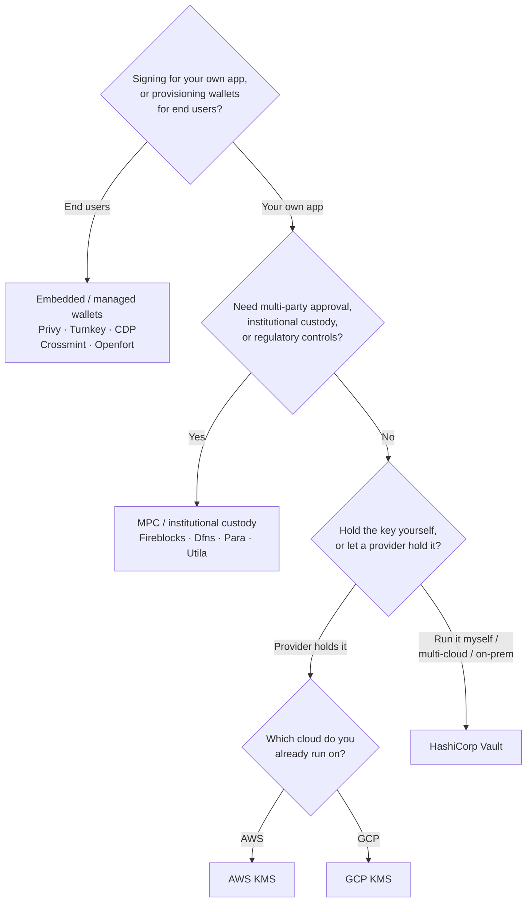

O Keychain expõe uma interface `SolanaSigner` única para todos os backends,
portanto a escolha é operacional, não arquitetural — você pode alterá-la
posteriormente através de configurações. Por isso, **comece pelos seus
requisitos, não por um produto.** Duas perguntas resolvem a maior parte: _onde a
chave privada reside, e quem está autorizado a aprovar uma assinatura com ela?_

Não existe um backend único que seja o melhor. Cada um é mais adequado para um
conjunto específico de restrições — a nuvem em que você já opera, se deseja
gerenciar a infraestrutura de chaves, e quais controles de custódia e aprovação
você precisa ter. O fluxo abaixo mapeia essas restrições a um backend.

<Callout type="info">
  Este guia aborda a assinatura no backend (lado do servidor). Quando seus
  usuários finais assinam suas próprias transações em um navegador, utilize uma
  carteira através do Wallet Standard — consulte [Assinando em
  Produção](/docs/core/transactions/signing-in-production).
</Callout>

## Fluxo de decisão

<Callout type="info">
  Desenvolvimento local e testes não precisam de nada disso — use o backend
  **Memory** para prototipagem e, em seguida, mude para um dos backends de
  produção acima através das configurações.
</Callout>

## Percorra as perguntas

<Steps>

<Step>

### Você está assinando para seu próprio aplicativo ou para seus usuários finais?

Se você provisiona carteiras que **usuários finais** possuem e operam
(aplicativos para consumidores, fluxos de integração), use um backend de
**carteira embarcada / gerenciada** — Privy, Turnkey, CDP, Crossmint ou
Openfort. Esses serviços gerenciam carteiras por usuário e autenticação em seu
nome.

Se está a assinar como **a sua própria aplicação** — um pagador de taxas, um
tesouro, automação de backend — continue abaixo.

</Step>

<Step>

### Necessita de aprovação multi-partes, custódia institucional ou controlos regulatórios?

Se as assinaturas tiverem de passar por uma política de aprovação, limite de
gastos ou fluxo de conformidade antes de serem produzidas — ou se precisar de um
custodiante regulado que detenha as chaves — utilize um backend de **MPC /
custódia institucional**: Fireblocks, Dfns, Para ou Utila. Estes dividem ou
guardam a chave e co-assinam de acordo com a sua política.

Se apenas precisar de uma chave que assine a pedido, continue abaixo.

</Step>

<Step>

### Pretende guardar a chave você mesmo, ou deixar um fornecedor guardá-la?

Se um fornecedor de cloud dever guardar a chave em infraestrutura com suporte de
hardware e a sua política de IAM controlar quem pode assinar, utilize o KMS
dessa cloud:

- **A correr na AWS** → AWS KMS
- **A correr na GCP** → GCP KMS

Se pretender operar a infraestrutura de chaves você mesmo — ou se for
multi-cloud ou on-prem — utilize o **HashiCorp Vault**. Você executa e audita; a
chave permanece dentro do motor Transit e assina a pedido.

</Step>

</Steps>

## Modelos de custódia

Os backends agrupam-se em cinco modelos de custódia. O fluxo acima encaminha-o
para um deles.

- **Auto-custódia (em processo)** — a sua aplicação detém a chave privada em
  bruto. Conveniente para desenvolvimento, mas inadequado para produção.
  Backend: **Memory**.
- **Gestão de chaves auto-hospedada** — você opera a infraestrutura de chaves; a
  chave permanece dentro dela e assina a pedido. Backend: **HashiCorp Vault**.
- **Cloud KMS / HSM** — um fornecedor de cloud armazena a chave em
  infraestrutura com suporte de hardware; a chave nunca sai do serviço e a sua
  política de IAM controla quem pode assinar. Backends: **AWS KMS**, **GCP
  KMS**.
- **MPC e custódia institucional** — a chave é dividida ou custodiada por um
  fornecedor, que co-assina de acordo com a sua política (aprovações, limites).
  Backends: **Fireblocks**, **Dfns**, **Para**, **Utila**.
- **Carteiras incorporadas e geridas** — um fornecedor gere carteiras em seu
  nome, frequentemente para integrar utilizadores finais. Backends: **Privy**,
  **Turnkey**, **CDP**, **Crossmint**, **Openfort**.

## Comparação de backends

| Backend         | Modelo de custódia              | Ideal para                                           | Notas                                                  |
| --------------- | ------------------------------- | ---------------------------------------------------- | ------------------------------------------------------ |
| Memory          | Autocustódia (em processo)      | Desenvolvimento local, testes, CI                    | Chave bruta no processo — não usar em produção         |
| HashiCorp Vault | Gestão de chaves auto-hospedada | Equipas com infraestrutura própria de chaves         | Motor Transit; você opera e audita                     |
| AWS KMS         | KMS / HSM na nuvem              | Backends a correr na AWS                             | Chave nunca sai do KMS; IAM controla a assinatura      |
| GCP KMS         | KMS / HSM na nuvem              | Backends a correr na GCP                             | Chave nunca sai do KMS; IAM controla a assinatura      |
| Fireblocks      | Custódia MPC / institucional    | Tesourarias, exchanges, custódia regulada            | Motor de políticas e fluxos de aprovação               |
| Dfns            | Infraestrutura de carteiras MPC | Carteiras programáticas com controles de política    | Assinatura Ed25519                                     |
| Para            | Carteiras MPC                   | Apps que pretendem carteiras com suporte MPC         | Chave API + ID da carteira                             |
| Utila           | Custódia MPC + co-assinante     | Carteiras Solana geridas pelo Utila                  | `signMessage` não suportado; você transmite a tx       |
| Privy           | Carteiras embutidas             | Apps de consumo a integrar utilizadores em carteiras | Carteiras embutidas geridas pela app                   |
| Turnkey         | Gestão de chaves não custodial  | Assinatura programática com controlo por políticas   | Gestão de chaves não custodial                         |
| CDP             | Carteira gerida (Coinbase)      | Apps na Plataforma de Desenvolvimento Coinbase       | `signMessage` aceita apenas payloads UTF-8             |
| Crossmint       | Carteiras geridas               | Marketplaces e apps com carteiras geridas            | Carteiras `smart` e `mpc`; `signMessage` não suportado |
| Openfort        | Carteiras backend embutidas     | Carteiras do lado do servidor                        | Chaves armazenadas em TEE                              |

## Cenários empresariais

Uma única aplicação frequentemente precisa de mais de um destes ao mesmo tempo.
Como a interface é idêntica, é possível executar um backend diferente por função
sem alterar os pontos de chamada.

- **Operações de tesouraria** — separe um signatário operacional "quente" de um
  signatário "frio" de tesouraria. Proteja a tesouraria com custódia MPC ou um
  HSM em nuvem e exija políticas de aprovação antes de assinaturas de alto
  valor.
- **Fluxos de aprovação** — os backends MPC e de custódia (ex.: Fireblocks)
  impõem aprovação de múltiplas partes antes que uma assinatura seja produzida.
- **Conformidade e auditoria** — o KMS em nuvem (AWS/GCP) e o Vault emitem logs
  de auditoria de assinatura; custodiantes institucionais adicionam aplicação de
  políticas e relatórios.
- **Ambientes regulamentados** — mantenha o material de chaves em um HSM, KMS ou
  custodiante institucional para que as chaves brutas nunca toquem a sua
  aplicação.

Consulte
[Melhores práticas de produção](/docs/tools/keychain/production-best-practices)
para operar esses backends com segurança.

<Cards>
  <Card title="Guia Rust" href="/docs/tools/keychain/getting-started/rust">
    Configure cada backend em Rust.
  </Card>
  <Card
    title="Guia TypeScript"
    href="/docs/tools/keychain/getting-started/typescript"
  >
    Configure cada backend em TypeScript.
  </Card>
</Cards>
