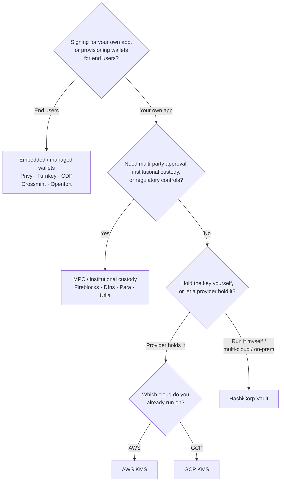

O Keychain expõe uma interface `SolanaSigner` única para todos os backends,
portanto a escolha é operacional, não arquitetural — você pode alterá-la
posteriormente por meio de configurações. Por isso, **comece pelos seus
requisitos, não pelo produto.** Duas perguntas decidem a maior parte: _onde a
chave privada reside, e quem está autorizado a assinar com ela?_

Não existe um único backend ideal. Cada um é mais adequado para um conjunto
específico de restrições — a nuvem que você já utiliza, se deseja operar uma
infraestrutura de chaves e quais controles de custódia e aprovação são
necessários. O fluxo abaixo mapeia essas restrições a um backend.

<Callout type="info">
  Este guia aborda a assinatura no backend (lado do servidor). Quando seus
  usuários finais assinam suas próprias transações em um navegador, utilize uma
  carteira por meio do Wallet Standard — consulte [Assinando em
  Produção](/docs/core/transactions/signing-in-production).
</Callout>

## Fluxo de decisão

<Callout type="info">
  Desenvolvimento local e testes não precisam de nada disso — use o backend
  **Memory** para prototipação e, em seguida, alterne para um dos backends de
  produção acima por meio de configurações.
</Callout>

## Percorra as perguntas

<Steps>

<Step>

### Você está assinando para seu próprio aplicativo ou para seus usuários finais?

Se você provisiona carteiras que **usuários finais** possuem e operam
(aplicativos para consumidores, fluxos de onboarding), use um backend de
**carteira incorporada / gerenciada** — Privy, Turnkey, CDP, Crossmint ou
Openfort. Esses serviços gerenciam carteiras por usuário e autenticação em seu
nome.

Se você está assinando como **sua própria aplicação** — um pagador de taxas, um
tesouro, automação de backend — continue abaixo.

</Step>

<Step>

### Você precisa de aprovação multipartidária, custódia institucional ou controles regulatórios?

Se as assinaturas precisam passar por uma política de aprovação, limite de
gastos ou fluxo de conformidade antes de serem produzidas — ou você precisa de
um custodiante regulamentado detendo as chaves — use um backend de **MPC /
custódia institucional**: Fireblocks, Dfns, Para ou Utila. Eles dividem ou
custodiiam a chave e co-assinam de acordo com sua política.

Se você só precisa de uma chave que assine sob demanda, continue abaixo.

</Step>

<Step>

### Você quer guardar a chave você mesmo, ou deixar um provedor guardá-la?

Se um provedor de nuvem deve guardar a chave em infraestrutura com suporte de
hardware e sua política de IAM controla quem pode assinar, use o KMS dessa
nuvem:

- **Rodando na AWS** → AWS KMS
- **Rodando no GCP** → GCP KMS

Se você quer operar a infraestrutura de chaves você mesmo — ou está em múltiplas
nuvens ou on-prem — use o **HashiCorp Vault**. Você o executa e audita; a chave
permanece dentro do mecanismo Transit e assina sob demanda.

</Step>

</Steps>

## Modelos de custódia

Os backends se agrupam em cinco modelos de custódia. O fluxo acima leva você a
um deles.

- **Autocustódia (em processo)** — sua aplicação detém a chave privada bruta.
  Conveniente para desenvolvimento, mas inadequado para produção. Backend:
  **Memory**.
- **Gerenciamento de chaves auto-hospedado** — você opera a infraestrutura de
  chaves; a chave permanece dentro dela e assina sob demanda. Backend:
  **HashiCorp Vault**.
- **Cloud KMS / HSM** — um provedor de nuvem armazena a chave em infraestrutura
  com suporte de hardware; a chave nunca sai do serviço e sua política de IAM
  controla quem pode assinar. Backends: **AWS KMS**, **GCP KMS**.
- **MPC e custódia institucional** — a chave é dividida ou custodiada por um
  provedor, que co-assina de acordo com sua política (aprovações, limites).
  Backends: **Fireblocks**, **Dfns**, **Para**, **Utila**.
- **Carteiras incorporadas e gerenciadas** — um provedor gerencia carteiras em
  seu nome, geralmente para integrar usuários finais. Backends: **Privy**,
  **Turnkey**, **CDP**, **Crossmint**, **Openfort**.

## Comparação de backends

| Backend         | Modelo de custódia              | Ideal para                                        | Observações                                            |
| --------------- | ------------------------------- | ------------------------------------------------- | ------------------------------------------------------ |
| Memory          | Autocustódia (em processo)      | Desenvolvimento local, testes, CI                 | Chave bruta no processo — não use em produção          |
| HashiCorp Vault | Gestão de chaves auto-hospedada | Equipes com infraestrutura de chaves própria      | Motor Transit; você opera e audita                     |
| AWS KMS         | KMS em nuvem / HSM              | Backends rodando na AWS                           | Chave nunca sai do KMS; IAM controla a assinatura      |
| GCP KMS         | KMS em nuvem / HSM              | Backends rodando na GCP                           | Chave nunca sai do KMS; IAM controla a assinatura      |
| Fireblocks      | Custódia MPC / institucional    | Tesourarias, exchanges, custódia regulada         | Motor de políticas e fluxos de aprovação               |
| Dfns            | Infraestrutura de carteiras MPC | Carteiras programáticas com controles de política | Assinatura Ed25519                                     |
| Para            | Carteiras MPC                   | Apps que desejam carteiras com suporte MPC        | Chave de API + ID da carteira                          |
| Utila           | Custódia MPC + co-signatário    | Carteiras Solana gerenciadas pelo Utila           | `signMessage` não suportado; você transmite a tx       |
| Privy           | Carteiras integradas            | Apps de consumo que integram usuários a carteiras | Carteiras integradas gerenciadas pelo app              |
| Turnkey         | Gestão de chaves não custodial  | Assinatura programática com controle de políticas | Gestão de chaves não custodial                         |
| CDP             | Carteira gerenciada (Coinbase)  | Apps na Coinbase Developer Platform               | `signMessage` aceita apenas payloads UTF-8             |
| Crossmint       | Carteiras gerenciadas           | Marketplaces e apps com carteiras gerenciadas     | Carteiras `smart` e `mpc`; `signMessage` não suportado |
| Openfort        | Carteiras de backend integradas | Carteiras no lado do servidor                     | Chaves armazenadas em TEE                              |

## Cenários empresariais

Uma única aplicação frequentemente precisa de mais de um destes ao mesmo tempo.
Como a interface é idêntica, é possível executar um backend diferente por função
sem alterar os pontos de chamada.

- **Operações de tesouraria** — separe um assinante operacional "hot" de um
  assinante "cold" de tesouraria. Apoie a tesouraria com custódia MPC ou um HSM
  em nuvem e exija políticas de aprovação antes de assinaturas de alto valor.
- **Fluxos de aprovação** — backends MPC e de custódia (ex.: Fireblocks) exigem
  aprovação de múltiplas partes antes de produzir uma assinatura.
- **Conformidade e auditoria** — KMS em nuvem (AWS/GCP) e Vault emitem logs de
  auditoria de assinatura; custodiantes institucionais adicionam aplicação de
  políticas e relatórios.
- **Ambientes regulados** — mantenha o material de chaves em um HSM, KMS ou
  custodiante institucional para que as chaves brutas nunca toquem a sua
  aplicação.

Consulte
[Melhores práticas de produção](/docs/tools/keychain/production-best-practices)
para operar esses backends com segurança.

<Cards>
  <Card title="Guia Rust" href="/docs/tools/keychain/getting-started/rust">
    Configure cada backend em Rust.
  </Card>
  <Card
    title="Guia TypeScript"
    href="/docs/tools/keychain/getting-started/typescript"
  >
    Configure cada backend em TypeScript.
  </Card>
</Cards>
