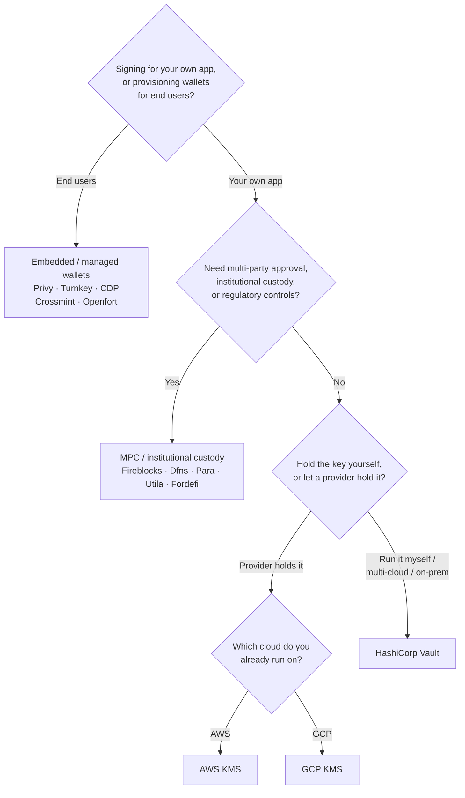

O Keychain expõe uma única interface base `SolanaSigner` em todos os backends, pelo que, para
A maioria dos backends, a escolha é operacional, não arquitetural: pode alterá-la
mais tarde através de configuração. A exceção é o formato da transação. Crossmint
e o modo automático nativo da Fordefi assinam e transmitem no lado do servidor, e o modo manual
nativo da Fordefi reescreve a transação antes de a assinar, pelo que passar para qualquer
um deles, ou deixar de o usar, altera a forma como chama o signatário. Por isso, **parta dos seus
requisitos, não de um produto.** Duas perguntas decidem a maior parte: _onde
vive a chave privada e quem pode autorizar uma assinatura com ela?_

Todos os backends, exceto o Ledger, estão disponíveis nas quatro linguagens (Rust, TypeScript,
Python e Go). O Ledger é apenas para Rust, atrás da funcionalidade opcional `ledger`.

Não existe um melhor backend único. Cada um é mais adequado a um determinado conjunto
de restrições: a cloud que já utiliza, se pretende operar infraestrutura de chaves
e que controlos de custódia e de aprovação é obrigado a ter.
O fluxo abaixo associa essas restrições a um backend.

<Callout type="info">
  Este guia cobre a assinatura em backend (lado do servidor). Quando os seus utilizadores finais assinam
  as próprias transações num navegador, use antes uma carteira através do Wallet Standard.
  Consulte [Signing in
  Production](/docs/core/transactions/signing-in-production).
</Callout>

## Fluxo de decisão

```mermaid title="Choosing a Keychain backend"
flowchart TD
    Start{Signing for your own app,<br/>or provisioning wallets<br/>for end users?}
    Start -->|End users| Managed[Embedded / managed wallets<br/>Privy · Turnkey · CDP<br/>Crossmint · Openfort]
    Start -->|Your own app| Q2{Need multi-party approval,<br/>institutional custody,<br/>or regulatory controls?}
    Q2 -->|Yes| MPC[MPC / institutional custody<br/>Fireblocks · Dfns · Para · Utila · Fordefi]
    Q2 -->|No| Q3{Hold the key yourself,<br/>or let a provider hold it?}
    Q3 -->|Provider holds it| Q4{Which cloud do you<br/>already run on?}
    Q4 -->|AWS| AWS[AWS KMS]
    Q4 -->|GCP| GCP[GCP KMS]
    Q3 -->|Run it myself /<br/>multi-cloud / on-prem| Vault[HashiCorp Vault]
```

<Callout type="info">
  O desenvolvimento local e os testes não precisam de nada disto: use o backend **Memory**
  para prototipagem e depois mude para um dos backends de produção acima através de
  configuração.
</Callout>

## Percorra as perguntas

<Steps>

<Step>

### Está a assinar para a sua própria aplicação ou para os seus utilizadores finais?

Se provisiona carteiras que pertencem aos **utilizadores finais** e são operadas por eles (aplicações de consumo,
fluxos de onboarding), use um backend de **carteira embebida / gerida**: Privy, Turnkey,
CDP, Crossmint ou Openfort. Estes gerem carteiras por utilizador e a autenticação em
seu nome.

Se assina como **a sua própria aplicação** (um fee payer, uma tesouraria, automação de
backend), continue abaixo.

</Step>

<Step>

### Precisa de aprovação multipartida, custódia institucional ou controlos regulamentares?

Se as assinaturas têm de passar por uma política de aprovação, um limite de despesa ou um fluxo de
conformidade antes de serem produzidas, ou se precisa de um custodiante regulado que guarde as
chaves, use um backend de **MPC / custódia institucional**: Fireblocks, Dfns, Para,
Utila ou Fordefi. Estes dividem ou mantêm em custódia a chave e co-assinam de acordo com a sua
política.

Se só precisa de uma chave que assine a pedido, continue abaixo.

</Step>

<Step>

### Quer guardar a chave por si ou deixar que um fornecedor a guarde?

Se um fornecedor de cloud deve guardar a chave em infraestrutura apoiada por hardware e
a sua política de IAM controla quem pode assinar, use o KMS dessa cloud:

- **A executar na AWS** → AWS KMS
- **A executar no GCP** → GCP KMS

Se quer operar a infraestrutura de chaves por si, ou se utiliza várias clouds ou
on-prem, use o **HashiCorp Vault**. É você quem o executa e audita; a chave permanece dentro do
motor Transit e assina a pedido.

</Step>

</Steps>

## Modelos de custódia

Os backends dividem-se em seis modelos de custódia. O fluxo acima leva-o a um
deles.

- **Autocustódia (em processo)**: a sua aplicação guarda a chave privada em bruto.
  Conveniente para desenvolvimento, mas inadequada para produção. Backend:
  **Memory**.
- **Autocustódia (carteira de hardware)**: a chave nunca sai de um dispositivo Ledger, e
  uma pessoa confirma cada assinatura no respetivo ecrã. Adequado à assinatura interativa
  por operadores, não a serviços autónomos. Apenas Rust, opcional e não abrangido
  pela auditoria. Backend: **Ledger**.
- **Gestão de chaves autoalojada**: é você quem opera a infraestrutura de chaves; a chave
  permanece dentro dela e assina a pedido. Backend: **HashiCorp Vault**.
- **KMS / HSM na cloud**: um fornecedor de cloud guarda a chave em infraestrutura
  apoiada por hardware; a chave nunca sai do serviço e a sua política de IAM controla
  quem pode assinar. Backends: **AWS KMS**, **GCP KMS**.
- **MPC e custódia institucional**: a chave é dividida ou mantida em custódia por
  um fornecedor, que co-assina de acordo com a sua política (aprovações, limites).
  Backends: **Fireblocks**, **Dfns**, **Para**, **Utila**, **Fordefi**.
- **Carteiras embebidas e geridas**: um fornecedor gere carteiras em seu nome,
  muitas vezes para integrar utilizadores finais. Backends: **Privy**, **Turnkey**, **CDP**,
  **Crossmint**, **Openfort**.

## Comparação de backends

| Backend         | Modelo de custódia                  | Ideal para                                     | Notas                                                                                                              |
| --------------- | ------------------------------ | -------------------------------------------- | ------------------------------------------------------------------------------------------------------------------ |
| Memory          | Autocustódia (em processo)      | Desenvolvimento local, testes, CI                 | Chave em bruto em processo; não usar em produção                                                                       |
| Ledger          | Autocustódia (carteira de hardware) | Assinatura interativa por operadores a partir de ferramentas Rust | Apenas Rust, funcionalidade opcional `ledger`, não auditado; cada assinatura confirmada no dispositivo                                 |
| HashiCorp Vault | Gestão de chaves auto-hospedada     | Equipas com infraestrutura própria de chaves   | Motor Transit; você opera e audita                                                                           |
| AWS KMS         | KMS / HSM na nuvem                | Backends a correr na AWS                      | Chave nunca sai do KMS; IAM controla a assinatura                                                                         |
| GCP KMS         | KMS / HSM na nuvem                | Backends a correr na GCP                      | Chave nunca sai do KMS; IAM controla a assinatura                                                                         |
| Fireblocks      | Custódia MPC / institucional    | Tesourarias, exchanges, custódia regulada     | Motor de políticas e fluxos de aprovação                                                                               |
| Dfns            | Infraestrutura de carteiras MPC      | Carteiras programáticas com controles de política    | Assinatura Ed25519                                                                                                    |
| Para            | Carteiras MPC                    | Apps que pretendem carteiras com suporte MPC            | Chave API + ID da carteira                                                                                                |
| Utila           | Custódia MPC + co-assinante        | Carteiras Solana geridas pelo Utila        | `signMessage` não suportado; você transmite a tx                                                                    |
| Fordefi         | Custódia MPC / institucional    | Custódia institucional com controles de política   | Caixa preta: você envia. Automático nativo: a Fordefi reescreve e envia. Manual nativo: a Fordefi reescreve, você envia o resultado |
| Privy           | Carteiras embutidas               | Apps de consumo a integrar utilizadores em carteiras    | Carteiras embutidas geridas pela app                                                                                       |
| Turnkey         | Gestão de chaves não custodial   | Assinatura programática com controlo por políticas           | Gestão de chaves não custodial                                                                                       |
| CDP             | Carteira gerida (Coinbase)      | Apps na Plataforma de Desenvolvimento Coinbase      | `signMessage` aceita apenas payloads UTF-8                                                                          |
| Crossmint       | Carteiras geridas                | Marketplaces e apps com carteiras geridas         | Apenas envio: transmite no lado do servidor, pode reescrever para patrocínio de gas; `signMessage` não suportado                   |
| Openfort        | Carteiras backend embutidas       | Carteiras do lado do servidor                          | Chaves armazenadas em TEE                                                                                                    |

## Formato de capacidades

Para além da custódia, cada backend tem um único formato de transação, que determina como
chama o signatário:

- **Assinar**: o fornecedor assina os bytes que construiu e você transmite-os. A maioria
  dos backends, incluindo o Ledger e o modo caixa preta da Fordefi.
- **Reescrever e assinar**: o fornecedor reescreve a transação e depois assina-a
  sem a transmitir. Continue a partir da transação devolvida. Modo manual nativo
  da Fordefi.
- **Assinar e transmitir**: o fornecedor assina e transmite no lado do servidor, pelo que uma
  falha não significa que nada tenha sido registado. Crossmint e modo automático nativo da Fordefi.

A tabela de capacidades do signatário no README de cada linguagem indica o formato de cada
backend; o
[modelo de segurança](https://github.com/solana-foundation/solana-keychain/blob/main/docs/SECURITY_MODEL.md)
explica o que cada formato garante.

## Cenários empresariais

Uma única aplicação precisa muitas vezes de mais do que um destes em simultâneo. Como a
interface é partilhada, pode executar um backend diferente por função sem alterar
os pontos de chamada, desde que os backends partilhem o mesmo formato de capacidades.

- **Operações de tesouraria** — separe um signatário operacional "quente" de um
  signatário "frio" de tesouraria. Proteja a tesouraria com custódia MPC ou um
  HSM em nuvem e exija políticas de aprovação antes de assinaturas de alto
  valor.
- **Fluxos de aprovação** — os backends MPC e de custódia (ex.: Fireblocks)
  impõem aprovação de múltiplas partes antes que uma assinatura seja produzida.
- **Conformidade e auditoria** — o KMS em nuvem (AWS/GCP) e o Vault emitem logs
  de auditoria de assinatura; custodiantes institucionais adicionam aplicação de
  políticas e relatórios.
- **Ambientes regulamentados** — mantenha o material de chaves em um HSM, KMS ou
  custodiante institucional para que as chaves brutas nunca toquem a sua
  aplicação.

Consulte
[Melhores práticas de produção](/docs/tools/keychain/production-best-practices)
para operar esses backends com segurança.

<Cards>
  <Card title="Guia Rust" href="/docs/tools/keychain/getting-started/rust">
    Configure cada backend em Rust.
  </Card>
  <Card
    title="Guia TypeScript"
    href="/docs/tools/keychain/getting-started/typescript"
  >
    Configure cada backend em TypeScript.
  </Card>
</Cards>
