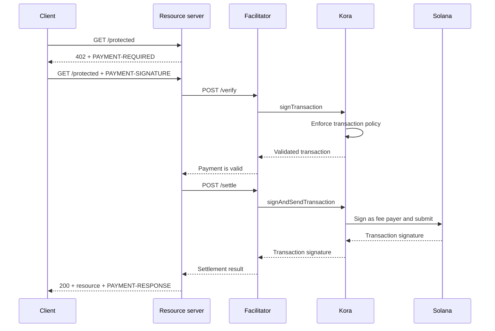

O Kora pode fornecer a camada de assinatura Solana, política de transações e patrocínio de taxas por trás de um [facilitador x402 V2](/docs/tools/x402-facilitator). O facilitador implementa a API HTTP x402; o Kora valida, assina e envia as transações de pagamento que aceita.

Este guia inicia o facilitador de referência do Kora na Solana Devnet. Trata-se de um ambiente de desenvolvimento para testar a integração, não uma implantação em produção.

## Arquitetura



Os quatro papéis da aplicação permanecem separados:

- O **cliente** seleciona um requisito de pagamento e assina a autorização de pagamento.
- O **servidor de recursos** precifica uma rota e a executa somente após verificação e liquidação bem-sucedidas.
- O **facilitador** expõe os endpoints `/supported`, `/verify` e `/settle` do x402.
- O **Kora** assina apenas transações permitidas pela sua política e pode patrocinar as taxas da rede Solana.

O Kora não substitui o protocolo x402. Ele é o limite de assinatura e política usado por esta implementação do facilitador.

## Iniciar o facilitador de referência

Você precisa do Git e do [Docker com Compose](https://docs.docker.com/compose/). Clone a versão estável mais recente do Kora e acesse a demonstração do x402:

```bash
git clone --branch v2.0.5 --depth 1 https://github.com/solana-foundation/kora.git
cd kora/examples/x402/demo
cp .env.example .env
```

Defina `KORA_PRIVATE_KEY` no `.env` com um keypair descartável da Devnet. A configuração do assinador da demonstração aceita um segredo em base58, um keypair em array de bytes ou o caminho para um arquivo keypair JSON. Financie o endereço público com SOL da Devnet para que ele possa patrocinar as taxas de transação.

<Callout type="caution" title="Use um assinador descartável da Devnet">
  A demonstração Docker carrega o assinador do Kora a partir de uma variável de ambiente. Não insira uma chave de assinatura de produção nesta demonstração nem faça commit do arquivo `.env`.
</Callout>

Inicie o Kora e o facilitador:

```bash
docker compose up --build
```

A primeira compilação pode levar vários minutos. Quando ambas as verificações de saúde passarem, inspecione as capacidades anunciadas do facilitador em outro terminal:

```bash
curl http://127.0.0.1:3000/supported
```

A resposta deve anunciar a versão `2` do x402, o esquema `exact` e o identificador de rede CAIP-2 da Devnet:

```json
{
  "kinds": [
    {
      "x402Version": 2,
      "scheme": "exact",
      "network": "solana:EtWTRABZaYq6iMfeYKouRu166VU2xqa1",
      "extra": {
        "feePayer": "<KORA_SIGNER_ADDRESS>"
      }
    }
  ]
}
```

O Kora escuta em `127.0.0.1:8080` e o facilitador escuta em `127.0.0.1:3000` por padrão. Pare a demonstração com `Ctrl+C`.

## Conectar um servidor de recursos

Configure o servidor de recursos x402 para usar o facilitador local e o endereço público do assinador do Kora como destinatário:

```bash
FACILITATOR_URL=http://127.0.0.1:3000
SOLANA_PAY_TO=<KORA_SIGNER_ADDRESS>
```

Em seguida, siga o [x402 no Solana](/docs/payments/agentic-payments/x402) para adicionar o middleware x402 V2 a uma rota Express. Uma requisição não paga recebe `PAYMENT-REQUIRED`, a nova tentativa carrega `PAYMENT-SIGNATURE` e uma resposta bem-sucedida carrega `PAYMENT-RESPONSE`.

Não copie exemplos que usem `X-PAYMENT`, `X-PAYMENT-RESPONSE` ou o nome de rede `solana-devnet`. Esses campos pertencem ao x402 V1.

O repositório do Kora também inclui uma API protegida e um cliente ciente de pagamentos no mesmo diretório `examples/x402/demo`. Use essas aplicações quando precisar exercitar o fluxo local completo.

## Configurar a política do Kora

O `kora/kora.toml` de referência é intencionalmente restrito. Sua política de validação controla:

- quais programas Solana o assinador permite;
- quais mints de token SPL podem ser usados;
- o máximo de lamports patrocinados e a contagem de assinaturas;
- quais operações do pagador de taxas são proibidas; e
- quais extensões do Token-2022 são rejeitadas.

A demonstração habilita apenas os métodos RPC do Kora que seu facilitador necessita:
`signTransaction`, `signAndSendTransaction`, `getBlockhash`, `getPayerSigner`,
`getConfig` e `getVersion`.

Trate a política como o limite de segurança para a chave do pagador de taxas. Para um serviço em produção:

1. Inclua na lista de permissões apenas os programas, mints de token e formatos de transação que seu esquema x402 produz.
2. Negue transferências, alterações de autoridade, encerramento de contas e outras instruções que possam mover valor do assinador do Kora.
3. Defina limites de transação e uso que restrinjam a perda decorrente de uma credencial de facilitador comprometida.
4. Use um backend de assinador gerenciado em vez de uma chave privada mantida em variável de ambiente.

## Proteger a conexão do facilitador com o Kora

A demonstração habilita a autenticação por chave de API do Kora. O facilitador envia o valor de `KORA_API_KEY`, que deve corresponder a `[kora.auth].api_key` em `kora.toml`.

Para produção, também:

- mantenha o Kora em uma rede privada e encerre o TLS em um limite confiável;
- armazene credenciais de API em um gerenciador de segredos e faça a rotação delas;
- considere a autenticação de requisições HMAC do Kora para proteção contra adulteração e replay;
- separe as chaves do pagador de taxas e do destinatário do pagamento quando seu modelo de contabilidade exigir; e
- configure alertas para rejeições de política, falhas de liquidação, consumo de taxas e saldo do assinador.

## Fortalecer a liquidação de pagamentos

O Kora valida a transação Solana, mas o facilitador e o servidor de recursos ainda são responsáveis pela corretude do protocolo x402. Antes de entregar um recurso, aplique:

- a versão x402 selecionada, o esquema, a rede, o ativo, o valor e o destinatário;
- o tempo de vida da autorização e o layout exato das instruções Solana;
- proteção atômica contra replay e liquidação idempotente;
- confirmação no nível de comprometimento exigido pelo produto; e
- um mapeamento durável entre a compra, o resultado da liquidação e o cumprimento.

Não retorne conteúdo pago apenas porque o Kora aceitou uma transação para assinatura. Execute o cumprimento somente após o facilitador retornar um resultado de liquidação bem-sucedido.

## Recursos relacionados

- [Repositório do Kora e demonstração x402](https://github.com/solana-foundation/kora/tree/main/examples/x402/demo)
- [Configuração do operador do Kora](/docs/tools/kora/operators/configuration)
- [Backends de assinador do Kora](/docs/tools/kora/operators/signers)
- [Auditorias de segurança do Kora](/docs/tools/kora/security-audits)
- [Especificação x402 V2](https://github.com/x402-foundation/x402/blob/main/specs/x402-specification-v2.md)
- [Visão geral de pagamentos agênticos](/docs/payments/agentic-payments)
