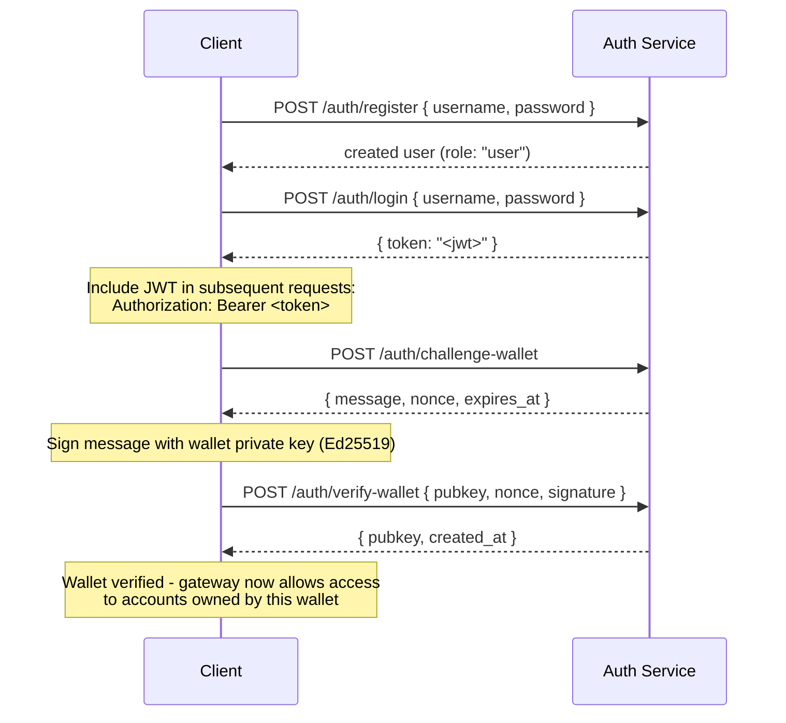

## Visão Geral

Os Canais Privados incluem um Serviço de Autenticação opcional que controla o acesso ao gateway
com autenticação JWT e controlo de acesso baseado em funções (RBAC). Quando
a autenticação está desativada, o gateway aceita todas as ligações. Quando ativada,
os clientes devem apresentar um JWT válido em cada pedido.

Esta página abrange dois públicos:

- **Developers** - registo, login, verificação de carteira e realização de
  pedidos autenticados
- **Operadores** - ativação do serviço de autenticação, configuração do `JWT_SECRET` e
  aprovisionamento da função `operator`

## Ativar a Autenticação

A autenticação é ativada ao definir `JWT_SECRET` (não vazio) tanto no
gateway como no Serviço de Autenticação. O Serviço de Autenticação também requer
`AUTH_DATABASE_URL`.

Quando `JWT_SECRET` não está definido, o gateway funciona em modo aberto; não é necessário
nenhum token.

> **Docker Compose:** O serviço de autenticação é um perfil Docker Compose e **não
> é iniciado por defeito**. Para o incluir, passe `--profile auth` ao seu
> comando `docker compose`, incluindo `--env-file .env` para que os segredos como
> `JWT_SECRET` e `POSTGRES_PASSWORD` sejam corretamente resolvidos (o Compose desativa o
> carregamento automático do `.env` assim que qualquer flag `--env-file` é passada):
>
> ```bash
> docker compose -f docker-compose.devnet.yml --env-file versions.env --env-file .env.devnet --env-file .env --profile auth up -d
> ```

## API do Serviço de Autenticação

Todos os endpoints estão sob `/auth`. O serviço de autenticação escuta na porta `AUTH_PORT`
(predefinição `8903`).

### `POST /auth/register`

Criar uma nova conta. Todos os utilizadores são registados com a função `user`.

```json
{ "username": "alice", "password": "hunter2" }
```

- Nome de utilizador: 5-32 caracteres, alfanumérico mais `_` e `-`
- Palavra-passe: 6-128 caracteres
- Devolve o utilizador criado; a palavra-passe nunca é devolvida

### `POST /auth/login`

Autenticar e receber um JWT assinado válido por 24 horas.

```json
{ "username": "alice", "password": "hunter2" }
```

Devolve `{ "token": "<jwt>" }`. Tanto um nome de utilizador errado como uma palavra-passe errada devolvem
`401` para evitar a enumeração de nomes de utilizador.

### `POST /auth/challenge-wallet`

Solicitar um desafio de assinatura para provar a posse de uma carteira Solana. Requer um
JWT válido.

Devolve uma mensagem, um nonce e uma expiração. O desafio expira em 10 minutos.

```json
{
  "message": "PrivateChannel wallet verification\nuser: <uuid>\nnonce: <uuid>\nexpires: <unix>",
  "nonce": "<uuid>",
  "expires_at": "<iso8601>"
}
```

### `POST /auth/verify-wallet`

Submeter o desafio assinado para registar uma carteira como verificada. Requer um JWT válido.

```json
{
  "pubkey": "<base58 pubkey>",
  "nonce": "<uuid from challenge>",
  "signature": "<base58 Ed25519 signature>"
}
```

O serviço reconstrói a mensagem do desafio, verifica a assinatura Ed25519
e armazena a carteira. Cada nonce só pode ser consumido uma vez; repetições são
rejeitadas.

Devolve `{ "pubkey": "<base58>", "created_at": "<iso8601>" }`.

### `GET /auth/wallets`

Listar todas as carteiras verificadas do utilizador autenticado. Requer um JWT válido.

### `DELETE /auth/wallets/{pubkey}`

Remover uma carteira verificada da conta do utilizador autenticado. Requer um JWT válido.

### `GET /health`

Verificação de disponibilidade. Devolve `200 ok`. Não requer autenticação.

## Estrutura do JWT

Os tokens utilizam o algoritmo HS256 e expiram 24 horas após a emissão.

| Claim  | Valor                           |
| ------ | ------------------------------- |
| `sub`  | UUID do utilizador                       |
| `role` | `"user"` ou `"operator"`        |
| `iss`  | `"private-channel-auth"`        |
| `aud`  | `"private-channel-gateway"`     |
| `exp`  | Timestamp Unix (24h após emissão) |

> `iss` e `aud` estão presentes no payload do JWT mas são validados pela
> configuração JWT do gateway, não desserializados na struct de claims da aplicação.
> O código da camada de aplicação tem acesso apenas a `sub`, `role` e `exp`.

Passe o token no cabeçalho `Authorization`:

```
Authorization: Bearer <JWT_TOKEN>
```

## Funções

### user

Função predefinida no registo.

- O acesso está restrito às carteiras verificadas do próprio utilizador
- Bloqueado de: `getBlock`, `getTransaction`, `simulateTransaction`
- Pode: chamar `Deposit` no Escrow Program, iniciar levantamentos via
  `WithdrawFunds`

### operator

Função elevada. Deve ser aprovisionada diretamente; não existe um caminho de self-service para
escalar de `user` para `operator`.

**Atribuir a função**, seja através da CLI de Administração (`private-channel-auth-admin`):

```bash
private-channel-auth-admin set-role --username alice --role operator
```

ou com SQL direto:

<Callout type="warning">
  Esta é uma operação de base de dados privilegiada. Restrinja o acesso à base de dados do Serviço de Autenticação
  em conformidade e audite quaisquer alterações de funções.
</Callout>

```sql
UPDATE private_channel_auth.users SET role = 'operator' WHERE username = 'alice';
```

**Registar uma carteira sem o fluxo de auto-verificação (CLI de Administração,
`private-channel-auth-admin`):**

```bash
private-channel-auth-admin attach-wallet --username alice --pubkey <base58-pubkey>
```

Este comando insere uma carteira verificada diretamente na tabela `verified_wallets`,
contornando o fluxo de desafio/verificação. Aplica uma restrição de unicidade em
`(user_id, pubkey)`. **Não** atribui a função `operator` por si só; utilize
`set-role` ou a atualização SQL acima para isso. Este comando destina-se a associar uma
carteira a uma conta (por exemplo, uma conta de serviço) sem exigir o
fluxo interativo de desafio/verificação.

**Capacidades:**

- Ignora todas as verificações de posse de carteira
- Acesso completo a todos os métodos RPC do gateway, incluindo `getBlock`,
  `getTransaction`, `simulateTransaction`
- Obrigatório para: `ReleaseFunds`, `ResetSmtRoot`

## Fluxo de Autenticação Completo



## Realizar Pedidos Autenticados

```typescript
const response = await fetch("http://localhost:8899/", {
  method: "POST",
  headers: {
    "Content-Type": "application/json",
    Authorization: `Bearer ${jwtToken}`
  },
  body: JSON.stringify({
    jsonrpc: "2.0",
    id: 1,
    method: "getBalance",
    params: [walletAddress]
  })
});
const data = await response.json();
```

## Endpoints do Gateway

Estes endpoints não requerem autenticação:

| Endpoint  | Método | Descrição                               | Sucesso                  | Falha                     |
| --------- | ------ | ----------------------------------------- | ------------------------ | --------------------------- |
| `/health` | GET    | Verificação de disponibilidade                            | `200 {"status":"ok"}`    | -                           |
| `/ready`  | GET    | Prontidão detalhada; testa nós de escrita e leitura | `200 {"status":"ready"}` | `503 {"status":"degraded"}` |

Para a referência de `JWT_SECRET` e variáveis de ambiente do gateway, consulte a
[referência de Configuração](/docs/tools/private-channels/operators/configuration).

## Matriz de Acesso a Métodos RPC

Os seguintes métodos são reconhecidos pelo gateway. Quando `JWT_SECRET` está definido,
o acesso depende da função no JWT:

| Método                        | Rota      | Sem JWT | `user`           | `operator` |
| ----------------------------- | ---------- | ------ | ---------------- | ---------- |
| `sendTransaction`             | Nó de escrita | ✓      | ✓                | ✓          |
| `getLatestBlockhash`          | Nó de leitura  | ✓      | ✓                | ✓          |
| `getSlot`                     | Nó de leitura  | ✓      | ✓                | ✓          |
| `getRecentBlockhash`          | Nó de leitura  | ✓      | ✓                | ✓          |
| `getSignatureStatuses`        | Nó de leitura  | ✓      | ✓                | ✓          |
| `getTransactionCount`         | Nó de leitura  | ✓      | ✓                | ✓          |
| `getFirstAvailableBlock`      | Nó de leitura  | ✓      | ✓                | ✓          |
| `getBlocks`                   | Nó de leitura  | ✓      | ✓                | ✓          |
| `getEpochInfo`                | Nó de leitura  | ✓      | ✓                | ✓          |
| `getEpochSchedule`            | Nó de leitura  | ✓      | ✓                | ✓          |
| `getRecentPerformanceSamples` | Nó de leitura  | ✓      | ✓                | ✓          |
| `getBlockTime`                | Nó de leitura  | ✓      | ✓                | ✓          |
| `getVoteAccounts`             | Nó de leitura  | ✓      | ✓                | ✓          |
| `getSupply`                   | Nó de leitura  | ✓      | ✓                | ✓          |
| `getSlotLeaders`              | Nó de leitura  | ✓      | ✓                | ✓          |
| `isBlockhashValid`            | Nó de leitura  | ✓      | ✓                | ✓          |
| `getAccountInfo`              | Nó de leitura  | 401    | restrito por posse¹ | ✓          |
| `getTokenAccountBalance`      | Nó de leitura  | 401    | restrito por posse¹ | ✓          |
| `getSignaturesForAddress`     | Nó de leitura  | 401    | restrito por posse¹ | ✓          |
| `getBlock`                    | Nó de leitura  | 401    | 403              | ✓          |
| `getTransaction`              | Nó de leitura  | 401    | 403              | ✓          |
| `simulateTransaction`         | Nó de leitura  | 401    | 403              | ✓          |

¹ **Restrito por posse**: para um token account SPL (o campo owner é `TokenkegQ...`
ou `TokenzQ...`, com dados de pelo menos 165 bytes), o gateway verifica se o
campo `owner` ou `delegate` corresponde a uma das carteiras verificadas do utilizador autenticado. Para qualquer outro tipo de conta (uma carteira System Program, ou um PDA desconhecido), verifica em vez disso se o próprio pubkey consultado é uma das carteiras verificadas do utilizador, uma vez que essas contas não têm campo owner/delegate para inspecionar.
A falha em qualquer uma das verificações devolve 403.
