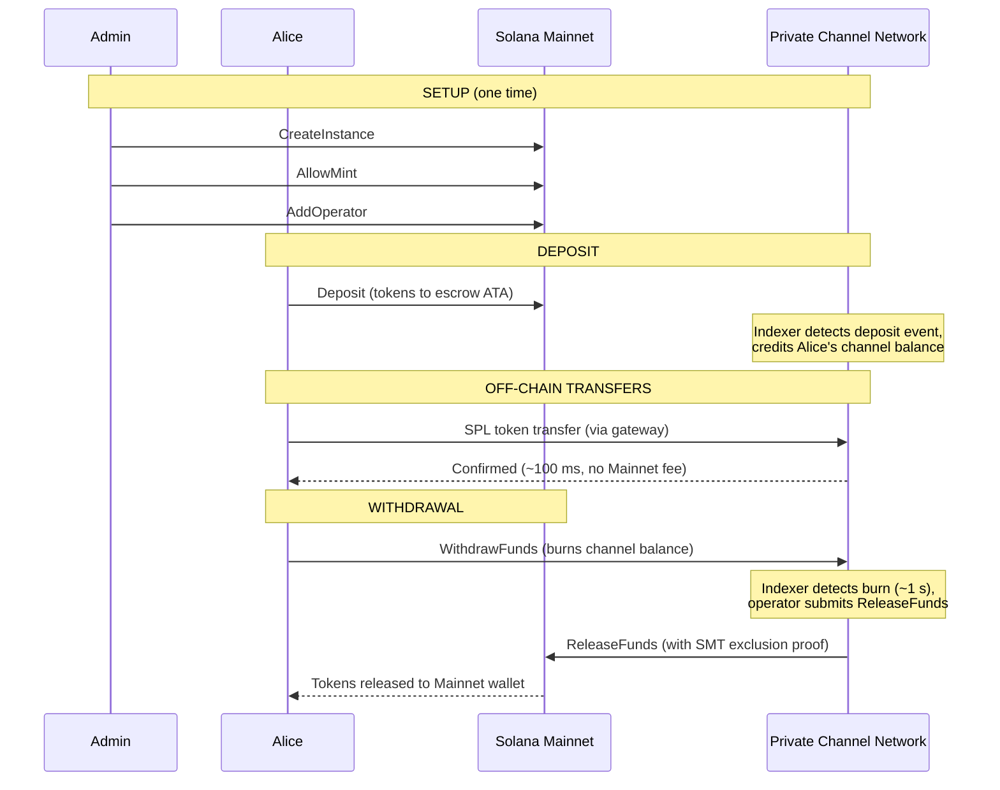
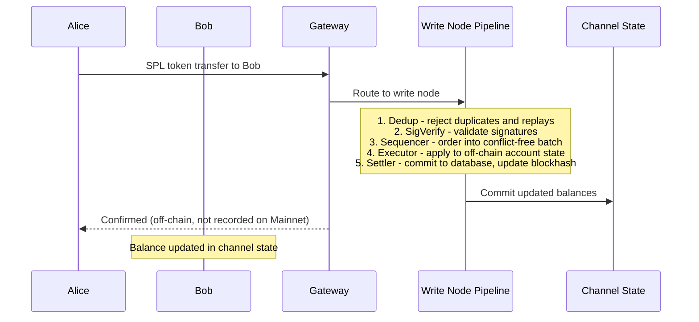
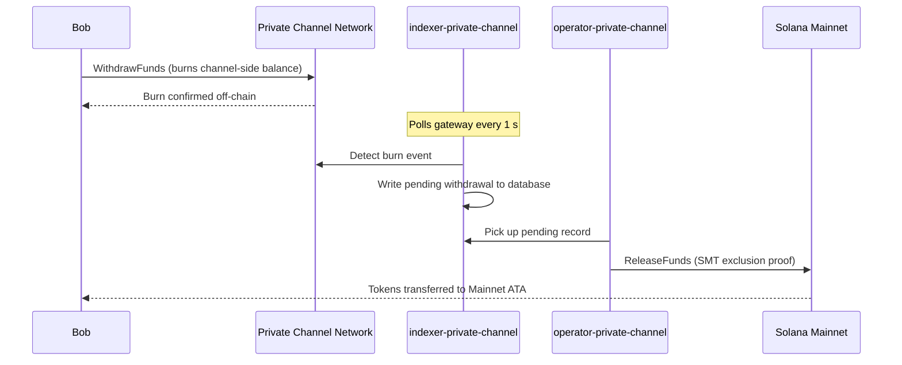

## O que é um Canal Privado?

Um canal privado é uma rede de pagamento off-chain ancorada à Solana. Os utilizadores depositam tokens SPL num programa de custódia on-chain e, em seguida, realizam transações off-chain através de um gateway com alta velocidade e custo zero por transferência. A liquidação de volta à Mainnet da Solana ocorre por meio de uma prova de Sparse Merkle Tree, garantindo que os fundos sejam sempre resgatáveis e que gastos duplos sejam impossíveis.

Ao contrário do fluxo de pagamento nativo da Solana, as transferências dentro de um canal não aparecem on-chain até que o utilizador efetue um levantamento. A rede do canal executa o seu próprio pipeline de transações (dedup -> sig verify -> sequencer -> executor -> settler) que processa transações de forma independente do tempo de bloco da Solana.

## Participantes

### Admin da Instância

O admin implementa o PDA `Instance` através do `CreateInstance` e controla quais mints de tokens SPL são aceites (`AllowMint` / `BlockMint`). O admin provisiona e revoga operadores através de `AddOperator` / `RemoveOperator`, e pode transferir direitos de administração via `SetNewAdmin`. Existe um admin por instância. A transferência de direitos de administração é irreversível num único passo: o admin atual não pode recuperar o papel sem a cooperação do novo admin.

### Operadores

Os operadores são provisionados pelo admin. Eles detêm um PDA `Operator` e são as únicas contas autorizadas a chamar `ReleaseFunds` (para liquidar levantamentos para a Mainnet) e `ResetSmtRoot` (para rodar a Sparse Merkle Tree). Os operadores ignoram todas as verificações de propriedade no gateway e têm acesso a todos os métodos JSON-RPC, incluindo `getBlock`, `getTransaction` e `simulateTransaction`. Papel JWT: `"operator"`. Os operadores devem ser provisionados diretamente na base de dados; não existe escalonamento de autosserviço. Consulte o [guia de Operadores](/docs/tools/private-channels/operators) para detalhes de implementação e configuração.

### Utilizadores

Os utilizadores registam-se de forma autónoma através do Serviço de Autenticação. Papel JWT: `"user"`. Os utilizadores podem chamar `Deposit` diretamente no Programa de Custódia e iniciar levantamentos através da instrução `WithdrawFunds` do lado do canal no Programa de Levantamento. O acesso ao gateway está limitado às suas próprias carteiras verificadas; não podem chamar `getBlock`, `getTransaction` ou `simulateTransaction`.

## Ciclo de Vida do Canal

1. **Criação da instância** - O admin chama `CreateInstance`, criando o PDA `Instance` e configurando os mints permitidos.
2. **Depósito** - Os utilizadores depositam tokens SPL na custódia através da instrução `Deposit`. Os tokens são movidos para o associated token account da instância.
3. **Transferências off-chain** - Os utilizadores enviam transferências através do gateway. As transferências são sequenciadas e executadas na rede do canal sem interagir com a Mainnet.
4. **Início do levantamento** - Um utilizador chama `WithdrawFunds` no Programa de Levantamento (lado do canal) para queimar o seu saldo e sinalizar um levantamento.
5. **Liquidação na Mainnet** - Um operador fornece uma prova de exclusão SMT válida e chama `ReleaseFunds` no Programa de Custódia (Mainnet), libertando os tokens para a carteira do utilizador.
6. **Rotação da árvore** - Quando a SMT se aproxima da capacidade (65.536 folhas), o operador chama `ResetSmtRoot` para rodar a árvore e iniciar um novo epoch.

### Transferência

### Levantamento

## Quando Utilizar Canais Privados

Utilize canais privados quando a sua aplicação necessitar de:

- **Throughput off-chain** - o seu volume de transferências saturaria o TPS da Solana ou precisa de confirmação abaixo do segundo
- **Privacidade** - as identidades das contrapartes e os valores das transferências não devem aparecer on-chain
- **Zero taxas por transferência** - transferências frequentes em que o custo de SOL por transação é proibitivo

Utilize transferências SPL nativas quando:

- **A composabilidade on-chain** for necessária (DeFi, swaps, empréstimos; outros programas precisam de observar ou agir sobre a transferência)
- **A liquidação por transferência única** for suficiente e a privacidade não for uma preocupação
- **Não existir infraestrutura de gateway** disponível ou operacionalmente viável
