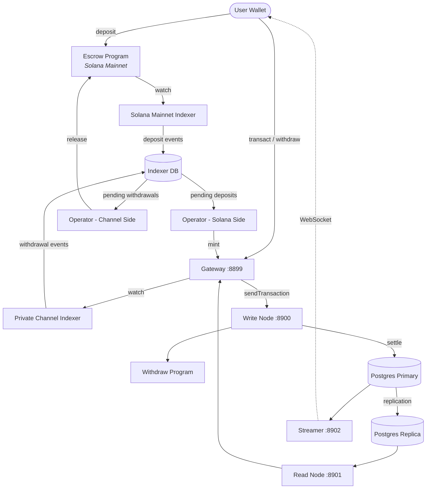

<Callout type="warning">
  O Private Channels não passou por auditoria de segurança e não é recomendado para
  uso em produção com fundos reais sem uma revisão de segurança minuciosa.
</Callout>

<Callout type="info">
  **Quer implantar uma instância?** Acesse o [guia do
  Operador](/docs/tools/private-channels/operators). **Quer integrar com uma
  instância existente?** Acesse o
  [Quickstart](/docs/tools/private-channels/quickstart/installation). Esta página
  é a referência de arquitetura para ambos os públicos.
</Callout>

## Arquitetura

O Private Channels é composto por quatro componentes: dois programas Solana on-chain
(Escrow e Withdraw) e dois serviços off-chain (Gateway e Auth Service).
Juntos, formam um protocolo de canal de estado onde os fundos ficam na Mainnet, mas
as transferências são liquidadas off-chain.

### Programa Escrow

O Programa Escrow é um programa Solana on-chain que armazena tokens SPL
depositados. Ele é a âncora de confiança do sistema: todos os fundos ficam em
escrow até que um operador forneça uma prova de exclusão de Sparse Merkle Tree válida para
liberá-los.

- ID do Programa: `9tgHa1DcnaSSUtmMsst8ovKTe1Gfxzezn27KnH9xXYeU`
- Este ID é compilado no binário do programa via `declare_id!()`. Os serviços off-chain
  leem o mesmo ID em tempo de compilação a partir do crate de cliente gerado, e não
  de uma variável de ambiente.
- Gerencia PDAs de `Instance`, `AllowedMint` e `Operator`
- Instruções: `CreateInstance`, `AllowMint`, `BlockMint`, `AddOperator`,
  `RemoveOperator`, `SetNewAdmin`, `Deposit`, `ReleaseFunds`, `ResetSmtRoot`

### Programa Withdraw

O Programa Withdraw é executado na rede de canais privados, não na Solana Mainnet.
Os usuários chamam `WithdrawFunds` para queimar o saldo de tokens no lado do canal. Essa queima
não libera os fundos automaticamente; ela sinaliza ao operador que há um
saque pendente. O operador então chama `ReleaseFunds` no Programa Escrow
com uma prova SMT válida para concluir a liquidação.

- ID do Programa: `J231K9UEpS4y4KAPwGc4gsMNCjKFRMYcQBcjVW7vBhVi`
- Este ID é compilado no binário do programa. Os serviços off-chain leem o mesmo
  ID em tempo de compilação a partir do crate de cliente gerado, e não de uma variável
  de ambiente.

### Gateway

O Gateway é um proxy compatível com JSON-RPC do Solana que roteia requisições de clientes para
o nó de escrita da rede de canais (para envio de transações) e para o nó de leitura (para
consultas). Ele é configurado por variáveis de ambiente: `GATEWAY_PORT`,
`GATEWAY_WRITE_URL`, `GATEWAY_READ_URL`.

Endpoints de saúde (sem autenticação necessária):

- `GET /health` - verificação de liveness; retorna `200 {"status":"ok"}`
- `GET /ready` - verificação profunda de prontidão, sonda os nós de escrita e leitura; retorna
  `200 {"status":"ready"}` ou `503 {"status":"degraded"}`

#### Roteamento de Métodos RPC e Acesso

O gateway roteia `sendTransaction` para o nó de escrita e todos os outros métodos para
o nó de leitura. Requisições maiores que 64 KB são rejeitadas com HTTP 413. Quando
a autenticação está habilitada, o acesso aos métodos é controlado por função JWT. Consulte
**[Autenticação e Funções](/docs/tools/private-channels/concepts/auth)** para a
matriz completa de métodos.

### Auth Service

O Auth Service é um componente opcional que emite JWTs HS256 (validade de 24 horas)
para controle de acesso ao gateway. Ele é habilitado quando a variável de ambiente `JWT_SECRET`
está definida. Sem ela, o gateway aceita todas as conexões.

Claims do JWT: `sub` (UUID do usuário), `role` (`"user"` ou `"operator"`), `iss`
(`"private-channel-auth"`), `aud` (`"private-channel-gateway"`), `exp` (timestamp Unix). `iss` e `aud` são validados pela configuração JWT do gateway,
e não desserializados na struct de claims da aplicação: apenas `sub`, `role` e
`exp` estão disponíveis para o código da camada de aplicação.

Funções:

- `user` - acesso restrito às próprias carteiras verificadas; não pode chamar `getBlock`,
  `getTransaction` ou `simulateTransaction`
- `operator` - ignora todas as verificações de propriedade; acesso completo aos métodos RPC; deve ser
  provisionado no banco de dados (sem escalonamento por autoatendimento)

### Streamer

O Streamer é um servidor WebSocket que envia atualizações de estado do canal para
clientes conectados em tempo real, eliminando a necessidade de fazer polling no RPC. Ele realiza
polling no PostgreSQL para detectar mudanças de estado. Faz parte da stack base do Docker Compose, e não
da stack devnet que este guia implanta; consulte a
[referência de configuração](/docs/tools/private-channels/operators/configuration#service-port-reference).

- Porta: `8902`, configurável via `STREAMER_PORT`
- Conectar: `ws://localhost:8902`
- Endpoint de saúde: `GET /health` - retorna `503` se qualquer loop de poll interno
  travar por mais de 30 segundos

<Callout type="warning">
  O esquema de eventos WebSocket ainda não está documentado publicamente. Consulte
  [`core/src/bin/streamer.rs`](https://github.com/solana-foundation/solana-private-channels/blob/main/core/src/bin/streamer.rs)
  para detalhes de implementação até que a documentação formal esteja disponível.
</Callout>



## Pipeline de Transações

```text
Transaction -> [1:Dedup] -> [2:SigVerify] -> [3:Sequencer] -> [4:Executor] -> [5:Settler] -> Database
```

As transações enviadas ao Gateway passam por um pipeline de cinco estágios antes
que seu estado seja confirmado:

1. **Dedup** - filtra transações duplicadas antes que entrem no pipeline
2. **SigVerify** - valida as assinaturas das transações em relação à chave pública do assinante
3. **Sequencer** - ordena as transações válidas de forma determinística para estabelecer um
   histórico canônico
4. **Executor** - executa as transações na camada de contas do canal
   (BOB Cache + AccountsDB), atualizando os saldos off-chain
5. **Settler** - confirma os resultados acumulados das transações no PostgreSQL e
   atualiza o cache Redis; gera novos blockhashes para o próximo ciclo de blocos.
   A liquidação na Mainnet (chamada de `ReleaseFunds`) é tratada separadamente pelo
   serviço `operator-private-channel`

## Principais Funcionalidades

### Privacidade

As transferências entre participantes do canal não são registradas na Solana Mainnet. Apenas
depósitos (entrada no canal) e saques finais (saída do canal)
aparecem on-chain. As identidades das contrapartes e os valores das transferências não são visíveis a
observadores externos durante a operação do canal.

### Desempenho

O pipeline off-chain remove o tempo de bloco do Solana do caminho crítico.
As transferências são confirmadas quando o sequencer as processa, e não quando um bloco do Solana
é confirmado. Isso permite finalidade sub-segundo e throughput além do TPS nativo do Solana
para transferências na camada de aplicação.

### Liquidação

Cada saque é protegido por uma prova de Sparse Merkle Tree on-chain. A raiz SMT
é armazenada em `Instance.withdrawal_transactions_root` no Programa Escrow.
Quando `ReleaseFunds` é chamado, o programa primeiro verifica uma prova de exclusão para
um nonce não visto em relação à raiz on-chain atual, depois verifica uma prova de
inclusão separada para esse nonce em relação à nova raiz fornecida pelo chamador. Somente após
ambas as verificações passarem é que a nova raiz é armazenada, tornando o gasto duplo impossível mesmo
se uma chave de operador for comprometida.

## Modelo de Segurança

**Chave admin** - controla a criação de instâncias (`CreateInstance`) e o
provisionamento de operadores (`AddOperator` / `RemoveOperator`). O comprometimento da chave admin
permite o provisionamento arbitrário de operadores. `SetNewAdmin` transfere a autoridade admin
irreversivamente em uma única etapa; proteja a chave admin adequadamente.

**Chaves de operador** - podem chamar `ReleaseFunds` e `ResetSmtRoot`. Elas não podem
liberar fundos sem uma prova de exclusão SMT válida em relação à raiz on-chain atual.
A verificação on-chain `verify_smt_exclusion_proof` é a última linha de
defesa contra saques não autorizados: uma chave de operador comprometida sozinha não é
suficiente para drenar o escrow.

**Raiz SMT** - armazenada on-chain em `Instance.withdrawal_transactions_root`.
Atualizada atomicamente a cada chamada de `ReleaseFunds`. Como cada prova deve
referenciar um nonce não visto, gastar duas vezes o mesmo saldo do canal é
impossível mesmo se uma chave de operador for comprometida.

**Rotação de árvore** - `Instance.current_tree_index` rastreia os epochs da árvore. Quando
`ResetSmtRoot` é chamado, ele incrementa o índice da árvore e invalida todos os
nonces do epoch da árvore anterior, fornecendo um ponto de partida limpo para novos ciclos de liquidação.

## Segurança Operacional de Chaves

<Callout type="warning">
  Os serviços off-chain usam seu próprio vocabulário de assinantes, que não está relacionado
  às autoridades admin/operador on-chain descritas no Modelo de Segurança acima.
  `ADMIN_PRIVATE_KEY` é obrigatório para todo serviço de operador e paga
  as taxas de transação; um `OPERATOR_PRIVATE_KEY` separado e opcional fornece a
  assinatura do Operador on-chain para `ReleaseFunds` e `ResetSmtRoot`, e usa
  o valor de `ADMIN_PRIVATE_KEY` como fallback quando não definido. Nunca insira a chave admin
  da instância no nível do protocolo (usada para `CreateInstance` / `AddOperator` / `SetNewAdmin`)
  em nenhuma das variáveis nem a exponha em tempo de execução; mantenha essa chave fria e offline.
</Callout>

`ReleaseFunds` e `ResetSmtRoot` requerem duas assinaturas on-chain: a do pagador de taxas
(de `ADMIN_PRIVATE_KEY`) e a da autoridade do PDA do Operador (de
`OPERATOR_PRIVATE_KEY`, ou `ADMIN_PRIVATE_KEY` se aquele não estiver definido). O passo a passo
devnet deste guia de implantação insere o keypair de operador gerado em
`ADMIN_PRIVATE_KEY` e deixa `OPERATOR_PRIVATE_KEY` indefinido, fazendo com que o mesmo keypair
preencha ambos os papéis de assinante. Trate a chave que acabar em `ADMIN_PRIVATE_KEY` com
os mesmos controles que uma chave privada de carteira hot:

- Armazene-a apenas no arquivo `.env` ignorado pelo git, nunca em `.env.devnet` ou em qualquer
  configuração versionada
- Para implantações em produção, considere um gerenciador de segredos (AWS Secrets Manager,
  HashiCorp Vault) em vez de uma variável de ambiente em texto simples
- O keypair admin da instância no nível do protocolo (usado para chamar `AddOperator` /
  `SetNewAdmin`) deve ser mantido frio; ele só é necessário durante a configuração da instância
  e o provisionamento do operador, e não durante a execução

`SetNewAdmin` transfere os direitos de admin **irreversivelmente em uma única transação**:
o admin atual não tem caminho de recuperação sem a cooperação do novo admin. Não
o chame sem verificar o endereço de destino.

## Próximos Passos

<Cards>
  <Card
    title="Quickstart"
    href="/docs/tools/private-channels/quickstart/installation"
  >
    Configure seu ambiente e gere clientes TypeScript.
  </Card>
  <Card title="Canais" href="/docs/tools/private-channels/concepts/channels">
    Entenda os participantes e o ciclo de vida do canal.
  </Card>
  <Card
    title="Sparse Merkle Tree"
    href="/docs/tools/private-channels/concepts/smt"
  >
    Entenda como as provas de saque são verificadas on-chain.
  </Card>
  <Card
    title="Instruções"
    href="/docs/tools/private-channels/instructions/deposit"
  >
    Referência completa de instruções para todos os programas.
  </Card>
</Cards>
