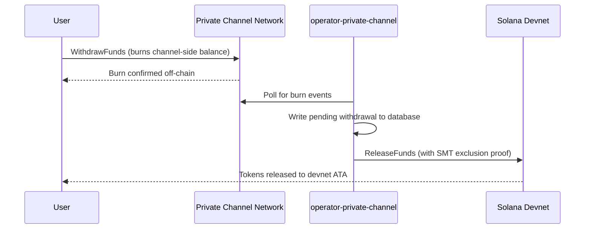

## Visão Geral

O saque dos Canais Privados é um processo de duas etapas. Primeiro, o usuário queima
seu saldo de tokens no lado do canal chamando `WithdrawFunds` no Programa de Saque.
Segundo, um operador chama `ReleaseFunds` no Programa de Escrow (devnet,
neste guia) com uma prova de exclusão válida da Sparse Merkle Tree para liberar
os fundos. A prova SMT garante que cada nonce de saque só possa ser usado uma vez,
evitando gasto duplo.



## Etapa 1: Iniciar o Saque no Canal

Chame `WithdrawFunds` no Programa de Saque para queimar seu saldo no lado do canal.
Use a variante `Async`, que deriva automaticamente o PDA `tokenAccount` e é a
forma recomendada para uso em produção:

```typescript
import { getWithdrawFundsInstructionAsync } from "../private-channel-withdraw-program/clients/typescript/src/generated";
import {
  createSolanaRpc,
  address,
  pipe,
  createTransactionMessage,
  setTransactionMessageFeePayerSigner,
  setTransactionMessageLifetimeUsingBlockhash,
  appendTransactionMessageInstruction,
  signAndSendTransactionMessageWithSigners,
  assertIsTransactionMessageWithSingleSendingSigner,
  getBase58Decoder
} from "@solana/kit";

// Point to the gateway, not a public Solana RPC
const privateChannelRpc = createSolanaRpc("http://localhost:8899");

const withdrawIx = await getWithdrawFundsInstructionAsync({
  user: userSigner,
  mint: address(mintAddress),
  amount: 1_000_000n, // 1 USDC (6 decimals)
  destination: null // null = release to signer's devnet wallet
});

const { value: latestBlockhash } = await privateChannelRpc
  .getLatestBlockhash({ commitment: "confirmed" })
  .send();

// Sent to the Private Channels gateway (not Solana RPC directly), which
// expects the legacy transaction format - do not switch this to version 0.
const transactionMessage = pipe(
  createTransactionMessage({ version: "legacy" }),
  (m) => setTransactionMessageFeePayerSigner(userSigner, m),
  (m) => setTransactionMessageLifetimeUsingBlockhash(latestBlockhash, m),
  (m) => appendTransactionMessageInstruction(withdrawIx, m)
);

assertIsTransactionMessageWithSingleSendingSigner(transactionMessage);

const signatureBytes =
  await signAndSendTransactionMessageWithSigners(transactionMessage);
const signature = getBase58Decoder().decode(signatureBytes);
console.log("Withdrawal initiated:", signature);
```

- ID do Programa de Saque: `J231K9UEpS4y4KAPwGc4gsMNCjKFRMYcQBcjVW7vBhVi`
- Envie esta transação para o gateway (`http://localhost:8899`), e não para um
  RPC público da Solana
- Se `destination` for fornecido, os fundos liberados irão para essa carteira em vez da
  carteira do signatário

## O Que Esperar

Nenhuma ação adicional é necessária após chamar `WithdrawFunds`. Os serviços do
operador lidam com a liquidação automaticamente:

1. `indexer-private-channel` verifica o canal a cada 1 segundo em busca de eventos de queima
   e registra um saque pendente quando o seu for detectado
2. `operator-private-channel` verifica o banco de dados a cada 1 segundo em busca de
   registros pendentes e envia `ReleaseFunds` ao Programa de Escrow na devnet da Solana
   com a prova de exclusão SMT necessária; verifica a confirmação na devnet até
   5 vezes em intervalos de 400 ms antes de tentar novamente

Os fundos geralmente aparecem em sua carteira devnet em poucos segundos em condições normais.

## Como o Operador Realiza a Liquidação (Referência)

Após a queima no lado do canal, um operador provisionado deve chamar `ReleaseFunds` no
Programa de Escrow com uma prova de exclusão SMT válida; o operador não pode liberar
os fundos sem provar que o nonce de saque não foi usado anteriormente. Esta etapa
é tratada automaticamente pelo `operator-private-channel`; você não precisa chamá-la
diretamente.

O operador fornece:

- `amount`: deve corresponder ao valor queimado
- `user`: carteira destinatária na devnet
- `new_withdrawal_root`: raiz SMT atualizada após este saque
- `transaction_nonce`: nonce único para esta folha
- `sibling_proofs`: 512 bytes (16 hashes de irmãos de 32 bytes para a prova da árvore)

## Verificar

Após a confirmação da chamada do operador, verifique seu saldo de tokens na devnet:

```bash
spl-token balance <MINT_ADDRESS> --owner <YOUR_WALLET>
```

Ou via RPC:

```typescript
import { createSolanaRpc, address } from "@solana/kit";
import { findAssociatedTokenPda } from "@solana-program/token";

const TOKEN_PROGRAM_ADDRESS = address(
  "TokenkegQfeZyiNwAJbNbGKPFXCWuBvf9Ss623VQ5DA"
);

// Query devnet directly; ReleaseFunds settles here, not through the gateway
const rpc = createSolanaRpc("https://api.devnet.solana.com");

const [yourDevnetAta] = await findAssociatedTokenPda({
  mint: address(mintAddress),
  owner: address(userSigner.address),
  tokenProgram: TOKEN_PROGRAM_ADDRESS
});

const balance = await rpc.getTokenAccountBalance(yourDevnetAta).send();
console.log(balance.value.uiAmountString);
```

## Você Concluiu o Guia de Início Rápido

Você executou o ciclo completo dos Canais Privados na devnet: depositou tokens SPL no
escrow, enviou uma transferência off-chain pelo gateway e sacou fundos
de volta para sua carteira devnet.

<Cards>
  <Card
    title="Ciclo de Vida do Canal"
    href="/docs/tools/private-channels/concepts/channels"
  >
    Entenda os participantes e o fluxo completo de depósito até saque em profundidade.
  </Card>
  <Card
    title="Autenticação e Funções"
    href="/docs/tools/private-channels/concepts/auth"
  >
    Adicione autenticação JWT à sua integração.
  </Card>
  <Card
    title="Referência de Liberação de Fundos"
    href="/docs/tools/private-channels/instructions/release-funds"
  >
    Referência completa da instrução ReleaseFunds para ferramentas de operador.
  </Card>
  <Card
    title="Sparse Merkle Tree"
    href="/docs/tools/private-channels/concepts/smt"
  >
    Entenda como as provas de saque evitam gastos duplos.
  </Card>
</Cards>
