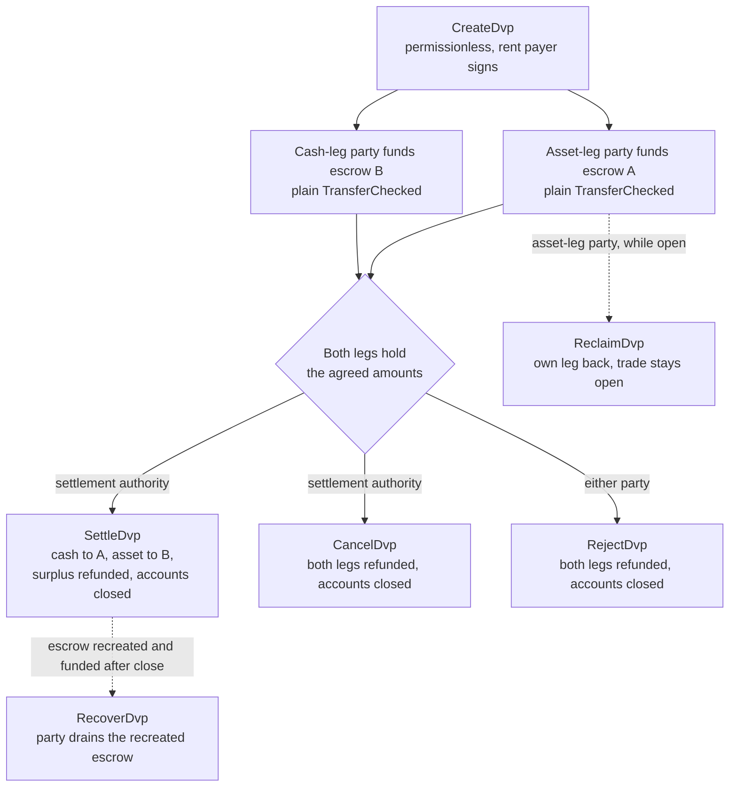
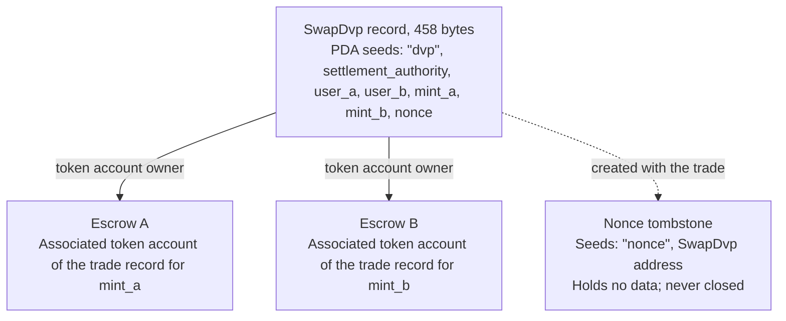

Программа DvP — это стандартная программа для «поставки против платежа» в Solana; её поддерживает Solana Foundation, а аудит провела Cantina. Две стороны согласуют сделку, каждая отправляет свою часть на эскроу-аккаунт обычным переводом токенов, а расчётный орган проводит расчёт по обеим частям в одной транзакции: либо переводятся обе части, либо ни одна. Расчётный орган — это третий адрес, указанный в сделке, например площадка или агент, организовавший её. Ни одной из сторон не нужно писать или деплоить программу, а кошелёк или кастодиан, способный отправить стандартный перевод токенов (`TransferChecked`), может пополнить часть без какой-либо интеграции с DvP. До расчёта любая из сторон может забрать свою часть обратно или расторгнуть сделку.

<Callout type="warn" title="Прочитайте запись, прежде чем действовать">

Создать запись о сделке может кто угодно, поэтому наличие записи не доказывает согласия сторон. Каждая сторона читает сохранённые условия перед пополнением, а расчётный орган — перед расчётом (см. [проверку](#verification-before-funding-and-settlement)).

</Callout>

## Как это работает

Каждой сделке соответствуют запись, принадлежащая программе, и два эскроу-аккаунта — по одному на каждую часть. Сторона с активом (`user_a`) и сторона с денежной частью (`user_b`) пополняют каждая свою часть, переводя токены на эскроу-аккаунт этой части. Расчёт может провести только расчётный орган — единственный подписант с такими правами. При расчёте согласованная сумма каждой части переводится противоположной стороне, излишек возвращается стороне, которой принадлежит часть, а запись и оба эскроу закрываются. Атомарность обеспечивают [транзакции](/docs/core/transactions) Solana: оба перевода выполняются в одной транзакции, поэтому либо вступают в силу оба, либо ни один.

Любой возврат, изъятие и возврат излишка направляются на собственный associated token account стороны: `user_a` — для `mint_a`, `user_b` — для `mint_b`. Кастодиан или казначейская система может пополнить часть со своего аккаунта, но всё возвращаемое попадает на аккаунт стороны, а не обратно к кастодиану. Кроме того, каждая сделка оставляет постоянный аккаунт-маркер (см. [Состояние](#state)).

## Руководства

Страницы с шагами проводят одну сделку от создания до расчёта, с примерами на TypeScript и Rust для каждой инструкции.

<Cards>
  <Card title="Создание сделки" href="/docs/defi/dvp-program/create-a-trade">
    Установите клиенты и запишите условия сделки с помощью CreateDvp
  </Card>
  <Card title="Пополнение частей" href="/docs/defi/dvp-program/fund-the-legs">
    Проверьте сохранённые условия, затем пополните каждую часть обычным переводом
  </Card>
  <Card title="Расчёт по сделке" href="/docs/defi/dvp-program/settle-the-trade">
    Проведите расчёт по обеим частям в одной транзакции в роли расчётного органа
  </Card>
  <Card title="Расторжение сделки" href="/docs/defi/dvp-program/unwind-a-trade">
    Заберите часть, отмените или отклоните сделку и верните запоздавшие депозиты
  </Card>
</Cards>

[Демо в devnet](https://solana.com/delivery-vs-payment/demo) проводит сделку от начала до конца: создаёт её, пополняет оба эскроу стандартными переводами токенов и проводит расчёт по обеим частям в одной транзакции.

## Выбор между программой и делегированием

[«Поставка против платежа» (DvP) с делегированием](/docs/tokenization/dvp) позволяет провести тот же обмен без программы: каждая сторона делегирует свою позицию расчётному агенту, который переводит обе части в одной транзакции.

- **Программа** не требует делегирования, поэтому ограничение в один делегат на token account не действует, а расчётный орган не может перенаправить поступления. Каждая сделка зависит от обновляемой программы и её upgrade authority.
- **Шаблон с делегированием** не зависит от программы и работает с минтами, у которых включено расширение Scaled UI Amount. Программа такие минты отклоняет, из-за чего не подходят любые минты, созданные по шаблону `tokenized-security` из Mosaic (см. [ограничения конфигурации минта](#mint-configuration-constraints)).

## Роли

Программа симметрична. В её интерфейсе две стороны — это `user_a`, который поставляет `mint_a`, и `user_b`, который поставляет `mint_b`. В README и сгенерированных клиентах `mint_a` называется частью с активом, а `mint_b` — денежной частью; эти страницы следуют той же конвенции, но программа не требует, чтобы денежная часть была денежным инструментом. Два актива или два стейблкоина рассчитываются точно так же.

| Роль                 | Кто                               | Подписывает                                              | Примечания                                                                                                                                                                                                     |
| -------------------- | --------------------------------- | -------------------------------------------------- | --------------------------------------------------------------------------------------------------------------------------------------------------------------------------------------------------------- |
| Сторона с активом      | `user_a`, поставляет `mint_a`       | Собственный перевод для пополнения; Reclaim, Reject, Recover | Кошелёк на keypair или смарт-кошелёк на основе PDA, например multisig-хранилище. Multisig-аккаунт SPL Token или program account не может быть стороной: Create завершается ошибкой `PartyNotSignerCapable`                   |
| Сторона с денежной частью       | `user_b`, поставляет `mint_b`       | Собственный перевод для пополнения; Reclaim, Reject, Recover | То же требование                                                                                                                                                                                          |
| Расчётный орган | Третий адрес, указанный при создании | Settle, Cancel                                     | Единственный подписант, который может провести расчёт. Не может перенаправить поступления, которые фиксируются при создании. При расчёте или отмене получает rent закрываемых аккаунтов                                         |
| Плательщик rent           | Тот, кто подписывает `CreateDvp`         | Create                                             | Вносит rent (депозит в SOL, удерживающий аккаунт открытым) за запись, nonce tombstone и оба эскроу. Не записывается как получатель rent: rent закрытых аккаунтов получает тот, кто закрывает сделку |

## ID программы

```text
dvp34bdbcEm4f4FCUjGV4mDAkDshaQR4LkK8fdcsyZq
```

| Кластер      | Программа                                       | Upgrade authority                              | Последний slot деплоя |
| ------------ | --------------------------------------------- | ---------------------------------------------- | ------------------ |
| mainnet-beta | `dvp34bdbcEm4f4FCUjGV4mDAkDshaQR4LkK8fdcsyZq` | `DXtFpbPjcn2hxPnw79x1Pfoj35vXh5AsWBkS37YnXMVv` | 452,058,374        |
| devnet       | `dvp34bdbcEm4f4FCUjGV4mDAkDshaQR4LkK8fdcsyZq` | `5EX1zFeJWj4rGYZv432WnYw8CbaSUeTdxPx4r573UgYU` | 479,376,863        |

Программа обновляема в обоих кластерах. Приведённые значения — это то, что `solana program show` вывела 2 октября 2026 года; для актуальных значений выполните ту же команду. Сборка в devnet старше коммита, под который написаны страницы с шагами (см. [Установка](/docs/defi/dvp-program/create-a-trade#install)), но набор инструкций и ошибок тот же.

## Жизненный цикл



Сделка открыта с момента `CreateDvp` и до тех пор, пока одна из инструкций Settle, Cancel или Reject не закроет её. У пополнения нет отдельной инструкции: часть считается пополненной, когда её эскроу-аккаунт содержит не меньше согласованной суммы. Reclaim работает для отдельной части и оставляет сделку открытой, поэтому проблема с одной частью не вынуждает другую сторону отменять всю сделку.

## Состояние

У каждой сделки есть один аккаунт `SwapDvp` размером 458 байт, принадлежащий программе. Его адрес выводится из расчётного органа, двух сторон, двух минтов и nonce (seeds `["dvp", settlement_authority, user_a, user_b, mint_a, mint_b, nonce]`). Суммы и время хранятся внутри аккаунта и не влияют на адрес, поэтому их нужно читать, а не выводить. Небольшой аккаунт-маркер, nonce tombstone по адресу `["nonce", swap_dvp]`, создаётся вместе со сделкой и никогда не закрывается, поэтому каждую комбинацию сторон, минтов, органа и nonce можно использовать только для одной сделки.



| Поле                                  | Тип          | Значение                                                                                                 |
| -------------------------------------- | ------------- | ------------------------------------------------------------------------------------------------------- |
| `bump`                                 | `u8`          | PDA bump                                                                                                |
| `user_a`, `user_b`                     | `Pubkey`      | Две стороны                                                                                         |
| `mint_a`, `mint_b`                     | `Pubkey`      | Минты части с активом и денежной части                                                                        |
| `settlement_authority`                 | `Pubkey`      | Единственный подписант, который может провести расчёт или отменить сделку                                                               |
| `token_program_a`, `token_program_b`   | `Pubkey`      | token program, которой принадлежит каждый минт; в одной сделке могут сочетаться части SPL Token и Token-2022                    |
| `amount_a`, `amount_b`                 | `u64`         | Согласованная сумма каждой части в наименьшей единице минта (базовые единицы)                                 |
| `expiry_timestamp`                     | `i64`         | После этого сетевого времени (ончейн-часов) Settle отклоняется. Reclaim, Cancel и Reject продолжают работать |
| `nonce`                                | `u64`         | Различает сделки, у которых совпадают остальные seeds. Одноразовый                                             |
| `ref_string`                           | `[u8; 64]`    | Непрозрачная клиентская ссылка, дополненная нулями; программа её никогда не читает                                     |
| `user_a_settlement_destination`        | `Pubkey`      | Получает денежную часть при Settle; по умолчанию `user_a`                                                   |
| `user_b_settlement_destination`        | `Pubkey`      | Получает часть с активом при Settle; по умолчанию `user_b`                                                  |
| `mint_a_authority`, `mint_b_authority` | `Pubkey`      | Mint authority, зафиксированные при создании; Settle завершается ошибкой, если любая из них изменилась                           |
| `earliest_settlement_timestamp`        | `Option<i64>` | Если задано, Settle отклоняется до наступления этого сетевого времени                                                     |

Список полей взят из IDL программы в коммите, указанном в разделе [Создание сделки](/docs/defi/dvp-program/create-a-trade#install).

## Инструкции

| Инструкция  | Подписант               | Результат                                                                                                                                                              |
| ------------ | -------------------- | ------------------------------------------------------------------------------------------------------------------------------------------------------------------- |
| `CreateDvp`  | Любой плательщик            | Создаёт запись `SwapDvp`, её nonce tombstone и оба эскроу-аккаунта. Токены не перемещает                                                                        |
| `ReclaimDvp` | `user_a` или `user_b` | Возвращает из эскроу собственную часть подписанта. Сделка остаётся открытой, и часть можно пополнить снова                                                                      |
| `SettleDvp`  | Расчётный орган | Переводит `amount_a` на адрес назначения `user_b`, а `amount_b` — на адрес назначения `user_a`, возвращает излишек стороне соответствующей части, закрывает запись и оба эскроу |
| `CancelDvp`  | Расчётный орган | Возвращает всё, что есть на эскроу A, стороне `user_a`, а всё, что на эскроу B, — стороне `user_b`, закрывает запись и оба эскроу                                                            |
| `RejectDvp`  | `user_a` или `user_b` | Тот же результат, что и у Cancel, но подписывает сторона                                                                                                                            |
| `RecoverDvp` | `user_a` или `user_b` | После закрытия сделки: переводит всё из пересозданного эскроу на собственный token account подписанта и закрывает его. Покрывает депозит, поступивший после Settle, Cancel или Reject  |

Любой возврат направляется на собственный associated token account стороны для минта этой части, независимо от того, кто пополнял эскроу.

Аккаунты и аргументы каждой инструкции описаны на странице соответствующего шага.

## Ошибки

| Код | Ошибка                            | Когда                                                                                                   |
| ---- | -------------------------------- | ------------------------------------------------------------------------------------------------------ |
| 0    | `SignerNotParty`                 | Reclaim, Reject или Recover подписаны адресом, который не является `user_a` или `user_b`                      |
| 1    | `DvpExpired`                     | Settle после `expiry_timestamp`                                                                        |
| 2    | `SettlementAuthorityMismatch`    | Settle или Cancel подписаны адресом, не являющимся расчётным органом                              |
| 3    | `SettlementTooEarly`             | Settle до `earliest_settlement_timestamp`                                                          |
| 4    | `LegNotFunded`                   | Settle, когда на одном из эскроу меньше согласованной суммы                                               |
| 5    | `ExpiryNotInFuture`              | Create со сроком действия, равным текущему сетевому времени или более ранним                                            |
| 6    | `EarliestAfterExpiry`            | Create с самым ранним временем расчёта позже срока действия                                               |
| 7    | `SelfDvp`                        | Create, где `user_a` равен `user_b`                                                                 |
| 8    | `SameMint`                       | Create, где `mint_a` равен `mint_b`                                                                 |
| 9    | `ZeroAmount`                     | Create с нулевой суммой в любой из частей                                                                |
| 10   | `BlockedMintExtension`           | Create или Settle с минтом, у которого есть расширение TransferFee, InterestBearing, ScaledUiAmount или NonTransferable |
| 11   | `SettlementAuthorityIsParty`     | Create, где расчётный орган совпадает с одной из сторон                                                  |
| 12   | `SettlementAuthorityExecutable`  | Create с исполняемым расчётным органом                                                         |
| 13   | `NonceAlreadyUsed`               | Create с повторным использованием `(seeds, nonce)`, для которого уже есть tombstone                                         |
| 14   | `ExpiryTooFarInFuture`           | Create со сроком действия более чем на год вперёд                                                         |
| 15   | `RefStringTooLong`               | Create со ссылкой длиннее 64 байт                                                           |
| 16   | `DvpStillOpen`                   | Recover, пока сделка ещё открыта; используйте Reclaim                                                     |
| 17   | `DvpNeverCreated`                | Вызов Recover с seeds, у которых нет tombstone                                                              |
| 18   | `EscrowPreloadedWithLamports`    | Create, когда ненативный эскроу удерживает lamports сверх минимума, освобождающего от rent                           |
| 19   | `SettlementDestinationIsSwapDvp` | Create с адресом назначения расчёта, равным записи сделки                                         |
| 20   | `SwapDvpPreloadedWithLamports`   | Create, когда адрес записи удерживает lamports сверх резерва rent                                   |
| 21   | `RecipientAtaMismatch`           | Token account получателя или возврата больше не принадлежит ожидаемому кошельку и mint                  |
| 22   | `PartyNotSignerCapable`          | Create со стороной, которая не является принадлежащим системной программе неисполняемым аккаунтом                                 |
| 23   | `MintAuthorityChanged`           | Settle, когда mint authority ноги отличается от значения, зафиксированного при создании                         |

## События и индексация

Программа не генерирует onchain-событий. Индексатор или система сверки считывает состояние аккаунта `SwapDvp` и балансы токенов двух эскроу и использует `ref_string`, чтобы сопоставить сделку с её офчейн-ордером. Поскольку запись закрывается при расчёте, системе, которой условия нужны постфактум, следует сохранять их при чтении или восстанавливать из транзакции, создавшей сделку.

## Поддерживаемые токены

Сделка может сочетать ногу SPL Token с ногой Token-2022; у каждой ноги свой token program. Ноги с wrapped SOL поддерживаются.

| Расширение Token-2022 на mint ноги                                                     | Поведение программы                                                  |
| ---------------------------------------------------------------------------------------- | ----------------------------------------------------------------- |
| TransferFee, InterestBearing, ScaledUiAmount, NonTransferable                            | Отклоняется при Create и Settle с ошибкой `BlockedMintExtension`         |
| PermanentDelegate, Pausable, DefaultAccountState, freeze authority, MintCloseAuthority | Допускается; каждая authority может распоряжаться токенами в эскроу           |
| ConfidentialTransfer                                                                     | Допускается; суммы на этой ноге публичны                          |
| TransferHook                                                                             | Поддерживается, до 32 дополнительных аккаунтов на ногу                        |
| MemoTransfer на аккаунте назначения или возврата                                          | Допускается; программа отправляет необходимый memo перед переводом |

Комиссия за перевод оставила бы получающую сторону без согласованной суммы. Interest Bearing и Scaled UI Amount не меняют raw-суммы, но их ставка или множитель могут измениться между созданием и расчётом сделки, из-за чего изменится отображение согласованных сумм. NonTransferable заблокировал бы обе ноги.

Допущенные authority могут перемещать, замораживать или останавливать токены в эскроу на протяжении всей жизни сделки (см. ниже). Эскроу нельзя настроить на приём конфиденциальных переводов, поэтому суммы в эскроу и при расчёте на конфиденциальной ноге публичны.

Для mint с hook клиент определяет дополнительные аккаунты hook и добавляет их в Settle, Cancel, Reject, Reclaim и Recover. Лимит в 32 на ногу включает программу hook и её аккаунт валидации. Если hook authority расширит список аккаунтов hook сверх этого лимита, каждый перевод на этой ноге завершится ошибкой, включая Reclaim, Cancel, Reject и Recover, пока authority не откатит изменение. Лимит аккаунтов в транзакции может сработать раньше лимита на ногу, если hook есть на обеих ногах.

Когда аккаунт назначения или возврата требует memo, программа вызывает программу Memo перед переводом, поэтому каждая инструкция, выводящая токены из эскроу, принимает аккаунт `memo_program`.

### Ограничения конфигурации mint

**Scaled UI Amount.** Шаблон `tokenized-security` в [Mosaic](https://github.com/solana-foundation/mosaic), инструментарии выпуска от Solana Foundation, всегда добавляет Scaled UI Amount, поэтому программа не принимает mint, созданный из этого шаблона, в качестве ноги. Mint для этой программы можно создать без этого расширения (см. [Token Extensions](/docs/tokens/extensions)); [DvP с использованием делегирования](/docs/tokenization/dvp) рассчитывается через делегированные полномочия и эту проверку не применяет.

**Mint с заморозкой по умолчанию.** Эскроу каждой сделки — это associated token account, принадлежащий program-derived address, новому для этой сделки. На mint с Default Account State, установленным в frozen, эскроу создаётся замороженным, и пополняющий перевод в него завершается ошибкой, пока он не разморожен. При [Token ACL](/docs/tokenization/token-acl) это означает, что эмитент или его трансфер-агент допускает эскроу сделки до пополнения: либо добавляя адрес записи сделки (владельца эскроу) в allowlist, чтобы любой мог разморозить эскроу там, где конфигурация Token ACL для mint включает permissionless thaw, либо поручая freeze authority разморозить его напрямую. Замороженное эскроу также блокирует Settle, Reclaim, Cancel, Reject и Recover на этой ноге, поэтому freeze authority, а для mint с hook — hook authority, является доверенной стороной на всё время жизни сделки. Путь с замороженным эскроу описан здесь и не используется в сниппетах для devnet.

## Ограничения

- Нет сопоставления, определения цены и книги ордеров. Стороны согласуют условия вне реестра, и одна из них их записывает.
- Нет неттинга, только двусторонние сделки: одна запись — одна сделка между двумя сторонами.
- Нет частичного исполнения. Settle перемещает ровно согласованную сумму каждой ноги и возвращает любой излишек стороне этой ноги.
- Нет внереестровой ноги. Обе ноги — это token accounts в Solana; денежная нога по существующим каналам рассчитывается отдельно и сверяется.
- Нет проверки допуска, allowlist или KYC. Допуск держателей обеспечивают собственные механизмы контроля mint.
- Нет автоматического расчёта. Settlement authority должна подписать.
- Нет событий и нет комиссии протокола, помимо комиссий за транзакции и rent.

Программа устраняет принципальный риск между двумя сторонами: ни одна нога не перемещается, если не перемещаются обе. Она не устраняет кредитный риск эмитента или риск погашения по любому из токенов, возможность freeze, pause или permanent delegate authority mint действовать с токенами в эскроу (см. [поддерживаемые токены](#supported-tokens)), а также зависимость от доступности settlement authority для подписи.

## Проверка перед пополнением и расчётом

`CreateDvp` не требует разрешений: подписывает только плательщик, а стороны и settlement authority — нет. Поэтому любой может создать запись с любыми сторонами и условиями. Перед пополнением и снова перед расчётом прочитайте аккаунт `SwapDvp` и убедитесь, что:

1. Аккаунт принадлежит программе DvP и имеет ровно 458 байт. Аккаунт, не принадлежащий программе, можно заполнить байтами, которые декодируются как настоящая запись.
2. `user_a`, `user_b`, `mint_a`, `mint_b` и `settlement_authority` соответствуют согласованной сделке.
3. `amount_a`, `amount_b`, `expiry_timestamp` и `earliest_settlement_timestamp` соответствуют согласованным условиям.
4. Оба адреса назначения расчёта — согласованные. Поддельная запись может перенаправить средства.

В разделе [Пополнение ног](/docs/defi/dvp-program/fund-the-legs#verify-the-terms) перечислены проверяющие ридеры сгенерированных клиентов и показана проверка в коде.

Считайте сделку рассчитанной, когда транзакция Settle достигает [`finalized`](/docs/rpc#configuring-state-commitment). Это уровень подтверждения сети; считается ли это также окончательностью расчёта в юридическом смысле, зависит от соглашений сторон и применимых режимов регулирования.

## Версионирование

У аккаунта `SwapDvp` нет поля версии. Его раскладка фиксирована и составляет 458 байт (`SwapDvp::LEN`), а проверяющие ридеры отклоняют аккаунт любой другой длины. У IDL своя версия: `0.1.0` по состоянию на 2 октября 2026 года.

Программа обновляема в обоих кластерах (см. [Program ID](#program-id)). Запись сделки существует только до расчёта, отмены или отклонения, поэтому проверьте в репозитории, как обновление влияет на открытые сделки, и заново сгенерируйте клиентов из IDL развёрнутой сборки.

## Репозиторий и аудит

Исходный код, IDL, сгенерированные клиенты и тесты находятся в [`solana-foundation/dvp`](https://github.com/solana-foundation/dvp) под лицензией MIT. Программа — `no_std` Pinocchio-программа; клиенты генерируются из IDL с помощью Codama. Сообщения об уязвимостях отправляются через ссылку на security advisory репозитория согласно его `SECURITY.md`.

Программа прошла аудит у [Cantina](https://cantina.xyz/portfolio/fe870bb4-d96d-4902-8aec-9dfcfa2d6a79).

## См. также

- [Delivery vs Payment (DvP) с использованием делегирования](/docs/tokenization/dvp): паттерн делегирования без программы
- [Token ACL](/docs/tokenization/token-acl): как mint с ограниченным доступом взаимодействует с аккаунтами эскроу
