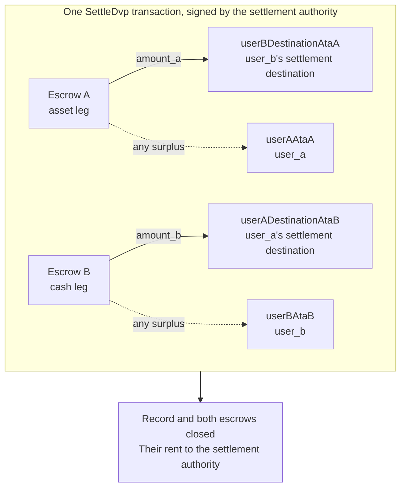

`SettleDvp` подписывается расчётным органом, указанным в записи о сделке. В одной
транзакции инструкция переводит `amount_a` стороны актива на адрес назначения участника
денежной стороны и `amount_b` денежной стороны на адрес назначения участника стороны
актива, возвращает любой излишек в каждом эскроу участнику соответствующей стороны и
закрывает запись и оба эскроу. Если хотя бы один из этих переводов не может быть
выполнен, инструкция завершается ошибкой, и ничего не перемещается.

Эта страница продолжает разделы [«Создание сделки»](/docs/defi/dvp-program/create-a-trade)
и [«Пополнение сторон»](/docs/defi/dvp-program/fund-the-legs); клиент, подписанты,
`trade` и token accounts участников переносятся оттуда.

## Повторная проверка перед подписанием

Расчётный орган подписывает транзакцию, которая перемещает обе стороны, поэтому перед
подписанием он выполняет то же чтение, что и каждый участник: владелец, размер,
участники, минты, суммы, срок действия и оба адреса назначения (см.
[«Пополнение сторон»](/docs/defi/dvp-program/fund-the-legs#verify-the-terms)). Сама
программа при расчёте повторно проверяет, что каждый минт по-прежнему принадлежит
token program, записанной при создании, не имеет запрещённых расширений и имеет
тот же mint authority, что и при создании сделки, поэтому минт, пересозданный с запрещённым
расширением, другой token program или другим mint authority, не может быть
рассчитан.

## Создание аккаунтов получателей

Settle записывает данные в четыре token accounts, которые программа не создаёт:

| Аккаунт                | Получает                     | Владелец                           |
| ---------------------- | ---------------------------- | ------------------------------- |
| `userADestinationAtaB` | Денежная сторона (`amount_b`)    | `user_a_settlement_destination` |
| `userBDestinationAtaA` | Сторона актива (`amount_a`)   | `user_b_settlement_destination` |
| `userAAtaA`            | Любой излишек на стороне актива | `user_a`                        |
| `userBAtaB`            | Любой излишек на денежной стороне  | `user_b`                        |

Аккаунты для излишка используются, только если эскроу содержит больше согласованной
суммы, но любой владелец минта может создать излишек, отправив в эскроу несколько
базовых единиц. Если аккаунт возврата не существует, весь Settle завершится ошибкой,
поэтому создайте все четыре идемпотентно в той же транзакции.

<Tabs items={["TypeScript", "Rust"]}>
  <Tab value="TypeScript">
    ```ts
    import {
      findAssociatedTokenPda,
      getCreateAssociatedTokenIdempotentInstruction,
    } from "@solana-program/token-2022";

    const destinationA = t.userASettlementDestination; // defaults to userA
    const destinationB = t.userBSettlementDestination; // defaults to userB

    const [userADestinationAtaB] = await findAssociatedTokenPda({
      mint: mintB,
      owner: destinationA,
      tokenProgram: tokenProgramB,
    });
    const [userBDestinationAtaA] = await findAssociatedTokenPda({
      mint: mintA,
      owner: destinationB,
      tokenProgram: tokenProgramA,
    });
    // userAAtaA and userBAtaB are from fund the legs.

    const createRecipientAccounts = [
      { ata: userADestinationAtaB, owner: destinationA, mint: mintB, tokenProgram: tokenProgramB },
      { ata: userBDestinationAtaA, owner: destinationB, mint: mintA, tokenProgram: tokenProgramA },
      { ata: userAAtaA, owner: userA, mint: mintA, tokenProgram: tokenProgramA },
      { ata: userBAtaB, owner: userB, mint: mintB, tokenProgram: tokenProgramB },
    ].map(({ ata, owner, mint, tokenProgram }) =>
      getCreateAssociatedTokenIdempotentInstruction({
        payer: authoritySigner,
        ata,
        owner,
        mint,
        tokenProgram,
      }),
    );
    ```

  </Tab>

  <Tab value="Rust">
    ```rust
    use spl_associated_token_account_client::address::get_associated_token_address_with_program_id;
    use spl_associated_token_account_client::instruction::create_associated_token_account_idempotent;

    let authority: Pubkey = pubkey!("SETTLEMENT_AUTHORITY_ADDRESS_HERE");
    let destination_a = trade.user_a_settlement_destination; // defaults to user_a
    let destination_b = trade.user_b_settlement_destination; // defaults to user_b

    let user_a_destination_ata_b =
        get_associated_token_address_with_program_id(&destination_a, &mint_b, &token_program_b);
    let user_b_destination_ata_a =
        get_associated_token_address_with_program_id(&destination_b, &mint_a, &token_program_a);
    let user_a_ata_a = get_associated_token_address_with_program_id(&user_a, &mint_a, &token_program_a);
    let user_b_ata_b = get_associated_token_address_with_program_id(&user_b, &mint_b, &token_program_b);

    let create_recipient_accounts = [
        create_associated_token_account_idempotent(&authority, &destination_a, &mint_b, &token_program_b),
        create_associated_token_account_idempotent(&authority, &destination_b, &mint_a, &token_program_a),
        create_associated_token_account_idempotent(&authority, &user_a, &mint_a, &token_program_a),
        create_associated_token_account_idempotent(&authority, &user_b, &mint_b, &token_program_b),
    ];
    ```

  </Tab>
</Tabs>

## Выполнение расчёта

`legAExtrasCount` сообщает программе, сколько аккаунтов из добавленных после
фиксированного списка относятся к transfer hook стороны актива; остальные относятся к
hook денежной стороны. Для минтов без transfer hooks передайте ноль и ничего не
добавляйте. memo program account требуется инструкции и используется только для
адресов назначения, которым нужен memo.

<Tabs items={["TypeScript", "Rust"]}>
  <Tab value="TypeScript">
    ```ts
    import { MEMO_PROGRAM_ADDRESS } from "@solana-program/memo";
    import { getSettleDvpInstruction } from "./dvp";

    const settleInstruction = getSettleDvpInstruction({
      settlementAuthority: authoritySigner,
      swapDvp,
      mintA,
      mintB,
      dvpAtaA: escrowA,
      dvpAtaB: escrowB,
      userADestinationAtaB,
      userBDestinationAtaA,
      userAAtaA,
      userBAtaB,
      tokenProgramA,
      tokenProgramB,
      memoProgram: MEMO_PROGRAM_ADDRESS,
      legAExtrasCount: 0,
    });

    const { context: settleContext } = await client.sendTransaction([
      ...createRecipientAccounts,
      settleInstruction,
    ]);
    const settleSignature = settleContext.signature;
    console.log("Submitted:", settleSignature);

    // sendTransaction returns at the client's commitment (confirmed by default).
    // Wait for finalized before recording the trade as settled.
    let finalized = false;
    for (let attempt = 0; attempt < 30 && !finalized; attempt++) {
      const {
        value: [status],
      } = await client.rpc.getSignatureStatuses([settleSignature]).send();
      if (status?.err) {
        throw new Error("Settle transaction failed");
      }
      finalized = status?.confirmationStatus === "finalized";
      if (!finalized) {
        await new Promise((resolve) => setTimeout(resolve, 2_000));
      }
    }
    if (!finalized) {
      // A closed record means it settled; an open one is safe to settle again.
      throw new Error("Settle not finalized after 60s; read the trade record");
    }
    console.log("Settled:", settleSignature);
    ```

  </Tab>

  <Tab value="Rust">
    ```rust
    use dvp_swap_program_client::instructions::SettleDvpBuilder;

    const MEMO_PROGRAM_ID: Pubkey = pubkey!("MemoSq4gqABAXKb96qnH8TysNcWxMyWCqXgDLGmfcHr");

    let settle_ix = SettleDvpBuilder::new()
        .settlement_authority(authority)
        .swap_dvp(swap_dvp)
        .mint_a(mint_a)
        .mint_b(mint_b)
        .dvp_ata_a(escrow_a)
        .dvp_ata_b(escrow_b)
        .user_a_destination_ata_b(user_a_destination_ata_b)
        .user_b_destination_ata_a(user_b_destination_ata_a)
        .user_a_ata_a(user_a_ata_a)
        .user_b_ata_b(user_b_ata_b)
        .token_program_a(token_program_a)
        .token_program_b(token_program_b)
        .memo_program(MEMO_PROGRAM_ID)
        .leg_a_extras_count(0)
        .instruction();
    ```

  </Tab>
</Tabs>



### Transfer hooks

Сгенерированный IDL перечисляет только фиксированные аккаунты, поэтому сгенерированные
билдеры ничего не знают об аккаунтах hook. Определите дополнительные account metas каждого
hook-минта так же, как для прямого перевода этого токена, а затем добавьте их в
инструкцию: сначала аккаунты стороны актива, затем денежной стороны, указав в
`legAExtrasCount` число аккаунтов из первой группы. В TypeScript разверните
определённые metas в массив `accounts` инструкции; в Rust используйте
`add_remaining_accounts` у билдера. Лимит составляет 32 аккаунта на сторону,
включая программу hook и аккаунт валидации; лимит аккаунтов в транзакции может
сработать раньше, если hooks есть у обеих сторон. Программа снимает флаг подписанта
со всех передаваемых аккаунтов, поэтому hook не может получить подпись расчётного
органа этим путём.

## Фиксация результата

Считайте сделку рассчитанной, когда транзакция Settle достигает статуса `finalized`.
После расчёта запись и оба эскроу больше не существуют, поэтому системе, которой
условия понадобятся позже, нужно сохранить их из чтения до расчёта или из
транзакции создания. rent закрытых аккаунтов передан расчётному органу.

## Ошибки Settle

`LegNotFunded` означает, что эскроу содержит меньше согласованной суммы; `DvpExpired`
и `SettlementTooEarly` означают, что временное окно упущено; `MintAuthorityChanged`
и `BlockedMintExtension` означают, что минт изменился после создания;
`RecipientAtaMismatch` означает, что token account назначения или возврата отсутствует
либо больше не принадлежит ожидаемому владельцу и минту, обычно потому, что описанный выше
шаг создания аккаунтов был пропущен. Во всех случаях ничего не переместилось, и
участники могут отменить сделку с учётом полномочий минтов (см.
[«Отмена сделки»](/docs/defi/dvp-program/unwind-a-trade)).

## Следующие шаги

- [Отмена сделки](/docs/defi/dvp-program/unwind-a-trade): возврат средств из
  пополненных сторон, если сделка не рассчитана
