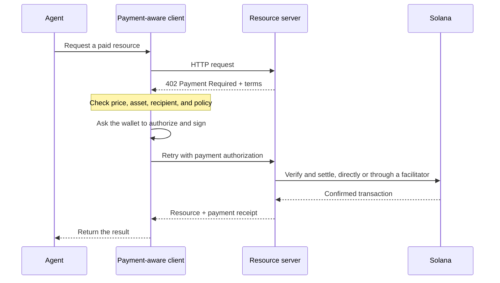

Агентные платежи позволяют программному обеспечению узнать цену, авторизовать платёж и получить
ресурс в рамках одного HTTP-процесса. Агент может оплатить запрос данных, вывод модели
или вызов инструмента, не создавая предварительно платёжный аккаунт и не копируя
API-ключ.

<Cards>
  <Card title="MPP" href="/docs/payments/agentic-payments/mpp">
    Используйте HTTP-аутентификацию для разовых платежей и тарифицируемых по использованию платёжных сессий.
  </Card>
  <Card title="x402" href="/docs/payments/agentic-payments/x402">
    Добавьте в HTTP-ресурс платёжные требования x402 V2, подписи и расчёты.
  </Card>
</Cards>

## Общий процесс оплаты

MPP и x402 используют разные заголовки и модели данных, но их базовый HTTP-процесс
похож:

## MPP и x402

Оба протокола позволяют проводить расчёты стейблкоинами в Solana. Выбирайте исходя из
платёжной модели и совместимости, которые нужны вашему сервису, а не только из общего
статус-кода `402`.

|                         | MPP                                                               | x402                                                                     |
| ----------------------- | ----------------------------------------------------------------- | ------------------------------------------------------------------------ |
| Запрос оплаты               | `WWW-Authenticate: Payment`                                       | `PAYMENT-REQUIRED`                                                       |
| Авторизация клиента    | `Authorization: Payment`                                          | `PAYMENT-SIGNATURE`                                                      |
| Квитанция                 | `Payment-Receipt`                                                 | `PAYMENT-RESPONSE`                                                       |
| Платёжные модели Solana   | Разовые намерения `charge` и ограниченные по сумме тарифицируемые намерения `session`           | Схемы, такие как `exact` и `upto`; поддержка зависит от сети и клиента |
| Архитектура расчётов | Проверка на стороне сервера или необязательный релей либо шлюз                | Сервер ресурса с локальной проверкой или фасилитатор                 |
| Хорошая отправная точка     | API, которым нужна семантика HTTP-аутентификации или многократная тарификация | Ресурсы с оплатой за каждый запрос и существующие клиенты x402                      |

MPP — это **Machine Payments Protocol**. Не путайте его с **Model
Context Protocol (MCP)**. MCP предоставляет агентам инструменты и ресурсы; MPP или x402
могут требовать оплату, когда агент вызывает один из этих инструментов.

<Callout type="info">
  Сервис может поддерживать более одного протокола. Клиент выбирает поддерживаемый им вариант
  оплаты, а затем использует соответствующие заголовки запроса оплаты, авторизации и
  квитанции на протяжении всего обмена.
</Callout>
