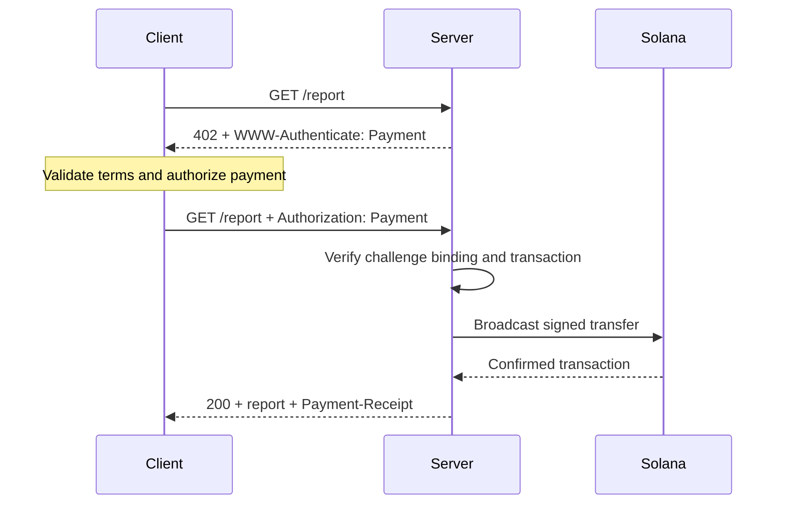
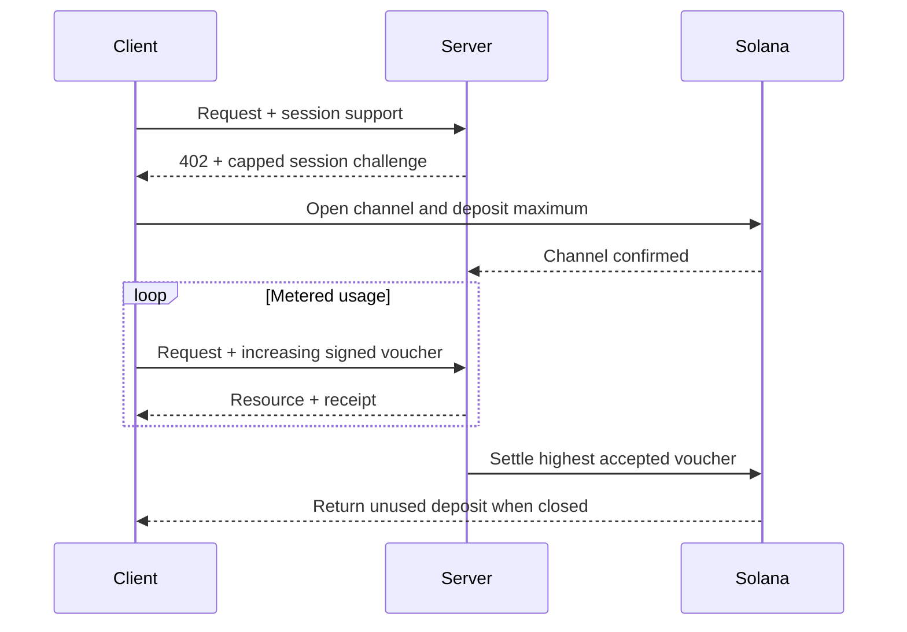

[Machine Payments Protocol (MPP)](https://mpp.dev/) применяет семантику HTTP-аутентификации
к платежам. Сервер отвечает challenge на неоплаченный запрос, клиент возвращает
платёжный credential, а сервер после принятия платежа возвращает квитанцию.

MPP разделяет три задачи:

- **Намерение (intent)** описывает коммерческое взаимодействие, например разовое
  списание (`charge`) или оплату по факту потребления (`session`).
- **Способ оплаты (payment method)** описывает, как перемещается стоимость. Метод Solana
  поддерживает нативный SOL и токены SPL для списаний.
- **Транспорт** HTTP передаёт challenge, credential, квитанции и ошибки.

MPP публикуется как набор Internet-Draft. Считайте
[актуальные спецификации](https://paymentauth.org/) источником истины и
ожидайте, что детали будут меняться, пока черновики находятся в работе.

## Обмен по HTTP

MPP использует стандартные поля HTTP-аутентификации вместо специфичных для протокола
платёжных заголовков:

| Сообщение                 | HTTP-представление                                         |
| ----------------------- | ----------------------------------------------------------- |
| Платёжный challenge       | `402 Payment Required` с `WWW-Authenticate: Payment ...` |
| Платёжный credential      | Повторный запрос с `Authorization: Payment ...`           |
| Успешная квитанция      | Ответ с ресурсом и `Payment-Receipt: ...`               |
| Некорректные платёжные данные | Тело Problem Details с `application/problem+json`       |



Challenge включает сгенерированный сервером ID, realm, метод, intent, закодированный
платёжный запрос и срок действия. Credential повторяет challenge и добавляет
платёжное доказательство, специфичное для метода. Сервер должен проверить обе части:
валидный перевод, относящийся к другому challenge, не должен открывать доступ к ресурсу.

## Разовые списания в Solana

Intent `charge` в Solana поддерживает два типа credential:

- **Режим pull** использует подписанную транзакцию. Клиент подписывает перевод и
  отправляет транзакцию серверу. Сервер проверяет её, при необходимости добавляет
  подпись плательщика комиссии (fee payer), отправляет в сеть, ожидает подтверждения и возвращает
  подпись транзакции в квитанции.
- **Режим push** использует подпись транзакции. Сначала клиент сам отправляет транзакцию
  в сеть, затем передаёт серверу подтверждённую подпись. Сервер получает и проверяет
  транзакцию, прежде чем вернуть ресурс.

Режим pull позволяет серверу оплачивать комиссии за транзакции и выполнять повторные
попытки на стороне сервера. Режим push полезен, когда кошелёк требует, чтобы клиент сам
отправлял свою транзакцию, но в нём нельзя использовать спонсирование комиссий сервером.

Нормативные поля и правила проверки см. в
[спецификации Solana charge](https://paymentauth.org/draft-solana-charge-00.html).

## Добавление MPP-списания в Express API

Solana Pay Kit предоставляет актуальную интеграцию на TypeScript для MPP и x402.
Установите его вместе с Express:

```bash
pnpm add @solana/pay-kit @solana/kit@^6.9.0 express
pnpm add --save-dev @types/express tsx
```

Этот минимальный пример использует размещённую песочницу Surfpool и публичного
демонстрационного получателя из пакета. Он предназначен только для локальной разработки:

```ts filename=server.ts
import express from "express";
import { createPayKit, usd } from "@solana/pay-kit";

const pay = await createPayKit({
  accept: ["mpp"],
  rpcUrl: "https://402.surfnet.dev:8899"
});

const app = express();

app.get("/report", pay.express(usd("0.01")), (_req, res) => {
  res.json({ report: "Paid report" });
});

app.listen(4567, () => {
  console.log("Paid API listening on http://127.0.0.1:4567");
});
```

Запустите его и сравните неоплаченный запрос с запросом с поддержкой оплаты:

```bash
pnpm tsx server.ts
curl -i http://127.0.0.1:4567/report
pay --sandbox curl http://127.0.0.1:4567/report
```

Обработчик маршрута выполняется только после того, как middleware принимает платёж.

<Callout type="warn" title="Замените все значения песочницы по умолчанию в продакшене">
  Настройте явную сеть, получателя-продавца, выделенный RPC, стабильный секрет
  привязки challenge, продакшен-подписант и надёжное хранилище для защиты от
  повторного воспроизведения (replay). Никогда не направляйте реальные платежи на
  демонстрационный подписант пакета.
</Callout>

## Сессии с учётом потребления

Используйте `session` Solana MPP, когда клиент будет совершать много небольших связанных платежей.
Сессия открывает ончейн-платёжный канал с максимальным депозитом, а по мере роста потребления
использует накопительные подписанные ваучеры. Сервер может проверять ваучеры
офчейн и позже рассчитывать наибольшую принятую сумму.

Это удобно для инференса с оплатой за токены, загрузок с оплатой за байты, потоковых данных
и повторных вызовов инструментов. Это не то же самое, что отправка отдельного ончейн-платежа
на каждое событие.



Называйте сессию **платежом по сессии**, **платёжным каналом** или **ограниченной повторяющейся
авторизацией**. Называйте её потоковым платежом, только если сервис и платёжный
контракт действительно измеряют поток потребления.

## Проверка в продакшене

Для каждого списания в Solana сервер должен проверять как минимум следующее:

- Challenge подлинный, не просрочен, привязан к этому запросу и предназначен для
  этого realm.
- Транзакция использует ожидаемые сеть, актив или mint, получателя, сумму
  и Token Program.
- Любые инструкции fee payer или associated token account явно
  разрешены и не могут опустошить подписанта сервера.
- Транзакция выполнена на требуемом уровне подтверждения (commitment level).
- Подпись транзакции ещё не была использована.
- Проверка повторного воспроизведения и операция потребления атомарны на всех экземплярах сервера.

Для сессий также сохраняйте состояние канала, принятую накопленную сумму и
отметку расчётов (settlement watermark) в общем хранилище. Опишите в документации, как клиенты возвращают неиспользованные
средства, если сервер становится недоступен.

## Связанные материалы

- [Спецификации MPP](https://paymentauth.org/)
- [Документация протокола MPP](https://mpp.dev/protocol)
- [Solana Pay Kit](https://github.com/solana-foundation/pay-kit)
- [Обзор агентных платежей](/docs/payments/agentic-payments)
- [Готовность к продакшену](/docs/tools/production-readiness)
