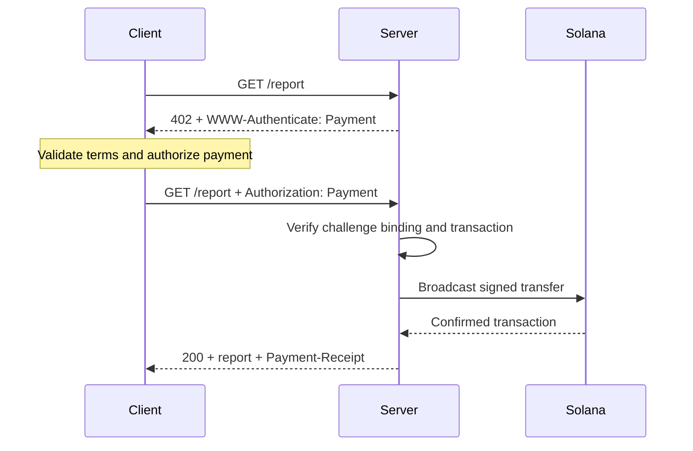
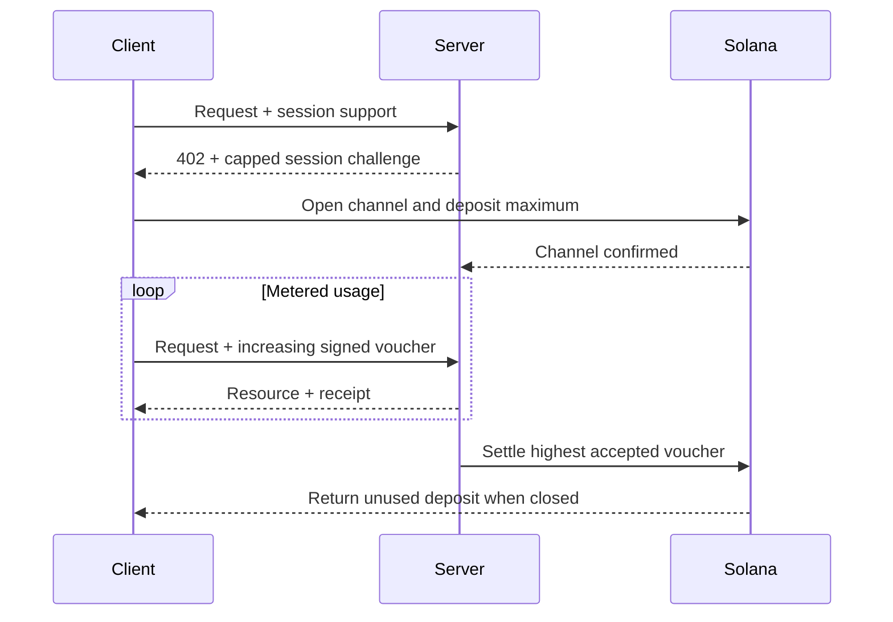

[Machine Payments Protocol (MPP)](https://mpp.dev/) применяет семантику HTTP-аутентификации
к платежам. Сервер отвечает на неоплаченный запрос challenge, клиент возвращает
платёжные учётные данные, а сервер после принятия платежа возвращает квитанцию.

MPP разделяет три области ответственности:

- **Intent** (намерение) описывает коммерческое взаимодействие, например разовое
  списание `charge` или сессию `session` с тарификацией по использованию.
- **Метод оплаты** описывает, как перемещается стоимость. Метод Solana поддерживает
  нативный SOL и токены SPL для списаний.
- HTTP-**транспорт** передаёт challenge, учётные данные, квитанции и ошибки.

MPP публикуется в виде набора Internet-Draft. Считайте
[актуальные спецификации](https://paymentauth.org/) источником истины и
учитывайте, что детали будут меняться, пока черновики находятся в разработке.

## HTTP-обмен

MPP использует стандартные поля HTTP-аутентификации вместо специфичных для
протокола платёжных заголовков:

| Сообщение                 | HTTP-представление                                         |
| ----------------------- | ----------------------------------------------------------- |
| Платёжный challenge       | `402 Payment Required` с `WWW-Authenticate: Payment ...` |
| Платёжные учётные данные      | Повторный запрос с `Authorization: Payment ...`           |
| Успешная квитанция      | Ответ с ресурсом и `Payment-Receipt: ...`               |
| Недействительные платёжные данные | Тело Problem Details с типом `application/problem+json`       |


```mermaid title="MPP Charge Flow"
sequenceDiagram
    participant Client
    participant Server
    participant Solana
    Client->>Server: GET /report
    Server-->>Client: 402 + WWW-Authenticate: Payment
    Note over Client: Validate terms and authorize payment
    Client->>Server: GET /report + Authorization: Payment
    Server->>Server: Verify challenge binding and transaction
    Server->>Solana: Broadcast signed transfer
    Solana-->>Server: Confirmed transaction
    Server-->>Client: 200 + report + Payment-Receipt
```

Challenge включает сгенерированный сервером ID, realm, метод, intent, закодированный
платёжный запрос и срок действия. Учётные данные повторяют challenge и добавляют
подтверждение платежа, специфичное для метода. Сервер должен проверить обе части:
валидный перевод, относящийся к другому challenge, не должен открывать доступ к ресурсу.

## Разовые списания в Solana

Intent `charge` в Solana поддерживает два типа учётных данных:

- **Режим pull** использует подписанную транзакцию. Клиент подписывает перевод и
  отправляет транзакцию на сервер. Сервер проверяет её, при необходимости добавляет
  подпись плательщика комиссии, рассылает в сеть, дожидается подтверждения и возвращает
  подпись транзакции в квитанции.
- **Режим push** использует подпись транзакции. Клиент сначала сам рассылает транзакцию
  в сеть, затем отправляет подтверждённую подпись на сервер. Сервер получает и проверяет
  транзакцию, прежде чем вернуть ресурс.

Режим pull позволяет серверу оплачивать комиссии за транзакции и реализовать повторные
попытки на стороне сервера. Режим push полезен, когда кошелёк требует, чтобы клиент сам
отправлял свою транзакцию, но в нём нельзя использовать оплату комиссий сервером.

Нормативные поля и правила проверки см. в
[спецификации списаний Solana](https://paymentauth.org/draft-solana-charge-00.html).

## Добавление списания MPP в Express API

Solana Pay Kit предоставляет актуальную интеграцию на TypeScript для MPP и x402.
Установите его вместе с Express:

```bash
pnpm add @solana/pay-kit @solana/kit@^6.9.0 express
pnpm add --save-dev @types/express tsx
```

Этот минимальный пример использует размещённую песочницу Surfpool и публичного
демонстрационного получателя из пакета. Он предназначен только для локальной разработки:

```ts filename=server.ts
import express from "express";
import { createPayKit, usd } from "@solana/pay-kit";

const pay = await createPayKit({
  accept: ["mpp"],
  rpcUrl: "https://402.surfnet.dev:8899"
});

const app = express();

app.get("/report", pay.express(usd("0.01")), (_req, res) => {
  res.json({ report: "Paid report" });
});

app.listen(4567, () => {
  console.log("Paid API listening on http://127.0.0.1:4567");
});
```

Запустите его и сравните неоплаченный запрос с запросом, поддерживающим оплату:

```bash
pnpm tsx server.ts
curl -i http://127.0.0.1:4567/report
pay --sandbox curl http://127.0.0.1:4567/report
```

Обработчик маршрута выполняется только после того, как middleware принимает платёж.

<Callout type="warn" title="Замените все настройки песочницы по умолчанию в продакшене">
  Настройте явную сеть, получателя-мерчанта, выделенный RPC, стабильный секрет привязки
  challenge, продакшен-подписант и надёжное хранилище для защиты от повторных отправок.
  Никогда не направляйте реальные платежи на демонстрационного подписанта из пакета.
</Callout>

## Сессии с тарификацией по использованию

Используйте `session` Solana MPP, когда клиент будет совершать много небольших связанных платежей.
Сессия открывает ончейн-платёжный канал с максимальным депозитом, а затем по мере роста
потребления использует накопительные подписанные ваучеры. Сервер может проверять ваучеры
офчейн и позднее провести расчёт по наибольшей принятой сумме.

Это удобно для инференса с тарификацией по токенам, загрузок с тарификацией по байтам,
данных в реальном времени и повторяющихся вызовов инструментов. Это не то же самое, что
отправлять отдельный ончейн-платёж за каждое событие.


```mermaid title="MPP Session Lifecycle"
sequenceDiagram
    participant Client
    participant Server
    participant Solana
    Client->>Server: Request + session support
    Server-->>Client: 402 + capped session challenge
    Client->>Solana: Open channel and deposit maximum
    Solana-->>Server: Channel confirmed
    loop Metered usage
        Client->>Server: Request + increasing signed voucher
        Server-->>Client: Resource + receipt
    end
    Server->>Solana: Settle highest accepted voucher
    Solana-->>Client: Return unused deposit when closed
```

Называйте сессию **платежом в рамках сессии**, **платёжным каналом** или **ограниченной
повторяющейся авторизацией**. Называйте её потоковым платежом, только если сервис и платёжный
контракт действительно тарифицируют поток использования.

## Проверка в продакшене

Для каждого списания в Solana сервер должен проверить как минимум следующее:

- Challenge подлинный, не просрочен, привязан к этому запросу и предназначен для
  данного realm.
- Транзакция использует ожидаемую сеть, актив или mint, получателя, сумму
  и token program.
- Любые инструкции плательщика комиссии или associated-token-account явно
  разрешены и не могут опустошить подписанта сервера.
- Транзакция выполнена успешно на требуемом уровне подтверждения.
- Подпись транзакции ещё не была использована.
- Проверка на повторное использование и операция потребления атомарны на всех экземплярах сервера.

Для сессий также сохраняйте состояние канала, принятую накопительную сумму и
отметку расчёта в общем хранилище. Опишите в документации, как клиенты возвращают
неиспользованные средства, если сервер станет недоступен.

## Связанные материалы

- [Спецификации MPP](https://paymentauth.org/)
- [Документация протокола MPP](https://mpp.dev/protocol)
- [Solana Pay Kit](https://github.com/solana-foundation/pay-kit)
- [Обзор агентных платежей](/docs/payments/agentic-payments)
- [Готовность к продакшену](/docs/tools/production-readiness)
