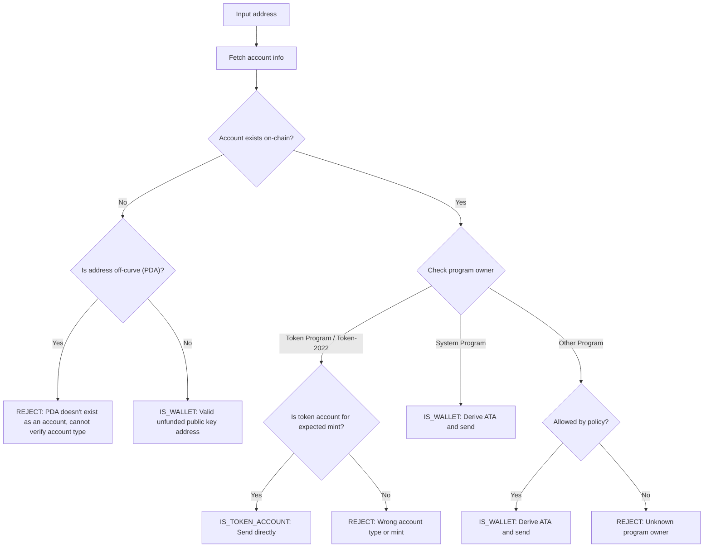

Отправка токенов на неверный адрес может привести к безвозвратной потере
средств. Проверка адреса гарантирует, что вы отправляете токены только на те
адреса, которые могут их корректно получить и использовать.

<Callout>
  Подробнее о ключевых понятиях платежей читайте в разделе [Как работают платежи
  в Solana](/docs/payments/how-payments-work).
</Callout>

## Понимание адресов Solana

В Solana у аккаунтов есть два типа адресов: on-curve и off-curve.

### On-curve адреса

Стандартные адреса — это публичные ключи из пар ключей Ed25519. Эти адреса:

- Имеют соответствующий приватный ключ, который может подписывать транзакции
- Используются как адреса кошельков

### Off-curve адреса (PDA)

[Program Derived Addresses](/docs/core/pda) (PDA) детерминировано создаются на
основе ID программы и seed-значений. Эти адреса:

- **Не** имеют соответствующего приватного ключа
- Могут быть подписаны только программой, от которой был получен этот адрес

## Типы аккаунтов в платежах

Используйте адрес, чтобы получить [аккаунт](/docs/core/accounts) из сети,
проверьте его владельца (программу) и тип аккаунта, чтобы понять, как работать с
этим адресом.

<Callout>
  Знание того, является ли адрес on-curve или off-curve, не говорит о том, какой
  это тип аккаунта, какая программа им владеет или существует ли аккаунт по
  этому адресу. Необходимо получить аккаунт из сети, чтобы узнать эти детали.
</Callout>

### Аккаунты System Program (кошельки)

Аккаунты, принадлежащие System Program, являются стандартными кошельками. Чтобы
отправить SPL токены на кошелек, необходимо получить и использовать его
[associated token account (ATA)](/docs/tokens/basics/create-token-account#whats-an-associated-token-account).

После получения адреса ATA проверьте, существует ли этот token account в
блокчейне. Если ATA не существует, вы можете добавить инструкцию на создание
токен-аккаунта получателя в ту же транзакцию, что и перевод. Однако для этого
потребуется оплатить rent за новый token account. Поскольку получатель владеет
ATA, SOL, потраченные на rent, не могут быть возвращены отправителю.

<Callout type="warn">
  Без мер предосторожности субсидирование создания ATA может быть использовано в
  корыстных целях. Злоумышленник может запросить перевод, создать свой ATA за
  ваш счёт, закрыть ATA, чтобы вернуть rent в SOL, и повторить это снова.
</Callout>

### Токен-аккаунты

[Токен-аккаунты](/docs/tokens/basics/create-token-account) принадлежат Token
Program или Token-2022 Program и содержат балансы токенов. Если полученный вами
адрес принадлежит токен-программе, необходимо убедиться, что это токен-аккаунт
(а не mint account) и что он соответствует ожидаемому mint account токена перед
отправкой.

<Callout type="info">
  Token Program автоматически проверяют, что оба токен-аккаунта при переводе
  содержат токены одного и того же mint. Если проверка не проходит, транзакция
  отклоняется, и средства не теряются.
</Callout>

### Mint-аккаунты

[Mint-аккаунты](/docs/tokens/basics/create-mint) отслеживают эмиссию токена и
метаданные конкретного токена. Mint-аккаунты также принадлежат Token Program, но
**не** являются допустимыми получателями токенов. Попытка отправить токены на
адрес mint приводит к неудачной транзакции, но средства не теряются.

### Другие аккаунты

Аккаунты, принадлежащие другим программам, требуют отдельной политики. Некоторые
аккаунты (например, мультисиг-кошельки) могут быть допустимыми владельцами
токен-аккаунтов, а другие должны быть отклонены.

## Процесс верификации

На следующей схеме показано примерное дерево решений для проверки адреса:



<Steps>
<Step>

### Получить аккаунт

Используйте адрес для получения данных аккаунта из сети.

</Step>
<Step>

### Аккаунт не существует

Если по этому адресу нет аккаунта, проверьте, находится ли адрес на кривой или
вне кривой:

- **Off-curve (PDA)**: Консервативно отклоняйте этот адрес, чтобы избежать
  отправки на ATA, который может быть недоступен. Без существующего аккаунта
  невозможно определить только по адресу, какая программа сгенерировала этот PDA
  или предназначен ли адрес для ATA. Создание ATA для этого адреса с целью
  отправки токенов может привести к блокировке средств на недоступном token
  account.

- **On-curve**: Это действительный адрес кошелька (публичный ключ), который еще
  не был профинансирован. Получите ATA, проверьте его наличие и отправьте туда
  токены. Вам необходимо принять решение о политике: финансировать ли создание
  ATA, если он отсутствует.

</Step>
<Step>

### Аккаунт существует

Если аккаунт существует, проверьте, какая программа им владеет:

- **System Program**: Это стандартный кошелек. Получите ATA, проверьте его
  наличие и отправьте туда токены. Необходимо принять решение о политике:
  финансировать ли создание ATA, если он отсутствует.

- **Token Program / Token-2022**: Убедитесь, что аккаунт является token account
  (а не mint account) и что он содержит нужный вам токен (mint). Если все верно,
  отправьте токены напрямую на этот адрес. Если это mint account или token
  account для другого mint, отклоните адрес.

- **Other Program**: Требуется решение по политике. Некоторые программы,
  например мультисиг-кошельки, могут быть допустимыми владельцами token account.
  Если ваша политика это разрешает, получите ATA и отправьте. В противном случае
  отклоните адрес.

</Step>
</Steps>

## Демонстрация

Следующий пример показывает только логику валидации адреса. Это справочный код
для иллюстрации.

<Callout>
  В этом демо не показано, как получить ATA или сформировать транзакцию для
  отправки токенов. Обратитесь к документации по [token
  account](/docs/tokens/basics/create-token-account#how-to-create-an-associated-token-account)
  и [token transfer](/docs/tokens/basics/transfer-tokens), чтобы посмотреть
  примеры кода.
</Callout>

В демо ниже используются три возможных результата:

| Результат          | Значение                | Действие                                         |
| ------------------ | ----------------------- | ------------------------------------------------ |
| `IS_WALLET`        | Валидный адрес кошелька | Получить и отправить на associated token account |
| `IS_TOKEN_ACCOUNT` | Валидный token account  | Отправить токены напрямую на этот адрес          |
| `REJECT`           | Неверный адрес          | Не отправлять                                    |

<CodeTabs flags="r">

```ts !! title="Demo"
// !collapse(1:35) collapsed

import {
  type Address,
  type Rpc,
  type GetAccountInfoApi,
  createSolanaRpc,
  fetchJsonParsedAccount,
  isOffCurveAddress,
  generateKeyPairSigner,
  getProgramDerivedAddress
} from "@solana/kit";

// =============================================================================
// Constants
// =============================================================================

const defaultRpc = createSolanaRpc("https://api.mainnet-beta.solana.com");

const SYSTEM_PROGRAM = "11111111111111111111111111111111" as Address;
const TOKEN_PROGRAM = "TokenkegQfeZyiNwAJbNbGKPFXCWuBvf9Ss623VQ5DA" as Address;
const TOKEN_2022_PROGRAM =
  "TokenzQdBNbLqP5VEhdkAS6EPFLC1PHnBqCXEpPxuEb" as Address;

// =============================================================================
// Validation Function
// =============================================================================

/**
 * Possible validation results for an input address.
 */
export type ValidationResult =
  | { type: "IS_TOKEN_ACCOUNT" }
  | { type: "IS_WALLET" }
  | { type: "REJECT"; reason: string };

/**
 * Validates an input address and classifies it as a wallet, token account, or invalid.
 *
 * @param inputAddress - The address to validate
 * @param rpc - Optional RPC client (defaults to mainnet)
 * @returns Classification result:
 *   - IS_WALLET: Valid wallet address
 *   - IS_TOKEN_ACCOUNT: Valid token account
 *   - REJECT: Invalid address for transfers
 */
export async function validateAddress(
  inputAddress: Address,
  rpc: Rpc<GetAccountInfoApi> = defaultRpc
): Promise<ValidationResult> {
  const account = await fetchJsonParsedAccount(rpc, inputAddress);
  // Log the account data for demo
  console.log("\nAccount:", account);

  // Account doesn't exist on-chain
  if (!account.exists) {
    // Off-curve = PDA that doesn't exist as an account
    // Reject conservatively to avoid sending to an address that may be inaccessible.
    if (isOffCurveAddress(inputAddress)) {
      return { type: "REJECT", reason: "PDA doesn't exist as an account" };
    }
    // On-curve = valid keypair address, treat as unfunded wallet
    return { type: "IS_WALLET" };
  }

  // Account exists, check program owner
  const owner = account.programAddress;

  // System Program = wallet
  if (owner === SYSTEM_PROGRAM) {
    return { type: "IS_WALLET" };
  }

  // Token Program or Token-2022, check if token account
  if (owner === TOKEN_PROGRAM || owner === TOKEN_2022_PROGRAM) {
    const accountType = (
      account.data as { parsedAccountMeta?: { type?: string } }
    ).parsedAccountMeta?.type;

    if (accountType === "account") {
      return { type: "IS_TOKEN_ACCOUNT" };
    }
    // Reject if not a token account (mint account)
    return {
      type: "REJECT",
      reason: "Not a token account"
    };
  }

  // Unknown program owner
  return { type: "REJECT", reason: "Unknown program owner" };
}

// =============================================================================
// Examples
// =============================================================================
// !collapse(1:1000) collapsed

// Wallets
const EXISTING_WALLET =
  "H8sMJSCQxfKiFTCfDR3DUMLPwcRbM61LGFJ8N4dK3WjS" as Address;
const NEW_WALLET = (await generateKeyPairSigner()).address;

// Token accounts
const USDC_TOKEN_ACCOUNT =
  "3emsAVdmGKERbHjmGfQ6oZ1e35dkf5iYcS6U4CPKFVaa" as Address;
const PYUSD_TOKEN_ACCOUNT =
  "47od2TPRvqJipfPVWZdyenLEngPw8hC36nDxiLyvGsEP" as Address;

// Token mints (should be rejected)
const USDC_MINT = "EPjFWdd5AufqSSqeM2qN1xzybapC8G4wEGGkZwyTDt1v" as Address;
const PYUSD_MINT = "2b1kV6DkPAnxd5ixfnxCpjxmKwqjjaYmCZfHsFu24GXo" as Address;

// PDA that doesn't exist (should be rejected)
const [NON_EXISTENT_PDA] = await getProgramDerivedAddress({
  programAddress: (await generateKeyPairSigner()).address,
  seeds: ["seed"]
});

// Program account (should be rejected)
const PROGRAM_ACCOUNT =
  "p1exdMJcjVao65QdewkaZRUnU6VPSXhus9n2GzWfh98" as Address;

async function runExample(label: string, address: Address) {
  console.log(`\n${"─".repeat(60)}`);
  console.log(`Example: ${label}`);
  console.log(`Input: ${address}`);
  console.log(`${"─".repeat(60)}`);

  const result = await validateAddress(address);
  console.log("\nResult:", result);
}

console.log("\n" + "═".repeat(60));
console.log("  IS_WALLET Examples");
console.log("═".repeat(60));

await runExample("Existing funded wallet", EXISTING_WALLET);
await runExample("New wallet (unfunded)", NEW_WALLET);

console.log("\n" + "═".repeat(60));
console.log("  IS_TOKEN_ACCOUNT Examples");
console.log("═".repeat(60));

await runExample("USDC token account (Token Program)", USDC_TOKEN_ACCOUNT);
await runExample("PYUSD token account (Token-2022)", PYUSD_TOKEN_ACCOUNT);

console.log("\n" + "═".repeat(60));
console.log("  REJECT Examples");
console.log("═".repeat(60));

await runExample("USDC mint address", USDC_MINT);
await runExample("PYUSD mint address", PYUSD_MINT);
await runExample("Non-existent PDA", NON_EXISTENT_PDA);
await runExample("Program account", PROGRAM_ACCOUNT);

console.log("\n" + "═".repeat(60));
console.log("  Done!");
console.log("═".repeat(60) + "\n");
```

</CodeTabs>
