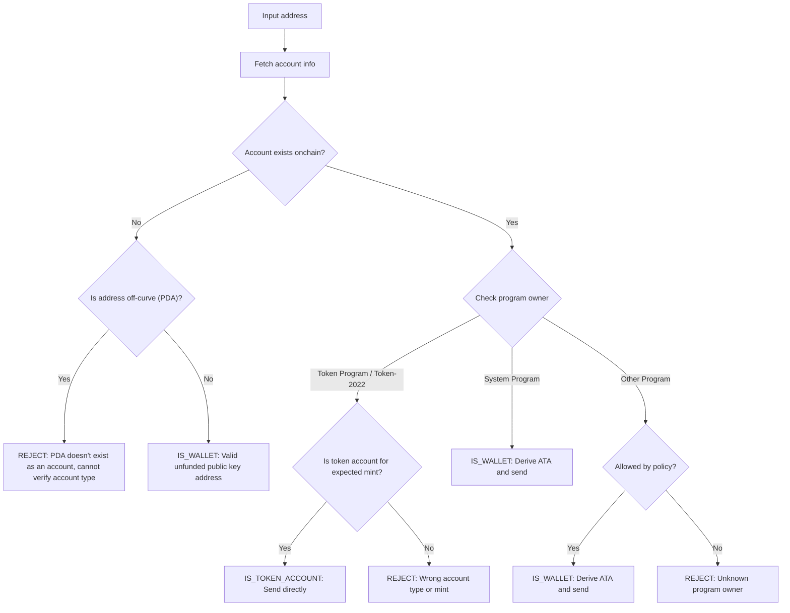

Отправка средств на неверный адрес может привести к их безвозвратной потере.
Верификация адреса гарантирует, что вы отправляете средства только на те адреса,
которые могут корректно их получить и использовать.

Валидация зависит от того, что именно вы отправляете:

- **SPL-токены** частично защищены встроенными механизмами. Token Program
  отклоняет перевод, если аккаунты не соответствуют ожидаемому минту, поэтому
  ошибочный перевод токенов завершится неудачей без потери средств. Большая
  часть этой страницы посвящена отправке SPL-токенов.
- **Нативный SOL** не имеет подобной защиты. Перевод через System Program
  успешно выполняется на любой аккаунт, поэтому при указании неверного
  получателя SOL будет заблокирован навсегда. См.
  [Отправка нативного SOL](#sending-native-sol).

<Callout>
  См. [Как работают платежи в Solana](/docs/payments/how-payments-work) для
  ознакомления с основными концепциями платежей.
</Callout>

## Понимание адресов Solana

Аккаунты Solana имеют два типа адресов: on-curve и off-curve.

### On-Curve адреса

Стандартные адреса — это публичные ключи из Ed25519 keypair. Такие адреса:

- Имеют соответствующий приватный ключ, которым можно подписывать транзакции
- Используются в качестве адресов кошельков

### Off-Curve адреса (PDA)

[Program Derived Addresses](/docs/core/pda) детерминированно выводятся из
идентификатора программы и сидов. Такие адреса:

- **Не** имеют соответствующего приватного ключа
- Могут быть подписаны только той программой, из которой был выведен адрес

## Типы аккаунтов в платежах

Используйте адрес для получения [аккаунта](/docs/core/accounts) из сети,
проверьте владельца программы и тип аккаунта, чтобы определить порядок работы с
данным адресом.

<Callout>
  Знание того, является ли адрес on-curve или off-curve, не говорит вам о типе
  аккаунта, какой программе он принадлежит и существует ли аккаунт по этому
  адресу. Для получения этих сведений необходимо запросить аккаунт из сети.
</Callout>

### Аккаунты System Program (Кошельки)

Аккаунты, принадлежащие System Program, являются стандартными кошельками. Чтобы
отправить SPL-токены на кошелёк, необходимо получить и использовать его
[Associated Token Account (ATA)](/docs/tokens/basics/create-token-account#what-is-an-associated-token-account).

После получения адреса ATA проверьте, существует ли token account в сети. Если
ATA не существует, вы можете включить инструкцию по созданию token account
получателя в ту же транзакцию, что и перевод. Однако это требует оплаты rent за
новый token account. Поскольку получатель является владельцем ATA, SOL,
уплаченные за rent, не могут быть возвращены отправителю.

<Callout type="warn">
  Без защитных мер субсидирование создания ATA может быть использовано в
  мошеннических целях. Злоумышленник может запросить перевод, добиться создания
  своего ATA за ваш счёт, закрыть ATA, чтобы вернуть rent SOL, и повторять эту
  схему снова.
</Callout>

### Token Accounts

[Token accounts](/docs/tokens/basics/create-token-account) принадлежат Token
Program или Token-2022 Program и хранят балансы токенов. Если адрес, который вы
получили, принадлежит token program, следует убедиться, что аккаунт является
token account (а не mint account) и соответствует ожидаемому mint account токена
перед отправкой.

<Callout type="info">
  Token Programs автоматически проверяют, что оба token account в транзакции
  перевода содержат токены одного и того же mint. Если проверка не пройдена,
  транзакция отклоняется и средства не теряются.
</Callout>

### Mint Accounts

[Mint accounts](/docs/tokens/basics/create-mint) отслеживают объём предложения
токенов и метаданные конкретного токена. Mint accounts также принадлежат Token
Programs, но **не** являются допустимыми получателями при переводе токенов.
Попытка отправить токены на mint-адрес приведёт к неудачной транзакции, однако
средства не будут потеряны.

### Другие аккаунты

Аккаунты, принадлежащие другим программам, требуют принятия политического
решения. Некоторые аккаунты (например, мультисиг-кошельки) могут являться
допустимыми владельцами token account, тогда как другие должны быть отклонены.

## Отправка нативного SOL

Приведённая выше классификация определяет, куда могут поступать SPL-токены.
Нативный SOL подчиняется более строгим правилам: единственным безопасным
получателем является **кошелёк System Program** (или незафондированный адрес на
кривой, который станет таковым).

Перевод через System Program добавляет lamport на любой аккаунт, включая минты,
token account, программы и PDA. Lamport могут быть выведены только
программой-владельцем аккаунта, поэтому отправка SOL на неверный адрес
получателя может привести к безвозвратной потере средств.

В отличие от перевода SPL-токенов, транзакция **не** завершается ошибкой, если
получателем оказывается неожиданный адрес.

При отправке нативного SOL приемлемым результатом является только `IS_WALLET`.
`IS_TOKEN_ACCOUNT` **не** является таковым: token account хранит SPL-токены, и
отправленный туда SOL выходит из-под контроля отправителя.

<Callout type="warn">
  Это распространённая причина потери SOL: пользователь вставляет адрес минта
  токена (или адрес программы) в поле вывода SOL. Перевод проходит успешно, и
  SOL становится невозможно вернуть. Всегда определяйте тип получателя перед
  подписанием SOL-перевода.
</Callout>

## Процесс верификации

На следующей диаграмме показано справочное дерево решений для валидации адреса:


```mermaid title="Address Verification Flow"
flowchart TD
    A["Input address"]
    B["Fetch account info"]

    A --> B
    B --> C{"Account exists onchain?"}

    %% --- Non-existent account path ---
    C -- "No" --> D{"Is address off-curve (PDA)?"}
    D -- "Yes" --> R1["REJECT: PDA doesn't exist as an account, cannot verify account type"]
    D -- "No" --> W1["IS_WALLET: Valid unfunded public key address"]

    %% --- Existing account path ---
    C -- "Yes" --> F{"Check program owner"}

    F -- "Token Program / Token-2022" --> G{"Is token account for expected mint?"}
    G -- "Yes" --> T1["IS_TOKEN_ACCOUNT: Send directly"]
    G -- "No" --> R2["REJECT: Wrong account type or mint"]

    F -- "System Program" --> W2["IS_WALLET: Derive ATA and send"]

    F -- "Other Program" --> K{"Allowed by policy?"}
    K -- "Yes" --> W3["IS_WALLET: Derive ATA and send"]
    K -- "No" --> R3["REJECT: Unknown program owner"]
```

<Steps>
<Step>

### Получение данных аккаунта

Используйте адрес для получения данных аккаунта из сети.

</Step>
<Step>

### Аккаунт не существует

Если по данному адресу аккаунт отсутствует, проверьте, находится ли адрес на
кривой или вне кривой:

- **Вне кривой (PDA)**: В целях безопасности отклоните адрес, чтобы избежать
  отправки средств на ATA, который может оказаться недоступным. При отсутствии
  существующего аккаунта невозможно определить только по адресу, какая программа
  вывела этот PDA и предназначен ли адрес для ATA. Деривация ATA для этого
  адреса с целью отправки токенов может привести к блокировке средств в
  недоступном token account.

- **На кривой**: Это действительный адрес кошелька (публичный ключ), который ещё
  не пополнен. Получите ATA, проверьте его существование и отправьте на него
  токены. Вы должны принять политическое решение о том, финансировать ли
  создание ATA, если он не существует.

</Step>
<Step>

### Аккаунт существует

Если аккаунт существует, проверьте, какая программа им владеет:

- **System Program**: Это стандартный кошелёк. Получите ATA, проверьте его
  существование и отправьте на него токены. Вы должны принять политическое
  решение о том, финансировать ли создание ATA, если он не существует.

- **Token Program / Token-2022**: Убедитесь, что аккаунт является token account
  (а не mint account), и что он содержит токен (mint), который вы намерены
  отправить. Если всё верно, отправьте токены непосредственно на этот адрес.
  Если это mint account или token account для другого mint, отклоните адрес.

- **Другая программа**: Это требует принятия политического решения. Некоторые
  программы, например мультисиг-кошельки, могут быть допустимыми владельцами
  token accounts. Если ваша политика это допускает, получите ATA и выполните
  отправку. В противном случае отклоните адрес.

</Step>
</Steps>

## Демонстрация

Следующий пример демонстрирует только логику проверки адреса. Это справочный код
в ознакомительных целях.

<Callout>
  Демонстрация не показывает, как получить ATA или создать транзакцию для
  отправки токенов. Обратитесь к документации по [token
  account](/docs/tokens/basics/create-token-account#how-to-create-an-associated-token-account)
  и [переводу токенов](/docs/tokens/basics/transfer-tokens) для получения
  примеров кода.
</Callout>

Демонстрация ниже использует три возможных результата:

| Результат          | Значение                      | Действие                                       |
| ------------------ | ----------------------------- | ---------------------------------------------- |
| `IS_WALLET`        | Действительный адрес кошелька | Получить ATA и отправить на него токены        |
| `IS_TOKEN_ACCOUNT` | Действительный token account  | Отправить токены непосредственно на этот адрес |
| `REJECT`           | Недействительный адрес        | Не отправлять                                  |

Затем каждый результат сопоставляется с допустимостью для конкретного актива с
помощью `canReceiveNativeSol` (только кошельки) и `canReceiveSplToken` (кошельки
или token accounts). associated token account возвращает `IS_TOKEN_ACCOUNT`,
поэтому он может принимать SPL-токены, но **не** нативный SOL — именно это
различие предотвращает блокировку SOL.

<CodeTabs flags="r">

```ts !! title="Demo"
// !collapse(1:35) collapsed

import {
  type Address,
  type Rpc,
  type GetAccountInfoApi,
  createSolanaRpc,
  fetchJsonParsedAccount,
  isOffCurveAddress,
  generateKeyPairSigner,
  getProgramDerivedAddress
} from "@solana/kit";

// =============================================================================
// Constants
// =============================================================================

const defaultRpc = createSolanaRpc("https://api.mainnet-beta.solana.com");

const SYSTEM_PROGRAM = "11111111111111111111111111111111" as Address;
const TOKEN_PROGRAM = "TokenkegQfeZyiNwAJbNbGKPFXCWuBvf9Ss623VQ5DA" as Address;
const TOKEN_2022_PROGRAM =
  "TokenzQdBNbLqP5VEhdkAS6EPFLC1PHnBqCXEpPxuEb" as Address;

// =============================================================================
// Validation Function
// =============================================================================

/**
 * Possible validation results for an input address.
 */
export type ValidationResult =
  | { type: "IS_TOKEN_ACCOUNT" }
  | { type: "IS_WALLET" }
  | { type: "REJECT"; reason: string };

/**
 * Validates an input address and classifies it as a wallet, token account, or invalid.
 *
 * @param inputAddress - The address to validate
 * @param rpc - Optional RPC client (defaults to mainnet)
 * @returns Classification result:
 *   - IS_WALLET: Valid wallet address
 *   - IS_TOKEN_ACCOUNT: Valid token account
 *   - REJECT: Invalid address for transfers
 */
export async function validateAddress(
  inputAddress: Address,
  rpc: Rpc<GetAccountInfoApi> = defaultRpc
): Promise<ValidationResult> {
  const account = await fetchJsonParsedAccount(rpc, inputAddress);
  // Log the account data for demo
  console.log("\nAccount:", account);

  // Account doesn't exist onchain
  if (!account.exists) {
    // Off-curve = PDA that doesn't exist as an account
    // Reject conservatively to avoid sending to an address that may be inaccessible.
    if (isOffCurveAddress(inputAddress)) {
      return { type: "REJECT", reason: "PDA doesn't exist as an account" };
    }
    // On-curve = valid keypair address, treat as unfunded wallet
    return { type: "IS_WALLET" };
  }

  // Account exists, check program owner
  const owner = account.programAddress;

  // System Program = wallet
  if (owner === SYSTEM_PROGRAM) {
    return { type: "IS_WALLET" };
  }

  // Token Program or Token-2022, check if token account
  if (owner === TOKEN_PROGRAM || owner === TOKEN_2022_PROGRAM) {
    const accountType = (
      account.data as { parsedAccountMeta?: { type?: string } }
    ).parsedAccountMeta?.type;

    if (accountType === "account") {
      return { type: "IS_TOKEN_ACCOUNT" };
    }
    // Reject if not a token account (mint account)
    return {
      type: "REJECT",
      reason: "Not a token account"
    };
  }

  // Unknown program owner
  return { type: "REJECT", reason: "Unknown program owner" };
}

/**
 * Native SOL is only safe to send to a wallet. Any other account locks it.
 */
function canReceiveNativeSol(result: ValidationResult): boolean {
  return result.type === "IS_WALLET";
}

/**
 * SPL tokens can go to a wallet (via its ATA) or directly to a token account.
 */
function canReceiveSplToken(result: ValidationResult): boolean {
  return result.type === "IS_WALLET" || result.type === "IS_TOKEN_ACCOUNT";
}

// =============================================================================
// Examples
// =============================================================================
// !collapse(1:1000) collapsed

// Wallets
const EXISTING_WALLET =
  "H8sMJSCQxfKiFTCfDR3DUMLPwcRbM61LGFJ8N4dK3WjS" as Address;
const NEW_WALLET = (await generateKeyPairSigner()).address;

// Token accounts
const USDC_TOKEN_ACCOUNT =
  "3emsAVdmGKERbHjmGfQ6oZ1e35dkf5iYcS6U4CPKFVaa" as Address;
const PYUSD_TOKEN_ACCOUNT =
  "47od2TPRvqJipfPVWZdyenLEngPw8hC36nDxiLyvGsEP" as Address;

// Token mints (should be rejected)
const USDC_MINT = "EPjFWdd5AufqSSqeM2qN1xzybapC8G4wEGGkZwyTDt1v" as Address;
const PYUSD_MINT = "2b1kV6DkPAnxd5ixfnxCpjxmKwqjjaYmCZfHsFu24GXo" as Address;

// PDA that doesn't exist (should be rejected)
const [NON_EXISTENT_PDA] = await getProgramDerivedAddress({
  programAddress: (await generateKeyPairSigner()).address,
  seeds: ["seed"]
});

// Program account (should be rejected)
const PROGRAM_ACCOUNT =
  "p1exdMJcjVao65QdewkaZRUnU6VPSXhus9n2GzWfh98" as Address;

async function runExample(label: string, address: Address) {
  console.log(`\n${"─".repeat(60)}`);
  console.log(`Example: ${label}`);
  console.log(`Input: ${address}`);
  console.log(`${"─".repeat(60)}`);

  const result = await validateAddress(address);
  console.log("\nResult:", result);
  console.log(
    `Can receive SOL?   ${canReceiveNativeSol(result) ? "YES" : "NO"}`
  );
  console.log(
    `Can receive token? ${canReceiveSplToken(result) ? "YES" : "NO"}`
  );
}

console.log("\n" + "═".repeat(60));
console.log("  IS_WALLET Examples");
console.log("═".repeat(60));

await runExample("Existing funded wallet", EXISTING_WALLET);
await runExample("New wallet (unfunded)", NEW_WALLET);

console.log("\n" + "═".repeat(60));
console.log("  IS_TOKEN_ACCOUNT Examples");
console.log("═".repeat(60));

await runExample("USDC token account (Token Program)", USDC_TOKEN_ACCOUNT);
await runExample("PYUSD token account (Token-2022)", PYUSD_TOKEN_ACCOUNT);

console.log("\n" + "═".repeat(60));
console.log("  REJECT Examples");
console.log("═".repeat(60));

await runExample("USDC mint address", USDC_MINT);
await runExample("PYUSD mint address", PYUSD_MINT);
await runExample("Non-existent PDA", NON_EXISTENT_PDA);
await runExample("Program account", PROGRAM_ACCOUNT);

console.log("\n" + "═".repeat(60));
console.log("  Done!");
console.log("═".repeat(60) + "\n");
```

</CodeTabs>
