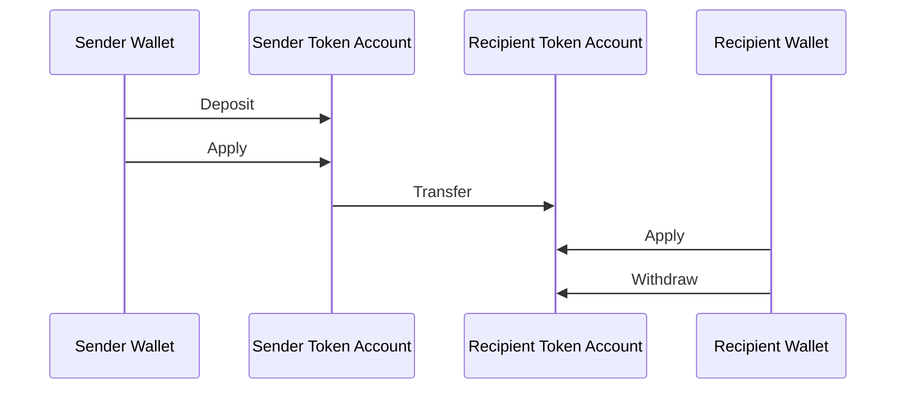
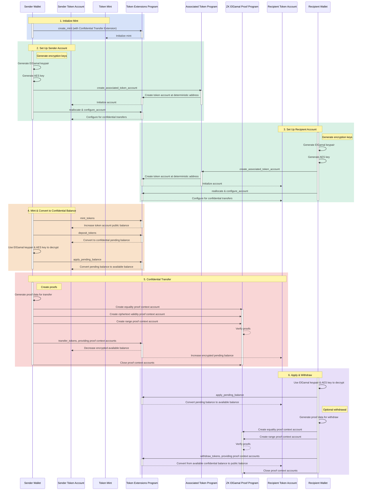

## Что такое конфиденциальные переводы?

<Embed url="https://youtu.be/Bqs95tFcRIU" />

Конфиденциальные переводы позволяют передавать токены между token accounts без
раскрытия суммы перевода. Это полезно для транзакций с защитой
конфиденциальности. Только суммы переводов и балансы токенов остаются
приватными. Адреса token accounts остаются публичными.

- [Обзор протокола](https://www.solana-program.com/docs/confidential-balances/overview) -
  Подробная информация о лежащем в основе криптографическом протоколе
- [Руководство по быстрому старту](https://www.solana-program.com/docs/confidential-balances#setup) -
  Настройка и основные команды CLI
- [Cookbook по конфиденциальным балансам](https://github.com/solana-developers/Confidential-Balances-Sample) -
  Фрагменты кода для работы с расширением конфиденциального перевода

### Как это работает?

Расширение конфиденциального перевода добавляет
[инструкции](https://github.com/solana-program/token-2022/blob/efd0c957fefbd79882d77df5fb2dac88c001249c/program/src/extension/confidential_transfer/instruction.rs#L29)
в Token Extensions Program, которые позволяют передавать токены между аккаунтами
без раскрытия суммы перевода.

Базовый процесс конфиденциальных переводов токенов выглядит следующим образом:

1. Создайте mint account с расширением конфиденциального перевода.
2. Создайте token accounts с расширением конфиденциального перевода для
   отправителя и получателя.
3. Выпустите токены на аккаунт отправителя.
4. **Внесите** публичный баланс отправителя в **конфиденциальный ожидающий
   баланс**.
5. **Примените** ожидающий баланс отправителя к **конфиденциальному доступному
   балансу**.
6. Конфиденциально **переведите** токены с token account отправителя на token
   account получателя.
7. **Примените** ожидающий баланс получателя к **конфиденциальному доступному
   балансу**.
8. **Выведите** конфиденциальный доступный баланс получателя в **публичный
   баланс**.

Подробнее о каждом шаге процесса конфиденциального перевода см. в
соответствующих разделах:

<Cards>
  <Card
    title="Создание mint account"
    href="/docs/tokens/extensions/confidential-transfer/create-mint"
  >
    Как создать mint account с расширением конфиденциального перевода
  </Card>
  <Card
    title="Создание token account"
    href="/docs/tokens/extensions/confidential-transfer/create-token-account"
  >
    Как настроить token account с расширением конфиденциального перевода
  </Card>
  <Card
    title="Внесение токенов"
    href="/docs/tokens/extensions/confidential-transfer/deposit-tokens"
  >
    Как внести токены в конфиденциальный ожидающий баланс
  </Card>
  <Card
    title="Применение ожидающего баланса"
    href="/docs/tokens/extensions/confidential-transfer/apply-pending-balance"
  >
    Как применить ожидающий баланс к доступному конфиденциальному балансу
  </Card>
  <Card
    title="Вывод токенов"
    href="/docs/tokens/extensions/confidential-transfer/withdraw-tokens"
  >
    Как вывести токены из конфиденциального доступного баланса
  </Card>
  <Card
    title="Перевод токенов"
    href="/docs/tokens/extensions/confidential-transfer/transfer-tokens"
  >
    Как конфиденциально переводить токены между token accounts
  </Card>
  <Card
    title="Руководство по интеграции"
    href="/docs/tokens/extensions/confidential-transfer/integration-guide"
  >
    Как кошельки, обозреватели и биржи могут поддерживать токены с
    конфиденциальным переводом
  </Card>
  <Card
    title="Руководство для эмитента"
    href="/docs/tokens/extensions/confidential-transfer/issuer-guide"
  >
    Как выпускать токены с конфиденциальным переводом и управлять ими (политика
    подтверждения, аудиторы, комиссии, выпуск и сжигание)
  </Card>
</Cards>

На диаграмме ниже показана подробная последовательность базового процесса
конфиденциальных переводов токенов:

## Инструкции конфиденциальных переводов

Полный список
[инструкций](https://github.com/solana-program/token-2022/blob/efd0c957fefbd79882d77df5fb2dac88c001249c/program/src/extension/confidential_transfer/instruction.rs#L29)
расширения конфиденциальных переводов выглядит следующим образом:

| Инструкция                          | Описание                                                                                                                                                                       |
| ----------------------------------- | ------------------------------------------------------------------------------------------------------------------------------------------------------------------------------ |
| _rs`InitializeMint`_                | Настраивает mint account для конфиденциальных переводов. Эта инструкция должна быть включена в ту же транзакцию, что и инструкция _rs`TokenInstruction::InitializeMint`_.      |
| _rs`UpdateMint`_                    | Обновляет настройки конфиденциальных переводов для mint account.                                                                                                               |
| _rs`ConfigureAccount`_              | Настраивает token account для конфиденциальных переводов.                                                                                                                      |
| _rs`ApproveAccount`_                | Подтверждает token account для конфиденциальных переводов, если mint требует подтверждения для новых token account.                                                            |
| _rs`EmptyAccount`_                  | Очищает ожидающие и доступные конфиденциальные балансы, чтобы разрешить закрытие token account.                                                                                |
| _rs`Deposit`_                       | Конвертирует публичный баланс токенов в ожидающий конфиденциальный баланс.                                                                                                     |
| _rs`Withdraw`_                      | Конвертирует доступный конфиденциальный баланс обратно в публичный баланс.                                                                                                     |
| _rs`Transfer`_                      | Конфиденциально переводит токены между token account.                                                                                                                          |
| _rs`ApplyPendingBalance`_           | Конвертирует ожидающий баланс в доступный после депозитов или переводов.                                                                                                       |
| _rs`EnableConfidentialCredits`_     | Позволяет token account получать конфиденциальные переводы токенов.                                                                                                            |
| _rs`DisableConfidentialCredits`_    | Блокирует входящие конфиденциальные переводы, сохраняя при этом возможность публичных переводов.                                                                               |
| _rs`EnableNonConfidentialCredits`_  | Позволяет token account получать публичные переводы токенов.                                                                                                                   |
| _rs`DisableNonConfidentialCredits`_ | Блокирует обычные переводы, чтобы аккаунт принимал только конфиденциальные переводы.                                                                                           |
| _rs`TransferWithFee`_               | Конфиденциально переводит токены между token account с комиссией.                                                                                                              |
| _rs`ConfigureAccountWithRegistry`_  | Альтернативный способ настройки token account для конфиденциальных переводов с использованием аккаунта _rs`ElGamalRegistry`_ вместо доказательства _rs`VerifyPubkeyValidity`_. |
