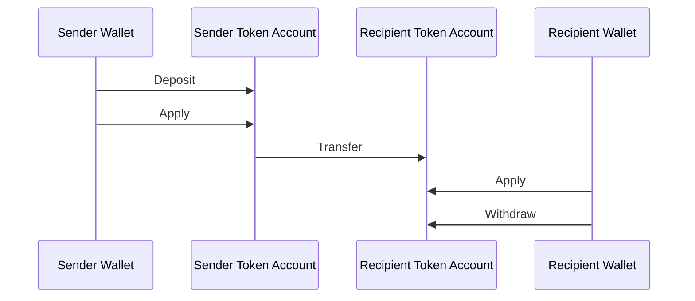
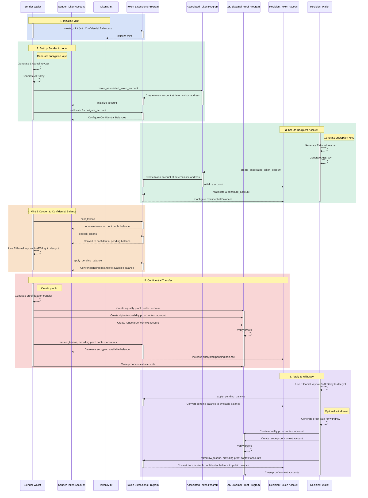

## Что такое Confidential Balances?

<Embed url="https://youtu.be/Bqs95tFcRIU" />

Confidential Balances — это расширение Token-2022, которое позволяет переводить токены между token accounts, не раскрывая сумму перевода. Это полезно для транзакций с сохранением конфиденциальности. Только суммы переводов и балансы токенов остаются приватными. Адреса token accounts остаются общедоступными.

- [Обзор протокола](https://www.solana-program.com/docs/confidential-balances/overview) -
  Подробная информация о лежащем в основе криптографическом протоколе
- [Руководство по быстрому старту](https://www.solana-program.com/docs/confidential-balances#setup) -
  Настройка и основные команды CLI
- [Confidential Balances Cookbook](https://github.com/solana-developers/Confidential-Balances-Sample) -
  Фрагменты кода, демонстрирующие использование Confidential Balances

### Как это работает?

Расширение Confidential Balances добавляет
[инструкции](https://github.com/solana-program/token-2022/blob/efd0c957fefbd79882d77df5fb2dac88c001249c/program/src/extension/confidential_transfer/instruction.rs#L29)
в программу Token Extension, позволяющие переводить токены между
аккаунтами, не раскрывая сумму перевода.

```mermaid title="Confidential Balances Basic Overview"
    sequenceDiagram

    participant A as Sender Wallet
    participant AA as Sender Token Account
    participant BB as Recipient Token Account
    participant B as Recipient Wallet

    A->>AA: Deposit
    A->>AA: Apply

    AA->>BB: Transfer
    B->>BB: Apply

    B->>BB: Withdraw

```

Базовый процесс конфиденциальных переводов токенов выглядит следующим образом:

1. Создайте mint account с включённым расширением Confidential Balances.
2. Создайте token accounts с включённым расширением Confidential Balances для отправителя и
   получателя.
3. Выпустите токены на аккаунт отправителя.
4. **Внесите** публичный баланс отправителя в **конфиденциальный ожидающий
   баланс**.
5. **Примените** ожидающий баланс отправителя к **конфиденциальному доступному
   балансу**.
6. Конфиденциально **переведите** токены с token account отправителя на token
   account получателя.
7. **Примените** ожидающий баланс получателя к **конфиденциальному доступному
   балансу**.
8. **Выведите** конфиденциальный доступный баланс получателя в **публичный
   баланс**.

### Ключи аудитора

Mint account с расширением Confidential Balances может хранить необязательный глобальный публичный ключ ElGamal аудитора. Если он настроен, каждый конфиденциальный перевод включает сумму, зашифрованную для отправителя, получателя и аудитора. Доказательство перевода подтверждает, что все три шифротекста содержат одинаковую сумму. Публичный доступ к сумме по-прежнему закрыт, однако владелец секретного ключа аудитора может расшифровывать суммы переводов для данного mint.

Полномочный орган Confidential Balances задаёт ключ аудитора при инициализации расширения или изменяет его впоследствии с помощью _rs`UpdateMint`_. Полномочный орган может сменить или удалить ключ. Смена ключа распространяется только на будущие переводы, поэтому сохраняйте предыдущие секретные ключи, если требуется доступ к историческим данным аудита. Ключи аудитора предоставляют доступ на чтение; они не авторизуют переводы токенов и не раскрывают полный конфиденциальный баланс аккаунта.

Примеры настройки и смены ключа см. в разделе
[Настройка аудитора](/docs/tokens/extensions/confidential-transfer/issuer-guide#configure-an-auditor).
Кошелькам, обозревателям, биржам и провайдерам комплаенса также рекомендуется ознакомиться с
[руководством по интеграции аудитора](/docs/tokens/extensions/confidential-transfer/integration-guide#auditors-and-compliance).

Подробнее о каждом шаге процесса конфиденциального перевода см. в
соответствующих разделах:

<Cards>
  <Card
    title="Создание mint account"
    href="/docs/tokens/extensions/confidential-transfer/create-mint"
  >
    Как создать mint account с включённым расширением Confidential Balances
  </Card>
  <Card
    title="Создание token account"
    href="/docs/tokens/extensions/confidential-transfer/create-token-account"
  >
    Как настроить token account с включённым расширением Confidential Balances
  </Card>
  <Card
    title="Внесение токенов"
    href="/docs/tokens/extensions/confidential-transfer/deposit-tokens"
  >
    Как внести токены в конфиденциальный ожидающий баланс
  </Card>
  <Card
    title="Применение ожидающего баланса"
    href="/docs/tokens/extensions/confidential-transfer/apply-pending-balance"
  >
    Как применить ожидающий баланс к доступному конфиденциальному балансу
  </Card>
  <Card
    title="Вывод токенов"
    href="/docs/tokens/extensions/confidential-transfer/withdraw-tokens"
  >
    Как вывести токены из конфиденциального доступного баланса
  </Card>
  <Card
    title="Перевод токенов"
    href="/docs/tokens/extensions/confidential-transfer/transfer-tokens"
  >
    Как конфиденциально переводить токены между token accounts
  </Card>
  <Card
    title="Руководство по интеграции"
    href="/docs/tokens/extensions/confidential-transfer/integration-guide"
  >
    Как кошельки, обозреватели и биржи могут поддерживать токены Confidential Balances
  </Card>
  <Card
    title="Руководство для эмитента"
    href="/docs/tokens/extensions/confidential-transfer/issuer-guide"
  >
    Как выпустить токен Confidential Balances и управлять им (политика одобрения, аудиторы, комиссии, выпуск и сжигание)
  </Card>
</Cards>

На диаграмме ниже показана подробная последовательность базового процесса
конфиденциальных переводов токенов:

```mermaid title="Confidential Balances Detailed Overview"
sequenceDiagram
    participant Sender as Sender Wallet
    participant SenderAccount as Sender Token Account
    participant Mint as Token Mint
    participant Token22 as Token Extensions Program
    participant ATAProgram as Associated Token Program
    participant ElGamal as ZK ElGamal Proof Program
    participant RecipientAccount as Recipient Token Account
    participant Recipient as Recipient Wallet

    rect rgba(120, 160, 235, 0.3)
    Note over Sender,Mint: 1. Initialize Mint

    activate Sender
    Sender->>Token22: create_mint (with Confidential Balances)
    activate Token22
    Token22-->>Mint: Initialize mint
    deactivate Token22
    deactivate Sender
    end

    rect rgba(130, 210, 170, 0.3)
    Note over Sender,SenderAccount: 2. Set Up Sender Account

    activate Sender
    Note right of Sender: Generate encryption keys
    Sender->>Sender: Generate ElGamal keypair
    Sender->>Sender: Generate AES key

    Sender->>ATAProgram: create_associated_token_account
    activate ATAProgram
    ATAProgram->>Token22: Create token account at deterministic address
    activate Token22
    Token22-->>SenderAccount: Initialize account
    deactivate Token22
    deactivate ATAProgram

    Sender->>Token22: reallocate & configure_account
    activate Token22
    Token22-->>SenderAccount: Configure Confidential Balances
    deactivate Token22
    deactivate Sender
    end

    rect rgba(130, 210, 170, 0.3)
    Note over Recipient,RecipientAccount: 3. Set Up Recipient Account

    activate Recipient
    Note right of Recipient: Generate encryption keys
    Recipient->>Recipient: Generate ElGamal keypair
    Recipient->>Recipient: Generate AES key

    Recipient->>ATAProgram: create_associated_token_account
    activate ATAProgram
    ATAProgram->>Token22: Create token account at deterministic address
    activate Token22
    Token22-->>RecipientAccount: Initialize account
    deactivate Token22
    deactivate ATAProgram

    Recipient->>Token22: reallocate & configure_account
    activate Token22
    Token22-->>RecipientAccount: Configure Confidential Balances
    deactivate Token22
    deactivate Recipient
    end

    rect rgba(235, 160, 80, 0.3)
    Note over Sender,SenderAccount: 4. Mint & Convert to Confidential Balance

    activate Sender
    Sender->>Token22: mint_tokens
    activate Token22
    Token22-->>SenderAccount: Increase token account public balance
    deactivate Token22

    Sender->>Token22: deposit_tokens
    activate Token22
    Token22-->>SenderAccount: Convert to confidential pending balance
    deactivate Token22

    Sender->>Sender: Use ElGamal keypair & AES key to decrypt
    Sender->>Token22: apply_pending_balance
    activate Token22
    Token22-->>SenderAccount: Convert pending balance to available balance
    deactivate Token22
    deactivate Sender
    end

    rect rgba(235, 120, 120, 0.3)
    Note over Sender,RecipientAccount: 5. Confidential Transfer

    activate Sender
    Note right of Sender: Create proofs
    Sender->>Sender: Generate proof data for transfer

    Sender->>ElGamal: Create equality proof context account
    activate ElGamal
    Sender->>ElGamal: Create ciphertext validity proof context account
    Sender->>ElGamal: Create range proof context account
    ElGamal-->>ElGamal: Verify proofs

    Sender->>Token22: transfer_tokens, providing proof context accounts
    activate Token22
    Token22-->>SenderAccount: Decrease encrypted available balance
    Token22-->>RecipientAccount: Increase encrypted pending balance
    deactivate Token22

    Sender->>ElGamal: Close proof context accounts
    deactivate ElGamal
    deactivate Sender
    end

    rect rgba(180, 150, 235, 0.3)
    Note over Recipient,RecipientAccount: 6. Apply & Withdraw

    activate Recipient
    Recipient->>Recipient: Use ElGamal keypair & AES key to decrypt
    Recipient->>Token22: apply_pending_balance
    activate Token22
    Token22-->>RecipientAccount: Convert pending balance to available balance
    deactivate Token22

    Note right of Recipient: Optional withdrawal
    Recipient->>Recipient: Generate proof data for withdraw

    Recipient->>ElGamal: Create equality proof context account
    activate ElGamal
    Recipient->>ElGamal: Create range proof context account
    ElGamal-->>ElGamal: Verify proofs

    Recipient->>Token22: withdraw_tokens, providing proof context accounts
    activate Token22
    Token22-->>RecipientAccount: Convert from available confidential balance to public balance
    deactivate Token22

    Recipient->>ElGamal: Close proof context accounts
    deactivate ElGamal
    deactivate Recipient
    end
```

## Инструкции Confidential Balances

Полный список
[инструкций](https://github.com/solana-program/token-2022/blob/efd0c957fefbd79882d77df5fb2dac88c001249c/program/src/extension/confidential_transfer/instruction.rs#L29)
расширения Confidential Balances выглядит следующим образом:

| Инструкция                         | Описание                                                                                                                                                       |
| ----------------------------------- | ----------------------------------------------------------------------------------------------------------------------------------------------------------------- |
| _rs`InitializeMint`_                | Включает Confidential Balances на mint account. Эта инструкция должна быть включена в ту же транзакцию, что и инструкция _rs`TokenInstruction::InitializeMint`_. |
| _rs`UpdateMint`_                    | Обновляет политику одобрения аккаунтов mint и необязательный глобальный публичный ключ ElGamal аудитора.                                                                        |
| _rs`ConfigureAccount`_              | Включает Confidential Balances на token account.                                                                                                                 |
| _rs`ApproveAccount`_                | Одобряет token account для использования Confidential Balances, если mint требует одобрения для новых token accounts.                                                          |
| _rs`EmptyAccount`_                  | Очищает ожидающие и доступные конфиденциальные балансы, чтобы разрешить закрытие token account.                                                                         |
| _rs`Deposit`_                       | Конвертирует публичный баланс токенов в ожидающий конфиденциальный баланс.                                                                                                  |
| _rs`Withdraw`_                      | Конвертирует доступный конфиденциальный баланс обратно в публичный баланс.                                                                                                   |
| _rs`Transfer`_                      | Конфиденциально переводит токены между token account.                                                                                                           |
| _rs`ApplyPendingBalance`_           | Конвертирует ожидающий баланс в доступный после депозитов или переводов.                                                                                      |
| _rs`EnableConfidentialCredits`_     | Позволяет token account получать конфиденциальные переводы токенов.                                                                                                   |
| _rs`DisableConfidentialCredits`_    | Блокирует входящие конфиденциальные переводы, сохраняя при этом возможность публичных переводов.                                                                                     |
| _rs`EnableNonConfidentialCredits`_  | Позволяет token account получать публичные переводы токенов.                                                                                                         |
| _rs`DisableNonConfidentialCredits`_ | Блокирует обычные переводы, чтобы аккаунт принимал только конфиденциальные переводы.                                                                                     |
| _rs`TransferWithFee`_               | Конфиденциально переводит токены между token account с комиссией.                                                                                                |
| _rs`ConfigureAccountWithRegistry`_  | Альтернативный способ настройки token accounts для Confidential Balances с использованием аккаунта _rs`ElGamalRegistry`_ вместо доказательства _rs`VerifyPubkeyValidity`_.         |
